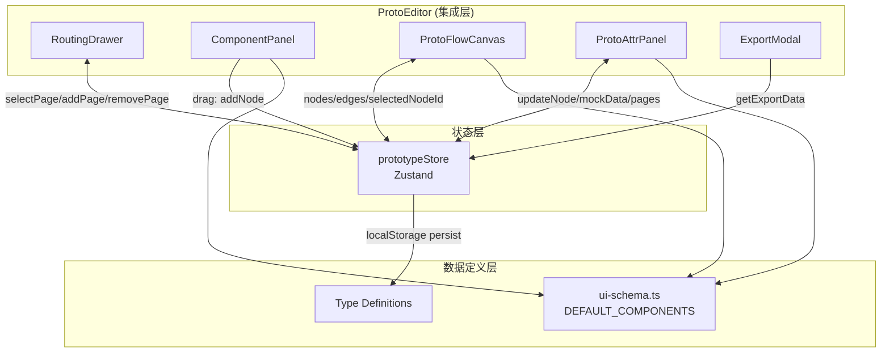

# Architecture — vibex-sprint1-prototype-canvas-qa

**项目**: vibex-sprint1-prototype-canvas-qa
**版本**: v1.0
**日期**: 2026-04-18
**角色**: Architect
**上游**: prd.md, specs/E1-E5, analysis.md

---

## 执行决策

- **决策**: 已采纳
- **执行项目**: vibex-sprint1-prototype-canvas-qa
- **执行日期**: 2026-04-18

---

## 1. Tech Stack

| 层 | 技术 | 版本 | 选型理由 |
|----|------|------|---------|
| 前端框架 | React | 18 | Next.js 集成，已验证 |
| 语言 | TypeScript | 5.x | 类型安全 |
| UI 框架 | Next.js | 16 | 项目基准 |
| 拖拽画布 | React Flow | @xyflow/core | 成熟社区库，已有多项目使用 |
| 状态管理 | Zustand | latest | 轻量、TS 友好、localStorage persist |
| 测试 | Vitest + Testing Library | — | 项目基准，949 行覆盖已验证 |
| 持久化 | localStorage | — | MVP 阶段够用，prototypeStore persist middleware |

**无新增依赖** — 所有 Epic 均可在现有 Tech Stack 内完成。

---

## 2. Architecture Diagram



**布局约束**: `ComponentPanel` 左固定 240px | `ProtoFlowCanvas` 中自适应 | `ProtoAttrPanel` 右固定 280px | `RoutingDrawer` 左侧滑 260px

---

## 3. API Definitions

### 3.1 prototypeStore API

```typescript
// prototypeStore.ts — 核心状态管理

interface PrototypeStoreState {
  // 数据
  nodes: ProtoNode[];
  edges: Edge[];
  selectedNodeId: string | null;
  breakpoint: '375' | '768' | '1024';
  pages: ProtoPage[];

  // 节点操作
  addNode(component: UIComponent, position: { x: number; y: number }): string; // returns nodeId
  removeNode(nodeId: string): void;
  updateNode(nodeId: string, data: Partial<ProtoNodeData>): void;
  updateNodePosition(nodeId: string, position: { x: number; y: number }): void;
  updateNodeMockData(nodeId: string, data: Record<string, unknown>): void;

  // 选中
  selectNode(nodeId: string | null): void;

  // 页面管理
  addPage(route: string, name?: string): void;
  removePage(pageId: string): void;

  // 断点
  setBreakpoint(bp: '375' | '768' | '1024'): void;

  // 导出
  getExportData(): PrototypeExportV2;
  loadFromExport(data: PrototypeExportV2): void;
}
```

### 3.2 数据模型

```typescript
// ProtoNodeData
interface ProtoNodeData {
  component: UIComponent;          // 来自 DEFAULT_COMPONENTS
  mockData?: {
    data: Record<string, unknown>;
    source: 'inline';
  };
  navigation?: ProtoNodeNavigation;
  breakpoints?: ProtoNodeBreakpoints;
  [key: string]: unknown;
}

// ProtoPage
interface ProtoPage {
  id: string;
  name: string;
  route: string;
}

// PrototypeExportV2
interface PrototypeExportV2 {
  version: '2.0';               // 固定标识
  nodes: ProtoNode[];
  edges: Edge[];
  pages: ProtoPage[];
  mockDataBindings: Array<{
    nodeId: string;
    data: Record<string, unknown>;
  }>;
}
```

### 3.3 组件接口

```typescript
// ProtoFlowCanvas props
interface ProtoFlowCanvasProps {
  nodes: ProtoNode[];
  edges: Edge[];
  onDrop: (component: UIComponent, position: { x: number; y: number }) => void;
  onNodeDoubleClick: (nodeId: string) => void;
}

// ProtoAttrPanel props
interface ProtoAttrPanelProps {
  selectedNodeId: string | null;
  node: ProtoNode | null;
  onUpdate: (nodeId: string, data: Partial<ProtoNodeData>) => void;
}

// ComponentPanel props
interface ComponentPanelProps {
  components: UIComponent[];     // DEFAULT_COMPONENTS (10 个)
  onDragStart: (component: UIComponent) => void;
}

// RoutingDrawer props
interface RoutingDrawerProps {
  pages: ProtoPage[];
  currentPageId: string;         // 方案A：全局 selectedNodeId 对应页面
  onAddPage: (route: string, name?: string) => void;
  onRemovePage: (pageId: string) => void;
  onSelectPage: (pageId: string) => void;
}
```

---

## 4. Module Breakdown

### 4.1 核心模块

| 模块 | 文件 | 职责 | 依赖 |
|------|------|------|------|
| ProtoEditor | `components/prototype/ProtoEditor.tsx` | 布局集成、Export Modal | 子组件 + prototypeStore |
| ProtoFlowCanvas | `components/prototype/ProtoFlowCanvas.tsx` | React Flow 画布、拖拽接收 | prototypeStore |
| ProtoNode | `components/prototype/ProtoNode.tsx` | UI Schema render | ui-schema |
| ProtoAttrPanel | `components/prototype/ProtoAttrPanel.tsx` | 属性编辑 + MockData Tab | prototypeStore |
| ComponentPanel | `components/prototype/ComponentPanel.tsx` | 10 组件卡片 + 拖拽源 | ui-schema |
| RoutingDrawer | `components/prototype/RoutingDrawer.tsx` | 页面列表管理 | prototypeStore |
| prototypeStore | `stores/prototypeStore.ts` | 全局状态、导出/导入 | Zustand |
| ui-schema | `lib/prototypes/ui-schema.ts` | 组件定义（ComponentDefinition[]）、props schema、variants | renderer 层使用

### 4.2 数据流

```
ComponentPanel 拖拽 (dragstart + dataTransfer)
  → ProtoFlowCanvas drop (onDrop handler)
    → prototypeStore.addNode()
      → nodes 更新
        → React Flow 重渲染
          → ProtoNode 根据 type 渲染
```

```
双击 ProtoNode
  → prototypeStore.selectNode(nodeId)
    → ProtoAttrPanel 响应 selectedNodeId
      → 修改 props → prototypeStore.updateNode()
        → 节点实时更新
```

```
导出流程:
  ProtoEditor ExportModal
    → prototypeStore.getExportData()
      → PrototypeExportV2 (version: '2.0')
```

### 4.3 路由策略（方案A）

所有 nodes 全局共享，不按 page 隔离。`pages` 仅作元数据（名称/路由）。当前 MVP 够用，后续可演进为方案B（每 page 独立节点集）。

---

## 5. 风险评估

| 风险 | 等级 | 描述 | 缓解 |
|------|------|------|------|
| E4-U2 Round-trip 测试缺失 | 高 | `prototypeStore.test.ts` 缺少端到端闭环测试 | 本期补充 E4-U2.1~E4-U2.5 测试用例 |
| ProtoFlowCanvas 性能 | 中 | 大量节点时 React Flow 可能卡顿 | MVP 阶段节点量有限，后续优化节点可视区域 |
| localStorage 容量 | 低 | 大型原型可能超 5MB | 提示用户，定期清理 |
| ComponentDefinition vs UIComponent 类型不一致 | 中 | `ui-schema.ts` 中 `DEFAULT_COMPONENTS` 是 `ComponentDefinition[]`，但 `prototypeStore` 引用为 `UIComponent`。字段结构不同（前者: name/category/description/props/variants；后者: id/type/name/props/children）。运行时依赖宽松，实际功能正常，但 TypeScript 类型检查不严格 | 后续迭代中统一类型定义，或在 `prototypeStore` 中引入与 `ComponentDefinition` 对齐的类型别名 |
| ui-schema 渲染函数缺失 | 低 | `ComponentDefinition` 不含 `render` 函数，`ProtoNode` 实际通过 `renderer.ts` / `component-renderers.ts` 间接渲染，非直接调用 ui-schema 函数 | ProtoNode 渲染依赖 renderer 层，不影响本期功能 |
| Dev Server middleware 警告 | 低 | Next.js 16 + `output: export` 冲突 | 全局问题，coord 后续处理 |
| PrototypeExporter.tsx 冗余 | 低 | 575 行组件未接入 | 标记废弃，不影响本期 |

**最高优先级风险**: E4-U2 Round-trip 测试缺失 — 已在上游 analysis.md 标记，本期 DoD 必须覆盖。

---

## 6. Testing Strategy

### 6.1 测试框架

- **框架**: Vitest + Testing Library（项目使用 Vitest，非 Jest）
- **覆盖率目标**: > 80%（现有 949 行基础）
- **测试位置**: `src/components/prototype/__tests__/`, `src/stores/prototypeStore.test.ts`

### 6.2 核心测试用例

#### E1-U1 ComponentPanel 拖拽
```typescript
// ComponentPanel.test.tsx
expect(screen.getAllByRole('listitem')).toHaveLength(10); // 10 组件卡片
fireEvent.dragStart(screen.getByText('Button'));
expect(screen.getByText('Button')).toHaveStyle({ opacity: '0.5' }); // 半透明
```

#### E1-U2 ProtoFlowCanvas drop
```typescript
// ProtoFlowCanvas.test.tsx
const mockTransfer = mockDataTransfer('Button');
fireEvent.drop(screen.getByTestId('proto-flow-canvas'), { dataTransfer: mockTransfer });
expect(usePrototypeStore.getState().nodes.length).toBeGreaterThan(0);
```

#### E1-U3 ProtoNode 渲染
```typescript
// ProtoNode.test.tsx
expect(screen.getByRole('button', { name: /button/i })).toBeInTheDocument();
expect(screen.getByRole('button')).toHaveStyle(expect.stringContaining('blue'));
userEvent.type(screen.getByRole('textbox'), 'test');
expect(screen.getByRole('textbox')).toHaveValue('test');
```

#### E1-U4 ProtoAttrPanel 属性编辑
```typescript
// ProtoAttrPanel.test.tsx
fireEvent.dblClick(screen.getByTestId('proto-node'));
expect(usePrototypeStore.getState().selectedNodeId).toBeTruthy();
expect(screen.getByTestId('proto-attr-panel')).toBeVisible();
```

#### E4-U2 Round-trip（新增）
```typescript
// prototypeStore.test.ts
test('E4-U2.1: export → loadFromExport → re-export → nodes 全等', () => {
  const store = create();
  store.getState().addNode(mockComponent, { x: 0, y: 0 });
  const exported = store.getState().getExportData();
  const fresh = create();
  fresh.getState().loadFromExport(exported);
  const reExported = fresh.getState().getExportData();
  expect(reExported.nodes).toEqual(exported.nodes);
  expect(reExported.pages).toEqual(exported.pages);
  expect(reExported.mockDataBindings).toEqual(exported.mockDataBindings);
});
```

### 6.3 测试命令

```bash
# TypeScript 编译
pnpm exec tsc --noEmit

# 单元测试
pnpm test

# 带覆盖率
pnpm test -- --coverage
```

---

## 7. 已知决策记录

| 决策 | 理由 | 影响 |
|------|------|------|
| 方案A（nodes 全局共享） | 实现简单，MVP 够用，页面仅作元数据 | 不支持每页独立节点集 |
| ProtoAttrPanel 内置 MockData Tab | 减少组件数量，避免 MockDataPanel 冗余文件 | MockData 功能集成在属性面板 |
| RoutingDrawer 管理页面 | 页面管理统一在左侧 drawer | 页面切换不重置画布节点 |
| PrototypeExporter.tsx 废弃 | 已有的 inline Export Modal 已满足需求 | 575 行代码保留但不再接入 |
