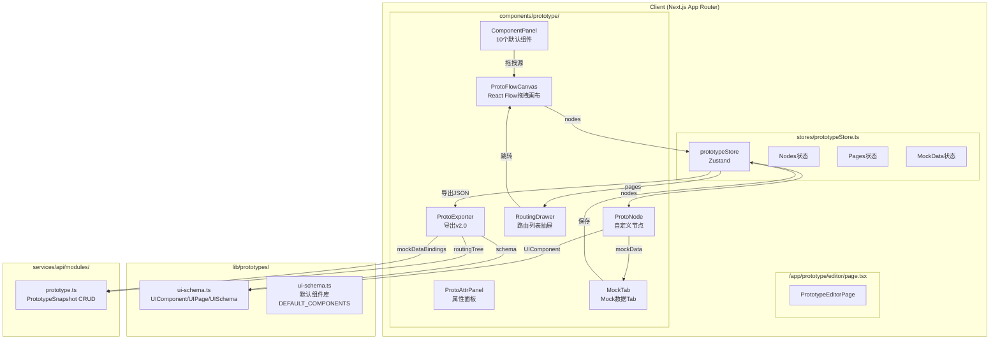
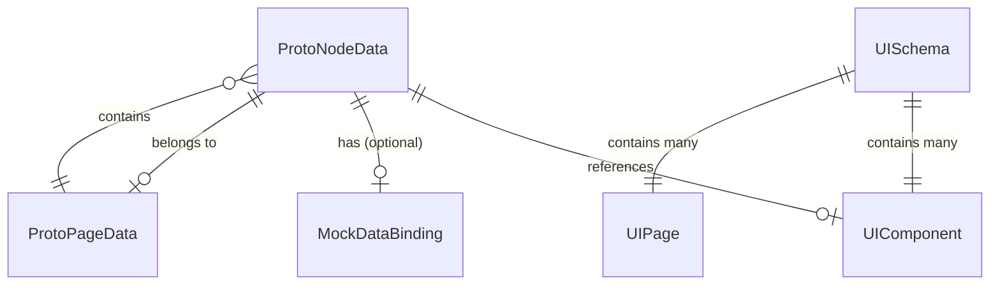

# Architecture — vibex-sprint1-prototype-canvas

**项目**: vibex-sprint1-prototype-canvas
**角色**: Architect
**日期**: 2026-04-17
**状态**: active

---

## 执行摘要

Sprint 1 为 VibeX 构建可视化原型画布（Prototype Canvas）：基于现有 `lib/prototypes/ui-schema.ts` 的 UIComponent/UIPage 体系，通过 React Flow 拖拽布局引擎、组件内嵌 Mock 数据、页面路由列表和 JSON 导出 v2.0，将 DDD 建模产出直接转化为可交互原型。

**技术决策**：复用 React Flow（已在 DDS Canvas 使用）+ Zustand + 现有 UI Schema 类型，不引入新基础设施。

---

## 1. Tech Stack

| 组件 | 选择 | 版本/理由 |
|------|------|---------|
| **框架** | Next.js (App Router) | 已有，基于 `/app/prototype/editor/` |
| **拖拽引擎** | @xyflow/react (React Flow v12) | 已有，DDS Canvas 已在使用 |
| **状态管理** | Zustand | 已有，DDSCanvasStore 模式可复用 |
| **UI Schema** | `lib/prototypes/ui-schema.ts` | 已有，核心数据模型 |
| **持久化** | localStorage (MVP) + API 层扩展 | MVP 本地优先，后续接 D1 |
| **样式** | CSS Modules | 已有，与现有组件一致 |
| **测试** | Vitest + React Testing Library | 已有，Canvas 测试策略可复用 |

**决策**：不引入新库。React Flow + Zustand + 现有 UI Schema 即可覆盖全部需求。

---

## 2. Architecture Diagram



---

## 3. API Definitions

### 3.1 内部 Store API（prototypeStore）

```typescript
// stores/prototypeStore.ts

interface ProtoNodeData {
  id: string;
  componentId: string;
  component: UIComponent;       // 来自 ui-schema.ts
  position: { x: number; y: number };
  mockData?: MockDataBinding;   // 组件内嵌 Mock
}

interface MockDataBinding {
  id: string;
  componentInstanceId: string;
  data: Record<string, any>;     // 内嵌 JSON
  source: 'inline';             // MVP 仅支持内嵌
}

interface ProtoPageData {
  id: string;
  pageId: string;
  route: string;
  nodeIds: string[];             // 画布上属于此页面的节点
}

// Store Actions
interface PrototypeStore {
  // Nodes
  addNode: (component: UIComponent, position: { x: number; y: number }) => void;
  updateNodePosition: (nodeId: string, position: { x: number; y: number }) => void;
  updateNodeMockData: (nodeId: string, mockData: MockDataBinding) => void;
  removeNode: (nodeId: string) => void;

  // Pages
  pages: ProtoPageData[];
  addPage: (page: ProtoPageData) => void;
  removePage: (pageId: string) => void;

  // Routing
  navigateToNode: (nodeId: string) => void;
  focusedNodeId: string | null;

  // Persistence
  saveToLocalStorage: () => void;
  loadFromLocalStorage: (projectId: string) => void;

  // Export
  getExportData: () => EnhancedPrototypeExport;
}
```

### 3.2 导出格式 v2.0

```typescript
// lib/prototypes/ui-schema.ts 扩展

interface EnhancedPrototypeExport {
  version: '2.0';
  schema: UISchema;                    // 现有 UI Schema
  routingTree: {
    pages: Array<{
      pageId: string;
      route: string;
      parentRoute?: string;
    }>;
  };
  mockDataBindings: MockDataBinding[]; // 所有内嵌 Mock
  layout: {
    nodes: Array<{
      nodeId: string;
      componentId: string;
      position: { x: number; y: number };
    }>;
  };
  exportedAt: string;
}
```

### 3.3 组件面板数据源

```typescript
// 复用现有 DEFAULT_COMPONENTS
// lib/prototypes/ui-schema.ts

interface ComponentPanelItem {
  id: string;
  type: UIComponentType;
  label: string;
  icon?: string;
  defaultProps?: Record<string, any>;
  mockDataTemplate?: Record<string, any>;  // MVP 提供示例 Mock
}

// 可从 DEFAULT_COMPONENTS 派生
const COMPONENT_PANEL_ITEMS: ComponentPanelItem[] = [
  { id: 'button', type: 'button', label: 'Button', mockDataTemplate: null },
  { id: 'input', type: 'input', label: 'Input', mockDataTemplate: null },
  { id: 'card', type: 'card', label: 'Card', mockDataTemplate: { title: '卡片标题', content: '卡片内容' } },
  { id: 'container', type: 'container', label: 'Container', mockDataTemplate: null },
  { id: 'header', type: 'header', label: 'Header', mockDataTemplate: null },
  { id: 'navigation', type: 'navigation', label: 'Navigation', mockDataTemplate: null },
  { id: 'modal', type: 'modal', label: 'Modal', mockDataTemplate: { title: '弹窗标题', visible: true } },
  { id: 'table', type: 'table', label: 'Table', mockDataTemplate: { columns: ['ID', '名称'], rows: [[1, '示例行']] } },
  { id: 'form', type: 'form', label: 'Form', mockDataTemplate: null },
  { id: 'image', type: 'image', label: 'Image', mockDataTemplate: null },
];
```

---

## 4. Data Model

### 4.1 核心实体关系



### 4.2 localStorage Schema（MVP）

```
Key: prototype:${projectId}:nodes
Value: ProtoNodeData[]  (JSON)

Key: prototype:${projectId}:pages
Value: ProtoPageData[]  (JSON)
```

---

## 5. Module Design

### 5.1 模块划分

| 模块 | 职责 | 关键文件 |
|------|------|---------|
| `PrototypeEditorPage` | 路由入口，布局组装 | `app/prototype/editor/page.tsx` |
| `ComponentPanel` | 左侧组件面板，拖拽源 | `components/prototype/ComponentPanel.tsx` (新建) |
| `ProtoFlowCanvas` | React Flow 画布，拖拽目标 | `components/prototype/ProtoFlowCanvas.tsx` (新建) |
| `ProtoNode` | React Flow 自定义节点，渲染 UIComponent | `components/prototype/ProtoNode.tsx` (新建) |
| `ProtoAttrPanel` | 右侧属性面板，Props + Mock Tab | `components/prototype/ProtoAttrPanel.tsx` (新建) |
| `MockDataTab` | Mock 数据编辑 Tab | `components/prototype/MockDataTab.tsx` (新建) |
| `RoutingDrawer` | 左侧路由列表抽屉 | `components/prototype/RoutingDrawer.tsx` (新建) |
| `ProtoExporter` | 导出 v2.0 | `components/prototype/ProtoExporter.tsx` (扩展) |
| `prototypeStore` | Zustand 状态管理 | `stores/prototypeStore.ts` (新建) |

### 5.2 数据流

```
用户拖拽组件 → ComponentPanel (dragstart, data=componentId)
    → ProtoFlowCanvas (drop, onDrop)
    → prototypeStore.addNode(component, position)
    → ProtoNode 渲染 (react-flow 自定义节点)

用户编辑 Mock 数据 → MockDataTab
    → prototypeStore.updateNodeMockData()
    → ProtoNode 重新渲染 (使用 mockData)

用户导出 → ProtoExporter
    → prototypeStore.getExportData()
    → EnhancedPrototypeExport JSON
    → download / API 保存
```

---

## 6. Performance Considerations

| 关注点 | 影响 | 缓解方案 |
|--------|------|---------|
| React Flow 节点过多 | 100+ 节点时渲染性能下降 | MVP 目标 ≤100 节点；超出时禁用实时渲染 |
| Mock 数据 JSON 超大 | 导出 JSON 超过 5MB | 导出前检查，超限提示精简 |
| localStorage 容量 | 浏览器限制约 5MB | 监控使用量，及时提示用户 |
| React Flow 拖拽卡顿 | 拖拽时重新渲染 | 使用 `nodeTypes` memo 化 |

**性能目标**：
- 初始加载（10节点）: < 500ms
- 拖拽响应帧率: ≥ 30fps（100节点内）
- JSON 导出（50节点 + Mock）: < 1s

---

## 7. Testing Strategy

### 7.1 测试框架
- **Vitest** + **React Testing Library**
- **Playwright** (e2e)

### 7.2 覆盖率要求
- Store 逻辑: > 80%
- 组件交互: > 70%

### 7.3 核心测试用例

```typescript
// stores/prototypeStore.test.ts

describe('prototypeStore', () => {
  it('addNode: 拖入组件后 nodes 列表增加', () => {
    const store = createPrototypeStore();
    const btn = DEFAULT_COMPONENTS.find(c => c.type === 'button')!;
    store.addNode(btn, { x: 100, y: 200 });
    expect(store.nodes.length).toBe(1);
    expect(store.nodes[0].component.type).toBe('button');
    expect(store.nodes[0].position).toEqual({ x: 100, y: 200 });
  });

  it('updateNodeMockData: Mock 数据更新后保留', () => {
    const store = createPrototypeStore();
    store.addNode(DEFAULT_COMPONENTS[0], { x: 0, y: 0 });
    const mockData = { id: 'mock1', componentInstanceId: store.nodes[0].id, data: { label: 'Test' }, source: 'inline' };
    store.updateNodeMockData(store.nodes[0].id, mockData);
    expect(store.nodes[0].mockData?.data.label).toBe('Test');
  });

  it('getExportData: 导出 v2.0 包含所有必需字段', () => {
    const store = createPrototypeStore();
    const exportData = store.getExportData();
    expect(exportData.version).toBe('2.0');
    expect(exportData.routingTree).toBeDefined();
    expect(exportData.mockDataBindings).toBeDefined();
    expect(exportData.layout).toBeDefined();
  });
});

// components/prototype/ProtoFlowCanvas.test.tsx

describe('ProtoFlowCanvas', () => {
  it('drop: 拖入组件后画布显示节点', async () => {
    render(<ProtoFlowCanvas />);
    const canvas = screen.getByTestId('proto-flow-canvas');
    // Simulate drag & drop
    fireEvent.drop(canvas, { data: { componentId: 'button' } });
    expect(screen.getByText('Button')).toBeVisible();
  });

  it('navigateToNode: 点击路由项跳转到节点并高亮', async () => {
    render(<ProtoFlowCanvas />);
    fireEvent.click(screen.getByText('/dashboard'));
    const highlightedNode = screen.getByTestId('proto-node-highlighted');
    expect(highlightedNode).toBeVisible();
  });
});

// components/prototype/MockDataTab.test.tsx

describe('MockDataTab', () => {
  it('valid JSON: 保存后显示确认', async () => {
    render(<MockDataTab nodeId="node1" />);
    fireEvent.change(screen.getByRole('textbox'), { target: { value: '{"label": "ok"}' } });
    fireEvent.click(screen.getByRole('button', { name: '保存' }));
    expect(screen.getByText('已保存')).toBeVisible();
  });

  it('invalid JSON: 显示错误提示，不崩溃', async () => {
    render(<MockDataTab nodeId="node1" />);
    fireEvent.change(screen.getByRole('textbox'), { target: { value: 'invalid' } });
    expect(screen.getByText(/JSON 格式错误/)).toBeVisible();
  });
});
```

---

## 8. Key Technical Decisions

| 决策 | 选择 | 理由 |
|------|------|------|
| Mock 数据存储位置 | 组件内嵌（方案 A） | MVP 最简，无需全局 Store；PM 确认 |
| 路由树展示形态 | 简单页面列表（方案 A） | MVP 最简，1h 工时；树形/DAG 后续迭代 |
| 持久化策略 | localStorage (MVP) | D1 持久化在 sprint2；先保证功能可用 |
| React Flow 自定义节点渲染 | 复用 `lib/prototypes/ui-schema.ts` renderer | 已有基础设施，避免重复建设 |
| 导出 v2.0 向后兼容 | 忽略额外字段 | 导出的 JSON 可导入 v1.0 系统 |

---

## 9. 与现有架构的兼容性

| 现有资产 | 复用方式 | 兼容性说明 |
|---------|---------|-----------|
| React Flow (DDS Canvas) | 同一 `@xyflow/react` 实例 | 完全兼容 |
| DDSCanvasStore (Zustand) | 独立 prototypeStore | 完全隔离，不冲突 |
| UI Schema (`lib/prototypes/`) | 复用 UIComponent/UIPage 类型 | 完全兼容 |
| PrototypeExporter.tsx | 扩展支持 v2.0 | 扩展，非破坏性修改 |
| `app/prototype/editor/` 目录 | 新建页面为主 | 目录已存在，补充实现 |

---

## 10. Risk Assessment

| 风险 | 可能性 | 影响 | 缓解 |
|------|--------|------|------|
| React Flow 自定义节点与 UI Schema 类型不匹配 | 低 | 高 | 先定义 `ProtoNodeData` 接口，再开发 |
| Mock 数据量大导致 JSON 超限 | 中 | 低 | 导出前检查大小，超限给出警告 |
| localStorage 满导致保存失败 | 低 | 中 | 监控容量，及时提示用户清理 |
| 组件拖拽事件与 React Flow 拖拽冲突 | 低 | 中 | 使用 `onDragOver` + `preventDefault()` 区分 |

---

## 技术审查发现

### 🔴 Critical Issues

1. **Round-trip 验证依赖 localStorage（MVP 限制）**
   - 问题：`getExportData()` 导出 JSON，但如果 localStorage 为空（首次访问），round-trip 验证无法进行
   - 影响：S4.2 的 round-trip 测试依赖已有数据
   - 缓解：在 AGENTS.md 中标注此限制，后续接 D1 后完善

2. **UIPage.route 字段依赖外部输入（MVP 范围）**
   - 问题：`ProtoPageData.route` 需要用户手动指定，当前 UI Schema 中 UIPage 已有 route 字段
   - 影响：路由树列表依赖手动输入
   - 缓解：可从 UISchema.pages 推导 route，后续迭代增加自动推导

3. **prototypeStore 与 DDSCanvasStore 完全隔离（设计决策，已确认）**
   - 两者不共享状态，导出/导入通过 JSON 文件进行
   - 无数据竞争风险

---

## 执行决策

- **决策**: 已采纳
- **执行项目**: vibex-sprint1-prototype-canvas
- **执行日期**: 待定
- **备注**: Mock数据采用方案A（组件内嵌），路由树采用方案A（页面列表），与 PRD 决策一致
