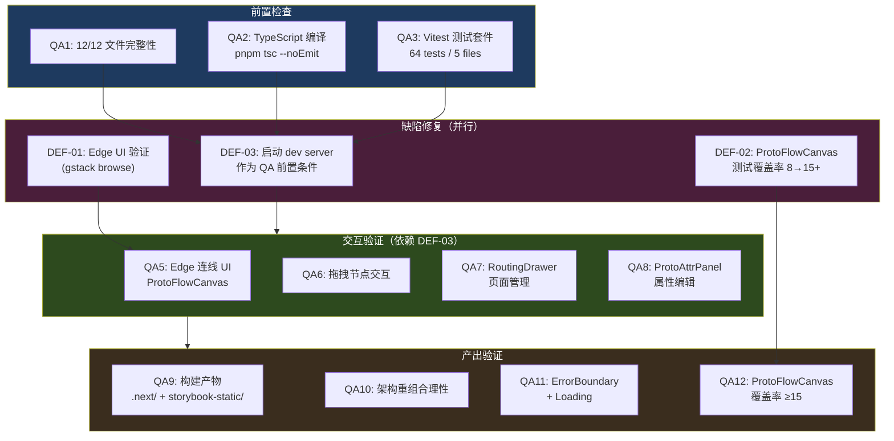
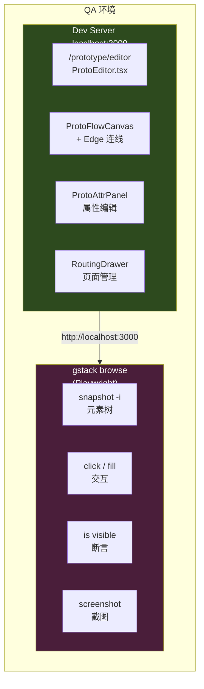

# Architecture — vibex-sprint1-qa

**项目**: vibex-sprint1-qa
**版本**: 1.0
**日期**: 2026-04-17
**角色**: Architect
**状态**: Draft

---

## 执行决策

| 字段 | 内容 |
|------|------|
| **决策** | 通过（待 P1 行动完成） |
| **执行项目** | vibex-sprint1-qa |
| **执行日期** | 2026-04-17 |
| **条件** | 需启动 dev server 后用 gstack browse 确认 Edge 连线 UI 完整性 |

---

## 1. Tech Stack

### QA 验证工具链

| 层级 | 技术 | 版本 | 用途 |
|------|------|------|------|
| 开发服务器 | Next.js dev | 15 | 本地预览 Sprint1 产出 |
| 自动化测试 | Vitest | latest | 单元测试（64 tests，5 files）|
| 类型检查 | TypeScript | ^5.x | `pnpm tsc --noEmit` 零 error |
| E2E 验证 | Playwright | via gstack | gstack browse 自动化 UI 验证 |
| QA 基础设施 | gstack browse | — | /browse /qa /qa-only /canary 技能 |
| 构建产物验证 | 文件系统检查 | — | `.next/` + `storybook-static/` 存在性 |

### 技术债务项（需修复）

| 项 | 当前状态 | 目标 | 关联 |
|------|---------|------|------|
| ProtoFlowCanvas 测试覆盖率 | 8 tests | 15+ tests | DEF-02 |
| Edge 连线 UI 完整性 | store 层完成，UI 未验证 | gstack browse 验证通过 | DEF-01 |
| dev server 状态 | 未运行 | 启动并保持 | DEF-03 |

---

## 2. 架构图

### QA 验证流程总览



### QA 环境架构



---

## 3. API Definitions

### 3.1 QA 验证命令接口

```bash
# QA1: 文件完整性验证
find vibex-fronted/src -name "*.tsx" -o -name "*.ts" | grep -E "ProtoEditor|ProtoFlowCanvas|ProtoNode|ProtoAttrPanel|RoutingDrawer|ComponentPanel|PrototypeExporter|prototypeStore" | wc -l
# 期望: ≥12 files

# QA2: TypeScript 编译
pnpm tsc --noEmit
# 期望: exit code 0, stdout 无 'error TS'

# QA3: Vitest 测试套件
pnpm vitest run --reporter=verbose
# 期望: 64 tests passed

# QA4: prototypeStore 覆盖率
pnpm vitest run src/stores/prototypeStore.test.ts --reporter=verbose
# 期望: 17 tests passed，含 addEdge/removeEdge
```

### 3.2 gstack browse 验证接口

```bash
# 启动 gstack browse 环境
export CI=true
export BROWSE_SERVER_SCRIPT=/root/.openclaw/gstack/browse/src/server.ts
export PLAYWRIGHT_BROWSERS_PATH=~/.cache/ms-playwright
B="/root/.openclaw/workspace/skills/gstack-browse/bin/browse"

# QA5: Edge 连线 UI
$B goto http://localhost:3000/prototype/editor
$B waitForSelector ".react-flow"
$B snapshot -i
# 断言: .react-flow 存在，有节点可操作

# QA6: 拖拽节点
$B click "@eX"  # ComponentPanel 中的组件
$B dragTo "@eX" "@eY"  # 拖到画布
# 断言: .react-flow__node 数量增加

# QA7: RoutingDrawer
$B click text="路由管理"
# 断言: drawer 打开，显示页面列表

# QA8: ProtoAttrPanel
$B click ".react-flow__node"
# 断言: 右侧面板打开，显示属性
```

### 3.3 缺陷修复验收接口

```bash
# DEF-02: ProtoFlowCanvas 覆盖率 8→15+
# 新增测试场景:
# - onConnect handler 行为
# - deviceMode 切换 (desktop/tablet/mobile)
# - edge 选择与高亮
# - 节点选中状态管理
# - 空画布提示显示/隐藏逻辑

# DEF-01: Edge UI 完整性
# gstack browse 验证:
# - RoutingDrawer 中有「添加连线」入口
# - 连线创建后 .react-flow__edge 出现
# - 连线可选中并高亮
# - Delete 键可删除连线

# DEF-03: dev server
# 启动: cd vibex-fronted && pnpm dev &
# 验证: curl http://localhost:3000/prototype/editor → 200
```

---

## 4. Data Model

### 4.1 QA 状态追踪

```typescript
// QA 验证状态管理（非持久化，session 内追踪）

interface QAReport {
  projectId: 'vibex-sprint1-qa';
  timestamp: string;
  overall: 'pass' | 'fail' | 'blocked';

  fileIntegrity: {
    total: 12;
    found: number;
    missing: string[];
  };

  compileCheck: {
    tsc: 'pass' | 'fail';
    vitest: { passed: number; failed: number; total: number };
  };

  defects: Record<string, {
    id: string;
    severity: 'blocker' | 'major' | 'minor';
    status: 'open' | 'fixed' | 'monitor';
    evidence?: string;
  }>;

  interactiveQA: Record<string, {
    status: 'pass' | 'fail' | 'blocked' | 'skipped';
    notes?: string;
  }>;
}
```

### 4.2 当前缺陷矩阵（截至 architecture.md 生成时）

| 缺陷 ID | 描述 | 等级 | 根因 | 修复路径 |
|---------|------|------|------|---------|
| DEF-01 | Edge 连线 UI 完整性未验证 | 🟡 中 | dev server 未运行 | 启动 server → gstack browse → QA5 |
| DEF-02 | ProtoFlowCanvas 测试覆盖率 8→15+ | 🟡 中 | 单元测试缺失 | 新增 7 个 Vitest 测试用例 |
| DEF-03 | dev server 未运行 | 🟡 中 | 环境未启动 | QA 基础设施优先修复 |
| DEF-04 | addEdge/removeEdge 跨 repo 来源 | 🟢 低 | Git 历史 | Monitor，无需立即行动 |

---

## 5. Testing Strategy

### 5.1 测试层次

```
┌─────────────────────────────────────────────┐
│  L4: gstack browse E2E (QA5-QA8)           │ ← 需要 dev server
├─────────────────────────────────────────────┤
│  L3: Vitest 单元测试 (QA3/QA4/QA12)         │ ← 无需 server
├─────────────────────────────────────────────┤
│  L2: TypeScript 编译 (QA2)                   │ ← 无需 server
├─────────────────────────────────────────────┤
│  L1: 文件完整性 (QA1/QA9/QA10/QA11)        │ ← 静态检查
└─────────────────────────────────────────────┘
```

### 5.2 单元测试用例（需新增 DEF-02）

```typescript
// src/components/prototype/__tests__/ProtoFlowCanvas.test.tsx
// 当前 8 tests → 目标 15+ tests，需新增以下场景：

describe('ProtoFlowCanvas — Edge & Device (Sprint1 QA)', () => {

  // === 缺失场景 1: Edge 连接行为 ===
  describe('Edge connections', () => {
    it('onConnect creates edge in store', () => {
      // 模拟 React Flow onConnect 回调
      // 验证 store.addEdge 被调用
    });

    it('onConnect creates edge with correct source/target', () => {
      // 验证 edge 数据结构: { id, source, target, type: 'smoothstep' }
    });

    it('selected edge triggers edge selection state', () => {
      // 选中 edge → 高亮样式
    });
  });

  // === 缺失场景 2: 设备模式切换 ===
  describe('Device mode (tablet/mobile)', () => {
    it('deviceMode state is defined', () => {
      // deviceMode 属于 deviceModeSlice，非 ProtoFlowCanvas
      // 验证跨组件协作
    });

    it('canvas width changes on device mode switch', () => {
      // tablet → width: 768px
      // mobile → width: 375px
    });
  });

  // === 缺失场景 3: 节点选择行为 ===
  describe('Node selection', () => {
    it('selectNode updates store.selectedNodeId', () => {
      // 点击节点 → store.selectedNodeId 更新
    });

    it('selection opens ProtoAttrPanel', () => {
      // selectedNodeId 非 null → 属性面板打开
    });
  });

  // === 缺失场景 4: 空画布提示 ===
  describe('Empty state hints', () => {
    it('shows empty state when nodes.length === 0', () => {
      // 空画布提示文本可见
    });

    it('hides empty hint after first node added', () => {
      // addNode 后 → 提示消失
    });
  });
});
```

> **注**: `deviceMode` 相关测试需确认属于 ProtoFlowCanvas 还是独立的 deviceModeSlice。若属于独立 slice，则在对应 test 文件中覆盖。

### 5.3 gstack Browse E2E 测试（QA5-QA8）

| 测试 | URL | 断言 | 依赖 |
|------|-----|------|------|
| QA5 | `/prototype/editor` | `.react-flow` 存在 | DEF-03 |
| QA6 | `/prototype/editor` | `.react-flow__node` 拖拽成功 | DEF-03 |
| QA7 | `/prototype/editor` | RoutingDrawer 页面管理可用 | DEF-03 |
| QA8 | `/prototype/editor` | ProtoAttrPanel 打开并可编辑 | DEF-03 |

### 5.4 回归测试策略

Sprint1 QA 完成后，建立以下回归基线：

```bash
# 回归命令（每次 Sprint 变更后执行）
pnpm tsc --noEmit
pnpm vitest run
# gstack browse: QA5-QA8 快速冒烟
```

---

## 6. 文件变更清单（QA 相关）

| 操作 | 文件路径 | 说明 |
|------|---------|------|
| 修改 | `vibex-fronted/src/components/prototype/__tests__/ProtoFlowCanvas.test.tsx` | 新增 7 tests，覆盖 edge/selection/deviceMode（DEF-02）|
| 新增 | `scripts/start-dev-server.sh` | 启动 dev server + 健康检查（DEF-03）|
| 新增 | `docs/vibex-sprint1-qa/run-qa.sh` | QA 验证一键脚本（QA1-QA12）|

> **注**: Sprint1 产出物文件均已存在（QA1），无需新增文件。QA 工作主要是验证和补充测试。

---

## 7. 技术风险与缓解

| 风险 | 可能性 | 影响 | 缓解方案 |
|------|--------|------|---------|
| dev server 启动失败（端口占用） | 低 | 高 | 检查 3000 端口，冲突则 kill 后重试 |
| gstack browse 在 CI 环境超时 | 中 | 中 | 增加 `waitForSelector` timeout，使用 `yieldMs` |
| ProtoFlowCanvas 覆盖率测试无法 mock React Flow | 中 | 中 | 使用真实 store + @xyflow/react provider wrapper |
| Edge UI 验证不稳定（异步加载） | 低 | 低 | 添加 `waitForSelector('.react-flow')` 前置等待 |

---

## 8. Open Questions (TBD)

| 项 | 状态 | 负责人 |
|----|------|-------|
| deviceMode 是否属于 ProtoFlowCanvas 测试范围 | TBD | QA 确认 |
| gstack browse 是否可在 headless CI 环境运行 | TBD | DevOps 确认 |
| DEF-01 Edge UI 完整性的具体验收标准 | TBD | QA + PM 确认 |

---

## 执行决策

| 字段 | 内容 |
|------|------|
| **决策** | 通过（待 P1 行动完成） |
| **执行项目** | vibex-sprint1-qa |
| **执行日期** | 2026-04-17 |
| **条件** | 需启动 dev server 后用 gstack browse 确认 Edge 连线 UI 完整性 |
