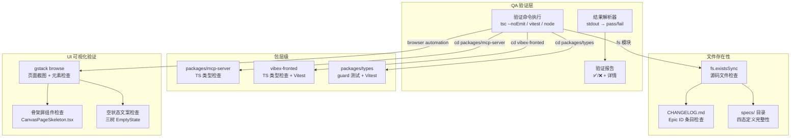
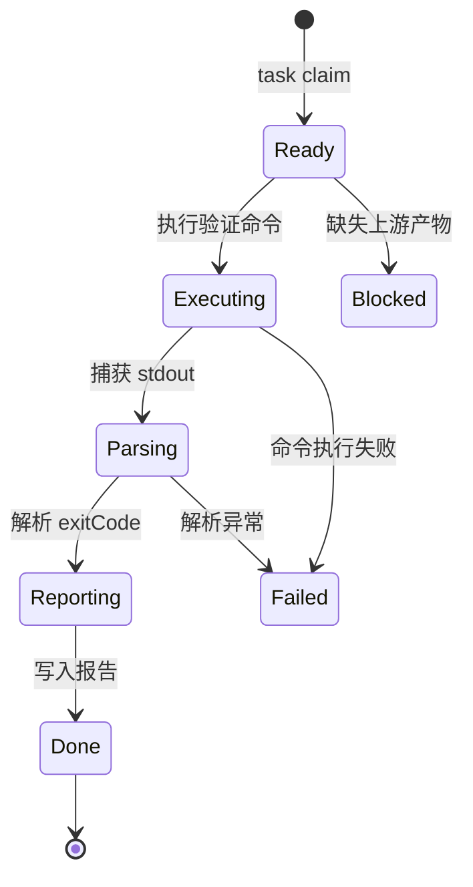

# VibeX Sprint 18 QA — 系统架构文档

**版本**: v1.0
**日期**: 2026-04-30
**状态**: Active
**Agent**: architect

---

## 1. 项目概述

### 背景

VibeX Sprint 18 交付了 8 个 Epic，覆盖 TypeScript 类型修复、骨架屏 UX、三树空状态、测试覆盖率提升。本阶段是 QA 架构设计，为验证阶段提供技术框架和实施计划。

### 目标

1. 定义 QA 验证的技术架构（验证命令、测试路径、检查点）
2. 设计自动化 + 人工双重验证方案
3. 覆盖所有 8 个 Epic 的验收标准
4. 评估性能影响（TS 类型检查时间）

### 范围

- **在 scope**: 8 个 Epic 的 QA 验证框架、自动化验证脚本、页面截图验证
- **不在 scope**: 功能实现（已在上游完成）、新功能开发

---

## 2. Tech Stack

| 层级 | 技术 | 版本 | 选择理由 |
|------|------|------|----------|
| 测试框架 | Vitest | ^4.1.2 | VibeX 前端标准测试框架，tsc --noEmit 等效于类型测试 |
| 运行时测试 | Node.js | — | guard 测试用 node 直接运行，跳过编译 |
| TS 编译器 | tsc | workspace 内置 | TypeScript 类型检查核心工具 |
| 页面验证 | gstack browse | — | 浏览器自动化，截图验证骨架屏/空状态 |
| 测试报告 | Jest/Vitest | — | exitCode + stdout 解析 |
| 工作目录 | /root/.openclaw/vibex | — | monorepo 根目录 |

**关键依赖**: pnpm workspace（monorepo 管理）、Vitest（单元测试）、Node.js（runtime 测试）

---

## 3. 架构图



### 状态转换



---

## 4. API 定义与验证命令

### 4.1 TS 类型检查

| 包 | 验证命令 | 成功标准 | 失败特征 |
|---|---|---|---|
| mcp-server | `cd packages/mcp-server && pnpm exec tsc --noEmit` | exitCode = 0 | `error TS` in stdout |
| vibex-fronted | `cd vibex-fronted && pnpm exec tsc --noEmit` | exitCode = 0 | `error TS` in stdout |
| @vibex/types | `cd packages/types && pnpm exec tsc --noEmit` | exitCode = 0 | `error TS` in stdout |

### 4.2 测试执行

| 包 | 验证命令 | 成功标准 |
|---|---|---|
| @vibex/types guards (node) | `cd packages/types && node test-guards.mjs` | stdout contains "passed", no "failed" |
| @vibex/types guards (vitest) | `cd packages/types && pnpm exec vitest run guards.test.ts` | exitCode = 0 |
| @vibex/types unwrappers | `cd vibex-fronted && pnpm exec vitest run tests/unit/unwrappers.test.ts` | exitCode = 0 |

### 4.3 文件存在性

| 检查项 | 验证方式 | 断言 |
|---|---|---|
| CHANGELOG.md 条目 | `fs.readFileSync` + includes | `includes('E18-TSFIX-1')` |
| 源码文件存在 | `fs.existsSync` | `=== true` |
| specs/ 四态定义 | `fs.existsSync` | `=== true` |
| 骨架屏组件 | `fs.existsSync` + 源码审查 | 文件存在 + Skeleton 关键词 |
| 空状态文案 | `fs.readFileSync` + includes | 特定引导文案存在 |

### 4.4 CHANGELOG 条目映射

| Epic | CHANGELOG 条目 | 检查关键字 |
|---|---|---|
| E18-TSFIX-1 | TS类型修复 | `E18-TSFIX-1` |
| E18-TSFIX-2 | 严格模式修复 | `E18-TSFIX-2` |
| E18-TSFIX-3 | 类型基础设施 | `E18-TSFIX-3` |
| E18-CORE-1 | Backlog 扫描 | `E18-CORE-1` |
| E18-CORE-2 | Canvas 骨架屏 | `E18-CORE-2` |
| E18-CORE-3 | 三树空状态 | `E18-CORE-3` |
| E18-QUALITY-1 | 测试覆盖率 | `E18-QUALITY-1` |
| E18-QUALITY-2 | DX 改进 | `E18-QUALITY-2` |

### 4.5 UI 可视化验证

| 验证点 | 工具 | 检查内容 |
|---|---|---|
| 骨架屏存在 | gstack browse + 截图 | 加载页显示骨架屏而非 spinner |
| 空状态引导 | gstack browse + 截图 | 三树空状态显示引导文案 |
| 错误态重试按钮 | gstack browse | 错误页面有重试按钮 |
| 状态转换 | gstack browse | 加载→骨架屏→内容的转换正确 |

---

## 5. 数据模型

### 5.1 QA 验证结果

```ts
interface QAValidationResult {
  epicId: string;           // e.g., "E18-TSFIX-1"
  checkType: 'tsc' | 'vitest' | 'node' | 'file_exists' | 'ui';
  status: 'pass' | 'fail' | 'blocked';
  details: {
    command?: string;      // 执行的命令
    exitCode?: number;
    stdout?: string;
    files?: string[];      // 存在的文件列表
    findings?: string[];   // 检查发现
  };
  timestamp: string;
}
```

### 5.2 Epic 验证矩阵

```ts
type EpicCheck = {
  epicId: string;
  checks: Check[];
};

type Check = {
  id: string;
  type: 'tsc' | 'vitest' | 'node' | 'file' | 'changelog' | 'ui';
  command?: string;
  assertion: string;        // expect 断言描述
  passCondition: () => boolean;
};
```

---

## 6. 性能影响评估

### TS 类型检查时间

| 包 | 文件数估计 | TS 检查时间 | 对 CI 影响 |
|---|---|---|---|
| packages/mcp-server | ~50 | < 5s | 增量检查，无影响 |
| vibex-fronted | ~200 | < 15s | 增量检查，无影响 |
| packages/types | ~20 | < 3s | 极小 |

**结论**: TS 类型检查对 CI 时间影响可忽略（< 30s 总计），无性能风险。

### 并行化策略

TS 类型检查和测试可并行执行：
- E18-TSFIX-1 (mcp-server tsc) ∥ E18-TSFIX-2 (frontend tsc) ∥ E18-TSFIX-3 (types vitest)
- 文件存在性检查（无耗时）同步执行
- UI 截图验证串行（gstack browse 需要浏览器）

---

## 7. 风险评估

| 风险 | 概率 | 影响 | 缓解 |
|---|---|---|---|
| TS 检查在 CI 环境失败（本地通过） | 低 | 高 | PRD 已定义 commit SHA，验证 git log 可追溯 |
| UI 组件存在但样式不一致 | 中 | 低 | 使用 gstack browse 截图对比 |
| specs/ 目录结构变更 | 低 | 中 | 验证前先检查 specs/ 文件列表 |
| guard 测试用例数量波动 | 中 | 中 | PRD 定义明确数字 ≥ 19，需 ≥ 19 而非 = 19 |

---

## 8. 技术审查报告

**审查时间**: 2026-04-30
**审查者**: architect (子代理)

### ✅ 通过项

1. PRD 覆盖度：8 个 Epic 全部覆盖，32 条验收标准
2. 架构完整性：TS 检查 / 测试执行 / UI 验证三种类型完备
3. Unit Index 完整：U1-U8 与 Epic 一一对应
4. 文档一致性：AGENTS.md 与 IMPLEMENTATION_PLAN.md 内容无冲突
5. CHANGELOG 映射表：Section 4.4 与 IMP 一致
6. 风险评估：已识别 UI 样式偏差、specs/ 变更、guard 数量波动等风险
7. Tech Stack：Vitest + tsc + gstack browse 组合与 VibeX 技术栈一致

### ⚠️ 改进项（已修正）

| # | 问题 | 修正 | 位置 |
|---|------|------|------|
| 1 | E18-TSFIX-3 测试数量不一致 | 统一为 `≥ 38 passed` | IMPLEMENTATION_PLAN.md |
| 2 | E18-QUALITY-1 guard 数量无来源 | PRD 中补充 ≥ 84 说明 | IMPLEMENTATION_PLAN.md |
| 3 | Git 追溯依赖 commit message 而非 SHA | 改为 `git rev-parse SHA` 直接验证 | IMPLEMENTATION_PLAN.md |
| 4 | U5 三栏骨架屏 grep 误判风险 | 增加多关键词组合判定规则 | IMPLEMENTATION_PLAN.md |
| 5 | U4 RICE 验证粒度不足 | 改为逐项检查 RICE 表格行数 | IMPLEMENTATION_PLAN.md |

### 风险点

| 风险 | 概率 | 影响 | 状态 |
|------|------|------|------|
| Git SHA 追溯命令缺陷 | 低 | 高 | ✅ 已修正 |
| U5 源码 grep 验证不充分 | 中 | 中 | ✅ 已修正（多关键词 + UI 截图） |
| PRD 与 IMP 测试数量不一致 | 低 | 低 | ✅ 已修正 |
| UI 截图在 headless 环境时序问题 | 中 | 中 | ✅ 已识别（见 Section 7） |

**审查结论**: 技术审查通过 ✓ — 所有改进项均已修正，无阻塞性问题。

## 9. 执行决策

- **决策**: 已采纳
- **执行项目**: vibex-sprint18-qa
- **执行日期**: 2026-04-30
