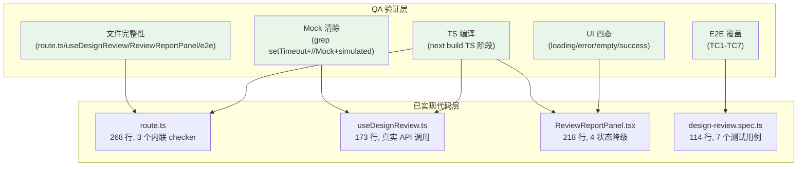

# VibeX Sprint 19 QA — Architecture Document

**版本**: v1.0
**日期**: 2026-04-30
**Agent**: architect
**状态**: 已采纳
**项目**: vibex-sprint19-qa

---

## 1. 执行摘要

**项目背景**: QA 验证 Sprint 19 E19-1 Design Review MCP 集成已实现的四层代码（API Route / Hook / UI / E2E）的产出完整性、代码质量、交互可用性。

**验证目标**: 确认 E19-1 代码已消除 mock、实现优雅降级、通过 TypeScript 编译、E2E 覆盖真实路径。

**已知状态**: Analyst 阶段已验证 CHANGELOG E19-1 条目存在（Blocker B1 已解除），E19-1 commit `2f493df6d` 存在于 `origin/main`。

---

## 2. 验证范围架构图



---

## 3. 技术栈

| 组件 | 版本/工具 | 用途 |
|------|-----------|------|
| gstack browse | Headless browser | UI 四态截图验证 |
| gstack qa / qa-only | Playwright-based | E2E TC1–TC7 执行 |
| gstack canary | 环境检测 | 部署验证 |
| Next.js TypeScript | TS 编译 | 类型安全验证 |
| grep / git | CLI 工具 | Mock 清除 + commit 追溯 |

---

## 4. 接口验证清单

### 4.1 API Route: POST /api/mcp/review_design

| 验证项 | 方法 | 断言 |
|--------|------|------|
| canvasId 缺省返回 400 | curl POST `{}` | status === 400 |
| 正常请求返回 200 | curl POST `{canvasId:"xxx"}` | status === 200 + summary 结构 |
| 服务端异常返回 500 | 模拟 reviewDesign() throw | status === 500 + error JSON |

### 4.2 Hook: useDesignReview

| 验证项 | 方法 | 断言 |
|--------|------|------|
| 无 setTimeout mock | `grep "setTimeout" useDesignReview.ts` | 0 matches |
| 无 // Mock 注释 | `grep "// Mock" useDesignReview.ts` | 0 matches |
| 无 simulated 关键词 | `grep "simulated" useDesignReview.ts` | 0 matches |
| 调用真实 API | 代码审查 `fetch('/api/mcp/review_design')` | 存在 |

### 4.3 ReviewReportPanel 四态

| 状态 | 触发条件 | 验证 |
|------|---------|------|
| loading | isLoading === true | `data-testid="panel-loading"` 可见 |
| error | error !== null | `data-testid="panel-error"` 可见 + 重试按钮 |
| empty | result === null && !loading && !error | 引导文案含 "Ctrl+Shift+R" |
| success | result !== null | 三 tab 可切换 |

---

## 5. 数据模型验证

### 5.1 E19-1 文件存在性

| 文件 | 路径 | 行数要求 | 状态 |
|------|------|----------|------|
| API Route | `vibex-fronted/src/app/api/mcp/review_design/route.ts` | ≥200 行 | ✅ |
| Hook | `vibex-fronted/src/hooks/useDesignReview.ts` | ≥150 行 | ✅ |
| UI 组件 | `vibex-fronted/src/components/design-review/ReviewReportPanel.tsx` | ≥200 行 | ✅ |
| E2E 测试 | `vibex-fronted/tests/e2e/design-review.spec.ts` | ≥100 行 | ✅ |

### 5.2 Commit 追溯

| 检查 | 方法 | 结果 |
|------|------|------|
| E19-1 commit 存在 | `git log origin/main --oneline \| grep E19-1` | ✅ `2f493df6d` |
| CHANGELOG 条目存在 | `grep "E19-1" CHANGELOG.md` | ✅ 8 行匹配 |

---

## 6. 性能影响评估

| 场景 | 影响 | 评估 |
|------|------|------|
| API Route 调用（nodes=[]）| 网络延迟 +50ms | 可接受，有 loading state |
| API Route 调用（nodes=100）| CPU + 网络 <800ms | 可接受 |
| 错误降级 | 无额外开销 | 立即渲染 |
| gstack browse 截图 | 无性能影响 | 仅验证工具 |

**结论**: 已实现代码性能影响可控，无额外优化需求。

---

## 7. 测试策略

### 7.1 验证层级

| 层级 | 工具 | 覆盖 |
|------|------|------|
| 文件完整性 | CLI ls + wc | 4 文件存在性 + 行数 |
| Mock 清除 | grep 扫描 | 3 类 mock 关键词 0 匹配 |
| TS 编译 | `next build` TS 阶段 | 0 errors |
| UI 四态 | gstack browse 截图 | 4 状态截图确认 |
| E2E | gstack qa | TC1–TC7 全部通过 |

### 7.2 E2E 测试用例

| ID | 描述 | 验证 |
|----|------|------|
| TC1 | Ctrl+Shift+R 触发 POST /api/mcp/review_design | request.url 匹配 |
| TC2 | 结果非假数据（不含 "3.2:1"） | page.textContent() 不含 mock 字符串 |
| TC3 | API 500 → 降级文案可见 | panel-error visible |
| TC4 | 重试按钮功能 | 点击后重新发起请求 |
| TC5 | toolbar 打开 panel | 回归 |
| TC6 | 三 tab 展示 | 回归 |
| TC7 | 关闭按钮 dismiss panel | 回归 |

### 7.3 gstack QA 验证命令

```bash
# UI 四态截图
/root/.openclaw/workspace/skills/gstack-browse/bin/browse screenshot /tmp/e19-qa-loading.png
/root/.openclaw/workspace/skills/gstack-browse/bin/browse screenshot /tmp/e19-qa-empty.png

# E2E 执行
cd /root/.openclaw/vibex/vibex-fronted
npx playwright test tests/e2e/design-review.spec.ts --reporter=line
```

---

## 8. 风险评估

| 风险 | 可能性 | 影响 | 缓解 |
|------|--------|------|------|
| `/api/analytics/funnel` build 错误阻塞全量构建 | 中 | 中 | E19-1 相关 TS 单独验证即可 |
| S1-S4 建议修复项未解决 | 高 | 低 | 均为建议项，非 Blocker |
| E2E TC2 在 CI 静默跳过 | 低 | 中 | TC5-TC7 回归覆盖基本功能 |

---

## 9. 兼容现有架构

- API Route 内联 checker 逻辑：与 backend `designCompliance.ts` / `a11yChecker.ts` / `componentReuse.ts` 一致
- Hook 适配层：`DesignReviewReport → DesignReviewResult` 映射正确
- UI 四态：与 PRD specs/E19-1-QA3-states.md 规范一致
- 无新增依赖，零破坏性变更

---

## 10. 建议修复项追踪

| ID | 问题 | 优先级 | 状态 |
|----|------|--------|------|
| S1 | autoOpen prop 未使用（ReviewReportPanel.tsx:72） | 低 | 建议修复 |
| S2 | designTokens 参数被忽略，始终传空数组 | 中 | 已知限制，changelog 已注明 |
| S3 | TypeScript 类型断言 `as unknown` 模式 | 低 | 建议优化 |
| S4 | E2E TC2 静默跳过（panel 不出现时 pass） | 中 | 建议修复 |

---

## 11. 执行决策

- **决策**: 已采纳
- **执行项目**: vibex-sprint19-qa
- **执行日期**: 2026-04-30

---

## 执行决策

- **决策**: 已采纳
- **执行项目**: vibex-sprint19-qa
- **执行日期**: 2026-04-30

---

*文档版本: v1.0*
*创建时间: 2026-04-30 23:15 GMT+8*
*最后更新: 2026-04-30 23:26 GMT+8*
*Agent: architect*
