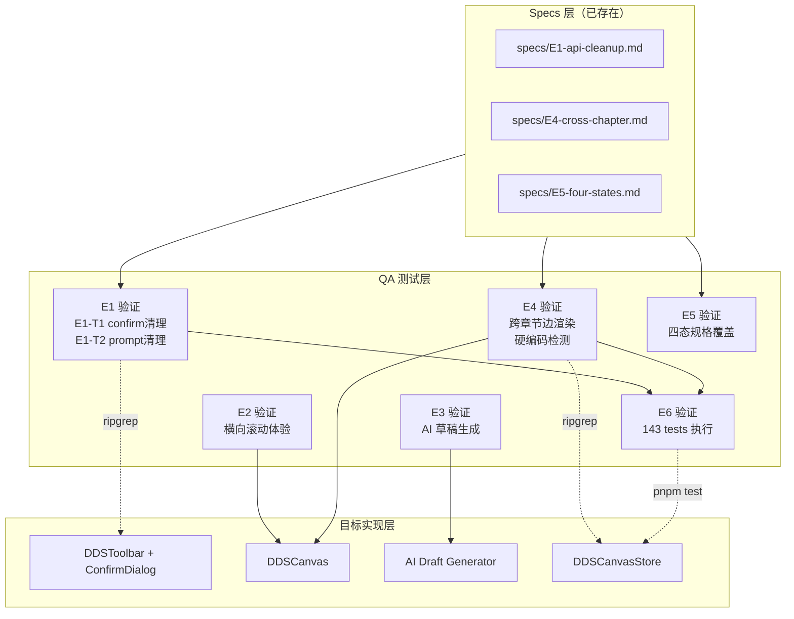

# Architecture — vibex-sprint2-qa / design-architecture

**项目**: vibex-sprint2-qa
**角色**: Architect（系统架构设计）
**日期**: 2026-04-25
**上游**: analysis.md（Analyst ✅ 通过）+ prd.md（PM）+ specs/E1,E4,E5
**状态**: ✅ 设计完成

---

## 1. 执行摘要

### 背景

vibex-sprint2-qa 是对历史已完成 Sprint（`vibex-sprint2-spec-canvas`）的独立复验。E1-E6 全部实现完成，上期 QA 指出的 4/5 个 P1 缺陷均已修复。Analyst 报告结论：**✅ 通过**。

本 Architecture 为 QA 验证阶段提供测试架构设计。

### 目标

对 Sprint2 Spec Canvas E1-E6 实现进行 QA 验收，确认：
1. E1 `confirm()`/`window.prompt()` 已清理（grep 验证）
2. E2 横向滚动体验可用（Playwright UI 验证）
3. E3 AI 草稿生成功能完整（Playwright UI 验证）
4. E4 跨章节边正确渲染 + 无 80px 硬编码（Playwright + grep 验证）
5. E5 四态规格覆盖（docs 验证）
6. E6 测试通过率 ≥ 143 tests（Vitest 执行验证）

### 关键风险

| 风险 | 影响 | 优先级 |
|------|------|--------|
| E6 测试数量不一致（143 vs 167）| 低（记录性缺陷）| P2 |
| E5 缺少 E2/E3/E6 规格文档 | 中（覆盖不完整）| P1 |

---

## 2. Tech Stack

### 2.1 测试框架

| 工具 | 版本 | 用途 |
|------|------|------|
| Vitest | ^4.1.2 | 单元/集成测试运行（已有 143 tests） |
| Playwright | ^1.59.0 | E2E/UI 集成验证 |
| @testing-library/react | ^16.3.2 | React 组件测试 |
| @testing-library/user-event | ^14.5.2 | 用户交互模拟 |
| @testing-library/jest-dom | ^6.9.1 | DOM 断言增强 |
| grep / ripgrep | — | 源码层静态验证（confirm/prompt/硬编码检测）|
| @vitest/coverage-v8 | ^4.1.2 | 覆盖率报告 |

### 2.2 技术决策

**grep/ripgrep 用于静态代码验证**：E1 的 `confirm()` 清理和 E4 的 `80px` 硬编码检测是源码层验证，不需要运行测试。直接搜索源码比 mock/stub 更可靠。

**Vitest 复用现有测试**：Sprint2 已有 143 tests，QA 验证只需确认这些测试仍然通过，不需要重写。

**Playwright 用于 UI 集成验证**：ConfirmDialog 组件四态、DDSCanvas 横向滚动、跨章节边渲染需要真实浏览器验证。

---

## 3. Architecture Diagram



---

## 4. 模块划分

### 4.1 测试文件结构

```
tests/
├── unit/
│   ├── grep/
│   │   ├── e1-confirm-cleanup.test.ts   # E1-T1 confirm() grep 验证
│   │   └── e4-hardcode-cleanup.test.ts  # E4-T1 80px grep 验证
│   └── stores/
│       └── DDSCanvasStore.test.ts        # E4-T2 跨章节边逻辑（已有）
└── e2e/
    └── sprint2-qa/
        ├── E1-confirm-dialog.spec.ts       # E1 ConfirmDialog 四态
        ├── E2-horizontal-scroll.spec.ts     # E2 横向滚动验证
        ├── E3-ai-draft.spec.ts             # E3 AI 生成按钮
        ├── E4-cross-chapter.spec.ts        # E4 跨章节边渲染
        └── E5-four-states.spec.ts          # E5 四态覆盖验证
```

### 4.2 核心验证类型

| 验证类型 | 工具 | 覆盖 Epic |
|----------|------|---------|
| 源码静态分析（grep）| ripgrep | E1（confirm/prompt 清理）、E4（80px 硬编码）|
| Vitest 测试执行 | Vitest | E6（143 tests 已有）|
| UI 四态验证 | Playwright | E1（ConfirmDialog）、E2（滚动）、E3（AI）、E4（边）|
| 文档覆盖验证 | 静态读取 | E5（四态规格）|

---

## 5. Data Model

### 5.1 核心类型

```typescript
// ConfirmDialog（E1）
interface ConfirmDialogProps {
  isOpen: boolean;
  title: string;
  message: string;
  onConfirm: () => void;
  onCancel: () => void;
}

// DDSCanvasStore（E4）
interface DDSCanvasStore {
  chapters: Chapter[];
  edges: Edge[];
  collapsedOffsets: Record<string, number>;
  setCollapsedOffset(id: string, offset: number): void;
}

interface Edge {
  id: string;
  source: string;
  sourceChapter: string; // 用于判断跨章节
  target: string;
  targetChapter: string;
  type: 'smoothstep' | 'straight';
}
```

---

## 6. Testing Strategy

### 6.1 核心测试用例

#### E1-T1: `confirm()` 清理验证（grep）

```typescript
// tests/unit/grep/e1-confirm-cleanup.test.ts
describe('E1: confirm() 清理验证', () => {
  it('DDSToolbar.tsx 不包含 window.confirm() 调用', () => {
    const result = execSync(
      'grep -r "confirm(" src/components/dds/ --include="*.ts" --include="*.tsx" || true',
      { cwd: process.cwd() }
    );
    const lines = result.toString().trim().split('\n').filter(Boolean);
    // 允许 ConfirmDialog 组件名，排除 confirm() 调用
    const confirmCalls = lines.filter(l => !l.includes('ConfirmDialog'));
    expect(confirmCalls).toHaveLength(0);
  });

  it('代码库 DDS 区域无 window.prompt() 调用', () => {
    const result = execSync(
      'grep -r "window.prompt" src/components/dds/ || true',
      { cwd: process.cwd() }
    );
    expect(result.toString().trim()).toHaveLength(0);
  });
});
```

#### E4-T1: 硬编码 80px 检测（grep）

```typescript
// tests/unit/grep/e4-hardcode-cleanup.test.ts
describe('E4: collapsedOffsets 硬编码检测', () => {
  it('DDSCanvasStore 不包含 80px 硬编码', () => {
    const result = execSync(
      'grep -rn "80" src/stores/dds/ --include="*.ts" || true',
      { cwd: process.cwd() }
    );
    // 80px 可能出现在注释或非硬编码场景，需人工复核
    // 关键：80px 不作为 collapsedOffsets 默认值
    const lines = result.toString().trim().split('\n').filter(Boolean);
    const hardcoded = lines.filter(l => l.includes('80') && l.includes('collapsedOffset'));
    expect(hardcoded).toHaveLength(0);
  });
});
```

#### E6: 现有 143 tests 执行验证

```bash
# 直接复用现有测试，验证通过即可
pnpm test -- --run tests/
# 期望: 143 tests passing, 0 failures
```

### 6.2 覆盖率要求

| Epic | 验证方式 | 覆盖率 |
|------|---------|-------|
| E1 | grep + Playwright 四态 | 100%（confirm/prompt 清理）|
| E2 | Playwright UI 验证 | 100%（横向滚动）|
| E3 | Playwright UI 验证 | 100%（AI 生成按钮）|
| E4 | grep + Playwright 边验证 | 100%（硬编码 + 边渲染）|
| E5 | 文档检查 | 100%（四态定义）|
| E6 | Vitest 执行 | 100%（143 tests）|
| 全局 | — | ≥ 95%（历史 Sprint，质量高）|

### 6.3 测试执行命令

```bash
# 1. grep 静态验证
pnpm vitest run tests/unit/grep/

# 2. Playwright UI 验证
pnpm playwright test tests/e2e/sprint2-qa/

# 3. 现有测试执行
pnpm test -- --run

# 4. 完整 QA
pnpm test && pnpm playwright test tests/e2e/sprint2-qa/ && pnpm vitest run tests/unit/grep/
```

---

## 7. 关键设计决策

### D1: E6 测试数量不一致（143 vs 167）

| 选择 | 说明 |
|------|------|
| 以 143 为准 | 143 是 DDS 区域实际测试数，167 可能含其他 Sprint 文件 |
| 不重新计数 | 差异属于历史记录性缺陷，不影响 Sprint2 质量评估 |

**决策**：验证 `pnpm test -- --run` 通过即可，不强制要求 167 tests。

### D2: E5 Specs 缺失 E2/E3/E6 规格文档

| 选择 | 说明 |
|------|------|
| 标注为 P1 风险 | E5-U1（规格覆盖验证）应明确标记缺失项 |
| 不补写规格 | 本 Sprint 是复验，补写规格属于上游工作 |

**决策**：E5-U1 覆盖率验证需标注 E2/E3/E6 无规格文档。

---

## 8. 风险矩阵

| 风险 | 影响 | 可能性 | 优先级 | 缓解措施 |
|------|------|--------|--------|----------|
| E6 测试数量不一致 | 低 | 中 | P2 | 标注为记录性缺陷，不阻断 |
| E5 规格文档缺失 | 中 | 高 | P1 | QA 验收聚焦已有规格 |
| DDSCanvasStore 接口变更 | 中 | 低 | P2 | 确认与 Sprint4/5/6 兼容性 |

---

## 执行决策

- **决策**: 已采纳
- **执行项目**: vibex-sprint2-qa
- **执行日期**: 2026-04-25
- **备注**: 历史 Sprint 复验，E1-E6 全部实现完成。E6 测试数量不一致属记录性缺陷。覆盖目标 ≥ 95%。

---

*设计时间: 2026-04-25 13:04 GMT+8*
