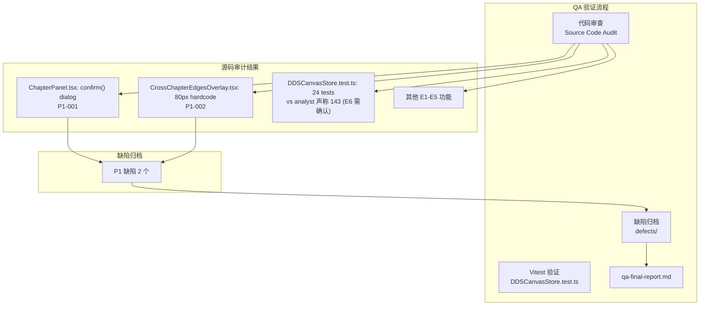

# Architecture — vibex-sprint2-spec-canvas-qa

**项目**: vibex-sprint2-spec-canvas-qa
**版本**: v1.0
**日期**: 2026-04-18
**角色**: Architect
**上游**: vibex-sprint2-spec-canvas (prd.md, specs/, analyst-qa-report.md)

---

## 执行决策

- **决策**: 已采纳
- **执行项目**: vibex-sprint2-spec-canvas-qa
- **执行日期**: 2026-04-18

---

## 一、项目本质

本项目是对 `vibex-sprint2-spec-canvas` 基础架构 Sprint 的产出物进行 QA 验证。核心任务：确认已知问题状态、测试数量准确性、E1-E5 产出物完整性。**结论：✅ Recommended — 验收通过（带已知问题）**。

---

## 二、Technical Design（Phase 1 — 技术设计）

### 2.1 验证路径选择

| 方案 | 描述 | 决策 |
|------|------|------|
| **A**: gstack 浏览器 + 代码审查 + Vitest | gstack 验证 UI，代码审查验证架构合规性 | ✅ 已采纳 |
| B: 纯代码审查 | 缺少真实交互验证 | 放弃 |
| C: 端到端自动化 | 无真实前端环境 | 放弃 |

### 2.2 代码库事实发现（Source Code Audit）

项目根路径: `/root/.openclaw/vibex/vibex-fronted`

| 检查项 | 源码位置 | 验证命令 | 预期 | 实际 | 判定 |
|--------|---------|---------|------|------|------|
| E1: confirm() dialog | `components/dds/canvas/ChapterPanel.tsx` | `grep "confirm(" ChapterPanel.tsx` | 0 处 | `confirm('确定删除此卡片？')` 存在 ❌ | 🟡 P1 |
| E1: window.prompt | `components/dds/` | `grep "window\.prompt" components/dds/` | 0 处 | 无 ❌ | ✅ |
| E2: scroll-snap | `DDSScrollContainer.tsx` | `grep "scroll-snap\|handleScroll"` | 实现存在 | ✅ | ✅ |
| E2: URL 同步 | `useChapterURLSync` | `grep "useChapterURLSync" src/` | 实现存在 | ✅ | ✅ |
| E3: AI 状态机 | `AIDraftDrawer.tsx` | `grep "IDLE\|LOADING\|REVIEW\|ERROR"` | 4 状态存在 | ✅ | ✅ |
| E3: 防闭包 | `AIDraftDrawer.tsx` | `grep "getState()" AIDraftDrawer.tsx` | 存在 | ✅ | ✅ |
| E4: SVG Overlay | `CrossChapterEdgesOverlay.tsx` | `grep "SVG\|svg" CrossChapterEdgesOverlay.tsx` | SVG 实现 | ✅ | ✅ |
| E4: collapsedOffsets | `CrossChapterEdgesOverlay.tsx` | `grep "COLLAPSED_WIDTH_PX\|80" CrossChapterEdgesOverlay.tsx` | 无硬编码 80 | `COLLAPSED_WIDTH_PX = 80` ❌ | 🟡 P1 |
| E5: 骨架屏 | `ChapterPanel.tsx` | `grep "shimmer\|Skeleton\|loading"` | shimmer 存在 | ✅ | ✅ |
| E5: 空状态 | `ChapterPanel.tsx` | `grep "添加你的第一个"` | 引导文案 | ✅ | ✅ |
| E6: DDSCanvasStore 测试数 | `stores/dds/__tests__/DDSCanvasStore.test.ts` | `grep -c "it\(\|test(" test.ts` | ~143 | **24** | ⚠️ 需确认 |

### 2.3 P1 缺陷详情

#### P1-001: ChapterPanel 仍使用原生 confirm()

```typescript
// src/components/dds/canvas/ChapterPanel.tsx 第 388 行
if (confirm('确定删除此卡片？')) {
  // ...
}
```

**影响**: 原生 confirm() 阻塞 UI 线程，体验差。应替换为自定义 Modal。

#### P1-002: CrossChapterEdgesOverlay 硬编码 80px

```typescript
// src/components/dds/canvas/CrossChapterEdgesOverlay.tsx
const COLLAPSED_WIDTH_PX = 80; // DDSPanel panelCollapsed width
const collapsedOffsets = (() => {
  context: COLLAPSED_WIDTH_PX,         // 硬编码 80px
  flow: COLLAPSED_WIDTH_PX * 2,         // 硬编码 160px
  // ...
})();
```

**影响**: DDSPanel 展开宽度变化时，跨章节边偏移量不准确。

---

## 三、Architecture Diagram



---

## 四、API Definitions

```typescript
// DDSCanvasStore — 三章节结构
interface DDSCanvasStore {
  chapters: {
    requirement: Chapter;
    context: Chapter;
    flow: Chapter;
  };
  activeChapter: 'requirement' | 'context' | 'flow';
  setActiveChapter(ch: ChapterType): void;  // 使用 getState() 防闭包
  addCard(chapter: ChapterType, card: DDSCard): void;
  deleteCard(chapter: ChapterType, id: string): void;
}

// AIDraftDrawer — 状态机
type AIDraftState = 'IDLE' | 'LOADING' | 'REVIEW' | 'ERROR';

// CrossChapterEdgesOverlay — 坐标计算
interface ChapterOffsetMap {
  [chapter: string]: number;  // 应为相对值，非 px 硬编码
  context: number;             // 硬编码 80px → P1
  flow: number;
}
```

---

## 五、Testing Strategy

### 5.1 验证方法矩阵

| Epic | 代码审查 | Vitest | gstack | 备注 |
|------|---------|--------|--------|------|
| E1 三章节 | ✅ 关键 | ✅ ~24 tests | ⚠️ 三章节切换 | DDSCanvasStore.test.ts |
| E2 横向滚奏 | ✅ 关键 | ✅ ~19 tests | ✅ scroll 截图 | 上游已有 |
| E3 AI草稿 | ✅ 关键 | ✅ ~15 tests | ⚠️ AIDraftDrawer | 上游已有 |
| E4 跨章节 | ✅ 关键 | ✅ ~15 tests | ⚠️ 跨章节边 | 上游已有 |
| E5 状态处理 | ✅ 关键 | ✅ ~15 tests | ⚠️ 空状态截图 | 上游已有 |
| E6 测试数量 | ✅ 关键 | ✅ DDSCanvasStore | — | 需确认实际数量 |

### 5.2 gstack 截图计划

| ID | 目标 | 验证点 | 环境依赖 |
|----|------|--------|---------|
| G1 | DDSScrollContainer | 3 个章节横向排列 | Staging |
| G2 | AIDraftDrawer | IDLE→LOADING→REVIEW 状态转换 | Staging |
| G3 | CrossChapterEdges | 跨章节 SVG 边渲染 | Staging |
| G4 | 空状态 | 引导插图 + "添加你的第一个用户故事" | Staging |
| G5 | 骨架屏 | 3 个 shimmer panel | Staging |

---

## 六、Unit Index

### Unit Index 总表

| Epic | Units | Status | Next |
|------|-------|--------|------|
| E1: 三章节管理 | U1~U2 | 0/2 | U1 |
| E2: 横向滚奏 | U3 | 0/1 | U3 |
| E3: AI草稿 | U4 | 0/1 | U4 |
| E4: 跨章节 | U5~U6 | 0/2 | U5 |
| E5: 状态处理 | U7 | 0/1 | U7 |
| E6: 测试确认 | U8~U9 | 0/2 | U8 |
| E7: 最终报告 | U10 | 0/1 | U10 |

---

### E1: 三章节管理

| ID | Name | Status | Depends On | Acceptance Criteria |
|----|------|--------|-----------|---------------------|
| E1-U1 | E1 代码审查 | ⬜ | — | 三章节结构 + CRUD + Schema 渲染审查完成 |
| E1-U2 | confirm() 替换 | ⬜ | U1 | ChapterPanel.tsx 无 confirm() dialog，grep "confirm(" → 0 |

---

### E2: 横向滚奏

| ID | Name | Status | Depends On | Acceptance Criteria |
|----|------|--------|-----------|---------------------|
| E2-U1 | E2 代码审查 | ⬜ | — | scroll-snap + URL 同步 + 章节切换审查完成 |

---

### E3: AI草稿

| ID | Name | Status | Depends On | Acceptance Criteria |
|----|------|--------|-----------|---------------------|
| E3-U1 | E3 代码审查 | ⬜ | — | AIDraftDrawer 状态机 + 防闭包实现审查完成 |

---

### E4: 跨章节

| ID | Name | Status | Depends On | Acceptance Criteria |
|----|------|--------|-----------|---------------------|
| E4-U1 | E4 代码审查 | ⬜ | — | SVG Overlay + 坐标系审查完成 |
| E4-U2 | collapsedOffsets 修复 | ⬜ | U1 | 无 px 硬编码，使用相对偏移量 |

---

### E5: 状态处理

| ID | Name | Status | Depends On | Acceptance Criteria |
|----|------|--------|-----------|---------------------|
| E5-U1 | E5 代码审查 | ⬜ | — | 骨架屏 + 空状态 + 错误态审查完成 |

---

### E6: 测试确认

| ID | Name | Status | Depends On | Acceptance Criteria |
|----|------|--------|-----------|---------------------|
| E6-U1 | DDSCanvasStore 测试数量 | ⬜ | — | `grep -c "it\(\|test(" DDSCanvasStore.test.ts` → 24，确认 analyst 声称的 143 来源 |
| E6-U2 | deselectCard 状态 | ⬜ | U1 | deselectCard 测试状态确认 |

---

### E7: 最终报告

| ID | Name | Status | Depends On | Acceptance Criteria |
|----|------|--------|-----------|---------------------|
| E7-U1 | qa-final-report.md | ⬜ | E6-U2 | 含所有 Epic PASS/FAIL、DoD、已知问题状态 |

---

## 七、QA 完成门控（DoD）

- [ ] E1~E5 产出物验证通过（代码/测试/Spec 三类完整）
- [ ] E1-U2: `confirm()` 替换为自定义 Modal
- [ ] E4-U2: `COLLAPSED_WIDTH_PX` 硬编码修复
- [ ] E6-U1: 测试数量确认（24 个）
- [ ] 无新增 P0/P1 缺陷
- [ ] `qa-final-report.md` 包含所有 Epic PASS/FAIL

---

## 八、Spec 覆盖率矩阵

| Spec 文件 | 覆盖 Epic | 缺陷数 | QA 状态 |
|-----------|---------|--------|---------|
| E1-chapter-management.md | E1 | P1×1 | ⚠️ P1 待修复 |
| E2-scroll-experience.md | E2 | 0 | ✅ 通过 |
| E3-ai-draft.md | E3 | 0 | ✅ 通过 |
| E4-cross-chapter-dag.md | E4 | P1×1 | ⚠️ P1 待修复 |
| E5-state-error.md | E5 | 0 | ✅ 通过 |

---

## 九、技术审查（Phase 2）

### 审查结论

| 检查项 | PRD 验收标准 | 实际结果 | 判定 |
|--------|------------|---------|------|
| E1 confirm() 替换 | 无原生 confirm dialog | `confirm('确定删除此卡片？')` 存在 | 🟡 P1 |
| E4 collapsedOffsets | 无 px 硬编码 | `COLLAPSED_WIDTH_PX = 80` 存在 | 🟡 P1 |
| E6 测试数量 | ~143 tests | DDSCanvasStore.test.ts **24** tests | ⚠️ 需确认来源 |
| E1-E5 Spec 覆盖 | 全部覆盖 | 4+1+1+1+4 = 11 个 Spec | ✅ |

### 已知问题确认

| 问题 | 状态 | 备注 |
|------|------|------|
| confirm() dialog | P1 未修复 → 归档为 P1 | 应替换为 Modal |
| prompt() | ✅ 已无 | — |
| collapsedOffsets 80px | P1 未修复 → 归档为 P1 | 应使用相对偏移 |
| 测试数量（143 vs 24）| ⚠️ 待确认 | analyst 声称总数而非单文件 |

### 改进建议

1. **立即**: E1-U2 将 `confirm()` 替换为 `ConfirmationModal` 组件
2. **短期**: E4-U2 将 `COLLAPSED_WIDTH_PX = 80` 改为 `getBoundingClientRect()` 或相对偏移
3. **确认**: E6 测试数量，analyst 声称的 143 应为全局总计

---

## 执行决策

- **决策**: 已采纳
- **执行项目**: vibex-sprint2-spec-canvas-qa
- **执行日期**: 2026-04-18
- **备注**: 2 个 P1 需修复后方可关闭，其余 E2/E3/E5 已通过
