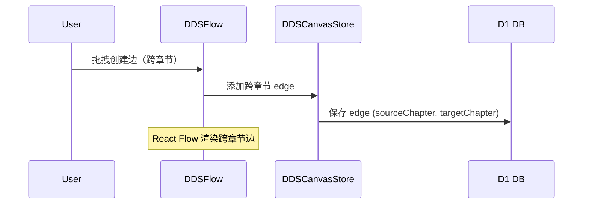
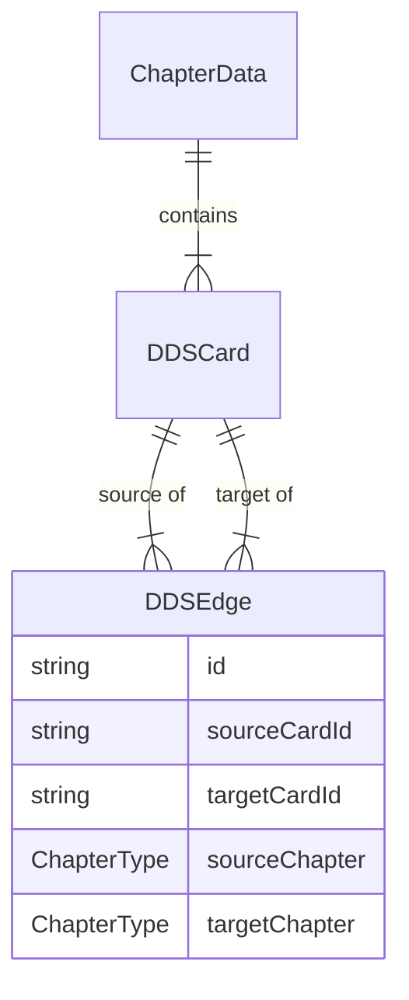

# Architecture — vibex-sprint2-spec-canvas

**项目**: vibex-sprint2-spec-canvas
**角色**: Architect
**日期**: 2026-04-17
**状态**: active

---

## 执行摘要

Sprint 2 为 VibeX 构建详细设计规范画布（Spec Canvas）：在 `/design/dds-canvas` 路由上扩展三章节固定结构（需求/上下文/流程）、横向 ScrollSnap 切换、卡片 CRUD、AI 辅助生成草稿、跨章节 DAG 关系，将工程文档从离散文件转化为结构化卡片管理。

**技术决策**：复用 `DDSCanvasStore`（Zustand）+ `DDSScrollContainer` + `AIDraftDrawer` + `DDSFlow`（React Flow）+ D1 持久化，在现有 DDS Canvas 基础设施上增量构建。

---

## 1. Tech Stack

| 组件 | 选择 | 版本/理由 |
|------|------|---------|
| **框架** | Next.js (App Router) | 已有，`/design/dds-canvas` 已存在 |
| **状态管理** | Zustand (`DDSCanvasStore`) | 已有，Epic 1 阶段扩展 chapters/cards/edges |
| **DAG 渲染** | @xyflow/react (React Flow v12) | 已有，DDS Canvas 已在使用 |
| **滚动容器** | CSS scroll-snap (原生) | 已有，`DDSScrollContainer` 已实现 |
| **持久化** | D1 Database (Cloudflare) | 已有部分 schema，Epic 1 完成 migration |
| **AI 辅助** | 复用 `AIDraftDrawer` + `useDDSAPI` | 已有基础设施 |
| **样式** | CSS Modules + Tailwind | 已有，Canvas 组件已在使用 |
| **测试** | Vitest + React Testing Library | 已有，DDSCanvasStore 测试策略可复用 |

**决策**：完全复用现有基础设施，不引入新库。DDS Canvas 的 scroll container + AI drawer + React Flow 均已验证可用。

---

## 2. Architecture Diagram

```mermaid
graph TB
    subgraph "/design/dds-canvas/page.tsx"
        route[DDSCanvasContent<br/>读取 projectId]
    end

    subgraph "components/dds/"
        page[DDSCanvasPage<br/>主组件]
        toolbar[DDSToolbar<br/>章节指示+AI触发]
        scroll[DDSScrollContainer<br/>横向ScrollSnap]
        flow[DDSFlow<br/>React Flow DAG]
        drawer[AIDraftDrawer<br/>AI草稿抽屉]
        cards[CardRenderer<br/>卡片Schema渲染]
    end

    subgraph "stores/dds/DDSCanvasStore.ts"
        store[DDSCanvasStore<br/>Zustand]
        chapters[chapters<br/>3个ChapterData]
        cards[chapters[].cards[]]
        edges[chapters[].edges[]<br/>含跨章节边]
        chapterActions[ddsChapterActions<br/>章节状态管理]
    end

    subgraph "services/dds/"
        ddsAPI[useDDSAPI hook<br/>AI + 数据 API]
        persistence[DDS Persistence<br/>D1 CRUD]
    end

    subgraph "D1 Database"
        d1_chapters[dds_chapters表]
        d1_cards[dds_cards表]
        d1_edges[dds_edges表]
    end

    subgraph "types/dds/"
        types[ChapterType<br/>DDSCard<br/>DDSEdge<br/>CardSchemas]
    end

    route --> page
    page --> toolbar
    page --> scroll
    scroll --> flow
    flow --> cards
    scroll --> drawer
    drawer --> store
    store --> ddsAPI
    ddsAPI --> persistence
    persistence --> d1_chapters
    persistence --> d1_cards
    persistence --> d1_edges
    store --> chapters
    chapters --> cards
    cards --> types
```

### 跨章节边数据流



---

## 3. API Definitions

### 3.1 数据模型（扩展现有 types/dds）

```typescript
// types/dds/index.ts — 扩展

// 章节类型（固定 3 个）
type ChapterType = 'requirement' | 'context' | 'flow';

// 卡片类型（与章节绑定）
type CardType = 'user-story' | 'bounded-context' | 'flow-step';

// 卡片基础
interface DDSCardBase {
  id: string;
  chapterType: ChapterType;
  cardType: CardType;
  title: string;
  createdAt: string;
  updatedAt: string;
}

// 用户故事卡片（需求章节）
interface UserStoryCard extends DDSCardBase {
  cardType: 'user-story';
  role: string;         // 作为[角色]
  action: string;       // 我想要[行为]
  benefit: string;      // 以便于[收益]
  priority?: 'high' | 'medium' | 'low';
  children?: string[];  // 子卡片 ID
}

// 限界上下文卡片（上下文章节）
interface BoundedContextCard extends DDSCardBase {
  cardType: 'bounded-context';
  name: string;
  description: string;
  responsibility: string;
}

// 流程步骤卡片（流程章节）
interface FlowStepCard extends DDSCardBase {
  cardType: 'flow-step';
  stepNumber?: number;
  actor?: string;
  preCondition?: string;
  postCondition?: string;
}

type DDSCard = UserStoryCard | BoundedContextCard | FlowStepCard;

// 边（含跨章节支持）
interface DDSEdge {
  id: string;
  source: string;          // 卡片 ID
  target: string;          // 卡片 ID
  sourceChapter: ChapterType;
  targetChapter: ChapterType;
  type?: 'default' | 'navigation';
  label?: string;
}

// 章节数据
interface ChapterData {
  type: ChapterType;
  cards: DDSCard[];
  edges: DDSEdge[];        // 本章内边 + 跨章节边
  loading: boolean;
  error: string | null;
}
```

### 3.2 Store API（DDSCanvasStore 扩展）

```typescript
// stores/dds/DDSCanvasStore.ts — 扩展接口

interface DDSCanvasStoreState {
  // 已有
  activeChapter: ChapterType;
  chapters: Record<ChapterType, ChapterData>;
  selectedCardIds: string[];
  isDrawerOpen: boolean;
  chatHistory: ChatMessage[];
  isGenerating: boolean;

  // 新增
  addCard: (chapter: ChapterType, card: Omit<DDSCard, 'id' | 'createdAt' | 'updatedAt'>) => void;
  updateCard: (cardId: string, updates: Partial<DDSCard>) => void;
  deleteCard: (cardId: string) => void;
  addEdge: (edge: Omit<DDSEdge, 'id'>) => void;
  deleteEdge: (edgeId: string) => void;
  loadChapterFromD1: (chapter: ChapterType) => Promise<void>;
  saveCardToD1: (card: DDSCard) => Promise<void>;
  deleteCardFromD1: (cardId: string) => Promise<void>;
  syncCrossChapterEdges: () => void;  // 同步跨章节边的章节归属
}
```

### 3.3 REST API（D1 via CF Workers）

```typescript
// services/dds/ddsPersistence.ts — 新增接口

interface DDSChaptersAPI {
  // 获取项目所有章节
  getChapters(projectId: string): Promise<ChapterData[]>;
  // 获取单个章节（含卡片）
  getChapter(projectId: string, chapterType: ChapterType): Promise<ChapterData>;
  // 章节不存在时初始化
  initChapters(projectId: string): Promise<void>;
}

interface DDSCardsAPI {
  createCard(card: DDSCard): Promise<DDSCard>;
  updateCard(cardId: string, updates: Partial<DDSCard>): Promise<DDSCard>;
  deleteCard(cardId: string): Promise<void>;
  getCardsByChapter(projectId: string, chapterType: ChapterType): Promise<DDSCard[]>;
}

interface DDSEdgesAPI {
  createEdge(edge: DDSEdge): Promise<DDSEdge>;
  deleteEdge(edgeId: string): Promise<void>;
  getEdgesByProject(projectId: string): Promise<DDSEdge[]>;
}

// D1 SQL Schema（需 migration）
// dds_chapters: (id, projectId, chapterType, createdAt, updatedAt)
// dds_cards: (id, projectId, chapterType, cardType, data JSON, createdAt, updatedAt)
// dds_edges: (id, projectId, sourceCardId, targetCardId, sourceChapter, targetChapter, label)
```

### 3.4 AI 草稿 API（复用现有）

```typescript
// components/dds/ai-draft/AIDraftDrawer.tsx — 复用现有接口

interface AIGenerateRequest {
  projectId: string;
  chapterType: ChapterType;
  prompt: string;
  context?: ChatMessage[];  // 对话历史
}

interface AIGenerateResponse {
  cards: Array<Omit<DDSCard, 'id' | 'createdAt' | 'updatedAt'>>;
  edges: Array<Omit<DDSEdge, 'id'>>;    // 建议的边
  suggestedPosition?: { x: number; y: number };
}
```

---

## 4. Data Model

### 4.1 实体关系



### 4.2 D1 Schema

```sql
-- dds_chapters
CREATE TABLE IF NOT EXISTS dds_chapters (
  id TEXT PRIMARY KEY,
  project_id TEXT NOT NULL,
  chapter_type TEXT NOT NULL,
  created_at TEXT DEFAULT (datetime('now')),
  updated_at TEXT DEFAULT (datetime('now')),
  UNIQUE(project_id, chapter_type)
);

-- dds_cards
CREATE TABLE IF NOT EXISTS dds_cards (
  id TEXT PRIMARY KEY,
  project_id TEXT NOT NULL,
  chapter_type TEXT NOT NULL,
  card_type TEXT NOT NULL,
  data TEXT NOT NULL,  -- JSON: 完整卡片对象
  created_at TEXT DEFAULT (datetime('now')),
  updated_at TEXT DEFAULT (datetime('now'))
);

CREATE INDEX idx_cards_project_chapter ON dds_cards(project_id, chapter_type);

-- dds_edges
CREATE TABLE IF NOT EXISTS dds_edges (
  id TEXT PRIMARY KEY,
  project_id TEXT NOT NULL,
  source_card_id TEXT NOT NULL,
  target_card_id TEXT NOT NULL,
  source_chapter TEXT NOT NULL,
  target_chapter TEXT NOT NULL,
  label TEXT,
  created_at TEXT DEFAULT (datetime('now'))
);

CREATE INDEX idx_edges_project ON dds_edges(project_id);
```

---

## 5. Module Design

### 5.1 模块划分

| 模块 | 职责 | 关键文件 |
|------|------|---------|
| `DDSCanvasPage` | 主页面，路由组装，加载章节数据 | `components/dds/DDSCanvasPage.tsx` (扩展) |
| `DDSToolbar` | 章节指示器，AI 草稿触发 | `components/dds/toolbar/DDSToolbar.tsx` (扩展) |
| `DDSScrollContainer` | 横向 ScrollSnap 容器 | `components/dds/canvas/DDSScrollContainer.tsx` (已有，验证) |
| `DDSFlow` | 单章节 React Flow DAG | `components/dds/DDSFlow.tsx` (已有，扩展跨章节边) |
| `CardRenderer` | 按类型渲染卡片字段 | `components/dds/cards/CardRenderer.tsx` (已有，扩展 BC/Flow) |
| `AIDraftDrawer` | AI 草稿抽屉 | `components/dds/ai-draft/AIDraftDrawer.tsx` (已有，验证) |
| `DDSCanvasStore` | Zustand 状态管理 | `stores/dds/DDSCanvasStore.ts` (扩展) |
| `ddsPersistence` | D1 CRUD 操作 | `services/dds/ddsPersistence.ts` (新建/扩展) |
| `types/dds` | 类型定义 | `types/dds/index.ts` (扩展) |

### 5.2 新建组件

| 组件 | 位置 | 说明 |
|------|------|------|
| `RequirementCard` | `components/dds/cards/RequirementCard.tsx` | 用户故事卡片（role/action/benefit 渲染） |
| `BoundedContextCard` | `components/dds/cards/BoundedContextCard.tsx` | 限界上下文卡片（已有，验证完整性） |
| `FlowStepCard` | `components/dds/cards/FlowStepCard.tsx` | 流程步骤卡片（已有，验证完整性） |
| `ChapterPanel` | `components/dds/ChapterPanel.tsx` | 单章节面板（含空状态/骨架屏） |
| `AIGenerateButton` | `components/dds/AIGenerateButton.tsx` | AI 草稿触发入口 |

---

## 6. Performance Considerations

| 关注点 | 影响 | 缓解方案 |
|--------|------|---------|
| 三章节卡片数量多 | 渲染性能下降 | 懒加载章节，滚动时按需加载 |
| 跨章节边渲染 | React Flow 视图跨越多个 chapter 面板 | 跨章节边作为全局 overlay 层渲染 |
| D1 写入延迟 | 卡片保存慢 | 乐观更新（先写 store，后写 D1），失败回滚 |
| AI 生成响应时间 | 用户等待焦虑 | 流式输出 + loading skeleton |

**性能目标**：
- 章节切换响应时间: ≤ 300ms（ScrollSnap 吸附，DOM 操作）
- 卡片保存成功率: ≥ 99%
- AI 草稿采纳率: ≥ 60%

---

## 7. Testing Strategy

### 7.1 测试框架
- **Vitest** + **React Testing Library**
- **Playwright** (e2e)

### 7.2 覆盖率要求
- Store 逻辑: > 80%
- 卡片渲染: > 70%
- API 层: > 80%

### 7.3 核心测试用例

```typescript
// stores/dds/DDSCanvasStore.test.ts — 扩展

describe('DDSCanvasStore - 卡片 CRUD', () => {
  it('addCard: 添加用户故事卡片到 requirement 章节', () => {
    const store = createStore();
    store.addCard('requirement', {
      cardType: 'user-story',
      title: '登录功能',
      role: '用户',
      action: '输入用户名密码',
      benefit: '登录系统',
    });
    const cards = store.chapters.requirement.cards;
    expect(cards.length).toBe(1);
    expect(cards[0].cardType).toBe('user-story');
    expect(cards[0].role).toBe('用户');
  });

  it('addCard: 添加限界上下文卡片到 context 章节', () => {
    const store = createStore();
    store.addCard('context', {
      cardType: 'bounded-context',
      title: '用户上下文',
      name: 'UserContext',
      description: '用户注册和认证',
      responsibility: '用户生命周期管理',
    });
    expect(store.chapters.context.cards[0].cardType).toBe('bounded-context');
  });

  it('deleteCard: 删除卡片后刷新，列表中无该卡片', async () => {
    const store = createStore();
    store.addCard('requirement', { cardType: 'user-story', title: 'Test', role: '', action: '', benefit: '' });
    const cardId = store.chapters.requirement.cards[0].id;
    store.deleteCard(cardId);
    expect(store.chapters.requirement.cards.find(c => c.id === cardId)).toBeUndefined();
  });
});

describe('DDSCanvasStore - 跨章节边', () => {
  it('addEdge: 创建跨章节边，sourceChapter ≠ targetChapter', () => {
    const store = createStore();
    store.addCard('requirement', { cardType: 'user-story', title: 'US1', role: '', action: '', benefit: '' });
    store.addCard('context', { cardType: 'bounded-context', title: 'BC1', name: 'BC', description: '', responsibility: '' });
    const reqCard = store.chapters.requirement.cards[0];
    const ctxCard = store.chapters.context.cards[0];
    store.addEdge({
      source: reqCard.id,
      target: ctxCard.id,
      sourceChapter: 'requirement',
      targetChapter: 'context',
    });
    expect(store.chapters.requirement.edges[0].targetChapter).toBe('context');
  });
});

// components/dds/cards/CardRenderer.test.tsx — 扩展

describe('CardRenderer', () => {
  it('renders UserStory card with role/action/benefit fields', () => {
    render(<CardRenderer card={{ cardType: 'user-story', title: 'Test', role: '用户', action: '登录', benefit: '使用系统' } as DDSCard} />);
    expect(screen.getByText('作为')).toBeVisible();
    expect(screen.getByText('用户')).toBeVisible();
    expect(screen.getByText('我想要')).toBeVisible();
    expect(screen.getByText('登录')).toBeVisible();
    expect(screen.getByText('以便于')).toBeVisible();
    expect(screen.getByText('使用系统')).toBeVisible();
  });

  it('renders BoundedContext card with name/description/responsibility', () => {
    render(<CardRenderer card={{ cardType: 'bounded-context', title: 'BC1', name: 'OrderContext', description: '订单管理', responsibility: '订单生命周期' } as DDSCard} />);
    expect(screen.getByText('上下文名称')).toBeVisible();
    expect(screen.getByText('OrderContext')).toBeVisible();
    expect(screen.getByText('职责描述')).toBeVisible();
    expect(screen.getByText('订单生命周期')).toBeVisible();
  });

  it('renders FlowStep card with actor/preCondition', () => {
    render(<CardRenderer card={{ cardType: 'flow-step', title: 'Step1', actor: '用户', preCondition: '已登录', stepNumber: 1 } as DDSCard} />);
    expect(screen.getByText('步骤名称')).toBeVisible();
    expect(screen.getByText('前置条件')).toBeVisible();
    expect(screen.getByText('已登录')).toBeVisible();
  });
});

// components/dds/canvas/DDSScrollContainer.test.tsx — 验证横向滚奏

describe('DDSScrollContainer', () => {
  it('scroll to context chapter, activeChapter updates', async () => {
    render(<DDSScrollContainer projectId="test" />);
    const scrollContainer = screen.getByTestId('dds-scroll-container');
    // Simulate scroll
    fireEvent.scroll(scrollContainer, { target: { scrollLeft: 500 } });
    // Assert activeChapter changes (via IntersectionObserver)
    expect(screen.getByTestId('chapter-context')).toBeVisible();
  });
});
```

---

## 8. Key Technical Decisions

| 决策 | 选择 | 理由 |
|------|------|------|
| 三章节存储方式 | 每个章节独立 ChapterData，含跨章节边副本 | 避免跨章节查询，读取性能好；边在两端各存一份 |
| 跨章节边渲染 | React Flow 单一画布 + 虚拟节点占位 | 复用现有 React Flow，无额外渲染复杂度 |
| AI 草稿写入时机 | 用户点击"确认"后写入，非流式自动写入 | 避免脏数据，用户可预览编辑 |
| D1 migration | Epic 1 阶段执行，Sprint 2 依赖 | 确保 persistence 层就绪 |
| 骨架屏 vs Spinner | 骨架屏，禁止 spinner | PRD 明确要求，用户体验更好 |

---

## 9. 与 Sprint 1 (Prototype Canvas) 的共享资产

| 共享资产 | 复用方式 | 兼容性说明 |
|---------|---------|-----------|
| React Flow | Spec Canvas 用 DDSFlow，Prototype 用 ProtoFlowCanvas | 各自独立实例，不冲突 |
| Zustand | Spec 用 DDSCanvasStore，Prototype 用 prototypeStore | 各自独立，不共享状态 |
| 类型定义 | UI Schema 与 DDS Schema 完全独立 | 无共享类型 |
| 导出基础设施 | ExportMenu 可扩展支持 Spec Canvas | 扩展，非破坏性 |
| 测试策略 | Canvas hooks 测试模式可直接复用 | 完全兼容 |

---

## 10. Risk Assessment

| 风险 | 可能性 | 影响 | 缓解 |
|------|--------|------|------|
| D1 migration 在生产失败 | 低 | 高 | staging 验证 + rollback 脚本 |
| AI 草稿 API 与 useDDSAPI 不匹配 | 中 | 中 | 先用 mock 验证 UI，再接入真实 API |
| 跨章节边在 ScrollSnap 时视图错位 | 中 | 中 | 跨章节边使用 React Flow 全局边层，chapter panel 内部无边 |
| Card schema 扩展字段不足 | 中 | 中 | MVP 使用基础字段，扩展字段后续迭代 |
| 三章节面板性能（大卡片数） | 低 | 中 | 按需加载章节，懒加载卡片 |

---

## 技术审查发现

### 🔴 Critical Issues

1. **跨章节边删除的一致性**
   - 问题：跨章节边同时存储在 `sourceChapter` 和 `targetChapter` 两个章节中（两边各存一份副本）
   - 影响：删除边时需要同时从两端章节中删除，否则数据不一致
   - 缓解：`deleteCard()` 时遍历所有章节删除关联边；`deleteEdge()` 时需同步删除两端副本
   - 状态：**已在 IMPLEMENTATION_PLAN.md E1-U2/E4-U1 中体现**

2. **骨架屏状态的归属**
   - 问题：`ChapterData.loading` 在 store 层，但骨架屏是纯 UI 展示
   - 缓解：loading 状态由 store 管理（`chapters[chapter].loading`），ChapterPanel 组件订阅并渲染骨架屏
   - 状态：**符合现有 architecture §2 的分层设计**

3. **AI 草稿边预览与 ChapterPanel 渲染的边界**
   - 问题：AI 返回的 `suggestedEdges` 需要在预览时跨越章节，但 ChapterPanel 是单章节组件
   - 缓解：AI 边预览在 AIDraftDrawer 内独立渲染（不经过 React Flow），确认后才写入 store
   - 状态：**已在 IMPLEMENTATION_PLAN.md E3-U4 中体现**

4. **D1 Migration 依赖**
   - 问题：E1-U5（卡片 D1 持久化）依赖 E5-U3（骨架屏）的完成，但两者可独立测试
   - 缓解：E1-U5 开发时先使用 mock D1，验证 persistence 接口
   - 状态：**架构无阻塞，可分阶段验证**

### 🟡 Design Notes

1. **乐观更新 + 失败回滚策略**：所有写操作先更新 Zustand store（UI 立即响应），后写 D1。API 失败时回滚 store 状态。这是当前 Canvas 的标准模式，已在 `DDSCanvasStore` 中有基础实现。
2. **跨章节边渲染**：React Flow 单一全局实例，所有章节面板共享同一 flow nodes/edges 状态。跨章节边使用 `sourceChapter`/`targetChapter` 标记，渲染时通过 CSS/颜色区分。

---

## 执行决策

- **决策**: 已采纳
- **执行项目**: vibex-sprint2-spec-canvas
- **执行日期**: 待定
- **备注**: 与 `vibex-sprint1-prototype-canvas` 并行推进，两者共享 React Flow + Zustand 技术栈，但数据模型完全独立
