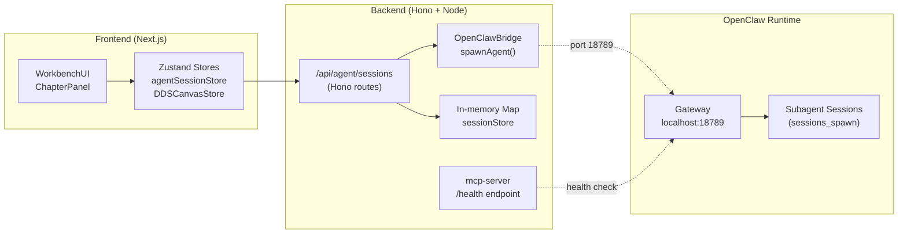

# VibeX Sprint 20 — Technical Architecture

**Architect**: architect 🤖
**Date**: 2026-05-01
**Project**: vibex-sprint20-qa
**Status**: Technical Design

---

## 1. Tech Stack

| Layer | Technology | Version | Rationale |
|-------|-----------|---------|-----------|
| Frontend | Next.js 14 (App Router) | 14.x | Server Components + client islands |
| State | Zustand | latest | Lightweight, selector-based subscriptions |
| Virtualization | @tanstack/react-virtual | 3.x | Battle-tested, zero-dependency |
| Backend | Hono | 4.x | Lightweight, Edge-ready, typed |
| Agent Runtime | OpenClaw sessions_spawn | — | Internal runtime bridge |
| E2E Testing | Playwright | 1.x | Chromium-only, CI-optimized |
| Unit Testing | Vitest | 2.x | Vite-native, faster than Jest |
| TypeScript | 5.x | strict mode | No compromise |

**版本约束**:
- `@tanstack/react-virtual@3` (not v4) — current codebase pins v3
- `Hono@4` — sessions.ts uses Hono router
- No lock-file drift allowed — all packages version-pinned

---

## 2. Architecture Diagram



### 数据流

```
User action (UI)
  → Zustand Store (client state)
  → Hono API route (POST/GET/DELETE)
  → OpenClawBridge.spawnAgent()
  → OpenClaw Gateway (HTTP POST /api/sessions/spawn)
  → Subagent spawn
  → Response back to client
```

---

## 3. API Definitions

### 3.1 Agent Sessions API

**Base URL**: `/api/agent/sessions`

| Method | Path | Request | Response | Status |
|--------|------|---------|----------|--------|
| `POST` | `/` | `{ task: string, context?: object }` | `{ sessionKey, status, createdAt }` | 201 |
| `GET` | `/` | — | `{ sessions: SessionSummary[] }` | 200 |
| `GET` | `/:id` | — | `{ sessionKey, task, status, messages, error }` | 200 |
| `GET` | `/:id/status` | — | `{ sessionKey, status, progress, result, error }` | 200 |
| `DELETE` | `/:id` | — | — (empty body) | 204 |

**Error response shape** (all error codes):
```json
{ "error": "string", "code": "ERROR_CODE" }
```

**Error codes**:
- `INVALID_TASK` — task missing or empty (400)
- `SESSION_NOT_FOUND` — session ID not found (404)
- `RUNTIME_UNAVAILABLE` — gateway unreachable

### 3.2 Workbench Route

| Condition | Response | Status |
|-----------|----------|--------|
| `NEXT_PUBLIC_WORKBENCH_ENABLED=true` | `WorkbenchUI` page | 200 |
| `NEXT_PUBLIC_WORKBENCH_ENABLED=false` | 404 (`notFound()`) | 404 |

### 3.3 MCP Server

| Endpoint | Method | Response |
|----------|--------|----------|
| `/health` | GET | `{ status: "ok", timestamp }` | 200 |

---

## 4. Data Model

### SessionRecord

```typescript
interface SessionRecord {
  sessionKey: string;       // Primary key
  task: string;            // User-provided task description
  status: SessionStatus;
  createdAt: number;       // Unix ms
  updatedAt: number;      // Unix ms
  messages: AgentMessage[];
  error?: string;         // 'RUNTIME_UNAVAILABLE' or error message
}

type SessionStatus =
  | 'idle'
  | 'starting'
  | 'running'
  | 'complete'
  | 'error'
  | 'terminated';
```

### In-Memory Store

```typescript
// backend/src/routes/agent/sessions.ts
const sessionStore = new Map<string, SessionRecord>();

// Max sessions: 50 (enforced by eviction on 51st insert)
```

### DDSCanvasStore (Canvas Virtualization)

```typescript
// frontend/src/stores/dds/DDSCanvasStore.ts
interface DDSCanvasStore {
  chapters: Record<ChapterType, Chapter>;
  selectedCardIds: string[];
  selectedCardSnapshot: {
    cardId: string;
    cardData: DDSCard;
    wasVisible: boolean;   // Tracks visibility across virtual boundaries
  } | null;
}

// Chapter → ChapterType (requirement | context | flow | api | business-rules)
```

---

## 5. Performance Architecture

### 5.1 Canvas Virtualization Config

```typescript
const virtualizer = useVirtualizer({
  count: cards.length,
  getScrollElement: () => parentRef.current,
  estimateSize: () => 120,   // Fixed — matches card height
  overscan: 3,              // 上下各 3 个节点
});
```

**约束**: `estimateSize` 固定为 120，`overscan` 固定为 3。禁止动态修改。

**性能目标**:
- 100 节点 P50 < 100ms (真实 DOM，Playwright E2E 验证)
- 150 节点 dropped frames < 2 (Playwright performance trace)
- 选中状态跨边界保持 (`selectedCardSnapshot.wasVisible`)

### 5.2 OpenClawBridge Timeout

```typescript
const timeout = 30_000; // 30s hard limit per P006
```

**约束**: 超时后 `AbortError` 抛出，session 状态更新为 `error`，`error = 'Agent spawn timeout (30s hard limit)'`。

---

## 6. Testing Strategy

### 6.1 Test Framework

| Test Type | Framework | Command |
|-----------|-----------|---------|
| Unit | Vitest | `pnpm test` |
| E2E | Playwright | `pnpm exec playwright test` |
| E2E (CI) | Playwright | `pnpm run test:e2e:ci` |
| Performance | Playwright | `pnpm exec playwright test tests/e2e/canvas-virtualization-perf.spec.ts` |

### 6.2 Coverage Requirements

| Layer | Coverage Target |
|-------|----------------|
| Backend (Hono routes) | > 90% |
| OpenClawBridge | 100% |
| Zustand stores | > 80% |
| Frontend components | Snapshot / manual |

### 6.3 Core Test Cases

**P001 (MCP DoD)**:
```typescript
// scripts/generate-tool-index.ts
test('generates INDEX.md with ≥ 7 entries and exits 0', () => {
  const { exitCode } = execSync('node scripts/generate-tool-index.ts');
  expect(exitCode).toBe(0);
  const index = readFileSync('INDEX.md', 'utf-8');
  expect(countEntries(index)).toBeGreaterThanOrEqual(7);
});

// mcp-server build
test('tsc --noEmit returns 0 errors', () => {
  const result = execSync('cd mcp-server && tsc --noEmit');
  expect(result.status).toBe(0);
});
```

**P004 (Canvas Virtualization)**:
```typescript
// DDSCanvasStore.test.ts
test('selectedCardSnapshot tracks wasVisible across virtual boundary', () => {
  store.addCard('requirement', mockCard);
  store.selectCard(mockCard.id);
  store.setSelectedCardSnapshot({ cardId: mockCard.id, cardData: mockCard, wasVisible: true });
  // Simulate scroll out of view
  store.updateCardVisibility(false);
  const snap = store.selectedCardSnapshot;
  expect(snap?.wasVisible).toBe(false);
  expect(snap?.cardId).toBe(mockCard.id);
});

test('benchmark-canvas.ts outputs valid JSON with p50/p95/p99', () => {
  const result = execSync('npx ts-node scripts/benchmark-canvas.ts --nodes=100');
  const parsed = JSON.parse(result.stdout);
  expect(parsed).toHaveProperty('p50');
  expect(parsed).toHaveProperty('p95');
  expect(parsed).toHaveProperty('p99');
  expect(parsed.nodeCount).toBe(100);
});
```

**P006 (Agent Sessions)**:
```typescript
// sessions.test.ts
test('POST /api/agent/sessions → 201 + sessionKey', async () => {
  const res = await api.post('/api/agent/sessions').send({ task: 'test task' });
  expect(res.status).toBe(201);
  expect(res.body).toHaveProperty('sessionKey');
  expect(res.body.status).toBe('starting');
});

test('DELETE /api/agent/sessions/:id → 204', async () => {
  const created = await api.post('/api/agent/sessions').send({ task: 'temp' });
  const sessionKey = created.body.sessionKey;
  const res = await api.delete(`/api/agent/sessions/${sessionKey}`);
  expect(res.status).toBe(204);
});

test('OpenClawBridge 30s timeout fires AbortError', async () => {
  // Mock fetch to never resolve
  vi.stubGlobal('fetch', () => new Promise(() => {}));
  await expect(spawnAgent({ task: 'test', sessionId: 'x' })).rejects.toThrow(/timeout/i);
});
```

### 6.4 E2E Performance Test (待执行)

```typescript
// tests/e2e/canvas-virtualization-perf.spec.ts
test('100 nodes P50 < 100ms (real DOM)', async ({ page }) => {
  await page.goto('/canvas');
  await seedCanvas(100);
  const metrics = await measurePaintLatency(page);
  expect(metrics.p50).toBeLessThan(100); // ms
});
```

---

## 7. Security Posture

| Risk | Level | Mitigation |
|------|-------|------------|
| XSS (WorkbenchUI message.content) | ✅ 已解除 | React JSX 自动转义 |
| CSRF (sessions API) | 🟡 低 (tech debt) | SSO 集成时处理 |
| RUNTIME_UNAVAILABLE | ⚠️ 中 | Structured error, status = 'error' |
| Session data in-memory (MVP) | 🟡 中 | 50 上限 + 自动清理；future: Redis |

---

## 8. Known Gaps (待 E2E 验证)

| ID | Gap | Impact | Action |
|----|-----|--------|--------|
| G1 | P004 真实 DOM P50 未实测 | 中 | QA 阶段执行 `canvas-virtualization-perf.spec.ts` |
| G2 | P006 gateway 可达性未实测 | 高 | QA 阶段执行 `E4-S6 gateway ping` |
| G3 | `NEXT_PUBLIC_WORKBENCH_ENABLED` 未配置 | 中 | 上线前由 coord 确认 |
| G4 | P006 artifact 写入 Canvas 未实现 | 中 | 记录为 future Epic-E4 |

---

## 执行决策

| 字段 | 内容 |
|------|------|
| **决策** | **已采纳** |
| **执行项目** | vibex-sprint20-qa |
| **执行日期** | 2026-05-01 |

---

*版本: 1.0*
*Architect: architect 🤖*
*设计时间: 2026-05-01 07:58 GMT+8*
