# VibeX Sprint 23 QA — Implementation Plan

**Architect**: architect 🤖
**Date**: 2026-05-03
**Project**: vibex-sprint23-qa
**Phase**: design-architecture
**Status**: Implementation Plan Complete

---

## 执行决策

- **决策**: 已采纳
- **执行项目**: vibex-sprint23-qa
- **执行日期**: 2026-05-03

---

## 1. 里程碑概览

```
Week 1 (2026-05-03 ~ 2026-05-09)
├── M1: E2-E5 tester 报告验证 ✅ (已有 tester 报告)
├── M2: E1 端到端验证 + Slack webhook 配置 (0.5d)
├── M3: E3 E2E 测试补充 (0.5d)
├── M4: E2 后端 API 确认 (Coord → Backend Dev)
├── M5: 所有 Epic build gate 验证 (0.5d)
└── M6: 最终 DoD 评审 (0.5d)
```

---

## 2. 任务分解

### 2.1 Epic E1: E2E CI → Slack 报告链路

| Task ID | 描述 | 执行者 | 工时 | 依赖 | 状态 |
|---------|------|--------|------|------|------|
| T1.1 | 验证 `scripts/e2e-summary-to-slack.ts` 脚本逻辑正确（Block Kit 格式） | Dev | 0.5h | 无 | ✅ 脚本已存在 |
| T1.2 | 确认 `.github/workflows/test.yml` e2e job 末尾调用 `e2e:summary:slack` | Dev | 0.25h | 无 | ✅ CI 已配置 |
| T1.3 | 确认 `if: always()` 配置（webhook 失败不阻塞 CI）| Dev | 0.25h | T1.2 | ✅ 已配置 |
| T1.4 | 在 GitHub repo secrets 添加 `SLACK_WEBHOOK_URL` | Dev/Admin | 0.25h | 无 | ⚠️ 待配置 |
| T1.5 | 触发一次 CI run，验证 Slack 收到 Block Kit 消息 | Dev | 0.5h | T1.4 | ⏳ 待执行 |
| T1.6 | 验证 Slack 消息含 pass/fail 摘要 + 失败用例列表 | Dev | 0.25h | T1.5 | ⏳ 待验证 |

**验收标准**：Slack #analyst-channel 收到 E2E 报告消息（Block Kit 格式），webhook 失败时 CI 仍显示绿色。

**触发方式**：
```bash
# 在本地模拟 CI 环境测试脚本
SLACK_WEBHOOK_URL="https://hooks.slack.com/services/T00000000/B00000000/XXXX" \
CI=true \
GITHUB_RUN_NUMBER=999 \
GITHUB_RUN_URL="https://github.com/test/actions/runs/999" \
npx tsx scripts/e2e-summary-to-slack.ts
```

---

### 2.2 Epic E2: Design Review Diff 视图

| Task ID | 描述 | 执行者 | 工时 | 依赖 | 状态 |
|---------|------|--------|------|------|------|
| T2.1 | 验证 `re-review-btn` data-testid 存在 | Dev | 0.25h | 无 | ✅ 已实现 |
| T2.2 | 验证 DiffView 显示 added（红）/ removed（绿）| Dev | 0.25h | T2.1 | ✅ 已实现 |
| T2.3 | 验证 `useDesignReview` 支持 `previousReportId` 参数 | Dev | 0.25h | 无 | ✅ 已实现 |
| T2.4 | 验证骨架屏（非 spinner）加载态 | Dev | 0.25h | T2.2 | ✅ 已实现 |
| T2.5 | 验证错误态（网络异常 → 错误消息 + 重试按钮）| Dev | 0.25h | T2.2 | ✅ 已实现 |
| T2.6 | **确认 S2.4 后端 `POST /design/review-diff` API 开发计划** | Coord → Backend Dev | — | 无 | ⚠️ 待确认 |
| T2.7 | 运行 `pnpm run build` 验证 0 errors | Dev | 0.25h | T2.1-T2.5 | ⏳ 待验证 |

**⚠️ S2.4 缺口说明**：后端 API 未实现，但前端 diff 逻辑（`reviewDiff.ts`）为纯前端计算，不依赖后端。E2 前端功能可独立验证通过。

**后端 API 接口（预留）**：
```typescript
// POST /api/design/review-diff
// Request: { canvasId: string, currentReportId: string, previousReportId: string }
// Response: ReviewDiff { added[], removed[], unchanged[] }
// 状态: ⚠️ 未实现（Backend Dev Sprint 23 待确认）
```

---

### 2.3 Epic E3: Firebase Cursor Sync

| Task ID | 描述 | 执行者 | 工时 | 依赖 | 状态 |
|---------|------|--------|------|------|------|
| T3.1 | 验证 `RemoteCursor.tsx` 含 data-testid="remote-cursor" + "remote-cursor-label" | Dev | 0.25h | 无 | ✅ 已实现 |
| T3.2 | 验证 `isMockMode=true` 时返回 null | Dev | 0.25h | T3.1 | ✅ 已实现 |
| T3.3 | 验证 `useCursorSync` 100ms throttle | Dev | 0.25h | 无 | ✅ 已实现 |
| T3.4 | 验证 `presence.ts` cursor 含 x/y/nodeId/timestamp | Dev | 0.25h | 无 | ✅ 已实现 |
| T3.5 | **补充 Playwright E2E 测试覆盖 S3.4** | Dev | 2-3h | T3.1-T3.4 | ⚠️ **缺失** |
| T3.6 | 运行 `pnpm run build` 验证 0 errors | Dev | 0.25h | T3.5 | ⏳ 待验证 |

**E2E 测试用例（T3.5）**：
```typescript
// e2e/presence/cursor-sync.spec.ts
it('应渲染 RemoteCursor 当多用户在线', async ({ page }) => {
  // 模拟两个用户进入同一 canvas
  await page.goto('/dds/canvas/test-canvas');
  // 第二个用户加入
  const ctx2 = await browser.newContext();
  await ctx2.newPage();
  await ctx2.goto('/dds/canvas/test-canvas');
  
  // 第一个用户页面应看到第二个用户的 cursor
  await page.waitForSelector('[data-testid="remote-cursor"]', { timeout: 5000 });
  await ctx2.close();
});
```

---

### 2.4 Epic E4: Canvas 导出格式扩展

| Task ID | 描述 | 执行者 | 工时 | 依赖 | 状态 |
|---------|------|--------|------|------|------|
| T4.1 | 验证 `DDSToolbar.tsx` 含 `plantuml-option` / `svg-option` / `schema-option` data-testid | Dev | 0.25h | 无 | ✅ 已实现 |
| T4.2 | 验证 PlantUML 导出生成 `.puml` 文件 | Dev | 0.25h | T4.1 | ✅ 已实现 |
| T4.3 | 验证 SVG 导出失败时显示降级文案 | Dev | 0.25h | T4.1 | ✅ 已实现 |
| T4.4 | 验证 JSON Schema 导出生成 `.schema.json` 文件 | Dev | 0.25h | T4.1 | ✅ 已实现 |
| T4.5 | 修复 vitest `vi.isolateModules` 技术债（tech debt）| Dev | 1h | T4.1-T4.4 | ⚠️ Sprint 24 修复 |
| T4.6 | 运行 `pnpm run build` 验证 0 errors | Dev | 0.25h | T4.1-T4.4 | ⏳ 待验证 |

**⚠️ T4.5 vitest 技术债**：将 `vi.isolateModules` 替换为 `vi.mock` + `vi.doMock`。当前 `vi.isolateModules is not a function` 不影响功能，延后 Sprint 24 修复。

---

### 2.5 Epic E5: 模板库版本历史 + 导入导出

| Task ID | 描述 | 执行者 | 工时 | 依赖 | 状态 |
|---------|------|--------|------|------|------|
| T5.1 | 验证 `template-export-btn` / `template-import-btn` / `template-history-btn` data-testid | Dev | 0.25h | 无 | ✅ 已实现 |
| T5.2 | 验证模板导出触发 JSON download | Dev | 0.25h | T5.1 | ✅ 已实现 |
| T5.3 | 验证模板导入 JSON 格式错误时显示错误文案 | Dev | 0.25h | T5.1 | ✅ 已实现 |
| T5.4 | 验证历史面板最多 10 个 snapshot，超出自动清理 | Dev | 0.25h | T5.1 | ✅ 已实现 |
| T5.5 | 验证无历史时显示引导文案 | Dev | 0.25h | T5.1 | ✅ 已实现 |
| T5.6 | 运行 `pnpm run build` 验证 0 errors | Dev | 0.25h | T5.1-T5.5 | ⏳ 待验证 |

---

## 3. 执行顺序

### Phase 1: 独立验证（可并行）

```mermaid
gantt
    title Sprint 23 QA 实现顺序
    dateFormat X
    axisFormat %d

    section E1
    T1.1 脚本验证        :done, 0, 1
    T1.4 Slack secret     :active, 1, 2
    T1.5 CI run 验证      :milestone, 2, 2

    section E2
    T2.1-T2.5 前端验证   :done, 0, 1
    T2.6 后端确认        :crit, active, 1, 4
    T2.7 build gate       :milestone, 4, 4

    section E3
    T3.1-T3.4 单元验证   :done, 0, 1
    T3.5 E2E 补充        :active, 1, 3
    T3.6 build gate       :milestone, 3, 3

    section E4
    T4.1-T4.4 导出验证   :done, 0, 1
    T4.6 build gate       :milestone, 1, 1

    section E5
    T5.1-T5.5 模板验证   :done, 0, 1
    T5.6 build gate       :milestone, 1, 1
```



### Phase 2: DoD 验证（串行）

1. `pnpm run build` → 0 errors（所有 Epic 合并验证）
2. Slack 消息手动验证（触发一次 CI）
3. Playwright E2E 全量回归（E2-E5）
4. Coord DoD 评审

---

## 4. 资源需求

| 资源 | 需求 | 优先级 |
|------|------|--------|
| Slack Webhook URL | 在 GitHub repo secrets 中配置 | P0 |
| Backend Dev | 确认 S2.4 API 是否 Sprint 23 完成 | P1 |
| Playwright 环境 | 运行 E2E 测试（S3.4 补充）| P1 |

---

## 5. DoD Checklist（最终验收）

### E1 DoD
- [ ] `.github/workflows/test.yml` e2e job 末尾有 `e2e:summary:slack`
- [ ] `if: always()` 保证 webhook 失败不阻塞 CI
- [ ] `SLACK_WEBHOOK_URL` secret 已配置
- [ ] Slack #analyst-channel 收到 Block Kit 消息（pass/fail 摘要 + 失败用例列表）

### E2 DoD
- [ ] `re-review-btn` data-testid 可见
- [ ] DiffView 显示 added（红）/ removed（绿）
- [ ] `useDesignReview` 支持 `previousReportId`
- [ ] 骨架屏（非 spinner）加载态
- [ ] 错误态显示消息 + 重试按钮
- [ ] S2.4 后端 API 状态确认（由 Coord）
- [ ] `pnpm run build` → 0 errors

### E3 DoD
- [ ] `RemoteCursor.tsx` 含 data-testid
- [ ] `isMockMode=true` 返回 null
- [ ] `useCursorSync` 100ms throttle
- [ ] `presence.ts` cursor 含 x/y/nodeId/timestamp
- [ ] S3.4 E2E 测试覆盖
- [ ] `pnpm run build` → 0 errors

### E4 DoD
- [ ] `plantuml-option` / `svg-option` / `schema-option` data-testid
- [ ] PlantUML 生成 `.puml` 文件
- [ ] SVG 失败显示降级文案
- [ ] JSON Schema 生成 `.schema.json`
- [ ] `pnpm run build` → 0 errors

### E5 DoD
- [ ] 4 个 data-testid 全存在
- [ ] 模板导出触发 JSON download
- [ ] 模板导入格式错误显示错误文案
- [ ] 历史面板 ≤ 10 个 snapshot，超出自动清理
- [ ] 无历史时显示引导文案
- [ ] `pnpm run build` → 0 errors

---

*生成时间: 2026-05-03 08:15 GMT+8*
*Architect Agent | VibeX Sprint 23 QA Implementation Plan*
