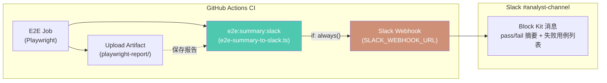
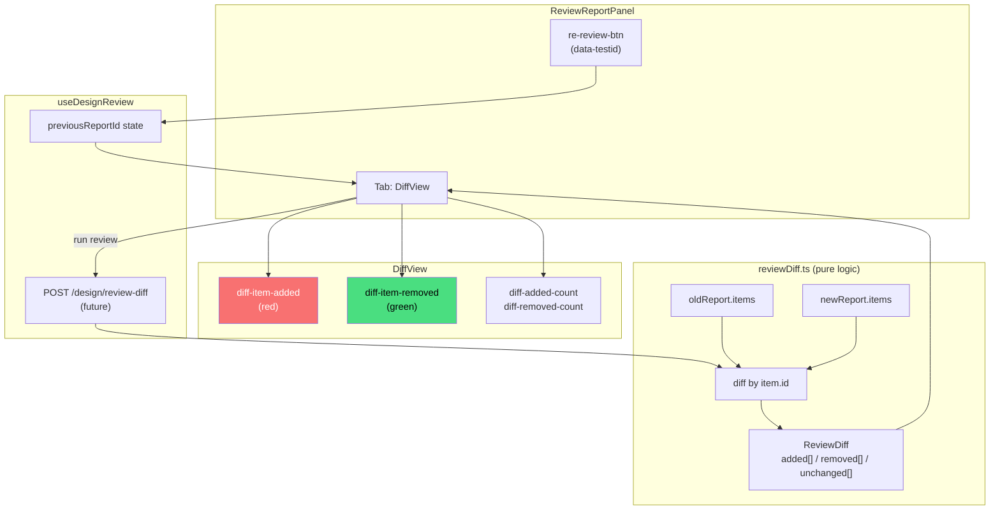
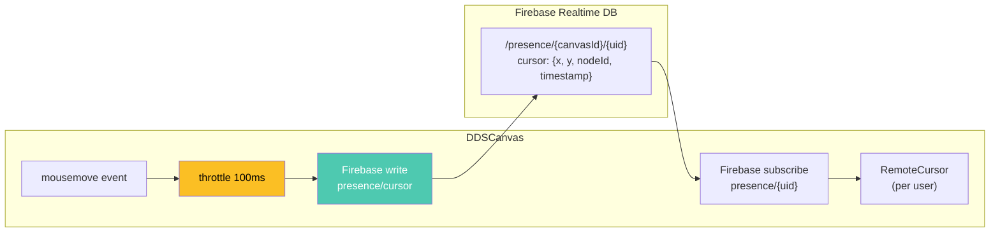
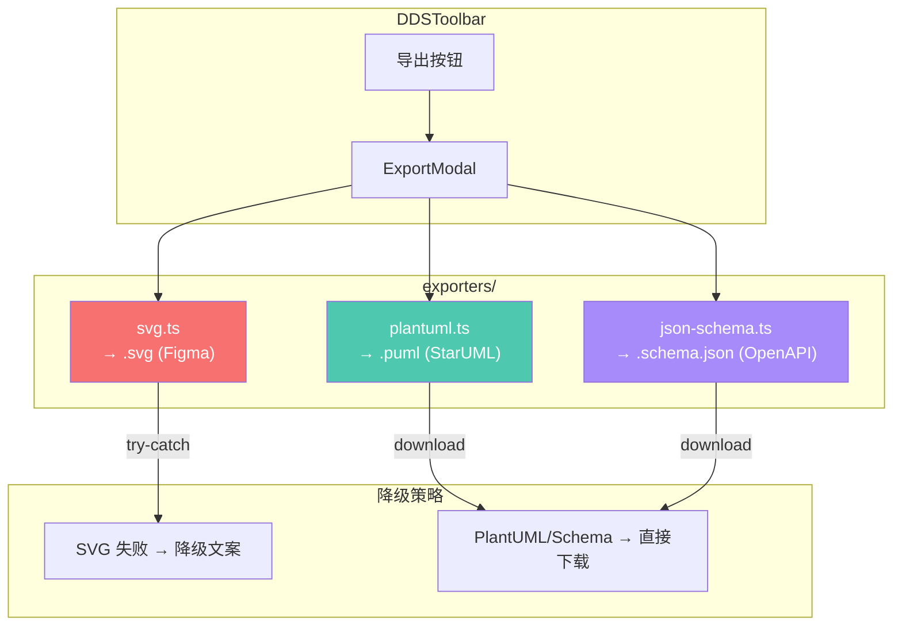
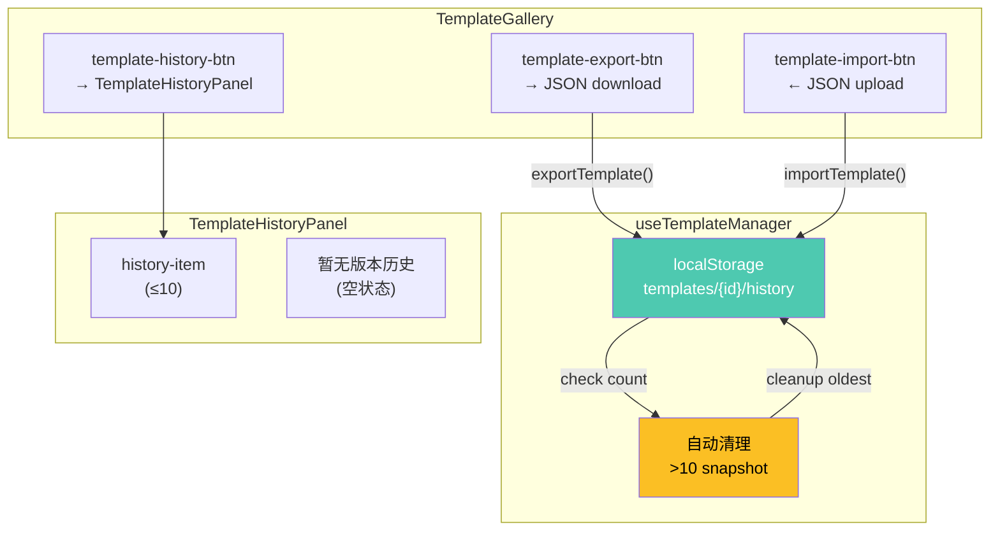

# VibeX Sprint 23 QA — Technical Architecture

**Architect**: architect 🤖
**Date**: 2026-05-03
**Project**: vibex-sprint23-qa
**Phase**: design-architecture
**Status**: Technical Design Complete

---

## 执行决策

- **决策**: 已采纳
- **执行项目**: vibex-sprint23-qa
- **执行日期**: 2026-05-03

---

## 1. 执行摘要

Sprint 23 QA 阶段验证 5 个 Epic 的实现状态。本文档记录各 Epic 的技术架构、接口定义、数据模型和测试策略。

**关键结论**：
- E2、E3、E4、E5 实现已完成，进入 QA 验证
- E1 CI 配置已完成（workflow 已有调用），需验证脚本端到端
- E2 后端 diff API（S2.4）缺失，需 Coord 确认是否 Sprint 23 完成
- E3 缺少 E2E 测试覆盖（S3.4）

---

## 2. Tech Stack

| Layer | Technology | Version | Rationale |
|-------|-----------|---------|-----------|
| Frontend Framework | Next.js 14 (App Router) | 14.x | Server Components + client islands |
| State | Zustand | latest | Lightweight store for canvas state |
| UI Testing | Vitest + RTL | 2.x | Vite-native, faster than Jest |
| E2E Testing | Playwright | 1.x | Chromium-only, CI-optimized |
| Firebase | Firebase JS SDK | 10.x | Real-time presence + cursor sync |
| PlantUML | plantuml | 1.x | Generate .puml for StarUML |
| JSON Schema | ajv | 8.x | Validate generated JSON Schema |
| TypeScript | 5.x | strict mode | No compromise |
| CI/CD | GitHub Actions | — | `.github/workflows/test.yml` |
| Slack Integration | Block Kit API | — | Incoming Webhook POST |

**版本约束**：
- Vitest 2.x（`vi.isolateModules` 已知问题，tech debt，Sprint 24 修复）
- Firebase mock mode 必须返回 `null`，不渲染任何 UI
- `pnpm run build` → 0 errors，所有 Epic 共用此 gate

---

## 3. Architecture Diagrams

### 3.1 Epic E1: E2E CI → Slack 报告链路



**关键文件**：
- CI workflow: `.github/workflows/test.yml` — e2e job 末尾步骤
- 脚本: `vibex-fronted/scripts/e2e-summary-to-slack.ts`
- 输入: `vibex-fronted/playwright-report/results.json`

**数据流**：
```
Playwright E2E run
  → playwright-report/results.json
  → e2e-summary-to-slack.ts (tsx)
  → parse stats + failed test names
  → generate Block Kit payload
  → POST https://hooks.slack.com/services/...
  → #analyst-channel 消息
```

### 3.2 Epic E2: Design Review Diff 视图



**关键文件**：
- `src/components/design-review/ReviewReportPanel.tsx` — 含 re-review-btn
- `src/components/design-review/DiffView.tsx` — added/removed 列表
- `src/lib/reviewDiff.ts` — diff 算法（纯前端，基于 item.id）
- `src/hooks/useDesignReview.ts` — 支持 previousReportId 参数

**⚠️ 已知缺口**：S2.4 后端 `POST /design/review-diff` API 尚未实现。前端 diff 算法（reviewDiff.ts）是纯前端实现，可独立工作，不依赖后端。

### 3.3 Epic E3: Firebase Cursor Sync



**关键文件**：
- `src/components/presence/RemoteCursor.tsx` — SVG cursor + username label
- `src/hooks/useCursorSync.ts` — 100ms debounce mouse sync
- `src/lib/firebase/presence.ts` — Firebase presence 含 cursor 字段

**Mock Mode 降级**：
```
isMockMode = true → RemoteCursor 返回 null（不渲染）
```

### 3.4 Epic E4: Canvas 导出格式扩展



**关键文件**：
- `src/components/dds/toolbar/DDSToolbar.tsx` — 含 plantuml-option / svg-option / schema-option
- `src/lib/exporters/plantuml.ts` — PlantUML 生成器
- `src/lib/exporters/svg.ts` — SVG 导出器（含 try-catch 降级）
- `src/lib/exporters/json-schema.ts` — JSON Schema 生成器

### 3.5 Epic E5: 模板库版本历史 + 导入导出



**关键文件**：
- `src/components/templates/TemplateGallery.tsx` — 含 export/import/history 按钮
- `src/components/templates/TemplateHistoryPanel/TemplateHistoryPanel.tsx` — 版本历史
- `src/hooks/useTemplateManager.ts` — export/import/history/prune 逻辑

**localStorage 结构**：
```
templates/{templateId}/history → Snapshot[]
Snapshot { id, createdAt, data, label }
MAX_SNAPSHOTS = 10
```

---

## 4. API Definitions

### 4.1 E1: e2e-summary-to-slack.ts (CLI Script)

**接口签名**：
```typescript
// scripts/e2e-summary-to-slack.ts
interface E2EReportPayload {
  passed: number;
  failed: number;
  skipped: number;
  duration: number;
  artifactsUrl: string;
  runUrl: string;
  timestamp: string;
  failedTests: string[];
}

// 读取 Playwright JSON 报告
async function loadTestResults(): Promise<E2EReportPayload>

// 生成 Block Kit payload
function generateSlackPayload(report: E2EReportPayload): SlackBlockKitPayload

// POST 到 Slack webhook
async function postToSlack(payload: SlackBlockKitPayload): Promise<void>
```

**环境变量**：
| 变量 | 类型 | 说明 |
|------|------|------|
| `SLACK_WEBHOOK_URL` | string | Slack incoming webhook URL |
| `CI` | string | `"true"` 在 CI 中启用 |
| `GITHUB_RUN_NUMBER` | string | CI run number（显示在消息中）|
| `GITHUB_RUN_URL` | string | CI job 链接 |

**约束**：
- 脚本不得抛异常（catch + log error）
- `if: always()` 由 CI 层保证，不在脚本内处理

### 4.2 E2: useDesignReview Hook API

**接口签名**：
```typescript
// src/hooks/useDesignReview.ts
interface DesignReviewOptions {
  canvasId: string;
  previousReportId?: string | null; // S2.2: 传入则计算 diff
}

interface UseDesignReviewResult {
  report: DesignReviewReport | null;
  diff: ReviewDiff | null;         // S2.2: previousReportId 传入时有值
  isLoading: boolean;
  error: string | null;
  reReview: (previousReportId?: string) => Promise<void>;
}

function useDesignReview(options: DesignReviewOptions): UseDesignReviewResult
```

**ReviewDiff 类型**（`src/lib/reviewDiff.ts`）：
```typescript
export interface ReviewItem {
  id: string;
  severity?: string;
  message: string;
  location?: string;
  priority?: string;
  score?: number;
}

export interface ReviewDiff {
  added: ReviewItem[];    // 新报告有，旧报告无
  removed: ReviewItem[];  // 旧报告有，新报告无
  unchanged: ReviewItem[];
}
```

### 4.3 E3: Firebase Presence Cursor Schema

**实时数据库结构**（Firebase Realtime DB）：
```json
{
  "presence": {
    "{canvasId}": {
      "{uid}": {
        "name": "Alice",
        "color": "#00ffff",
        "cursor": {
          "x": 350,
          "y": 420,
          "nodeId": "node_abc",
          "timestamp": 1746234567890
        },
        "lastSeen": 1746234567890
      }
    }
  }
}
```

**RemoteCursor 组件接口**：
```typescript
// src/components/presence/RemoteCursor.tsx
interface RemoteCursorProps {
  userId: string;
  userName: string;
  position: { x: number; y: number };
  nodeId?: string | null;
  isMockMode?: boolean;  // true → 返回 null
  color?: string;
}
```

### 4.4 E4: Exporter Interface

**统一 Exporter 接口**：
```typescript
interface ExporterResult {
  content: string;
  filename: string;
  mimeType: string;
}

interface Exporter {
  generate(canvasData: DDSCanvasData): ExporterResult;
  validate?(input: string): boolean;
}

// 三个实现
class PlantUMLExporter implements Exporter { ... }
class SVGExporter implements Exporter { ... }      // throws → 降级文案
class JSONSchemaExporter implements Exporter { ... }
```

**DDSToolbar data-testid 映射**：
| data-testid | 导出器 | 输出文件 |
|------------|--------|---------|
| `plantuml-option` | PlantUMLExporter | `vibex-canvas-<ts>.puml` |
| `svg-option` | SVGExporter | `vibex-canvas-<ts>.svg` |
| `schema-option` | JSONSchemaExporter | `vibex-canvas-<ts>.schema.json` |

### 4.5 E5: Template Manager Interface

**Hook 接口**：
```typescript
// src/hooks/useTemplateManager.ts
interface Snapshot {
  id: string;
  createdAt: number;
  data: TemplateData;
  label: string;
}

interface UseTemplateManager {
  getHistory(templateId: string): Snapshot[];
  createSnapshot(templateId: string, label?: string): Promise<void>; // 超出 10 个自动 prune
  exportTemplate(templateId: string): Promise<Blob>;    // JSON download
  importTemplate(file: File): Promise<{ success: boolean; error?: string }>;
}
```

**⚠️ 导入验证**：
- JSON 必须包含 `id` 和 `name` 字段
- 文件大小限制 5MB
- 解析失败返回 `{ success: false, error: "文件格式不正确..." }`

---

## 5. Data Models

### 5.1 Design Review Report

```typescript
interface DesignReviewReport {
  canvasId: string;
  summary: {
    compliance: 'pass' | 'warn' | 'fail';
    a11y: 'pass' | 'warn' | 'fail';
    reuse: 'pass' | 'warn' | 'fail';
    overallScore: number;
  };
  compliance: DesignReviewIssue[];
  accessibility: DesignReviewIssue[];
  reuse: DesignReviewRecommendation[];
  previousReportId?: string;  // 用于 diff 模式
  createdAt: string;
}

interface DesignReviewIssue {
  id: string;
  severity: 'critical' | 'warning' | 'info';
  category: 'compliance' | 'accessibility' | 'reuse';
  message: string;
  location?: string;
}
```

### 5.2 Template localStorage Schema

```typescript
// localStorage key: `templates/${templateId}/history`
interface TemplateHistoryStore {
  snapshots: Snapshot[];  // 最多 10 个
  currentVersion: string; // 当前版本 ID
}

interface Snapshot {
  id: string;
  createdAt: number;      // Date.now()
  data: TemplateData;     // 完整模板数据
  label: string;          // 用户自定义标签
}
```

---

## 6. Testing Strategy

### 6.1 测试框架

| 测试类型 | 框架 | 配置文件 |
|---------|------|---------|
| 单元测试 | Vitest 2.x | `vitest.config.ts` |
| 集成测试（RTL）| Vitest + @testing-library/react | `vitest.config.ts` |
| E2E 测试 | Playwright | `playwright.ci.config.ts` |

### 6.2 覆盖率要求

| Epic | 单元/集成覆盖率目标 | E2E 覆盖 |
|------|---------------------|---------|
| E1 | 80%（脚本逻辑） | CI 端到端（手动验证一次）|
| E2 | 85%（DiffView + reviewDiff）| Playwright E2E |
| E3 | 85%（RemoteCursor + useCursorSync）| **⚠️ S3.4 缺失** |
| E4 | 90%（PlantUML + SVG + Schema）| Playwright E2E |
| E5 | 90%（useTemplateManager + TemplateHistoryPanel）| Playwright E2E |

### 6.3 核心测试用例

#### E1: Slack 脚本
```typescript
// e2e-summary-slack.test.ts
it('应解析 Playwright JSON 并生成 Block Kit payload', async () => {
  const payload = generateSlackPayload(mockReport);
  expect(payload.blocks).toBeDefined();
  expect(payload.blocks.some(b => b.type === 'section')).toBe(true);
  expect(payload.text).toMatch(/✅.*\d+|❌.*\d+/);
});

it('failed > 0 时应包含失败用例列表', async () => {
  const payload = generateSlackPayload({ ...mockReport, failed: 2 });
  expect(payload.blocks.some(b =>
    b.text?.text?.includes('.spec.ts')
  )).toBe(true);
});

it('SLACK_WEBHOOK_URL 为空时应静默退出，不抛异常', () => {
  const original = process.env.SLACK_WEBHOOK_URL;
  delete process.env.SLACK_WEBHOOK_URL;
  expect(() => runE2eSummarySlack()).not.toThrow();
  process.env.SLACK_WEBHOOK_URL = original;
});
```

#### E2: DiffView
```typescript
// DiffView.test.tsx
it('added 条目应渲染为红色', () => {
  render(<DiffView diff={mockDiff} />);
  const added = screen.getAllByTestId('diff-item-added');
  expect(added[0]).toHaveClass(/text-red|background-red/);
});

it('removed 条目应渲染为绿色', () => {
  render(<DiffView diff={mockDiff} />);
  const removed = screen.getAllByTestId('diff-item-removed');
  expect(removed[0]).toHaveClass(/text-green|background-green/);
});
```

#### E3: RemoteCursor
```typescript
// RemoteCursor.test.tsx
it('isMockMode=true 时应返回 null', () => {
  const { container } = render(<RemoteCursor {...props} isMockMode={true} />);
  expect(container.firstChild).toBeNull();
});

it('useCursorSync 应 100ms throttle', () => {
  const write = vi.fn();
  const { result } = renderHook(() => useCursorSync({ onWrite: write, throttleMs: 100 }));
  for (let i = 0; i < 10; i++) result.current.moveTo({ x: i, y: i });
  expect(write.mock.calls.length).toBeLessThanOrEqual(2);
});
```

#### E4: Exporters
```typescript
// exporters.test.ts
it('PlantUMLExporter 应生成 .puml 文件', () => {
  const result = new PlantUMLExporter().generate(mockCanvas);
  expect(result.filename).toMatch(/\.puml$/);
  expect(result.content).toContain('@startuml');
});

it('SVGExporter 失败时应抛出异常（由 UI 层 catch 并显示降级文案）', () => {
  expect(() => new SVGExporter().generate(badData)).toThrow();
});
```

#### E5: Template Manager
```typescript
// useTemplateManager.test.ts
it('createSnapshot 超出 10 个时应自动清理最旧版本', async () => {
  const { result } = renderHook(() => useTemplateManager());
  await result.current.createSnapshot('tpl_1', 'snap_11');
  expect(result.current.getHistory('tpl_1').length).toBeLessThanOrEqual(10);
});

it('importTemplate 应验证 JSON 结构', async () => {
  const invalid = new File(['not json'], 'bad.json', { type: 'application/json' });
  const { success, error } = await result.current.importTemplate(invalid);
  expect(success).toBe(false);
  expect(error).toMatch(/文件格式不正确/);
});
```

### 6.4 build Gate

```bash
# 所有 Epic 必须通过
pnpm run build  # vibex-fronted
pnpm exec tsc --noEmit  # backend
```

---

## 7. 技术风险

| Epic | 风险 | 可能性 | 影响 | 缓解 |
|------|------|--------|------|------|
| E1 | Slack webhook 未配置/无效 | 中 | 中 | `if: always()` 保证 CI 不失败 |
| E2 | S2.4 后端 API Sprint 23 不做 | 中 | 低 | 前端 diff 纯前端实现，可独立工作 |
| E3 | E2E 测试未覆盖 S3.4 | 高 | 低 | 补充 Playwright E2E 用例（2-3h）|
| E4 | vitest `vi.isolateModules` 问题 | 中 | 低 | tech debt，Sprint 24 修复（`vi.mock` 替代）|
| E5 | localStorage 满时 prune 逻辑 | 低 | 中 | 已在 useTemplateManager 中实现 |
| 跨 Epic | `pnpm run build` 失败 | 低 | 高 | 所有 Epic 最后统一验证 build |

---

## 8. 已知缺口（DoD Blockers）

| ID | Epic | 缺口描述 | 影响 DoD | 修复工时 |
|----|------|---------|---------|---------|
| G1 | E1 | `SLACK_WEBHOOK_URL` secret 需在 GitHub repo secrets 中配置 | E1 DoD | 0.5h |
| G2 | E2 | S2.4 后端 `POST /design/review-diff` API 未实现 | E2 DoD（后端项）| 2h（Backend Dev）|
| G3 | E3 | S3.4 E2E 测试覆盖缺失 | E3 DoD | 2-3h |

---

*生成时间: 2026-05-03 08:10 GMT+8*
*Architect Agent | VibeX Sprint 23 QA Technical Architecture*
