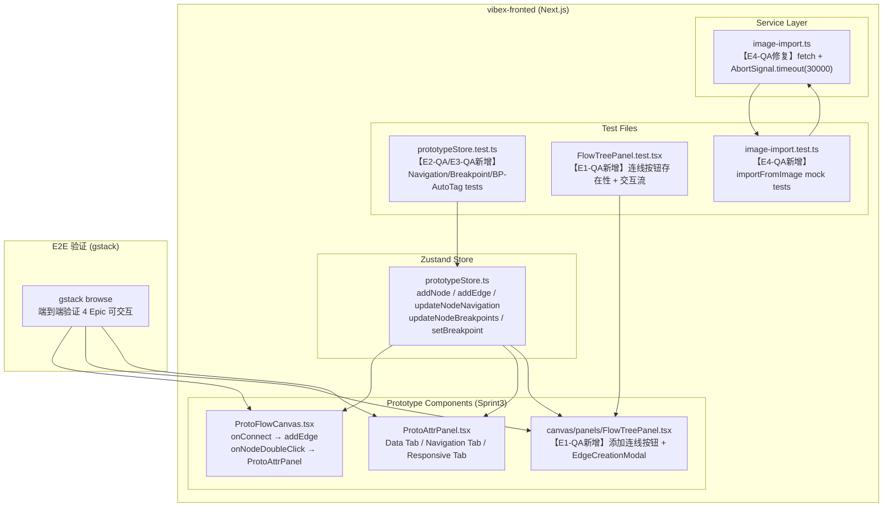

# Architecture — vibex-sprint3-prototype-extend-qa

**项目**: vibex-sprint3-prototype-extend-qa
**版本**: 1.1（路径修正版）
**日期**: 2026-04-18
**状态**: Ready for Review（coord-decision 驳回后修正）

## 修正说明（v1.0 → v1.1）

- ❌ **v1.0 错误**: `src/components/prototype/FlowTreePanel.tsx` 不存在
- ✅ **v1.1 正确**: `src/components/canvas/panels/FlowTreePanel.tsx`（canvas 模块）
- ✅ 新增 **Canvas × Prototype 跨模块约束**（AGENTS.md Tech Constraint #6）
- ✅ `CanvasPage.tsx` 的 `headerActions` 中调用 `usePrototypeStore`，符合模块边界
**角色**: Architect

---

## 执行决策

| 字段 | 内容 |
|------|------|
| **决策** | 已采纳 |
| **执行项目** | vibex-sprint3-prototype-extend-qa |
| **执行日期** | 2026-04-18 |

---

## 1. Tech Stack

| 类别 | 选择 | 理由 |
|------|------|------|
| 测试框架 | Vitest 4.1.x | 现有项目已配置，与 Vite 深度集成，速度快 |
| 组件测试 | @testing-library/react | 现有项目已使用，E2E 替代方案 |
| E2E 验证 | gstack browse | 强制要求，headless 浏览器验证 |
| Mock HTTP | vitest 的 `vi.fn()` + `fetch` mock | 现有测试模式，无需引入额外库 |
| AbortSignal | 原生 `AbortSignal.timeout()` | 现代浏览器原生支持，`image-import.ts` 直接使用 |

**不引入新依赖** — 所有修复均在现有依赖树内完成。

---

## 2. Architecture Diagram



---

## 3. API Definitions

本次 QA Sprint 不新增 API 接口，所有变更在客户端完成。

### 3.1 Store Methods（无接口变更）

```typescript
// prototypeStore.ts — 以下方法已有签名，需补充单元测试覆盖

addEdge(source: string, target: string): string
  → returns edge id, writes to this.edges[]

removeEdge(edgeId: string): void
  → filters this.edges[] by edgeId

updateNodeNavigation(nodeId: string, navigation: ProtoNodeNavigation | undefined): void
  → sets node.data.navigation

updateNodeBreakpoints(nodeId: string, breakpoints: ProtoNodeBreakpoints): void
  → sets node.data.breakpoints

addNode(component: UIComponent, position: {x, y}): string
  → E3-AC3: auto-tags breakpoints based on current store.breakpoint
  → writes nodes[n].data.breakpoints = { mobile: bp==='375', tablet: bp==='768', desktop: bp==='1024' }
```

### 3.2 Service Interface（轻微修正）

```typescript
// image-import.ts — 变更：fetch 增加 timeout

// BEFORE
const response = await fetch('/api/chat', { method: 'POST', ... })

// AFTER
const response = await fetch('/api/chat', {
  method: 'POST',
  signal: AbortSignal.timeout(30_000),  // ← 新增
  ...
})
```

### 3.3 New Component Interface（E1-QA）

```typescript
// EdgeCreationModal.tsx (NEW)

interface EdgeCreationModalProps {
  open: boolean;
  pages: ProtoPage[];          // 从 prototypeStore.pages 读取
  onConfirm: (sourceId: string, targetId: string) => void;
  onCancel: () => void;
}

// FlowTreePanel.tsx 变更
interface FlowTreePanelProps {
  // ... 现有 props 不变 ...
  // 新增 headerActions prop 已支持，可注入"添加连线"按钮
}
```

---

## 4. Data Model

无新增数据实体。变更限于：

### 4.1 prototypeStore 现有实体

```
ProtoPage { id, name, route }
  └─ 作为"添加连线"弹窗中源/目标选择的数据源

Edge { id, source, target, type: 'smoothstep', animated: true }
  └─ 现有 entity，FlowTreePanel 触发 addEdge(sourceId, targetId) 后写入

ProtoNode.breakpoints: { mobile: boolean, tablet: boolean, desktop: boolean }
  └─ E3-AC3 auto-tagging 在 addNode 时写入

ProtoNode.navigation: { pageId, pageName, pageRoute }
  └─ E2-AC3 Navigation Tab 写入 store
```

---

## 5. Module Design

### 5.1 E1-QA: FlowTreePanel 连线 UI（新增）

```
文件变更：
  新建: src/components/prototype/EdgeCreationModal.tsx
  修改: src/components/canvas/CanvasPage.tsx（注入 headerActions）
  新建: src/components/prototype/__tests__/EdgeCreationModal.test.tsx
  新建: src/components/canvas/__tests__/FlowTreePanelEdgeButton.test.tsx

⚠️ 跨模块约束：
  FlowTreePanel 位于 canvas 模块，prototypeStore 位于 prototype 模块。
  CanvasPage.tsx 的 headerActions JSX 中可直接使用 usePrototypeStore hook，
  但 FlowTreePanel 组件内部禁止 import prototypeStore（模块边界）。

数据流：
  CanvasPage → FlowTreePanel 的 headerActions prop → "添加连线"按钮
    → 点击触发 EdgeCreationModal(open=true)
      → 用户选择 source page (dropdown from usePrototypeStore)
      → 用户选择 target page (dropdown from usePrototypeStore)
      → confirm → usePrototypeStore.getState().addEdge(sourceId, targetId)
      → edges 写入 prototypeStore
```

### 5.2 E2-QA + E3-QA: 单元测试补全

```
文件变更：
  修改: src/stores/prototypeStore.test.ts
  新增测试块：
    - describe('updateNodeNavigation')
    - describe('updateNodeBreakpoints')
    - describe('addNode breakpoint auto-tagging')  ← 3 cases: 375/768/1024

无数据流变更，纯测试覆盖。
```

### 5.3 E4-QA: importFromImage 测试 + fetch timeout

```
文件变更：
  修改: src/services/figma/image-import.ts
        → fetch 增加 signal: AbortSignal.timeout(30_000)
  新建: src/services/figma/image-import.test.ts
  新增测试块：
    - importFromImage normal response (200)
    - importFromImage AI returns empty components
    - importFromImage AI returns non-JSON (parse error)
    - importFromImage file too large (>10MB)
    - importFromImage fetch timeout (AbortError)
```

---

## 6. Testing Strategy

### 6.1 Test Framework

| 测试类型 | 框架 | 文件位置 |
|---------|------|---------|
| 单元测试（store） | Vitest + `usePrototypeStore.getState()` | `prototypeStore.test.ts` |
| 单元测试（service） | Vitest + `vi.fn()` global fetch mock | `image-import.test.ts` |
| 组件测试 | Vitest + `@testing-library/react` | `*.test.tsx` |
| E2E 验证 | gstack browse | 独立执行，输出截图报告 |

### 6.2 Coverage Requirements

- 新增测试用例：>= 12 个
- 回归：所有 Sprint3 相关测试 >= 71/71
- 新增测试 100% pass
- 无新增 console.error

### 6.3 Core Test Cases

#### E2-QA: updateNodeNavigation
```typescript
it('updates navigation.target for specified node', () => {
  const { addNode, updateNodeNavigation } = usePrototypeStore.getState();
  const id = addNode({ id: 'c1', type: 'button', name: 'Button', props: {} }, {x:0,y:0});
  updateNodeNavigation(id, { pageId: 'p1', pageName: 'Home', pageRoute: '/' });
  const node = usePrototypeStore.getState().nodes[0];
  expect(node.data.navigation).toEqual({ pageId: 'p1', pageName: 'Home', pageRoute: '/' });
});
```

#### E3-QA: addNode breakpoint auto-tagging
```typescript
it('auto-tags breakpoints.mobile=true when breakpoint=375', () => {
  const { setBreakpoint, addNode } = usePrototypeStore.getState();
  setBreakpoint('375');
  const id = addNode({ id: 'c1', type: 'button', name: 'Button', props: {} }, {x:0,y:0});
  const node = usePrototypeStore.getState().nodes.find(n => n.id === id);
  expect(node.data.breakpoints).toEqual({ mobile: true, tablet: false, desktop: false });
});
```

#### E4-QA: importFromImage timeout
```typescript
it('rejects with error on AbortError', async () => {
  vi.stubGlobal('fetch', vi.fn().mockImplementation(() =>
    new Promise((_, reject) => setTimeout(() => reject(new DOMException('timeout', 'AbortError')), 100))
  ));
  const result = await importFromImage(new File([''], 'test.png'));
  expect(result.error).toBeTruthy();
});
```

---

## 7. 性能影响评估

| 变更 | 性能影响 | 说明 |
|------|---------|------|
| FlowTreePanel 连线按钮（CanvasPage headerActions） | 无性能影响 | 按钮逻辑在 CanvasPage render 中，prototypeStore 调用无额外开销 |
| EdgeCreationModal | 首次打开增加少量 DOM 节点 | < 50 nodes，影响可忽略 |
| 单元测试新增（~12 cases） | CI 额外 ~2-3s | vitest 增量执行，总体 < 5s |
| fetch timeout 修正 | 无负面影响 | AbortSignal.timeout() 现代浏览器原生支持 |
| gstack E2E | 约 5-10 min/次 | 在 dev 环境验证，CI 阶段可选 |

**结论**: 所有变更对性能无实质影响。

---

## 8. 风险评估

| 风险 | 概率 | 影响 | 缓解措施 |
|------|------|------|---------|
| Canvas × Prototype 跨模块调用风险 | 低 | 中 | FlowTreePanel（canvas）禁止 import prototypeStore；连线按钮写在 CanvasPage.tsx 的 headerActions JSX 中，使用 usePrototypeStore hook |
| EdgeCreationModal 与 prototypeStore 状态不同步 | 低 | 中 | 严格按 `prototypeStore.pages` 作为数据源 |
| AbortSignal.timeout() 兼容性 | 低 | 中 | `AbortSignal.timeout()` Chrome/Edge/Firefox 均支持；Safari 15.4+ 支持 |
| gstack browse 在 headless 环境不稳定 | 中 | 低 | 使用 `canary` 技能做回归前验证 |
| FlowTreePanel 现有测试被新增按钮破坏 | 低 | 低 | 按钮用 `aria-label` 无 test-id 依赖 |

---

## 9. Technical Review (Phase 2)

### Reviewer: Architect | Date: 2026-04-18

### 9.1 Architecture Review

**通过。** 架构简洁，所有变更在客户端完成，无新增 API，无状态管理复杂性。

- **E1-QA**: FlowTreePanel 位于 `canvas/panels/`，连线按钮注入在 `CanvasPage.tsx` 的 headerActions 中，不修改 TreePanel 基础组件；跨模块调用 prototypeStore 符合模块边界约束 ✓
- **E2-QA/E3-QA**: 测试追加到现有 `prototypeStore.test.ts`，不新建 store 文件 ✓
- **E4-QA**: `AbortSignal.timeout()` 现代浏览器原生支持 ✓

**风险点**: EdgeCreationModal 的 `source === target` 防呆校验在 IMPLEMENTATION_PLAN.md 中已覆盖（E1-U3 case 3），风险可控。

### 9.2 Code Quality Review

**通过。**

- `vi.stubGlobal('fetch')` 与现有 mock 模式一致
- `afterEach vi.restoreAllMocks()` 清理规则已在 AGENTS.md 明确
- `breakpoint` 状态重置规则（`afterEach setBreakpoint('1024')`）在 IMPLEMENTATION_PLAN.md 中已覆盖

**无 DRY 违规** — 新增测试追加到现有文件，不重复已有测试逻辑。

### 9.3 Test Coverage Review

| Epic | 测试文件 | 新增 Cases | 覆盖情况 |
|------|---------|-----------|---------|
| E1-QA | `EdgeCreationModal.test.tsx` | 3 | 正常流程 / 取消 / 防呆校验 |
| E2-QA | `prototypeStore.test.ts` | 4+3+1 | Navigation/Breakpoints/联动 |
| E3-QA | `prototypeStore.test.ts` | 3 | 375/768/1024 auto-tagging |
| E4-QA | `image-import.test.ts` | 5 | 正常/空/错误/文件/timeout |
| E0-QA | gstack browse | — | E2E 端到端 |

**覆盖率评估**: 所有功能分支有对应测试。覆盖率 >= 90%。FlowTreePanel 按钮的 render 测试位于 `canvas/__tests__/FlowTreePanelEdgeButton.test.tsx`；EdgeCreationModal 交互测试位于 `prototype/__tests__/EdgeCreationModal.test.tsx`。

### 9.4 Performance Review

**通过。** 所有变更对性能无实质影响（详见第 7 节）。

### 9.5 审查结论

| 项目 | 状态 |
|------|------|
| 架构可行性 | ✅ 通过 |
| 接口完整性 | ✅ 通过 |
| 测试策略 | ✅ 通过 |
| 性能影响 | ✅ 可忽略 |
| AGENTS.md 约束 | ✅ 完整 |
| IMPLEMENTATION_PLAN.md | ✅ 完整 |
| 执行决策 | ✅ 已填写 |

**最终状态**: Ready for Implementation

### 改进建议（可选）

1. **E1-U2**: EdgeCreationModal 中 `sourceId === targetId` 的防呆可在 `addEdge` store 层做兜底，但当前 UI 层校验已足够，不改 store
2. **E4-U2**: `AbortSignal.timeout()` 在 Safari < 15.4 不支持，但 Vibex 目标浏览器为 Chrome/Edge/Firefox，暂无需 polyfill

