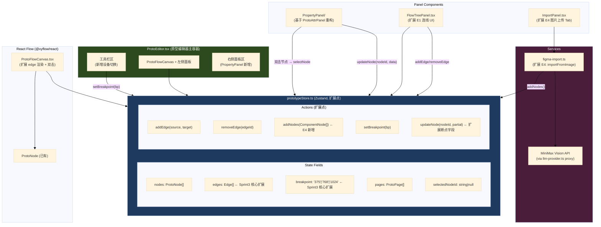
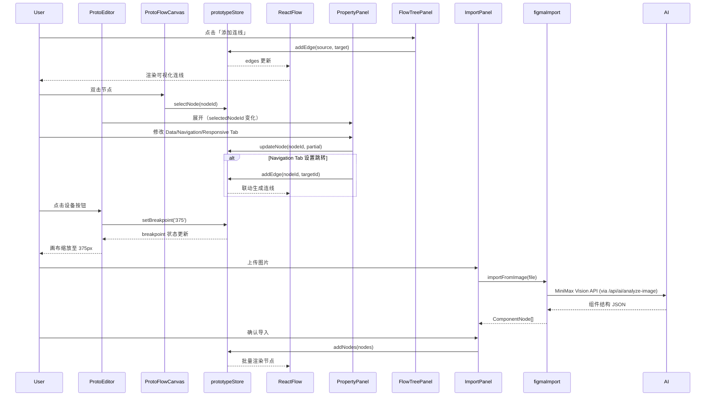

# Architecture — vibex-sprint3-prototype-extend

**项目**: vibex-sprint3-prototype-extend
**版本**: 1.0
**日期**: 2026-04-17
**角色**: Architect
**状态**: Draft → 待 /plan-eng-review 评审

---

## 执行决策

| 字段 | 内容 |
|------|------|
| **决策** | 推荐（选项 A — 最小增量扩展） |
| **执行项目** | vibex-sprint3-prototype-extend |
| **执行日期** | 待定 |
| **技术方案** | 充分利用 Sprint1 已有资产，在 prototypeStore 基础上增量开发 |

---

## 1. Tech Stack

### 现有技术栈（保持不变）

| 层级 | 技术 | 版本 | 理由 |
|------|------|------|------|
| 前端框架 | Next.js | 15 | App Router 稳定，React Flow 兼容 |
| 状态管理 | Zustand | ^5.x | prototypeStore 已用，API 简洁 |
| 画布引擎 | @xyflow/react (React Flow) | ^12.x | Sprint1 已上线，edges API 成熟 |
| 样式 | CSS Modules + CSS Variables | — | CLAUDE.md 规范要求 |
| API 层 | TanStack Query | ^5.x | API 数据缓存 |
| 外部 AI | MiniMax Vision | — | E4 图片识别，复用后端 llm-provider.ts Minimax 集成 |

### Sprint3 新增依赖

| 依赖 | 版本 | 用途 | 引入理由 |
|------|------|------|---------|
| `openai` (或 `ai` SDK) | latest | AI Vision API 调用 | E4 图片识别 |
| 无新增 UI 库 | — | 所有 UI 复用现有 design-tokens | CLAUDE.md 规范：优先使用已有组件 |

### Feature Flag 策略

- 所有 Epic 通过 `NEXT_PUBLIC_SPRINT3_ENABLED` 控制，默认 `false`
- E4 AI 导入额外通过 `NEXT_PUBLIC_AI_IMPORT_ENABLED` 控制（因依赖外部 API）
- 各 Epic 独立 feature flag：`NEXT_PUBLIC_E1_ENABLED` / `NEXT_PUBLIC_E2_ENABLED` / `NEXT_PUBLIC_E3_ENABLED`

---

## 2. 架构图



### 数据流总览



---

## 3. API Definitions

### 3.1 prototypeStore 扩展接口

#### 新增 State 字段

```typescript
// stores/prototypeStore.ts

export interface PrototypeStoreState {
  // 现有字段...
  breakpoint: '375' | '768' | '1024'; // E3 新增
  // 现有字段...
}

// 新增 Actions
interface PrototypeStoreActions {
  // E1: 连线管理
  addEdge: (source: string, target: string) => string;
  removeEdge: (edgeId: string) => void;

  // E2: 节点属性更新（扩展现有 updateNode）
  updateNodeBreakpoints: (nodeId: string, breakpoints: NodeBreakpoints) => void;

  // E3: 断点切换
  setBreakpoint: (bp: '375' | '768' | '1024') => void;

  // E4: 批量节点导入
  addNodes: (nodes: ProtoNode[]) => string[];

  // 现有...
}

// 辅助类型
export interface NodeBreakpoints {
  mobile: boolean;
  tablet: boolean;
  desktop: boolean;
}

export interface NavigationTarget {
  pageId: string;
  pageRoute: string;
}
```

#### Edge 类型

```typescript
// edges 由 React Flow @xyflow/react 提供，使用其内置 Edge 类型
// Sprint3 扩展字段通过 `data` 携带
export interface ProtoEdgeData {
  label?: string;
  animated?: boolean;
}
```

### 3.2 figma-import.ts 扩展接口（E4）

```typescript
// services/figma/image-import.ts (新建文件，扩展自 figma-import.ts)

export interface ImportedComponent {
  id: string;
  type: ComponentType;       // 来自 ui-schema.ts
  name: string;
  text?: string;
  position: { x: number; y: number };
  size?: { width: number; height: number };
  style?: Record<string, unknown>;
  breakpoints: NodeBreakpoints;
}

export interface ImageImportResult {
  success: boolean;
  components: ImportedComponent[];
  error?: string;
}

/**
 * 上传图片 → AI Vision API 解析 → 返回组件结构
 * @param file - 图片文件 (PNG/JPG/JPEG)
 * @param apiKey - AI 服务 API Key（优先从 env 读取）
 */
export async function importFromImage(
  file: File,
  apiKey?: string
): Promise<ImageImportResult>;
```

### 3.3 PropertyPanel 组件接口

```typescript
// components/canvas/panels/PropertyPanel.tsx

export interface PropertyPanelProps {
  nodeId: string | null;  // null = 关闭面板
  onClose: () => void;
}

// Tab 类型
export type PropertyTab = 'style' | 'data' | 'navigation' | 'responsive';

// 子组件结构
// PropertyPanel/StyleTab.tsx
// PropertyPanel/DataTab.tsx
// PropertyPanel/NavigationTab.tsx  → 调用 prototypeStore.addEdge
// PropertyPanel/ResponsiveTab.tsx → 调用 prototypeStore.updateNodeBreakpoints
```

### 3.4 ImportPanel 扩展接口（E4）

```typescript
// components/canvas/features/ImportPanel.tsx 扩展

export interface ImportPanelState {
  activeTab: 'json' | 'figma' | 'image';  // 'image' 新增
  imageFile: File | null;
  importStatus: 'idle' | 'uploading' | 'analyzing' | 'success' | 'error';
  recognizedComponents: ImportedComponent[];
  errorMessage?: string;
}
```

---

## 4. Data Model

### 4.1 核心实体关系

```mermaid
erDiagram
    PrototypeStore {
        ProtoNode[] nodes
        Edge[] edges
        ProtoPage[] pages
        string selectedNodeId
        string breakpoint
    }

    ProtoNode ||--o| ProtoEdge : "source → edges"
    ProtoNode ||--o| ProtoEdge : "target → edges"
    ProtoPage ||--o{ ProtoEdge : "pages → edges (via navigation)"

    ProtoNode {
        string id PK
        string type "protoNode"
        Position position
        ProtoNodeData data
    }

    ProtoNodeData {
        UIComponent component
        MockData mockData?
        NavigationTarget? navigation
        NodeBreakpoints breakpoints
    }

    ProtoEdge {
        string id PK
        string source
        string target
        string type "smoothstep"
        ProtoEdgeData data?
    }

    ProtoPage {
        string id PK
        string name
        string route
    }

    NodeBreakpoints {
        bool mobile
        bool tablet
        bool desktop
    }

    NavigationTarget {
        string pageId
        string pageRoute
    }
```

### 4.2 prototypeStore 扩展字段清单

| 字段路径 | 类型 | 所在 Epic | 说明 |
|---------|------|---------|------|
| `breakpoint` | `'375'\|'768'\|'1024'` | E3 | 当前画布断点 |
| `nodes[].data.breakpoints` | `NodeBreakpoints` | E2/E3 | 节点断点显示规则 |
| `nodes[].data.navigation` | `NavigationTarget?` | E2 | 节点跳转目标页面 |
| `edges[]` | `Edge[]` | E1 | 已有但从未填充，Sprint3 激活 |

---

## 5. Testing Strategy

### 5.1 测试框架

- **单元测试**: Vitest + React Testing Library（`vibex-fronted/src/**/*.test.tsx`，项目已配置 `vitest`）
- **集成测试**: Playwright（gstack browse 自动化验证）
- **覆盖率要求**: 核心逻辑（prototypeStore actions、figma-import 解析）覆盖率 > 80%

### 5.2 核心测试用例

#### prototypeStore 单元测试（E1/E2/E3 共享）

```typescript
// stores/__tests__/prototypeStore.test.ts

describe('prototypeStore — Sprint3 Extensions', () => {

  describe('E1: addEdge / removeEdge', () => {
    it('AC1: addEdge adds edge to store and returns id', () => {
      const id = store.getState().addEdge('page-1', 'page-2');
      expect(store.getState().edges).toHaveLength(1);
      expect(store.getState().edges[0].id).toBe(id);
    });

    it('AC1: edge has correct source/target', () => {
      store.getState().addEdge('page-A', 'page-B');
      const edge = store.getState().edges[0];
      expect(edge.source).toBe('page-A');
      expect(edge.target).toBe('page-B');
      expect(edge.type).toBe('smoothstep');
    });

    it('AC3: removeEdge removes edge from store', () => {
      const id = store.getState().addEdge('p1', 'p2');
      store.getState().removeEdge(id);
      expect(store.getState().edges).toHaveLength(0);
    });

    it('AC3: removeNode cascades to related edges', () => {
      const id = store.getState().addEdge('n1', 'n2');
      store.getState().removeNode('n1'); // 复用已有 removeNode
      expect(store.getState().edges.find(e => e.id === id)).toBeUndefined();
    });
  });

  describe('E3: setBreakpoint / updateNodeBreakpoints', () => {
    it('AC2: setBreakpoint updates breakpoint state', () => {
      store.getState().setBreakpoint('375');
      expect(store.getState().breakpoint).toBe('375');
    });

    it('AC3: addNode in breakpoint mode auto-sets breakpoints', () => {
      store.getState().setBreakpoint('375');
      store.getState().addNode(sampleComponent, { x: 0, y: 0 });
      const node = store.getState().nodes[0];
      expect(node.data.breakpoints.mobile).toBe(true);
      expect(node.data.breakpoints.tablet).toBe(false);
    });

    it('AC4: updateNodeBreakpoints updates node breakpoints', () => {
      const nodeId = store.getState().addNode(sampleComponent, { x: 0, y: 0 });
      store.getState().updateNodeBreakpoints(nodeId, { mobile: true, tablet: false, desktop: true });
      const node = store.getState().nodes.find(n => n.id === nodeId);
      expect(node?.data.breakpoints.mobile).toBe(true);
    });
  });

  describe('E4: addNodes (batch import)', () => {
    it('AC3: addNodes adds multiple nodes and returns ids', () => {
      const nodes = [node1, node2, node3];
      const ids = store.getState().addNodes(nodes);
      expect(ids).toHaveLength(3);
      expect(store.getState().nodes).toHaveLength(3);
    });

    it('addNodes with empty array returns empty', () => {
      const ids = store.getState().addNodes([]);
      expect(ids).toHaveLength(0);
    });
  });
});
```

#### PropertyPanel 集成测试（E2）

```typescript
// components/canvas/panels/__tests__/PropertyPanel.test.tsx

describe('PropertyPanel — E2 Integration', () => {
  it('E2-AC1: 双击节点，面板显示节点 ID 和类型', async () => {
    render(<PropertyPanel nodeId="NODE_001" onClose={...} />);
    expect(screen.getByText(/NODE_001/)).toBeInTheDocument();
  });

  it('E2-AC2: Data Tab 修改文字，store 节点更新', async () => {
    render(<PropertyPanel nodeId="NODE_001" onClose={...} />);
    fireEvent.change(screen.getByLabelText('文字'), { target: { value: 'new value' } });
    expect(usePrototypeStore.getState().nodes.find(n => n.id === 'NODE_001')?.data.component.label)
      .toBe('new value');
  });

  it('E2-AC3: Navigation Tab 设置跳转，自动生成 edge', async () => {
    render(<PropertyPanel nodeId="NODE_001" onClose={...} />);
    fireEvent.change(screen.getByLabelText('跳转页面'), { target: { value: 'page-2' } });
    const edges = usePrototypeStore.getState().edges;
    expect(edges.some(e => e.source === 'NODE_001' && e.target === 'page-2')).toBe(true);
  });

  it('E2-AC4: Responsive Tab 设置断点规则，节点 breakpoints 更新', async () => {
    render(<PropertyPanel nodeId="NODE_001" onClose={...} />);
    fireEvent.click(screen.getByLabelText('仅手机'));
    const node = usePrototypeStore.getState().nodes.find(n => n.id === 'NODE_001');
    expect(node?.data.breakpoints.mobile).toBe(true);
    expect(node?.data.breakpoints.tablet).toBe(false);
  });
});
```

#### ProtoEditor 断点切换测试（E3）

```typescript
// components/prototype/__tests__/ProtoEditor.test.tsx (扩展现有测试)

describe('ProtoEditor — E3 Responsive Breakpoints', () => {
  it('E3-AC1: 工具栏显示 3 个设备按钮', () => {
    render(<ProtoEditor />);
    expect(screen.getByLabelText(/手机/)).toBeInTheDocument();
    expect(screen.getByLabelText(/平板/)).toBeInTheDocument();
    expect(screen.getByLabelText(/桌面/)).toBeInTheDocument();
  });

  it('E3-AC2: 点击手机按钮，画布宽度缩放至 375px', async () => {
    render(<ProtoEditor />);
    fireEvent.click(screen.getByLabelText(/手机/));
    const canvas = screen.getByTestId('proto-canvas-container');
    expect(canvas).toHaveStyle({ width: '375px' });
    expect(usePrototypeStore.getState().breakpoint).toBe('375');
  });

  it('E3-AC2: 切换断点，store.breakpoint 同步更新', async () => {
    render(<ProtoEditor />);
    fireEvent.click(screen.getByLabelText(/平板/));
    expect(usePrototypeStore.getState().breakpoint).toBe('768');
  });
});
```

#### AI 图片导入测试（E4）

```typescript
// services/figma/__tests__/image-import.test.ts

describe('image-import — E4 AI Sketch Import', () => {
  it('E4-AC2: importFromImage 返回组件列表', async () => {
    const mockFile = new File([''], 'sketch.png', { type: 'image/png' });
    const result = await importFromImage(mockFile, 'test-api-key');
    expect(result.success).toBe(true);
    expect(Array.isArray(result.components)).toBe(true);
  });

  it('E4-AC2: 网络错误返回友好错误提示', async () => {
    server.use(
      rest.post('https://api.openai.com/*', (_req, res) => res.status(500))
    );
    const result = await importFromImage(mockFile, 'test-key');
    expect(result.success).toBe(false);
    expect(result.error).toContain('识别失败');
  });

  it('E4-AC3: addNodes 将识别结果批量导入 store', async () => {
    const mockComponents: ProtoNode[] = [
      { id: 'ai-1', type: 'protoNode', position: { x: 0, y: 0 }, data: { component: buttonComponent, breakpoints: { mobile: true, tablet: true, desktop: true } } },
      { id: 'ai-2', type: 'protoNode', position: { x: 100, y: 0 }, data: { component: inputComponent, breakpoints: { mobile: true, tablet: true, desktop: true } } },
    ];
    const ids = store.getState().addNodes(mockComponents);
    expect(ids).toHaveLength(2);
  });
});
```

### 5.3 gstack Browse 自动化测试（QA 验证）

| Epic | 验证项 | 断言 |
|------|--------|------|
| E1 | FlowTreePanel「添加连线」按钮可见 | `is visible text="添加连线"` |
| E1 | 连线创建后画布上出现 SVG 路径 | `is visible [data-testid="proto-edge-*"]` |
| E2 | 双击节点，PropertyPanel 展开 | `is visible [data-testid="property-panel"]` |
| E2 | PropertyPanel 四个 Tab 可切换 | `click @eX` 循环切换 Tab |
| E3 | 设备切换按钮存在且可点击 | `is visible [aria-label="手机"]` |
| E3 | 点击设备，画布宽度变化 | `getAttribute [data-testid="canvas-container"] "style"` 包含 `375px` |
| E4 | ImportPanel「上传图片」Tab 可见 | `is visible text="上传图片"` |
| 全局 | 无 console.error | `console` 无 error 级别日志 |

### 5.4 测试文件路径约定

```
vibex-fronted/src/
├── stores/
│   ├── __tests__/
│   │   └── prototypeStore.test.ts       # E1/E2/E3/E4 核心逻辑
│   └── prototypeStore.ts
├── components/
│   ├── canvas/
│   │   ├── __tests__/
│   │   │   └── ProtoEditor.test.tsx       # E3 集成
│   │   ├── panels/
│   │   │   ├── __tests__/
│   │   │   │   └── PropertyPanel.test.tsx  # E2
│   │   │   └── PropertyPanel/
│   │   └── features/
│   │       └── __tests__/
│   │           └── ImportPanel.test.tsx  # E4
└── services/
    └── figma/
        └── __tests__/
            └── image-import.test.ts      # E4
```

---

## 6. 文件变更清单

| 操作 | 文件路径（repo-relative） | 说明 |
|------|---------|
| 修改 | `vibex-fronted/src/stores/prototypeStore.ts` | 新增 `breakpoint`/`addEdge`/`removeEdge`/`addNodes()`/`setBreakpoint`/`updateNodeBreakpoints` |
| 新建 | `vibex-fronted/src/components/prototype/PropertyPanel/` | 属性面板（E2，基于 ProtoAttrPanel.tsx 重构，4 Tab） |
| 新建 | `vibex-fronted/src/components/prototype/PropertyPanel/DataTab.tsx` | Data Tab（E2） |
| 新建 | `vibex-fronted/src/components/prototype/PropertyPanel/StyleTab.tsx` | Style Tab（E2） |
| 新建 | `vibex-fronted/src/components/prototype/PropertyPanel/NavigationTab.tsx` | Navigation Tab（E2） |
| 新建 | `vibex-fronted/src/components/prototype/PropertyPanel/ResponsiveTab.tsx` | Responsive Tab（E2） |
| 修改 | `vibex-fronted/src/components/canvas/panels/FlowTreePanel.tsx` | 增加「添加连线」按钮（E1） |
| 修改 | `vibex-fronted/src/components/prototype/ProtoFlowCanvas.tsx` | edge 渲染 + 双击事件（E1/E2） |
| 修改 | `vibex-fronted/src/components/prototype/ProtoEditor.tsx` | 工具栏增加设备切换按钮（E3，ProtoEditor 323行） |
| 修改 | `vibex-fronted/src/components/canvas/features/ImportPanel.tsx` | 增加图片上传 Tab（E4） |
| 新建 | `vibex-fronted/src/services/figma/image-import.ts` | 新增 `importFromImage()` 方法（E4） |
| 修改 | `vibex-fronted/src/lib/prototypes/ui-schema.ts` | 新增 `NodeBreakpoints`/`NavigationTarget` 类型 |

> **⚠️ 代码库核查修正**（由 ce-plan 子任务发现）：
> - `MockDataPanel.tsx` 不存在 → 属性面板前身是 `ProtoAttrPanel.tsx`（258行，已有 props/mock Tab），PropertyPanel 基于其重构
> - `CanvasPage.tsx` 是 app 级三树并行画布页面（911行），不是原型编辑器 → E3 设备切换在 `ProtoEditor.tsx`（323行）
> - 测试框架是 **Vitest**，不是 Jest
> - `figma-import.ts` 是后端 API 代理 → E4 AI 识别需新建 `image-import.ts` 前端服务
> - `removeNode` 已有级联删除 edges 逻辑 ✓

---

## 7. 技术风险与缓解

| 风险 | 可能性 | 影响 | 缓解方案 |
|------|--------|------|---------|
| ProtoEditor.tsx 工具栏扩展破坏现有布局 | 中 | 高 | 用 `// === E3: DeviceSwitcher ===` 分区隔离，每次修改后 Vitest 验证 |
| AI 图像识别质量不可控 | 高 | 中 | 设计为「辅助建议」模式，用户可编辑后再导入；E4 设为 P2 |
| React Flow edges 与节点拖拽事件冲突 | 低 | 中 | edges 在 FlowTreePanel 管理，与 ProtoFlowCanvas 节点拖拽分离 |
| AI 服务 API 成本/延迟 | 高 | 低 | 异步导入，UI 显示 loading，支持取消 |
| prototypeStore 持久化数据迁移 | 低 | 高 | 新增字段设默认值，不破坏现有 localStorage 数据 |

---

## 8. Open Questions (TBD)

| 项 | 状态 | 负责人 |
|----|------|-------|
| AI 服务提供商 | **确认使用 MiniMax**（后端 llm-provider.ts 已集成） | Architect |
| AI API Key 来源与配额 | TBD | DevOps |
| PropertyPanel Tab 切换动画规范 | TBD | Design |
| E4 AI 识别准确率 SLO | TBD | Product |
| ProtoEditor 工具栏设备按钮具体插入位置 | TBD | Architect（待设计评审） |

---

## 执行决策

| 字段 | 内容 |
|------|------|
| **决策** | 推荐（选项 A — 最小增量扩展） |
| **执行项目** | vibex-sprint3-prototype-extend |
| **执行日期** | 待定 |
| **技术方案** | 充分利用 Sprint1 已有资产，在 prototypeStore 基础上增量开发 |
