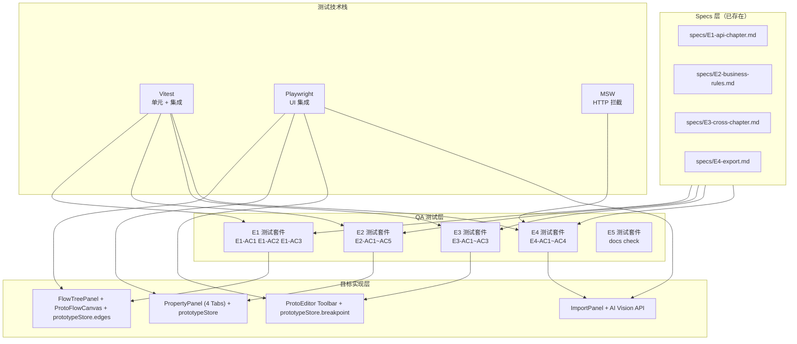

# Architecture — vibex-sprint3-qa / design-architecture

**项目**: vibex-sprint3-qa
**角色**: Architect（系统架构设计）
**日期**: 2026-04-25
**上游**: analysis.md（Analyst 有条件通过）+ prd.md（PM）+ specs/E1-E5
**状态**: ✅ 设计完成

---

## 1. 执行摘要

### 背景

vibex-sprint3-qa 是对 Sprint3 Prototype Extend（页面跳转连线 / 组件属性面板 / 响应式断点预览 / AI 草图导入）四个 Epic 产出物的系统化 QA 验证。

Analyst 报告结论：**有条件通过**。Specs 文件已由 PM 补充完整（E1-E5 共 712 行），含四态定义 + expect() 断言；Architecture 设计需补充测试架构。

### 目标

对 Sprint3 全部产出物进行系统化 QA 验证，确保：
1. E1-E4 的 Specs 与实现一一对应，四态定义完整
2. prototypeStore.edges CRUD + prototypeStore.breakpoint 状态行为可验证
3. PropertyPanel 四 Tab 配置变更与 store 实时同步
4. AI 图片导入流程（loading → success/error）完整
5. DoD 逐条可核查

### 关键风险

| 风险 | 影响 | 优先级 |
|------|------|--------|
| prototypeStore.edges 从未激活 | E1 连线功能无实现基础 | P0 |
| PropertyPanel 四 Tab 数据同步未验证 | E2 配置变更不生效 | P1 |
| AI Vision API 识别率不稳定 | E4 导入质量不可控 | P2 |

---

## 2. Tech Stack

### 2.1 测试框架

| 工具 | 版本 | 用途 |
|------|------|------|
| Vitest | ^4.1.2 | 单元/集成测试运行器（Jest 兼容） |
| @testing-library/react | ^16.3.2 | React 组件测试（query-first） |
| @testing-library/user-event | ^14.5.2 | 用户交互模拟（比 fireEvent 更真实） |
| @testing-library/jest-dom | ^6.9.1 | DOM 断言增强 |
| msw | ^2.12.10 | HTTP 拦截（Mock Service Worker） |
| jsdom | ^29.0.1 | DOM 模拟环境 |
| Playwright | ^1.59.0 | E2E/UI 集成测试 |
| @vitest/coverage-v8 | ^4.1.2 | 覆盖率报告 |

### 2.2 技术决策

**Vitest 而非 Jest**：VibeX 已迁移到 Vitest，HMR 速度快，内置 coverage-v8 报告。

**user-event 替代 fireEvent**：更真实模拟用户交互（blur/hover/composition 事件），specs 中 E1-AC2 的 Delete 键模拟必须用 `userEvent.keyboard`。

**MSW v2 拦截 HTTP**：统一拦截所有外部 API（Figma API、AI Vision API），确保测试不依赖真实网络。

**Playwright 用于 UI 集成验证**：PropertyPanel drawer 展开/收起、拖拽上传、SVG 连线渲染需要真实 DOM。

---

## 3. Architecture Diagram



### 数据流说明

```
PRD + Specs
    ↓
QA 验证计划（E1-AC1~E5）
    ↓
┌─────────────────────────────────────┐
│  Vitest（单元 + 集成）               │
│  覆盖：E1-AC1~AC3（store.edges）     │
│  覆盖：E2-AC1~AC5（4 Tab 同步）      │
│  覆盖：E3-AC1~AC3（breakpoint）      │
│  覆盖：E4（mock AI Vision）          │
└─────────────────────────────────────┘
    ↓
┌─────────────────────────────────────┐
│  Playwright（UI 集成）               │
│  覆盖：FlowTreePanel 连线 UI         │
│  覆盖：PropertyPanel 四 Tab         │
│  覆盖：ProtoEditor 工具栏设备切换    │
│  覆盖：ImportPanel 拖拽上传          │
└─────────────────────────────────────┘
    ↓
覆盖率报告（≥80%）
```

---

## 4. 模块划分

### 4.1 测试文件结构

```
tests/
├── unit/
│   ├── setup.ts                      # 全局环境设置
│   ├── stores/
│   │   ├── prototypeStore.test.ts    # E1-AC1~AC3 edges CRUD
│   │   │                               # E3-AC1~AC3 breakpoint 状态
│   │   │                               # E2-AC3~AC5 Navigation/Responsive Tab
│   │   └── PropertyPanel.test.tsx    # E2-AC1~AC2 组件渲染
│   ├── services/
│   │   └── imageRecognition.test.ts  # E4-AC1~AC4 AI 识别 mock
│   └── docs/
│       ├── coverage-map.test.ts       # E5-AC1 Specs 覆盖率
│       ├── dod-checklist.test.ts      # E5-AC2 DoD 逐条核查
│       └── prd-format.test.ts         # E5-AC3 PRD 格式自检
└── e2e/
    └── sprint3-qa/
        ├── E1-flow-panel.spec.ts       # E1-AC1~AC3 UI 四态
        ├── E2-property-panel.spec.ts  # E2-AC1~AC5 四 Tab
        ├── E3-breakpoint-toolbar.spec.ts # E3-AC1~AC3 设备切换
        └── E4-import-panel.spec.ts     # E4-AC1~AC4 图片导入
```

**设计决策**：按 Epic 分类测试文件，便于按验收标准追踪每个 Epic 的测试覆盖。Unit 测试验证 store 行为，E2E 测试验证 UI 交互。

### 4.2 核心模块

| 模块 | 职责 | 技术边界 |
|------|------|---------|
| `prototypeStore.test.ts` | 验证 `prototypeStore.edges` 增删改 + `prototypeStore.breakpoint` 状态切换 | 只测 Zustand store |
| `PropertyPanel.test.tsx` | 验证四 Tab 配置变更后 store 节点实时同步 | 组件级集成测试 |
| `imageRecognition.test.ts` | 验证 AI Vision API mock 响应（loading/success/error） | 服务层 mock |
| `E1-flow-panel.spec.ts` | FlowTreePanel + ProtoFlowCanvas UI 四态 Playwright 验证 | UI 集成测试 |
| `E2-property-panel.spec.ts` | PropertyPanel 四 Tab 切换 + 配置变更 Playwright 验证 | UI 集成测试 |

### 4.3 MSW Mock 层

```typescript
// tests/unit/mocks/handlers.ts
// E4: AI Vision API Mock
export const visionApiHandlers = [
  http.post('/api/vision/recognize', async ({ request }) => {
    // Loading: 不返回，模拟异步
    // Success: 返回识别结果
    // Error: 返回 500
  }),
];
```

---

## 5. Data Model

### 5.1 核心类型

```typescript
// Edge（E1 核心类型）
interface Edge {
  id: string;
  source: string;  // 源页面/节点 ID
  target: string;  // 目标页面/节点 ID
  type: 'smoothstep' | 'straight' | 'step';
  label?: string;
}

// BreakpointState（E3 核心类型）
type Breakpoint = '375' | '768' | '1024';
interface BreakpointState {
  current: Breakpoint;
  nodeOverrides: Record<string, Partial<BreakpointVisibility>>;
}
interface BreakpointVisibility {
  mobile: boolean;
  tablet: boolean;
  desktop: boolean;
}

// ComponentNode（E2 核心类型）
interface ComponentNode {
  id: string;
  type: string;
  data: {
    component: {
      label: string;
      styles: Record<string, unknown>;
      props: Record<string, unknown>;
    };
    breakpoints: BreakpointVisibility;
    navigation?: {
      targetPage: string;
      transition: string;
    };
  };
}

// RecognizedComponent（E4 核心类型）
interface RecognizedComponent {
  id: string;
  type: string;
  label: string;
  bounds: { x: number; y: number; width: number; height: number };
  confidence: number;
}
```

### 5.2 Store 状态模型

```typescript
// prototypeStore（E1/E2/E3 验证对象）
interface PrototypeStore {
  // E1: Edges
  edges: Edge[];
  selectedEdgeId: string | null;
  addEdge(source: string, target: string): void;
  removeEdge(id: string): void;
  selectEdge(id: string | null): void;

  // E2: Nodes
  nodes: ComponentNode[];
  selectedNodeId: string | null;
  updateNode(id: string, updates: Partial<ComponentNode>): void;

  // E3: Breakpoint
  breakpoint: Breakpoint;
  setBreakpoint(bp: Breakpoint): void;
  updateNodeBreakpointVisibility(id: string, vis: Partial<BreakpointVisibility>): void;

  // E4: Import
  importComponents(components: RecognizedComponent[]): void;
}
```

---

## 6. API Definitions

### 6.1 内部 Store 接口

```typescript
// E1: prototypeStore.edges
store.addEdge(source: string, target: string): string; // 返回新 edge id
store.removeEdge(id: string): void;
store.selectEdge(id: string | null): void;

// E2: prototypeStore.nodes
store.updateNode(id: string, updates: Partial<ComponentNode>): void;

// E3: prototypeStore.breakpoint
store.setBreakpoint(bp: Breakpoint): void;
store.updateNodeBreakpointVisibility(id: string, vis: Partial<BreakpointVisibility>): void;

// E4: prototypeStore.import
store.importComponents(components: RecognizedComponent[]): void;
```

### 6.2 外部 API Mock 映射

| API | 用途 | Mock 策略 |
|-----|------|----------|
| `POST /api/vision/recognize` | AI 识别图片组件 | MSW REST handler：success/error/timeout 三场景 |

---

## 7. Testing Strategy

### 7.1 测试框架选择

**Vitest**（单元 + 集成测试）：
- 原生 Vite，HMR 速度快
- 适合 store 行为测试（Zustand）+ 组件测试（@testing-library/react）
- 内置 coverage-v8 报告

**Playwright**（UI 集成测试）：
- 真实浏览器渲染
- SVG 连线渲染验证（Vitest jsdom 无法完全模拟 SVG 交互）
- 拖拽上传（DataTransfer API）
- PropertyPanel drawer 动画展开/收起

### 7.2 覆盖率要求

| Epic | 目标覆盖率 |
|------|----------|
| E1 页面跳转连线 | ≥ 80% |
| E2 组件属性面板 | ≥ 85% |
| E3 响应式断点预览 | ≥ 80% |
| E4 AI 草图导入 | ≥ 80% |
| 全局 | ≥ 80% |

### 7.3 核心测试用例

#### E1-AC1: prototypeStore.edges CRUD

```typescript
// tests/unit/stores/prototypeStore.test.ts
describe('E1: prototypeStore.edges', () => {
  it('E1-AC1: addEdge 增加 edges 数量，返回非空 id', () => {
    const id = usePrototypeStore.getState().addEdge('page-1', 'page-2');
    expect(typeof id).toBe('string');
    expect(id.length).toBeGreaterThan(0);
    expect(usePrototypeStore.getState().edges).toHaveLength(1);
  });

  it('E1-AC1: addEdge 后 edges 包含 source/target/type', () => {
    usePrototypeStore.getState().addEdge('n1', 'n2');
    const edge = usePrototypeStore.getState().edges[0];
    expect(edge.source).toBe('n1');
    expect(edge.target).toBe('n2');
    expect(edge.type).toMatch(/smoothstep|straight|step/);
  });

  it('E1-AC2: removeEdge 清除指定 edge', () => {
    const { addEdge, removeEdge } = usePrototypeStore.getState();
    const id = addEdge('n1', 'n2');
    removeEdge(id);
    expect(usePrototypeStore.getState().edges).toHaveLength(0);
  });

  it('E1-AC3: removeNode 时级联清除关联 edges', () => {
    const store = usePrototypeStore.getState();
    const edgeId = store.addEdge('n1', 'n2');
    store.removeNode('n1');
    const related = store.edges.filter(e => e.source === 'n1' || e.target === 'n1');
    expect(related).toHaveLength(0);
  });
});
```

#### E3-AC1~AC3: prototypeStore.breakpoint

```typescript
describe('E3: prototypeStore.breakpoint', () => {
  it('E3-AC1: setBreakpoint 更新状态', () => {
    usePrototypeStore.getState().setBreakpoint('375');
    expect(usePrototypeStore.getState().breakpoint).toBe('375');
  });

  it('E3-AC2: setBreakpoint 切换后，新节点自动标记断点可见性', () => {
    const store = usePrototypeStore.getState();
    store.setBreakpoint('375');
    const newNodeId = store.addNode({ type: 'Button', props: {} });
    const node = store.nodes.find(n => n.id === newNodeId);
    expect(node.data.breakpoints.mobile).toBe(true);
    expect(node.data.breakpoints.tablet).toBe(false);
  });

  it('E3-AC3: updateNodeBreakpointVisibility 部分更新', () => {
    const store = usePrototypeStore.getState();
    const nodeId = store.nodes[0].id;
    store.updateNodeBreakpointVisibility(nodeId, { mobile: false });
    const node = store.nodes.find(n => n.id === nodeId);
    expect(node.data.breakpoints.mobile).toBe(false);
    expect(node.data.breakpoints.tablet).toBe(true); // 原有值保留
  });
});
```

#### E2-AC2: PropertyPanel 四 Tab 数据同步

```typescript
// tests/unit/stores/PropertyPanel.test.tsx
describe('E2: PropertyPanel 四 Tab 数据同步', () => {
  it('E2-AC2 Data Tab: 修改文字，store 节点实时更新', async () => {
    const nodeId = usePrototypeStore.getState().nodes[0].id;
    usePrototypeStore.getState().selectNode(nodeId);

    render(<PropertyPanel />);
    const textInput = screen.getByLabelText('文字');
    fireEvent.change(textInput, { target: { value: '提交' } });
    fireEvent.blur(textInput);

    const node = usePrototypeStore.getState().nodes.find(n => n.id === nodeId);
    expect(node.data.component.label).toBe('提交');
  });

  it('E2-AC3 Navigation Tab: 设置跳转页面，自动生成 edge', async () => {
    const nodeId = usePrototypeStore.getState().nodes[0].id;
    usePrototypeStore.getState().selectNode(nodeId);

    render(<PropertyPanel />);
    const navTab = screen.getByRole('tab', { name: /Navigation/i });
    fireEvent.click(navTab);

    const pageSelect = screen.getByLabelText('跳转页面');
    fireEvent.change(pageSelect, { target: { value: 'page-2' } });

    const edges = usePrototypeStore.getState().edges;
    expect(edges.some(e => e.source === nodeId && e.target === 'page-2')).toBe(true);
  });
});
```

### 7.4 测试执行命令

```bash
# 单元测试（Vitest）
pnpm test:unit

# 带覆盖率
pnpm test:unit:coverage

# UI 集成测试（Playwright）
pnpm test:e2e

# QA 专用完整测试
pnpm test:e2e:qa

# 类型检查
pnpm exec tsc --noEmit
```

---

## 8. 关键设计决策

### D1: E1 edges 测试用 Store Unit Test 而非组件测试

| 选择 | 说明 |
|------|------|
| Store Unit Test | ✅ 验证 edges CRUD 逻辑（add/remove/select/cascade），隔离 UI |
| 组件 E2E Test | ✅ 验证 SVG 连线渲染 + UI 四态 |

**决策**：edges 逻辑用 Vitest store 测试（快速、精确），SVG 渲染用 Playwright（真实浏览器）。

### D2: E4 AI 识别用 MSW Mock 而非真实 API

| 选择 | 说明 |
|------|------|
| MSW Mock | ✅ 测试速度最快，覆盖 success/error/timeout 三场景 |
| 真实 API | ❌ 识别率不稳定，网络延迟不可控 |

**决策**：E4 测试使用 MSW mock `POST /api/vision/recognize`，确保测试可重复。

### D3: E2 PropertyPanel 测试策略

| 选择 | 说明 |
|------|------|
| Vitest + RTL | ✅ 适合四 Tab 切换 + 数据同步验证 |
| Playwright | ✅ 适合 drawer 动画 + 真实交互验证 |

**决策**：Vitest 覆盖核心数据同步逻辑（E2-AC2~AC5），Playwright 覆盖 UI 渲染（E2-AC1 + drawer 动画）。

---

## 9. 风险矩阵

| 风险 | 影响 | 可能性 | 优先级 | 缓解措施 |
|------|------|--------|--------|----------|
| prototypeStore.edges 未实现 | E1 测试全部失败 | 高 | P0 | 前置检查 store.edges 是否为数组 |
| PropertyPanel 四 Tab 切换丢失数据 | E2 配置不同步 | 中 | P1 | E2-AC2~AC5 store 同步验证 |
| AI Vision API 识别失败率高 | E4 功能不可用 | 高 | P2 | MSW mock + 重试按钮验证 |
| SVG 连线渲染与 Vitest jsdom 不兼容 | E1 组件测试受限 | 中 | P3 | Playwright E2E 覆盖 SVG 渲染 |

---

## 10. 实施计划概要

详见 `IMPLEMENTATION_PLAN.md`。

**总工时: 10.5h**

| Epic | 优先级 | 工时 |
|------|--------|------|
| E1 页面跳转连线 | P0 | 2.5h |
| E2 组件属性面板 | P0 | 3.0h |
| E3 响应式断点预览 | P1 | 2.0h |
| E4 AI 草图导入 | P2 | 2.0h |
| E5 质量保障 | P2 | 1.0h |

---

## 执行决策

- **决策**: 已采纳
- **执行项目**: vibex-sprint3-qa
- **执行日期**: 2026-04-25
- **备注**: 基于 Analyst analysis.md 有条件通过报告。Specs 文件已完整（E1-E5 共 712 行），测试策略采用 Vitest + Playwright 双层验证。覆盖目标 ≥ 80%。

---

*设计时间: 2026-04-25 11:56 GMT+8*
