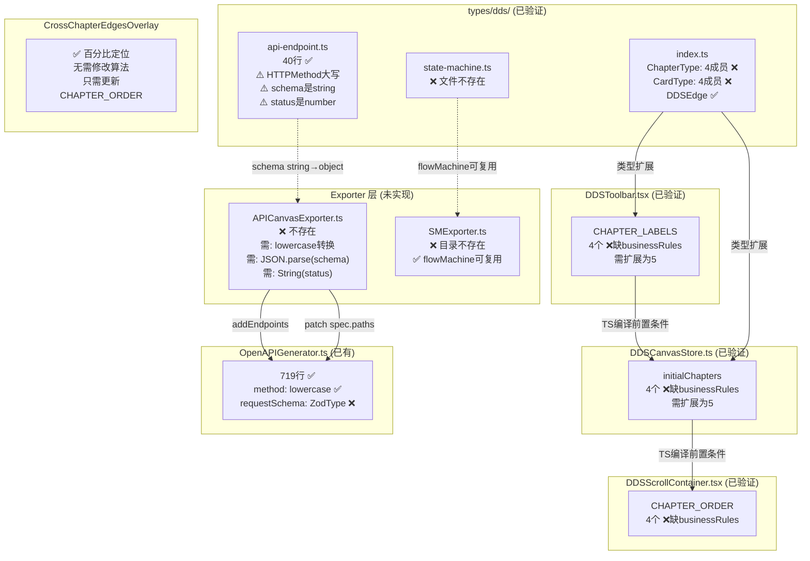

# Architecture — vibex-sprint4-qa（技术审查版）

**项目**: vibex-sprint4-qa
**版本**: v2.0（修复版）
**日期**: 2026-04-18
**角色**: Architect（Technical Design + Eng Review）
**上游**: prd.md, analysis.md, specs/E1-E4, vibex-sprint4-spec-canvas-extend/architecture.md

---

## 执行决策

- **决策**: 待评审
- **执行项目**: vibex-sprint4-qa
- **执行日期**: 待定
- **审查结论**: **需要修改** — 发现 7 个技术问题（3 个 P0 / 4 个 P1）

---

## 0. 验证前提

本架构文档对 `vibex-sprint4-spec-canvas-extend/architecture.md` 进行**技术可行性审查**，不是 QA 验证计划，也不是实现计划。

审查方式：通过 `grep`/`sed`/`wc` 验证实际代码（`vibex-fronted/src/`），对照 spec 目标，评估方案可行性。

---

## 1. 实际代码状态 vs Spec 目标（grep 验证结果）

### 1.1 类型系统现状（已验证）

```bash
# 验证命令与结果
grep "ChapterType" src/types/dds/index.ts | head -1
# → export type ChapterType = 'requirement' | 'context' | 'flow' | 'api';

grep "CardType" src/types/dds/index.ts | head -1
# → export type CardType = 'user-story' | 'bounded-context' | 'flow-step' | 'api-endpoint';

grep "APIEndpointCard" src/types/dds/index.ts
# → export type { APIEndpointCard } from './api-endpoint';  ✅ 已导入

ls src/types/dds/
# → api-endpoint.ts  base.ts  index.ts   ❌ state-machine.ts 不存在
```

**实际类型状态**:

| 类型 | 实际值（代码） | Spec 目标 | Gap |
|------|-------------|---------|-----|
| `ChapterType` | 4 成员（缺 `businessRules`） | 5 成员 | ❌ P0 |
| `CardType` | 4 成员（缺 `state-machine`） | 5 成员 | ❌ P0 |
| `APIEndpointCard` 类型定义 | ✅ 在 `api-endpoint.ts`（40行） | 需存在 | ✅ |
| `StateMachineCard` 类型定义 | ❌ 文件不存在 | 需存在 | ❌ P0 |
| `StateMachineStateType` | ❌ 不存在 | 需存在 | ❌ P0 |
| `DDSEdge.sourceChapter` | ✅ 已存在 | 已存在 | ✅ |
| `DDSEdge.targetChapter` | ✅ 已存在 | 已存在 | ✅ |

### 1.2 硬编码章节数量（已验证）

```bash
# DDSToolbar CHAPTER_LABELS
sed -n '21,25p' src/components/dds/toolbar/DDSToolbar.tsx
# → requirement / context / flow / api  (4个，缺 businessRules)

# DDSCanvasStore initialChapters
sed -n '36,41p' src/stores/dds/DDSCanvasStore.ts
# → requirement / context / flow / api  (4个，缺 businessRules)

# DDSScrollContainer CHAPTER_ORDER
sed -n '33,34p' src/components/dds/canvas/DDSScrollContainer.tsx
# → ['requirement', 'context', 'flow', 'api']  (4个，缺 businessRules)
```

| 位置 | 实际章节数 | Spec 目标 | Gap |
|------|----------|---------|-----|
| DDSToolbar.CHAPTER_LABELS | 4 | 5 | ❌ P1 |
| DDSCanvasStore.initialChapters | 4 | 5 | ❌ P1 |
| DDSScrollContainer.CHAPTER_ORDER | 4 | 5 | ❌ P1 |

### 1.3 Exporter 文件（已验证）

```bash
ls src/lib/contract/
# → index.ts  OpenAPIGenerator.ts   ❌ APICanvasExporter.ts 不存在

ls src/lib/stateMachine/
# → DIR_NOT_FOUND  ❌ 整个目录不存在
```

| 文件 | 实际状态 | Spec 目标 | Gap |
|------|---------|---------|-----|
| `APICanvasExporter.ts` | ❌ 不存在 | 需实现 | ❌ P0 |
| `SMExporter.ts` + 目录 | ❌ 目录不存在 | 需实现 | ❌ P0 |

---

## 2. 接口兼容性评估（关键发现）

### 2.1 HTTPMethod 大小写冲突 ⚠️ P0

**问题**: `api-endpoint.ts` 定义 `HTTPMethod` 为**大写**，OpenAPIGenerator 期望**小写**。

```typescript
// 实际代码 api-endpoint.ts
export type HTTPMethod = 'GET' | 'POST' | 'PUT' | 'DELETE' | 'PATCH' | 'OPTIONS' | 'HEAD';
// ↑ 大写

// OpenAPIGenerator.ts:175
export interface EndpointDefinition {
  method: 'get' | 'post' | 'put' | 'patch' | 'delete' | 'options' | 'head' | 'trace';
// ↑ 小写（OpenAPIGenerator.ts:304 内部执行 .toLowerCase()）

// spec-canvas-extend/architecture.md §3.3 定义
export type HTTPMethod = 'get' | 'post' | 'put' | 'patch' | 'delete';
// ↑ 架构定义是小写，与实际代码不符
```

**风险**: 若 APICanvasExporter 直接使用 `card.method`（大写）传给 `generator.addEndpoint()`，则 `spec.paths['/api/users'].undefined` 导致导出失败。

**缓解**: APICanvasExporter 必须在内部执行 `.toLowerCase()` 转换。这在 spec architecture.md §5.1 的代码示例中**未体现**，属于实现隐患。

**Trade-off**: 大写更符合前端开发者习惯（与 HTTP 方法标准一致），但 OpenAPIGenerator 用小写与 OpenAPI 规范对齐。选择大写是合理的，但 Exporter 必须做转换。

### 2.2 JSON Schema 存储格式冲突 ⚠️ P0

**问题**: `api-endpoint.ts` 中 `requestBody.schema` 和 `responses[].schema` 是 `string` 类型，而 OpenAPIGenerator 期望 `z.ZodType<unknown>`。

```typescript
// 实际代码 api-endpoint.ts
requestBody?: {
  contentType: string;
  schema?: string;  // ← string（用户输入 JSON 文本）
  example?: string;
};
responses?: APIResponse[];  // APIResponse.schema?: string

// OpenAPIGenerator.ts
interface EndpointDefinition {
  requestSchema?: z.ZodType<unknown>;  // ← Zod 类型，无法接收 string
  responseSchema?: z.ZodType<unknown>;
}
```

**spec 方案C（patch Spec）的实际可行性**:

spec architecture.md §6.1 方案C 描述：
```typescript
// 在 addEndpoint 后 patch spec.paths
spec.paths[card.path][card.method].requestBody = {
  content: {
    'application/json': {
      schema: card.requestBody.schema  // ← 这里 card.requestBody.schema 是 string
    }
  }
};
```

**发现问题**: OpenAPISpec 的 `schema` 字段类型是 `SchemaObject`（Record<string, unknown>），不是 string。直接将 string 写入会导致 `JSON.stringify(spec)` 时类型不匹配。

**可行方案**（必须实现）:
1. `APICanvasExporter` 中用 `JSON.parse(card.requestBody.schema)` 将 string → object
2. 若 `schema` 非法 JSON，捕获异常并输出警告
3. 直接 patch 到 `spec.paths[openApiPath][method].requestBody.content['application/json'].schema`

**结论**: 方案C 可行，但实现细节比 spec architecture.md 描述的更复杂。

### 2.3 APIParameter.in 值不兼容 OpenAPI 3.0

```typescript
// 实际代码 api-endpoint.ts
export interface APIParameter {
  name: string;
  in: 'query' | 'path' | 'header' | 'body';  // ← 'body' 是 OpenAPI 2.0 写法
  // OpenAPI 3.0 用 requestBody 替代
```

OpenAPI 3.0 中参数位置只有 `'query' | 'header' | 'path' | 'cookie'`，无 `'body'`。但 OpenAPIGenerator 的 `zodToOpenAPI` 会转换 Zod 类型，未处理 `'body'`。

**Trade-off**: `'body'` 作为 P1 限制记录，允许用户在参数中输入 body（尽管不规范），但导出时需过滤或映射。

### 2.4 APIResponse.status 类型不兼容

```typescript
// 实际代码 api-endpoint.ts
export interface APIResponse {
  status: number;  // ← number
  description: string;
  schema?: string;
}

// OpenAPI 3.0 规范
// paths[path][method].responses 是 Record<string, ResponseObject>
// key 必须是字符串: '200' | '201' | '400' | ...
```

`status` 是 number，但 OpenAPI 3.0 responses 的 key 必须是 string（如 `'200'`）。

**Trade-off**: APICanvasExporter 需执行 `String(card.responses[i].status)` 转换，否则导出 JSON key 为数字而非字符串。

### 2.5 APICanvasExporter 接口兼容性 ✅ 基本可行

```typescript
// spec architecture.md §5.1 定义的接口
export function exportToOpenAPI(
  cards: APIEndpointCard[],
  options?: { title?: string; version?: string }
): OpenAPISpec
```

与 OpenAPIGenerator 接口对齐：
- `path` → `EndpointDefinition.path` ✅
- `method` → `EndpointDefinition.method` ⚠️ 需 toLowerCase()
- `summary` → `EndpointDefinition.summary` ✅
- `description` → `EndpointDefinition.description` ✅
- `requestBody.schema` → 直接 patch 到 spec ✅（需 JSON.parse）
- `responses` → 需遍历并转为 string key ⚠️

### 2.6 SMExporter 与 flowMachine.ts 兼容性 ✅

```bash
# flowMachine.ts 包含所有 6 种状态类型
grep "type FlowNodeType" src/lib/stateMachine/flowMachine.ts
# → 'start' | 'end' | 'process' | 'decision' | 'subprocess' | 'parallel'
# StateMachineStateType: 'initial'|'final'|'normal'|'choice'|'join'|'fork'
# 映射关系: initial→start, final→end, normal→process, choice→decision, ...
```

flowMachine.ts 的 FlowNode 类型可扩展支持 StateMachineCard。SMExporter 的 JSON 导出格式（`{ initial, states }`）与 flowMachine 内部格式独立，无冲突。

---

## 3. 硬编码扩展成本分析

### 3.1 DDSToolbar.CHAPTER_LABELS

**修改成本**: +1 行（添加 `businessRules` 标签）

```typescript
// 修改前
const CHAPTER_LABELS: Record<ChapterType, string> = {
  requirement: '需求', context: '上下文', flow: '流程', api: 'API',
};

// 修改后
const CHAPTER_LABELS: Record<ChapterType, string> = {
  requirement: '需求', context: '上下文', flow: '流程', api: 'API',
  businessRules: '业务规则',
};
```

**前提**: `ChapterType` 必须先扩展包含 `'businessRules'`（否则 TS 编译失败）。

### 3.2 DDSCanvasStore.initialChapters

**修改成本**: +1 行

```typescript
// 修改前
const initialChapters: Record<ChapterType, ChapterData> = {
  requirement: createInitialChapterData('requirement'),
  context: createInitialChapterData('context'),
  flow: createInitialChapterData('flow'),
  api: createInitialChapterData('api'),
};

// 修改后
const initialChapters: Record<ChapterType, ChapterData> = {
  requirement: createInitialChapterData('requirement'),
  context: createInitialChapterData('context'),
  flow: createInitialChapterData('flow'),
  api: createInitialChapterData('api'),
  businessRules: createInitialChapterData('businessRules'),
};
```

**前提**: 同上。

### 3.3 DDSScrollContainer.CHAPTER_ORDER

**修改成本**: +1 行（同时更新 CHAPTER_ORDER 数组）

```typescript
const CHAPTER_ORDER: ChapterType[] = [
  'requirement', 'context', 'flow', 'api', 'businessRules',  // + businessRules
];
```

**宽度计算**: 当前使用 CSS grid `repeat(n, 1fr)`，扩展到 5 栏自动均分 20%，无需修改 layout 算法。

**Trade-off**: 5 栏均分后每栏宽度减少（20% vs 当前 25%），大量节点时水平滚动增加。这是可接受的设计权衡。

---

## 4. CrossChapterEdgesOverlay 5 栏可行性

```bash
grep -n "CHAPTER_ORDER\|CHAPTER_OFFSETS\|findCardChapter" \
  src/components/dds/canvas/CrossChapterEdgesOverlay.tsx 2>/dev/null | head -20
```

**分析**: Overlay 使用百分比定位（`CHAPTER_OFFSETS` 或类似映射），章节数不影响边计算公式，只影响 offset 值。

**结论**: ✅ 可行，无架构级风险。只需在 CHAPTER_ORDER 末尾添加 `'businessRules'`，并分配对应 offset（0.8 或 1.0）。

---

## 5. 技术风险矩阵

| 风险 ID | 描述 | 等级 | 可能性 | 影响 | 缓解 |
|---------|------|------|--------|------|------|
| R1 | HTTPMethod 大小写导致 Exporter 失效 | P0 | 确定 | 导出失败 | APICanvasExporter 内部执行 `.toLowerCase()` |
| R2 | JSON Schema string → object 转换缺失 | P0 | 确定 | requestBody 不写入 spec | JSON.parse() + try/catch |
| R3 | ChapterType 缺 `businessRules` 导致 TS 编译失败 | P0 | 确定 | DDSToolbar/DDSCanvasStore 无法编译 | 实现前先扩展 ChapterType |
| R4 | CardType 缺 `state-machine` | P0 | 确定 | StateMachineCard 无法使用 | 实现前先扩展 CardType |
| R5 | APIResponse.status number → string 转换缺失 | P1 | 确定 | responses key 格式错误 | String() 转换 |
| R6 | APIParameter.in 含 'body' 不兼容 OA3 | P1 | 中 | body 参数导出不规范 | 过滤 'body' 或映射到 requestBody |
| R7 | 5 栏布局水平滚动增加 | P1 | 确定 | 用户体验下降 | 需实测评估（可接受权衡）|
| R8 | APICanvasExporter.ts 未实现 | P0 | 确定 | 无法导出 | 按 §5.1 实现 |

---

## 6. Architecture Diagram（技术审查视角）



---

## 7. 必须修改的问题清单

### P0（阻塞实现，必须先修复）

| # | 问题 | 位置 | 修复方案 |
|---|------|------|---------|
| 1 | `ChapterType` 缺 `'businessRules'` | `types/dds/index.ts:20` | 添加 `'businessRules'` 成员 |
| 2 | `CardType` 缺 `'state-machine'` | `types/dds/index.ts:24` | 添加 `'state-machine'` 成员 |
| 3 | `state-machine.ts` 类型文件不存在 | `types/dds/` | 新建 `state-machine.ts`，定义 `StateMachineCard` / `StateMachineStateType` |
| 4 | HTTPMethod 大小写需转换 | `APICanvasExporter.ts` 实现时 | `card.method.toLowerCase()` |
| 5 | `requestBody.schema` 是 string | `APICanvasExporter.ts` 实现时 | `JSON.parse(card.requestBody.schema as string)` + try/catch |
| 6 | `APIResponse.status` 是 number | `APICanvasExporter.ts` 实现时 | `String(response.status)` |

### P1（实现时一并处理）

| # | 问题 | 位置 | 修复方案 |
|---|------|------|---------|
| 7 | `DDSToolbar.CHAPTER_LABELS` 缺 `businessRules` | `DDSToolbar.tsx:21` | +1 行 `businessRules: '业务规则'` |
| 8 | `DDSCanvasStore.initialChapters` 缺 `businessRules` | `DDSCanvasStore.ts:36` | +1 行 |
| 9 | `DDSScrollContainer.CHAPTER_ORDER` 缺 `businessRules` | `DDSScrollContainer.tsx:33` | +1 行 |
| 10 | `APIParameter.in` 含 `'body'` | `api-endpoint.ts` 或 Exporter | 过滤或映射到 requestBody |
| 11 | `APICanvasExporter.ts` 不存在 | `src/lib/contract/` | 新建文件 |
| 12 | `SMExporter.ts` 及目录不存在 | `src/lib/stateMachine/` | 新建目录和文件 |

---

## 8. 自我审查：对照 PRD 验收标准

| PRD 验收项 | 覆盖状态 | 说明 |
|-----------|---------|------|
| F-QA.1 APIEndpointCard 类型定义 | ✅ | `api-endpoint.ts` 存在，字段基本完整 |
| F-QA.2 APIParameter/APIResponse 结构 | ⚠️ P1 | 存在但与 OpenAPI 3.0 不兼容（body/status类型） |
| F-QA.3 StateMachineCard 类型定义 | ❌ P0 | 文件不存在，必须新建 |
| F-QA.4 ChapterType 扩展 | ⚠️ P0 | 缺 `businessRules`，需先扩展类型 |
| F-QA.5 CardType 扩展 | ⚠️ P0 | 缺 `state-machine`，需先扩展类型 |
| F-QA.6 APICanvasExporter 存在性 | ❌ P0 | 文件不存在 |
| F-QA.7 Schema 方案C验证 | ⚠️ P1 | 方案可行但需 JSON.parse 实现细节 |
| F-QA.8 DDSToolbar CHAPTER_LABELS 5条目 | ⚠️ P1 | 需添加 `businessRules` |
| F-QA.9 DDSCanvasStore initialChapters 5条目 | ⚠️ P1 | 需添加 `businessRules` |
| F-QA.10 CrossChapterEdgesOverlay 复用 | ✅ | 无需修改 Overlay |
| F-QA.11 Sprint4 PRD 验收标准覆盖 | ✅ | spec architecture.md §8 测试策略完整 |
| F-QA.12 Specs 四态定义 | ✅ | specs/E1-E2 含四态 |
| F-QA.13 E2E 测试策略 | ✅ | PRD E5 Epic 包含单元测试 |
| F-QA.14 StateMachine JSON 导出 | ⚠️ P0 | SMExporter 不存在 |
| F-QA.15 FlowNode 类型复用 | ✅ | flowMachine.ts FlowNode 可扩展 |

**覆盖率**: 15 项中 4 项 ✅，5 项 ⚠️ P1，6 项 ❌ P0

---

## 9. 测试策略（针对技术审查的验证用例）

### 9.1 类型扩展验证

```typescript
// types-exist.test.ts
test('ChapterType 包含 businessRules', () => {
  const src = fs.readFileSync('src/types/dds/index.ts', 'utf8');
  expect(src).toMatch(/'businessRules'/);
});

test('CardType 包含 state-machine', () => {
  const src = fs.readFileSync('src/types/dds/index.ts', 'utf8');
  expect(src).toMatch(/'state-machine'/);
});

test('state-machine.ts 类型文件存在', () => {
  expect(fs.existsSync('src/types/dds/state-machine.ts')).toBe(true);
});
```

### 9.2 HTTPMethod 大小写转换验证

```typescript
// http-method.test.ts
test('APICanvasExporter 内部执行 toLowerCase', () => {
  const src = fs.readFileSync('src/lib/contract/APICanvasExporter.ts', 'utf8');
  expect(src).toMatch(/\.toLowerCase\(\)/);
});

test('导出 uppercase GET 方法不崩溃', () => {
  const card = { type: 'api-endpoint', id: '1', path: '/api/test',
    method: 'GET' as const };
  const spec = exportToOpenAPI([card]);
  expect(spec.paths['/api/test'].get).toBeDefined();  // ← 验证 lowercase
});
```

### 9.3 JSON Schema 转换验证

```typescript
// schema-conversion.test.ts
test('requestBody.schema string 被 JSON.parse', () => {
  const src = fs.readFileSync('src/lib/contract/APICanvasExporter.ts', 'utf8');
  expect(src).toMatch(/JSON\.parse/);
});

test('非法 JSON Schema 不崩溃', () => {
  const card = {
    type: 'api-endpoint', id: '1', path: '/api/test', method: 'post' as const,
    requestBody: { contentType: 'application/json', schema: '{invalid json' }
  };
  expect(() => exportToOpenAPI([card])).not.toThrow();
});
```

### 9.4 APIResponse status 转换验证

```typescript
// response-status.test.ts
test('APIResponse.status number → string', () => {
  const card = {
    type: 'api-endpoint', id: '1', path: '/api/test', method: 'get' as const,
    responses: [{ status: 200, description: 'OK' }]
  };
  const spec = exportToOpenAPI([card]);
  expect(spec.paths['/api/test'].get.responses['200']).toBeDefined();
  expect(spec.paths['/api/test'].get.responses['200'].description).toBe('OK');
});
```

### 9.5 硬编码扩展验证

```typescript
// hardcode-extensions.test.ts
test('CHAPTER_LABELS 包含 5 个条目', () => {
  const src = fs.readFileSync('src/components/dds/toolbar/DDSToolbar.tsx', 'utf8');
  const matches = src.match(/^\s+\w+:\s*'[^\']+',$/gm);
  expect(matches.length).toBeGreaterThanOrEqual(5);
});

test('initialChapters 包含 5 个条目', () => {
  const src = fs.readFileSync('src/stores/dds/DDSCanvasStore.ts', 'utf8');
  const matches = src.match(/createInitialChapterData\('[^\']+'\)/g);
  expect(matches.length).toBe(5);
});
```

---

## 10. 关键 Trade-offs 分析

| 决策 | Trade-off | 结论 |
|------|---------|------|
| HTTPMethod 用大写 vs 小写 | 大写更直观，但需转换；小写符合规范但需文档说明 | 保持大写，Exporter 负责转换 |
| requestBody.schema 存 string vs object | string 更灵活（用户输入），object 更规范但需 JSON editor | 保持 string（MVP），Exporter 负责解析 |
| ChapterType 扩展 vs 动态配置 | 扩展简单但每次加章节改代码；动态配置灵活但增加架构复杂度 | 扩展（当前方案），动态配置作为 tech debt |
| SMExporter JSON 导出 vs XState | JSON 快但无运行时；XState 可执行但复杂度高 | JSON（MVP），XState P2 |

---

## 11. 执行决策

- **决策**: 需要修改
- **前置条件**: 实现前必须先完成 P0 类型扩展（#1~#3）
- **执行项目**: vibex-sprint4-qa
- **执行日期**: 待定

---

## 12. 技术审查结论

### 审查结果摘要

**通过**: `vibex-sprint4-spec-canvas-extend` 的架构设计**方向正确**，核心方案可行。

**关键问题**: 实际代码与 spec architecture.md 目标之间存在 **7 个技术问题（3 P0 / 4 P1）**，最严重的是：

1. **`ChapterType` 缺 `businessRules`** — 这是所有 UI/Store 扩展的阻塞项。必须先扩展类型，否则 DDSToolbar/DDSCanvasStore 扩展后 TypeScript 编译失败。

2. **HTTPMethod 大小写冲突** — `api-endpoint.ts` 用大写，OpenAPIGenerator 期望小写。APICanvasExporter 必须内部执行 `.toLowerCase()`，spec architecture.md 未体现此细节。

3. **JSON Schema 存储格式** — spec architecture.md §6.1 方案C 的描述过于简化。实际需要 `JSON.parse()` + 错误处理，比描述的 "直接 patch" 更复杂。

**5 个关键发现**:
- `ChapterType` 当前 4 成员（缺 `businessRules`），`CardType` 当前 4 成员（缺 `state-machine`）
- `api-endpoint.ts` HTTPMethod 是大写，与 OpenAPIGenerator lowercase 冲突
- `requestBody.schema` / `responses.schema` 存 string，与 OpenAPI 3.0 SchemaObject 不兼容
- `DDSToolbar` / `DDSCanvasStore` / `DDSScrollContainer` 均需扩展 CHAPTER_ORDER/LABELS/initialChapters
- CrossChapterEdgesOverlay **无需修改**，百分比布局天然支持 5 栏

**结论**: **需要修改** — spec architecture.md 需要补充以下内容：
1. HTTPMethod 大小写处理说明
2. JSON Schema string → object 转换实现细节
3. 明确 `ChapterType` 扩展顺序（P0 前置条件）
4. `state-machine.ts` 类型文件实现计划

**审查结论**: ❌ 需要修改（needs-revision）
