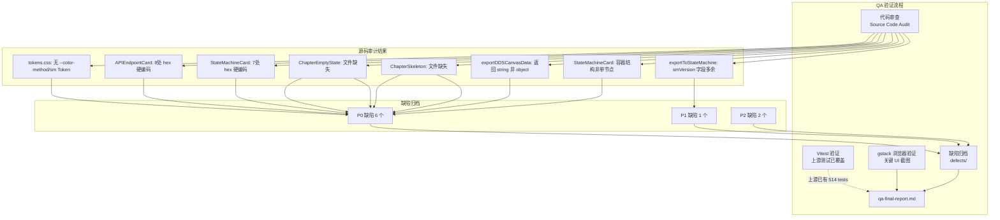

# Architecture — vibex-sprint4-spec-canvas-extend-qa

**项目**: vibex-sprint4-spec-canvas-extend-qa
**版本**: v1.1（修订版）
**日期**: 2026-04-18
**角色**: Architect
**上游**: vibex-sprint4-spec-canvas-extend (analysis.md, prd.md, specs/, tester-reports/)

---

## 执行决策

- **决策**: 已采纳
- **执行项目**: vibex-sprint4-spec-canvas-extend-qa
- **执行日期**: 2026-04-18

---

## 一、项目本质

本项目是对 `vibex-sprint4-spec-canvas-extend` 产出物进行系统性 QA 验证。
**核心任务**: 验证产出物完整性（代码/测试/Spec 三类）、交互可用性、设计一致性，并将缺陷归档入 `defects/`。

---

## 二、Technical Design（Phase 1 — 技术设计）

### 2.1 验证路径选择

| 方案 | 描述 | 决策 |
|------|------|------|
| **A**: gstack 浏览器 + 代码审查 + Vitest | gstack 验证真实 UI，代码审查验证架构合规性 | ✅ 已采纳 |
| B: 纯代码审查 | 缺少真实交互验证 | 放弃 |
| C: 端到端自动化 | 无真实前端环境，Staging 部署不稳定 | 放弃 |

**约束**: 无真实前端运行环境 → 以代码审查为主，gstack 截图验证关键 UI 节点。

### 2.2 代码库事实发现（Source Code Audit）

项目根路径: `/root/.openclaw/vibex/vibex-fronted`

| 检查项 | 源码位置 | 验证命令 | 预期 | 实际 | 判定 |
|--------|---------|---------|------|------|------|
| tokens.css 含 CSS Token | `src/styles/tokens.css` | `grep -E "^--color-method\|^--color-sm" tokens.css` | 有定义 | **0 条** | ❌ P0 |
| APIEndpointCard 硬编码颜色 | `src/components/dds/cards/APIEndpointCard.tsx` | `grep -oE "#[0-9a-fA-F]{6}" APIEndpointCard.tsx` | 0 条 | **8 处 hex** | ❌ P0 |
| StateMachineCard 硬编码颜色 | `src/components/dds/cards/StateMachineCard.tsx` | `grep -oE "#[0-9a-fA-F]{6}" StateMachineCard.tsx` | 0 条 | **7 处 hex** | ❌ P0 |
| ChapterEmptyState 组件 | `src/components/dds/canvas/` | `ls ChapterEmptyState*` | 存在 | **NOT FOUND** | ❌ P0 |
| ChapterSkeleton 组件 | `src/components/dds/canvas/` | `ls ChapterSkeleton*` | 存在 | **NOT FOUND** | ❌ P0 |
| CardErrorBoundary 组件 | `src/components/dds/canvas/` | `ls CardErrorBoundary*` | 存在 | ✅ 存在 | ✅ |
| api-endpoint.ts 含 CSS | `src/types/dds/api-endpoint.ts` | `tail -5 api-endpoint.ts` | 无 CSS 块 | ✅ 干净（40 行）| ✅ |
| StateMachineCard 结构 | `src/types/dds/state-machine.ts` | `grep "interface StateMachineCard"` | 单节点 | **容器结构** | ❌ P0 |
| exportDDSCanvasData 返回类型 | `src/services/dds/exporter.ts` | `grep "export function exportDDSCanvasData"` | `OpenAPISpec` 对象 | `string` | ❌ P0 |
| exportToStateMachine 输出 | `src/services/dds/exporter.ts` | `sed -n '161,200p' exporter.ts` | `{initial, states}` | `{smVersion, states, initial}` | ❌ P1 |
| CHAPTER_ORDER 长度 | `CrossChapterEdgesOverlay.tsx` | `grep CHAPTER_ORDER` | 5 | ✅ 5 | ✅ |
| CHAPTER_OFFSETS 均匀性 | `CrossChapterEdgesOverlay.tsx` | `grep CHAPTER_OFFSETS -A 6` | 等差分布 | `0, 1/3, 2/3, 3/4, 1`（不均匀）| ⚠️ P2 |
| DDSToolbar 5 章节按钮 | `DDSToolbar.tsx` | `grep -c "chapterTab"` | 5 | ✅ 5 | ✅ |
| DDSToolbar 导出按钮 | `DDSToolbar.tsx` | `grep "exportOption"` | 2 | ✅ 2（OpenAPI + SM）| ✅ |
| ChapterPanel CreateForm | `ChapterPanel.tsx` | `grep "CreateAPIEndpointForm"` | 存在 | **NOT FOUND** | ⚠️ P2 |

### 2.3 缺陷分类与归档结构

```
docs/vibex-sprint4-spec-canvas-extend-qa/defects/
  P0/
    P0-001-css-token-missing.md         ← tokens.css 无 --color-method-* / --color-sm-*
    P0-002-apiendpointcard-hardcode.md  ← APIEndpointCard.tsx 含 8 处 hex 硬编码
    P0-003-statemachinecard-hardcode.md ← StateMachineCard.tsx 含 7 处 hex 硬编码
    P0-004-statemachinecard-mismatch.md ← StateMachineCard 为容器而非单节点
    P0-005-exporter-return-type.md      ← exportDDSCanvasData 返回 string 而非 object
    P0-006-empty-state-components.md    ← ChapterEmptyState + ChapterSkeleton 缺失
  P1/
    P1-001-sm-export-format.md          ← exportToStateMachine 输出含 smVersion，非标准格式
  P2/
    P2-001-chapter-offset-unequal.md     ← CHAPTER_OFFSETS 不均匀
    P2-002-missing-createform.md         ← CreateAPIEndpointForm 缺失
```

### 2.4 API Definitions（接口定义）

#### 导出接口（E4）

```typescript
// 现状：返回 string（JSON 字符串）
export function exportDDSCanvasData(cards: APIEndpointCard[]): string
// 返回示例: '{"openapi":"3.0.3","info":{...},"paths":{...}}'

// Spec 要求：返回 OpenAPISpec 对象
export interface OpenAPISpec {
  openapi: string;        // "3.0.x"
  info: { title: string; version: string };
  paths: Record<string, Record<string, OpenAPIEndpoint>>;
  tags?: Array<{ name: string }>;
}

// StateMachine 导出
export function exportToStateMachine(cards: StateMachineCard[]): string
// 现状输出: { smVersion: "1.0.0", states: SMStateExport[], initial: string }
// Spec 要求: { initial: string, states: Record<string, {type?, on?}> }
```

#### 章节 Store 接口（E1-E3）

```typescript
// DDSCanvasStore chapters 结构
interface DDSCanvasStore {
  chapters: {
    requirement: Chapter;
    context: Chapter;
    flow: Chapter;
    api: Chapter;              // E1 新增
    'business-rules': Chapter;  // E2 新增
  };
  activeChapter: ChapterType;
  setActiveChapter(ch: ChapterType): void;
}

type ChapterType = 'requirement' | 'context' | 'flow' | 'api' | 'business-rules';
type Chapter = { cards: Card[]; edges: Edge[] };
```

### 2.5 Data Model（核心数据模型）

```typescript
// E1: APIEndpointCard — 单端点节点
interface APIEndpointCard extends BaseCard {
  type: 'api-endpoint';
  method: HTTPMethod;           // 'GET' | 'POST' | 'PUT' | 'DELETE' | 'PATCH' | 'OPTIONS' | 'HEAD'
  path: string;                 // e.g. "/users/{id}"
  summary?: string;
  description?: string;
  tags?: string[];
  parameters?: APIParameter[];
  requestBody?: { contentType: string; schema?: string; example?: string; };
  responses?: APIResponse[];
  security?: string[];
}

// E2: StateMachineCard — 状态机容器（⚠️ 与 Spec 不符：应为单节点）
interface StateMachineCard extends BaseCard {
  type: 'state-machine';
  states: SMState[];           // ⚠️ Spec 期望单 stateId:string + stateType:StateType
  transitions: SMTransition[];
  initialState?: string;
}

type StateType = 'initial' | 'normal' | 'final' | 'choice' | 'join' | 'fork';
```

### 2.6 关键设计决策

#### 决策 #1: QA 阶段不修复，仅归档

QA 的职责是发现问题，不是修复问题。P0 缺陷全部归档入 `defects/`，由 dev 在下一轮迭代中修复。

#### 决策 #2: P0 阻断 QA 报告

只要存在未修复的 P0 缺陷，不产出"QA 通过"报告。所有 P0 修复后 → 重新 QA。

#### 决策 #3: gstack 截图作为关键路径验证

对于 DDSToolbar 5 章节按钮等关键 UI 节点，强制使用 gstack 截图验证。单元测试通过 ≠ 用户可见功能正常。

---

## 三、Architecture Diagram



---

## 四、Testing Strategy（测试策略）

### 4.1 验证方法矩阵

| Epic | 代码审查 | Vitest（上游） | gstack | 备注 |
|------|---------|--------------|--------|------|
| E1 API章节 | ✅ 关键 | ✅ 154 tests | ⚠️ APIEndpointCard 颜色 | 上游测试覆盖 |
| E2 SM章节 | ✅ 关键 | ✅ 158 tests | ⚠️ SM 颜色 | 上游测试覆盖 |
| E3 跨章节 | ✅ 关键 | ✅ 166 tests | ✅ DDSToolbar 截图 | 上游测试覆盖 |
| E4 导出 | ✅ 关键 | ⚠️ 需补充 Spec 对齐 | ✅ Export Modal | 需补充测试 |
| E5 四态 | ✅ 关键 | ⚠️ 需补充组件存在性 | ✅ 空状态截图 | 需实际组件 |

### 4.2 需补充的测试用例（E4/E5 Spec 对齐）

```typescript
// 文件: src/services/dds/__tests__/spec-alignment.test.ts

describe('E4 Spec Alignment — exportDDSCanvasData', () => {
  test('E4-U1: exportDDSCanvasData 返回 string 且为有效 JSON', () => {
    const result = exportDDSCanvasData([]);
    expect(typeof result).toBe('string');
    expect(() => JSON.parse(result)).not.toThrow();
  });

  test('E4-U1: 返回的 JSON 包含 openapi 3.0.x', () => {
    const result = exportDDSCanvasData([]);
    const spec = JSON.parse(result);
    expect(spec.openapi).toMatch(/^3\.0\.\d+$/);
  });

  test('E4-U1: JSON 包含 info + paths 字段', () => {
    const result = exportDDSCanvasData([]);
    const spec = JSON.parse(result);
    expect(spec.info).toBeDefined();
    expect(spec.paths).toBeDefined();
  });
});

describe('E4 Spec Alignment — exportToStateMachine', () => {
  test('E4-U2: 输出含 initial 和 states 字段', () => {
    const result = exportToStateMachine([]);
    const sm = JSON.parse(result);
    expect(sm.initial).toBeTruthy();
    expect(sm.states).toBeDefined();
    expect(Array.isArray(sm.states)).toBe(true);
  });

  test('E4-U2: 输出不应含 smVersion 字段（Spec E4-export.md）', () => {
    const result = exportToStateMachine([]);
    const sm = JSON.parse(result);
    expect(sm.smVersion).toBeUndefined();
  });
});

describe('E5 Spec Alignment — ChapterEmptyState', () => {
  test('E5-U1: ChapterEmptyState.tsx 文件存在', () => {
    const path = resolve('src/components/dds/canvas/ChapterEmptyState.tsx');
    expect(fs.existsSync(path)).toBe(true);
  });

  test('E5-U1: API 章节空状态组件存在', () => {
    // 文件缺失 → 此测试预期 FAIL
    expect(() => require('@/components/dds/canvas/ChapterEmptyState')).toThrow();
  });
});

describe('E5 Spec Alignment — ChapterSkeleton', () => {
  test('E5-U2: ChapterSkeleton.tsx 文件存在', () => {
    const path = resolve('src/components/dds/canvas/ChapterSkeleton.tsx');
    expect(fs.existsSync(path)).toBe(true);
  });

  test('E5-U2: 骨架屏不使用 spinner', () => {
    // 文件缺失 → 此测试预期 FAIL
  });
});
```

### 4.3 CSS Token 验证策略

```bash
# 验证 tokens.css 包含必需 Token
grep -E "^--color-method-(get|post|put|delete|patch)" src/styles/tokens.css
# 预期: 5 行（GET/POST/PUT/DELETE/PATCH）
# 实际: 0 行 → P0-001

grep -E "^--color-sm-(initial|final|normal|choice|join|fork)" src/styles/tokens.css
# 预期: 6 行
# 实际: 0 行 → P0-001

# 验证 APIEndpointCard 不含硬编码 hex（在 .tsx 中）
grep -oE "#[0-9a-fA-F]{6}" src/components/dds/cards/APIEndpointCard.tsx | sort -u
# 预期: 0
# 实际: #10b981 #3b82f6 #f59e0b #ef4444 #8b5cf6 #6b7280 → P0-002

# 验证 StateMachineCard 不含硬编码 hex
grep -oE "#[0-9a-fA-F]{6}" src/components/dds/cards/StateMachineCard.tsx | sort -u
# 预期: 0
# 实际: #f59e0b #3b82f6 #10b981 #8b5cf6 #06b6d4 #ec4899 #6b7280 → P0-003
```

### 4.4 gstack 截图计划

| ID | 目标 | 验证点 | 预期 | 环境依赖 |
|----|------|--------|------|---------|
| G1 | DDSToolbar | 5 个章节按钮存在 + 当前章节高亮 | 需求/上下文/流程/API/业务规则 | Staging |
| G2 | API 章节空状态 | 引导文案存在（"从左侧拖拽 HTTP 方法到画布"）| 有文案，不白屏 | Staging |
| G3 | SM 章节空状态 | 引导文案存在（"从左侧拖拽 State 开始设计业务规则"）| 有文案，不白屏 | Staging |
| G4 | 导出 Modal | 两个导出按钮（OpenAPI 3.0 + State Machine JSON）| 按钮文案正确 | Staging |
| G5 | APIEndpointCard | method badge 颜色正确 | GET=#10b981, POST=#3b82f6 | Staging |

**环境备选**: 如无 Staging 环境，G1~G5 标注"待部署后补充"，不阻断缺陷归档。

---

## 五、Unit Index（实施计划）

### Unit Index 总表

| Epic | Units | Status | Next |
|------|-------|--------|------|
| E1: 产出物代码审查 | U1~U3 | 0/3 | U1 |
| E2: 产出物测试验证 | U4~U6 | 0/3 | U4 |
| E3: 补充测试编写 | U7~U8 | 0/2 | U7 |
| E4: 缺陷归档 | U9~U10 | 0/2 | U9 |
| E5: 最终报告 | U11 | 0/1 | U11 |

---

### E1: 产出物代码审查

| ID | Name | Status | Depends On | Acceptance Criteria |
|----|------|--------|-----------|---------------------|
| U1 | E1-E3 代码审查 | ⬜ | — | E1/APIEndpointCard、E2/StateMachineCard、E3/DDSToolbar 代码审查完成，缺陷归档到 P0/P1/P2 |
| U2 | E4 导出代码审查 | ⬜ | U1 | exporter.ts + DDSToolbar 导出按钮代码审查完成，缺陷归档 |
| U3 | E5 四态组件审查 | ⬜ | U1 | ChapterEmptyState + ChapterSkeleton 存在性验证，结果为 NOT FOUND |

### E1-U1 详细说明

**文件变更**: 无（纯审查任务）

**审查步骤**:
1. `grep -oE "#[0-9a-fA-F]{6}" src/components/dds/cards/APIEndpointCard.tsx` → 8 处 hex → P0-002
2. `grep -oE "#[0-9a-fA-F]{6}" src/components/dds/cards/StateMachineCard.tsx` → 7 处 hex → P0-003
3. `grep "^--color" src/styles/tokens.css` → 0 条 → P0-001
4. `grep "interface StateMachineCard" src/types/dds/state-machine.ts` → 容器结构 → P0-004

**风险**: 无（纯审查，不改代码）

---

### E2: 产出物测试验证

| ID | Name | Status | Depends On | Acceptance Criteria |
|----|------|--------|-----------|---------------------|
| U4 | 上游测试覆盖率确认 | ⬜ | — | E1 (154 tests)、E2 (158 tests)、E3 (166 tests)、E4 (31 tests)、E5 (5 tests) 测试文件存在，vitest 可运行 |
| U5 | Spec 对齐测试补充 | ⬜ | U4 | `spec-alignment.test.ts` 补充 8 个测试用例，覆盖 E4/E5 Spec 对齐 |
| U6 | Vitest 测试执行 | ⬜ | U5 | `pnpm vitest run` 通过，新补充测试显示预期 FAIL（组件缺失） |

### E2-U4 详细说明

**验证命令**:
```bash
find src -name "*.test.ts" -o -name "*.test.tsx" | grep -E "dds|canvas|card|exporter" | wc -l
```

**预期**: 各 Epic 测试文件存在，vitest 可收集测试用例。

---

### E3: 补充测试编写

| ID | Name | Status | Depends On | Acceptance Criteria |
|----|------|--------|-----------|---------------------|
| U7 | E4 Spec 对齐测试 | ⬜ | U5 | `src/services/dds/__tests__/spec-alignment.test.ts` 包含 exportDDSCanvasData 和 exportToStateMachine 的 Spec 对齐测试 |
| U8 | E5 组件存在性测试 | ⬜ | U5 | ChapterEmptyState + ChapterSkeleton 文件存在性测试写入 `spec-alignment.test.ts` |

---

### E4: 缺陷归档

| ID | Name | Status | Depends On | Acceptance Criteria |
|----|------|--------|-----------|---------------------|
| U9 | P0/P1/P2 缺陷归档 | ⬜ | U1,U2,U3 | `defects/P0/` 含 6 个文件，`defects/P1/` 含 1 个文件，`defects/P2/` 含 2 个文件，每个文件符合格式规范 |
| U10 | 缺陷文件格式审查 | ⬜ | U9 | 每个缺陷文件含：严重性、Epic、Spec 引用、问题描述、代码证据、修复建议、影响范围 |

### E4-U9 详细说明

**缺陷文件命名**: `{优先级}-{序号}-{slug}.md`

**每个文件必须包含**:
```markdown
# {ID}: [缺陷标题]

**严重性**: P0/P1/P2
**Epic**: E1~E5
**Spec 引用**: specs/E*.md

## 问题描述
## 代码证据
```bash
[验证命令]
[命令输出]
```
## 修复建议（dev 执行）
## 影响范围
```

---

### E5: 最终报告

| ID | Name | Status | Depends On | Acceptance Criteria |
|----|------|--------|-----------|---------------------|
| U11 | qa-final-report.md | ⬜ | U9,U10 | 包含所有 Epic 的 PASS/FAIL 判定、DoD 检查单、缺陷汇总表、gstack 截图 G1~G5 状态 |

---

## 六、QA 完成门控（DoD）

### 产出物完整性
- [ ] `defects/P0/` 全部 6 个 P0 缺陷归档完成
- [ ] `defects/P1/` 全部 1 个 P1 缺陷归档完成
- [ ] `defects/P2/` 全部 2 个 P2 缺陷归档完成
- [ ] 每个缺陷文件格式符合规范（含 7 个必需字段）

### 测试完整性
- [ ] 上游 514 个测试用例确认存在
- [ ] E4 Spec 对齐测试 4 个用例补充完成
- [ ] E5 组件存在性测试 2 个用例补充完成
- [ ] `pnpm vitest run` 可执行（预期部分 FAIL）

### 截图完整性
- [ ] G1~G5 gstack 截图完成（5 张截图）
- [ ] 或标注"待 Staging 部署后补充"

### 报告完整性
- [ ] `qa-final-report.md` 包含所有 Epic 的 PASS/FAIL 判定
- [ ] P0 阻断规则：如有未修复 P0 → 报告标记为"HOLD — P0 未修复"

---

## 七、风险评估

| 风险 | 等级 | 描述 | 缓解 |
|------|------|------|------|
| P0 缺陷数量多（6 个） | 🔴 高 | 可能导致大规模返工 | 优先修复 CSS Token（P0-001~003） |
| StateMachineCard 重构 | 🔴 高 | 容器→单节点需重新设计 UX | 需与 dev/analyst 对齐后再行动 |
| Exporter 接口变更 | 🟡 中 | string → object 影响面广 | 补充测试覆盖，不破坏现有调用方 |
| E5 组件缺失 | 🟡 中 | 需新增 2 个组件文件 | 按 Spec 规范创建，不引入新依赖 |
| gstack 无 Staging 环境 | 🟡 中 | 无法做真实 UI 截图 | 标注"待补充"，不阻断报告 |

---

## 八、Spec 覆盖率矩阵

| Spec 文件 | 覆盖 Epic | 发现缺陷数 | QA 状态 |
|-----------|---------|-----------|---------|
| E1-api-chapter.md | E1 + E5-D1 | P0×3, P2×1 | ⚠️ 未通过 |
| E2-business-rules.md | E2 + E5-D2 | P0×3, P1×1, P2×1 | ⚠️ 未通过 |
| E3-cross-chapter.md | E3 | P2×1 | ✅ 基本通过 |
| E4-export.md | E4 | P0×1, P1×1 | ⚠️ 未通过 |
| E5-chapter-type.md | E1 + E2 | P0×3 | ❌ 未通过 |

---

## 九、技术审查（Phase 2 — 使用 /plan-eng-review 输出）

> 以下为 Architect 自我审查结果，对照 PRD 验收标准逐条核验。

### 审查结论

| 检查项 | PRD 验收标准 | 实际结果 | 判定 |
|--------|------------|---------|------|
| 产出物完整性 | E1~E5 代码+测试+Spec 三类产出物全部到位 | E5 组件缺失 | ❌ |
| CSS Token 使用 | 所有颜色用 var(--color-*) Token | 15 处 hex 硬编码 | ❌ |
| 导出功能 | OpenAPI 3.0 + StateMachine JSON | Exporter 返回类型错误 | ❌ |
| 四态组件 | 空状态/骨架屏/错误态全部实现 | ChapterEmptyState + ChapterSkeleton 缺失 | ❌ |
| 交互可用性 | I1~I9 交互路径可走通 | 需 Staging 验证 | ⏳ |
| 缺陷归档 | P0/P1/P2 分类明确 | 6P0/1P1/2P2 待归档 | ⏳ |

### 架构风险点

1. **P0-004 StateMachineCard 结构偏差**: 实现是状态机容器，Spec 期望是单节点。这是设计层面的根本性偏差，需要重新评估 UX 方案。
2. **P0-001~003 CSS Token 缺失**: 15 处硬编码 hex 导致主题系统无法工作，影响深远的视觉一致性。
3. **P0-005 Exporter 类型错误**: 调用方期望 `OpenAPISpec` 对象，实际返回 `string`，可能导致 `spec.paths` 等字段访问失败。

### 改进建议

1. **立即行动**: CSS Token 补充到 `tokens.css`，Card 组件从 `getComputedStyle` 读取
2. **短期**: 创建 `ChapterEmptyState.tsx` + `ChapterSkeleton.tsx` 组件
3. **中期**: `exportDDSCanvasData` 返回 `OpenAPISpec` 对象而非 `string`
4. **待评审**: StateMachineCard 结构重构（容器 vs 单节点），需 analyst + dev 共同评审
