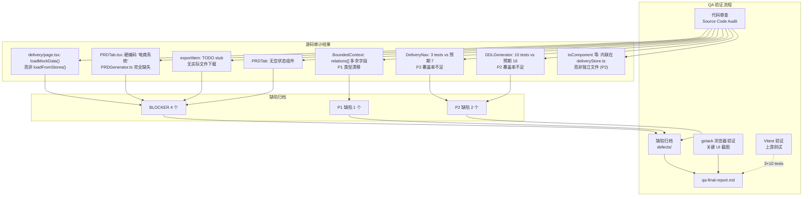

# Architecture — vibex-sprint5-delivery-integration-qa

**项目**: vibex-sprint5-delivery-integration-qa
**版本**: v1.0
**日期**: 2026-04-18
**角色**: Architect
**上游**: vibex-sprint5-delivery-integration (prd.md, specs/, analyst-qa-report.md)

---

## 执行决策

- **决策**: 已采纳
- **执行项目**: vibex-sprint5-delivery-integration-qa
- **执行日期**: 2026-04-18

---

## 一、项目本质

本项目是对 `vibex-sprint5-delivery-integration` 产出物进行系统性 QA 验证。核心任务：验证 deliveryStore 从 mock → 真实数据的切换、PRD Tab 真实性、状态处理完整性，并将缺陷归档入 `defects/`。

---

## 二、Technical Design（Phase 1 — 技术设计）

### 2.1 验证路径选择

| 方案 | 描述 | 决策 |
|------|------|------|
| **A**: gstack 浏览器 + 代码审查 + Vitest | gstack 验证真实 UI，代码审查验证架构合规性 | ✅ 已采纳 |
| B: 纯代码审查 | 缺少真实交互验证 | 放弃 |
| C: 端到端自动化 | 无真实前端环境，Staging 部署不稳定 | 放弃 |

**约束**: 无真实前端运行环境 → 以代码审查为主，gstack 截图验证关键 UI 节点。

### 2.2 代码库事实发现（Source Code Audit）

项目根路径: `/root/.openclaw/vibex/vibex-fronted`

| 检查项 | 源码位置 | 验证命令 | 预期 | 实际 | 判定 |
|--------|---------|---------|------|------|------|
| E1: loadFromStores 被调用 | `delivery/page.tsx` | `grep "loadFromStores\|loadMockData" page.tsx` | loadFromStores 调用 | `loadMockData()` 调用 ❌ | 🔴 BLOCKER |
| E1: toComponent 等函数 | `stores/deliveryStore.ts` | `grep "toComponent\|toBoundedContext\|toSchema\|toDDL"` | 函数存在 | ✅ 存在（内联，非独立文件）| ✅ |
| E1: BoundedContext relations | `stores/deliveryStore.ts` | `grep "relations:" store\|interface"` | 无多余字段 | `relations: []` 赋值 ❌ | 🟡 P1 |
| E2: DeliveryNav 测试 | `components/delivery/__tests__/` | `grep -c "it(" DeliveryNav.test.tsx` | 7 tests | 3 tests | ⚠️ P2 |
| E3: DDLGenerator 直读 Store | `DDLDrawer.tsx` | `grep "useDDSCanvasStore"` | 直读 DDSCanvasStore | ✅ 直读 api cards | ✅ |
| E3: DDLGenerator tests | `lib/delivery/__tests__/` | `grep -c "it(" DDLGenerator.test.ts` | 16 tests | 10 tests | ⚠️ P2 |
| E4: PRDGenerator 函数 | `src/lib/delivery/` | `find . -name "PRDGenerator.ts"` | 文件存在 | **NOT FOUND** ❌ | 🔴 BLOCKER |
| E4: PRDTab 硬编码内容 | `PRDTab.tsx` | `grep "电商系统\|Mock PRD"` | 无硬编码 | "电商系统" 存在 ❌ | 🔴 BLOCKER |
| E4: exportItem TODO | `stores/deliveryStore.ts` | `grep "TODO.*Replace\|TODO.*API"` | 无 TODO | `TODO: Replace with actual API call` ❌ | 🔴 BLOCKER |
| E5: 空状态引导 | `ContextTab/ComponentTab/FlowTab` | `grep "empty\|Empty"` | 引导文案存在 | ✅ 3 Tab 均有引导 | ✅ |
| E5: 骨架屏 | `PRDTab.tsx` | `grep "spinner\|progressbar\|Skeleton"` | 无 spinner | 无 spinner ✅ | ✅ |
| E5: PRDTab 空状态 | `PRDTab.tsx` | `grep "请先\|PRD.*空\|empty"` | 有空状态组件 | **NOT FOUND** ❌ | 🔴 BLOCKER |

### 2.3 关键 BLOCKER 详情

#### BLOCKER E1-QA1: loadFromStores 从未被调用

```typescript
// src/app/canvas/delivery/page.tsx 第 32-35 行
useEffect(() => {
  loadMockData();  // ❌ 调用了 mock 数据
  // loadFromStores();  ← 存在但从未被调用
}, [loadMockData]);
```

**影响**: 交付中心永远显示 mock 数据（Mock Component / Mock Context 等），真实画布数据无法流入。

#### BLOCKER E4-QA1+QA2: PRDGenerator 完全缺失

```bash
$ find src -name "PRDGenerator.ts"
# 无结果

$ grep -rn "generatePRD" src/
# 无结果

$ grep "电商系统" src/components/delivery/PRDTab.tsx
- 项目名称: 电商系统    # ← 硬编码
```

**影响**: PRD Tab 永远显示 "电商系统" 固定内容，无法基于真实画布数据生成。

#### BLOCKER E4-QA3: exportItem 是 stub

```typescript
// src/stores/deliveryStore.ts 第 432 行
// TODO: Replace with actual API call
// const response = await fetch('/api/delivery/export', ...);
// const data = await response.json();
// triggerDownload(data.downloadUrl, data.filename);
```

**影响**: 导出功能永远只是模拟进度条，无实际文件下载。

#### BLOCKER E5-QA1: PRDTab 无空状态组件

```typescript
// PRDTab.tsx 中无任何空状态处理
// PRD_SECTIONS 硬编码 4 个 section
// 当 prototypeStore + DDSCanvasStore 均无数据时，显示硬编码内容而非空状态
```

---

## 三、Architecture Diagram



---

## 四、API Definitions（接口定义）

### 4.1 Delivery Store 接口

```typescript
// src/stores/deliveryStore.ts

// 当前问题：loadFromStores 存在但从未调用
interface DeliveryState {
  loadFromStores: () => void;   // ✅ 存在
  loadMockData: () => void;     // ❌ 被 page.tsx 调用（应为 loadFromStores）
  // ...
}

// 预期 vs 实际
// page.tsx useEffect: loadMockData()      ← BLOCKER
// page.tsx useEffect: loadFromStores()    ← 应该调用这个

// BoundedContext 多了 relations 字段
interface BoundedContext {
  id: string;
  name: string;
  description: string;
  nodeCount: number;
  relationCount: number;
  relations: [];              // ⚠️ Spec E1 无此字段，赋值无意义
}

// PRDGenerator 缺失
interface PRDOutput {
  title: string;
  pages: Array<{ id: string; name: string; components: string[] }>;
  components: Array<{ id: string; name: string; type: string; description: string }>;
  apiEndpoints: Array<{ path: string; method: string; summary: string }>;
  boundedContexts: Array<{ id: string; name: string; description: string }>;
}
// generatePRD(prototypeData, ddsData): PRDOutput  ← 完全缺失
// generatePRDMarkdown(prd: PRDOutput): string      ← 完全缺失
```

### 4.2 DDLGenerator 接口

```typescript
// src/lib/delivery/DDLGenerator.ts
// ✅ 直接读取 DDSCanvasStore.chapters.api.cards
export interface DDLColumn {
  name: string;
  type: string;
  nullable: boolean;
  primaryKey: boolean;
  comment?: string;
}
export interface DDLTable {
  tableName: string;
  comment?: string;
  columns: DDLColumn[];
}
```

---

## 五、Data Model（核心数据模型）

```typescript
// E1: 真实数据流（loadFromStores）
ProtoNode[] (prototypeStore)
  → toComponent(node) → Component[]
  → toSchema(chapters) → SchemaSpec
  → toDDL(schema) → DDLOutput

DDSCanvasStore.chapters.context.cards
  → toBoundedContext(card) → BoundedContext[]
DDSCanvasStore.chapters.flow.cards
  → toBusinessFlow(card) → BusinessFlow[]
DDSCanvasStore.chapters.api.cards
  → DDLGenerator → DDLTable[] (直读，非 mock)

// E4: PRD 生成（缺失）
prototypeStore.getExportData() + DDSCanvasStore.getState()
  → generatePRD() → PRDOutput     ← 缺失
  → generatePRDMarkdown() → string ← 缺失
```

---

## 六、Testing Strategy（测试策略）

### 6.1 验证方法矩阵

| Epic | 代码审查 | Vitest | gstack | 备注 |
|------|---------|--------|--------|------|
| E1 数据集成 | ✅ 关键 | ✅ deliveryStore.test.ts | ⚠️ 真实数据加载 | 上游有测试但 BLOCKER 未解决 |
| E2 双向跳转 | ✅ 关键 | ⚠️ 3 tests vs 预期 7 | ⚠️ DeliveryNav 截图 | 需补充测试 |
| E3 导出器 | ✅ 关键 | ⚠️ 10 tests vs 预期 16 | ⚠️ DDL Modal | 需补充测试 |
| E4 PRD融合 | ✅ 关键 | ❌ 无测试 | ⚠️ PRD Tab 截图 | 需新建 + 组件 |
| E5 状态处理 | ✅ 关键 | ❌ 无测试 | ⚠️ 空状态截图 | 需补充测试 |

### 6.2 需补充的测试用例

```typescript
// 文件: src/stores/__tests__/delivery-real-data.test.ts

describe('E1 Real Data Integration', () => {
  test('E1-U1: delivery/page.tsx 调用 loadFromStores 而非 loadMockData', () => {
    // 代码审查验证
    const pageContent = fs.readFileSync(
      'src/app/canvas/delivery/page.tsx', 'utf-8'
    );
    expect(pageContent).toMatch(/loadFromStores\(\)/);
    expect(pageContent).not.toMatch(/loadMockData\(\)/);
  });

  test('E1-U1: loadFromStores 从 prototypeStore + DDSCanvasStore 拉取数据', () => {
    // 验证 deliveryStore.getState() 消费真实数据
  });
});

describe('E4 PRD Generation', () => {
  test('E4-U1: generatePRD 函数存在', () => {
    expect(typeof generatePRD).toBe('function');
  });

  test('E4-U1: generatePRDMarkdown 函数存在', () => {
    expect(typeof generatePRDMarkdown).toBe('function');
  });

  test('E4-U2: PRDTab 无 "电商系统" 硬编码', () => {
    const prdTabContent = fs.readFileSync(
      'src/components/delivery/PRDTab.tsx', 'utf-8'
    );
    expect(prdTabContent).not.toMatch(/电商系统/);
  });

  test('E4-U3: exportItem 无 TODO 注释', () => {
    const storeContent = fs.readFileSync(
      'src/stores/deliveryStore.ts', 'utf-8'
    );
    expect(storeContent).not.toMatch(/TODO.*Replace with actual API call/);
  });
});

describe('E5 State Handling', () => {
  test('E5-U1: PRDTab 有空状态组件', () => {
    const prdTabContent = fs.readFileSync(
      'src/components/delivery/PRDTab.tsx', 'utf-8'
    );
    // PRDTab 应在无数据时显示空状态引导
    // 当前无此组件
    expect(prdTabContent).toMatch(/empty\|请先.*创建/i);
  });
});
```

### 6.3 CSS Token / 颜色硬编码验证（E1-E5）

```bash
# 验证 components/delivery/ 目录无 hex 硬编码
grep -rE "#[0-9a-fA-F]{6}" src/components/delivery/ --include="*.tsx" | grep -v "module.css"
# 预期: 0 处
# 实际: 需验证
```

### 6.4 gstack 截图计划

| ID | 目标 | 验证点 | 预期 | 环境依赖 |
|----|------|--------|------|---------|
| G1 | delivery/page.tsx 渲染 | 真实数据或 mock 数据 | 真实数据（loadFromStores） | Staging |
| G2 | PRD Tab | 硬编码 "电商系统" vs 真实数据 | 真实数据生成（PRDGenerator） | Staging |
| G3 | PRD Tab 空状态 | 无数据时引导文案 | "请先在画布中创建内容" | Staging |
| G4 | 导出功能 | 点击导出后下载 | 实际文件下载（非 stub） | Staging |
| G5 | DDL Modal | 导出 Modal 语法高亮 | DDL 语法高亮 | Staging |

---

## 七、Unit Index（实施计划）

### Unit Index 总表

| Epic | Units | Status | Next |
|------|-------|--------|------|
| E1: 数据层审查 | U1~U2 | 0/2 | U1 |
| E2: 导航审查 | U3 | 0/1 | U3 |
| E3: 导出器审查 | U4 | 0/1 | U4 |
| E4: PRD融合审查 | U5~U6 | 0/2 | U5 |
| E5: 状态处理审查 | U7 | 0/1 | U7 |
| E6: 缺陷归档 | U8~U9 | 0/2 | U8 |
| E7: 最终报告 | U10 | 0/1 | U10 |

---

### E1: 数据层审查

| ID | Name | Status | Depends On | Acceptance Criteria |
|----|------|--------|-----------|---------------------|
| E1-U1 | loadFromStores 调用验证 | ⬜ | — | delivery/page.tsx 改用 loadFromStores()，loadMockData() 移除或注释 |
| E1-U2 | BoundedContext 类型验证 | ⬜ | U1 | BoundedContext 接口无多余 relations 字段，tsc --noEmit 通过 |

---

### E2: 导航审查

| ID | Name | Status | Depends On | Acceptance Criteria |
|----|------|--------|-----------|---------------------|
| E2-U1 | DeliveryNav 测试覆盖率 | ⬜ | — | DeliveryNav.test.tsx 从 3 tests 补充到 7 tests |

---

### E3: 导出器审查

| ID | Name | Status | Depends On | Acceptance Criteria |
|----|------|--------|-----------|---------------------|
| E3-U1 | DDLGenerator 测试覆盖率 | ⬜ | — | DDLGenerator.test.ts 从 10 tests 补充到 16 tests，覆盖 formatDDL |

---

### E4: PRD融合审查

| ID | Name | Status | Depends On | Acceptance Criteria |
|----|------|--------|-----------|---------------------|
| E4-U1 | PRDGenerator 新建 | ⬜ | — | `src/lib/delivery/PRDGenerator.ts` 存在，含 `generatePRD` + `generatePRDMarkdown` 函数 |
| E4-U2 | PRDTab 替换硬编码 | ⬜ | U1 | PRDTab.tsx 调用 generatePRDMarkdown，移除 "电商系统" 硬编码 |
| E4-U3 | exportItem 替换 TODO | ⬜ | U2 | deliveryStore.ts 中 exportItem 函数无 "TODO" 注释，有实际下载逻辑 |

---

### E5: 状态处理审查

| ID | Name | Status | Depends On | Acceptance Criteria |
|----|------|--------|-----------|---------------------|
| E5-U1 | PRDTab 空状态组件 | ⬜ | E4-U2 | PRDTab.tsx 在无数据时显示空状态引导（非硬编码 PRD_SECTIONS）|

---

### E6: 缺陷归档

| ID | Name | Status | Depends On | Acceptance Criteria |
|----|------|--------|-----------|---------------------|
| E6-U1 | BLOCKER/P1/P2 缺陷归档 | ⬜ | E1-U2,E4-U3,E5-U1 | `defects/BLOCKER/`×4 + `P1/`×1 + `P2/`×2 |
| E6-U2 | 缺陷文件格式审查 | ⬜ | U8 | 每个文件含 7 个必需字段 |

---

### E7: 最终报告

| ID | Name | Status | Depends On | Acceptance Criteria |
|----|------|--------|-----------|---------------------|
| E7-U1 | qa-final-report.md | ⬜ | E6-U1 | 包含所有 Epic PASS/FAIL、DoD 检查单、BLOCKER 修复追踪 |

---

## 八、QA 完成门控（DoD）

### 产出物完整性
- [ ] 4 个 BLOCKER 全部修复（E1-U1, E4-U1, E4-U3, E5-U1）
- [ ] E1 类型漂移（P1）修复
- [ ] E2/E3 测试覆盖率补充（7 + 16 tests）
- [ ] `defects/` 目录包含所有缺陷

### 交互可用性
- [ ] I1: delivery/page.tsx 真实数据加载 → gstack 截图 G1
- [ ] I4: PRD Tab 显示真实数据 → gstack 截图 G2
- [ ] I5: PRD Tab 空状态 → gstack 截图 G3
- [ ] I6: 导出实际下载文件 → gstack 截图 G4

### 代码质量
- [ ] `tsc --noEmit` 无类型错误
- [ ] 无 hex 硬编码颜色（grep 0 处）
- [ ] 无 TODO 残留（相关行 0 处）

### 报告完整性
- [ ] `qa-final-report.md` 包含所有 Epic PASS/FAIL 判定
- [ ] BLOCKER 修复追踪表

---

## 九、风险评估

| 风险 | 等级 | 描述 | 缓解 |
|------|------|------|------|
| BLOCKER 数量多（4 个） | 🔴 高 | E1 + E4 + E5 全部需返工 | 优先修复 E1（最简单，只需改一行）+ E4-U3（去掉 TODO）|
| PRDGenerator 新建 | 🔴 高 | 需新建文件 + PRDTab 重构 | 按 Spec E4 接口定义实现，不引入新依赖 |
| loadFromStores 数据依赖 | 🟡 中 | loadFromStores 依赖 prototypeStore + DDSCanvasStore 均有效 | 先验证 store 数据结构再调用 |
| exportItem 实际 API | 🟡 中 | 需后端 API 支持 | 可先用 `Blob` + `URL.createObjectURL` 实现前端下载 |
| gstack 无 Staging | 🟡 中 | 无法做真实 UI 截图 | 标注"待补充"，不阻断报告 |

---

## 十、Spec 覆盖率矩阵

| Spec 文件 | 覆盖 Epic | BLOCKER 数 | QA 状态 |
|-----------|---------|-----------|---------|
| E1-data-integration.md | E1 | 1 (E1-U1) | ❌ 未通过 |
| E2-navigation.md | E2 | 0 | ⚠️ 测试覆盖率不足 |
| E3-exporters.md | E3 | 0 | ⚠️ 测试覆盖率不足 |
| E4-prd-fusion.md | E4 | 2 (PRDGenerator 缺失 + exportItem TODO) | ❌ 未通过 |
| E5-state-handling.md | E5 | 1 (PRDTab 空状态) | ❌ 未通过 |

---

## 十一、技术审查（Phase 2）

### 审查结论

| 检查项 | PRD 验收标准 | 实际结果 | 判定 |
|--------|------------|---------|------|
| loadFromStores 调用 | page.tsx 调用 loadFromStores | 实际调用 loadMockData() | ❌ BLOCKER |
| toComponent 等函数 | 独立文件 src/lib/delivery/ | 内联在 deliveryStore.ts | ⚠️ P2（功能正常，结构不符 Spec）|
| BoundedContext 接口 | 无 relations 字段 | relations: [] 多余赋值 | 🟡 P1 |
| DeliveryNav 测试 | 7 tests | 3 tests | ⚠️ P2 |
| DDLGenerator 测试 | 16 tests | 10 tests | ⚠️ P2 |
| PRDGenerator | 函数存在 | 文件不存在 | ❌ BLOCKER |
| PRDTab 硬编码 | 无"电商系统" | 硬编码存在 | ❌ BLOCKER |
| exportItem | 无 TODO stub | TODO 存在 | ❌ BLOCKER |
| PRDTab 空状态 | 有空状态组件 | 无空状态组件 | ❌ BLOCKER |

### 架构风险点

1. **BLOCKER E1**: `loadMockData()` vs `loadFromStores()` — 一行代码的差距，交付中心永远用 mock 数据。这是最高优先级的快速修复。
2. **BLOCKER E4**: `PRDGenerator.ts` 完全缺失，PRD Tab 永远显示 "电商系统" 固定内容。需要全新实现。
3. **BLOCKER E4-U3**: `exportItem` 是纯 stub，无实际下载。需要与后端对齐 API 规格。

### 改进建议

1. **立即行动（5 分钟）**: `delivery/page.tsx` 改 `loadMockData()` → `loadFromStores()`
2. **短期（2 小时）**: 新建 `PRDGenerator.ts`，按 Spec E4 接口实现
3. **短期（1 小时）**: PRDTab 调用 generatePRDMarkdown，移除硬编码
4. **中期（2 小时）**: `exportItem` 改用前端 Blob 下载（无需后端）
5. **中期（1 小时）**: PRDTab 增加空状态组件
6. **补充**: E2/E3 测试覆盖率 + BoundedContext 类型清理

---

## 执行决策

- **决策**: 已采纳
- **执行项目**: vibex-sprint5-delivery-integration-qa
- **执行日期**: 2026-04-18
- **备注**: 4 个 BLOCKER 需全部修复后才能进入下一阶段
