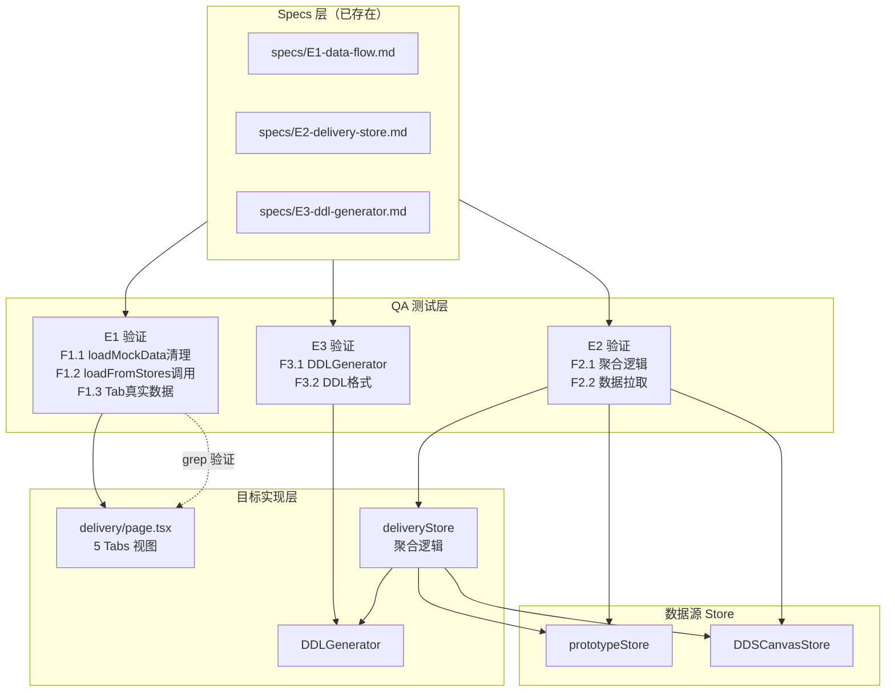

# Architecture — vibex-sprint5-qa / design-architecture

**项目**: vibex-sprint5-qa
**角色**: Architect（系统架构设计）
**日期**: 2026-04-25
**上游**: analysis.md（Analyst 有条件通过）+ prd.md（PM）+ specs/E1-E3
**状态**: ✅ 设计完成

---

## 1. 执行摘要

### 背景

Sprint5 Delivery Integration QA 验证的核心问题：**🔴 E1 数据流阻断**。`delivery/page.tsx` 第 27 行仍调用 `loadMockData()`，所有 5 个 Tab（Context/Flow/Component/PRD/DDL）实际消费的是 mock 数据而非真实 store 数据。`loadFromStores()` 已实现但从未被调用。

Analyst 报告结论：有条件通过 — specs 完整，Architecture 完整，但 E1 数据流是 P0 阻断风险。

### 目标

对 Sprint5 Delivery Integration E1-E3 实现进行 QA 验收，确认：
1. **E1（P0）**: `delivery/page.tsx` 从 `loadMockData()` 切换到 `loadFromStores()`，5 Tab 显示真实数据
2. **E2（P0）**: deliveryStore 聚合逻辑（toComponent/toBoundedContext/toFlow/toSM）正确
3. **E3（P1）**: DDLGenerator 与 Sprint4 APIEndpointCard 接口兼容

### 关键风险

| 风险 | 影响 | 优先级 |
|------|------|--------|
| E1: `loadMockData()` 仍在被调用 | 所有 Tab 显示假数据，交付物无价值 | P0 |
| E1: 5 个 Tab 数据消费验证 | 确保切换后无 Tab 残留 mock 数据 | P0 |
| E3: DDLGenerator 与 Sprint4 API 兼容性 | Sprint4 未上线则 E3 无法验证 | P1 |

---

## 2. Tech Stack

### 2.1 测试框架

| 工具 | 版本 | 用途 |
|------|------|------|
| Vitest | ^4.1.2 | 单元/集成测试（store 行为 + DDLGenerator 逻辑）|
| Playwright | ^1.59.0 | E2E/UI 集成（delivery/page.tsx 数据流验证）|
| @testing-library/react | ^16.3.2 | React 组件测试 |
| @testing-library/user-event | ^14.5.2 | 用户交互模拟 |
| @testing-library/jest-dom | ^6.9.9.1 | DOM 断言增强 |
| msw | ^2.12.10 | HTTP 拦截（如果 delivery/page.tsx 有 API 调用）|
| @vitest/coverage-v8 | ^4.1.2 | 覆盖率报告 |

### 2.2 技术决策

**E1 数据流验证用 Playwright + grep 双重策略**：
- Playwright 验证 UI 层：delivery/page.tsx 各 Tab 显示内容不包含 "mock" 字样
- grep 验证源码层：`delivery/page.tsx` 中无 `loadMockData()` 调用

**E2 deliveryStore 聚合逻辑用 Vitest store 测试**：toComponent/toBoundedContext/toFlow/toSM 是纯函数，直接 Vitest 测试最精确。

**E3 DDLGenerator 用单元测试**：APIEndpointCard[] → DDLTable[] 转换是纯逻辑转换，无需浏览器。

---

## 3. Architecture Diagram



---

## 4. 模块划分

### 4.1 测试文件结构

```
tests/
├── unit/
│   ├── stores/
│   │   └── deliveryStore.test.ts         # E2 F2.1/F2.2 聚合逻辑
│   ├── services/
│   │   └── DDLGenerator.test.ts          # E3 F3.1/F3.2 DDL生成逻辑
│   └── grep/
│       └── e1-data-flow-cleanup.test.ts  # E1 F1.1 grep 验证
└── e2e/
    └── sprint5-qa/
        ├── E1-delivery-page.spec.ts       # E1 F1.1~F1.3 5 Tab数据验证
        └── E3-ddl-output.spec.ts           # E3 F3.2 DDL格式验证
```

### 4.2 核心模块

| 模块 | 职责 | 技术边界 |
|------|------|---------|
| `deliveryStore.test.ts` | 验证 toComponent/toBoundedContext/toFlow/toSM 聚合转换 | store 层纯函数测试 |
| `DDLGenerator.test.ts` | 验证 APIEndpointCard[] → DDLTable[] 转换 | 纯逻辑单元测试 |
| `E1-delivery-page.spec.ts` | Playwright 验证 5 Tab 真实数据 + 无 mock 内容 | UI 集成测试 |

### 4.3 数据流

```
prototypeStore.nodes ──────────────────┐
DDSCanvasStore.chapters/edges ───────┴──→ deliveryStore.loadFromStores()
                                                   │
                                                   ▼
                                    toComponent / toBoundedContext / toFlow / toSM
                                                   │
                                                   ▼
                                        delivery/page.tsx 5 Tabs
                                        (Context / Flow / Component / PRD / DDL)
```

---

## 5. Data Model

### 5.1 核心类型

```typescript
// DDLGenerator（E3 核心类型）
interface APIEndpointCard {
  id: string;
  method: 'GET' | 'POST' | 'PUT' | 'DELETE';
  path: string;
  summary: string;
  requestBody?: { schema: Record<string, unknown> };
  responses: Record<string, { schema: Record<string, unknown> }>;
}

interface DDLTable {
  tableName: string;
  columns: Array<{
    name: string;
    type: string;
    nullable: boolean;
    primaryKey: boolean;
  }>;
  foreignKeys: Array<{ column: string; references: string }>;
}

// deliveryStore（E2 核心类型）
interface DeliveryStore {
  dataSource: 'mock' | 'stores';
  components: ComponentData[];
  boundedContexts: BoundedContextData[];
  flows: FlowData[];
  stateMachines: SMData[];

  loadFromStores(): Promise<void>;  // 从 prototypeStore + DDSCanvasStore 拉取
  toComponent(node: ProtoNode): ComponentData;
  toBoundedContext(chapter: Chapter): BoundedContextData;
  toFlow(edge: Edge): FlowData;
  toStateMachine(chapter: SMChapter): SMData;
}
```

---

## 6. Testing Strategy

### 6.1 核心测试用例

#### E1-F1.1: `loadMockData()` 清理验证（grep + Playwright）

```typescript
// tests/unit/grep/e1-data-flow-cleanup.test.ts
describe('E1: delivery/page.tsx 数据流修复验证', () => {
  it('F1.1: delivery/page.tsx 不包含 loadMockData 调用', () => {
    const result = execSync(
      'grep "loadMockData" src/pages/delivery/page.tsx || true',
      { cwd: process.cwd() }
    );
    expect(result.toString().trim()).toHaveLength(0);
  });

  it('F1.1: delivery/page.tsx 包含 loadFromStores 调用', () => {
    const result = execSync(
      'grep "loadFromStores" src/pages/delivery/page.tsx || true',
      { cwd: process.cwd() }
    );
    expect(result.toString().trim()).not.toHaveLength(0);
  });
});

// tests/e2e/sprint5-qa/E1-delivery-page.spec.ts
describe('E1: delivery/page.tsx 5 Tab 真实数据验证', () => {
  it('F1.2: loadFromStores 调用后，dataSource 变为 stores', async ({ page }) => {
    await page.goto('/delivery');
    // 等待数据加载
    await page.waitForSelector('[data-tab-content]');
    const dataSource = await page.evaluate(() =>
      // @ts-ignore
      window.__deliveryStore?.getState?.()?.dataSource
    );
    expect(dataSource).toBe('stores');
  });

  it('F1.3: 5 个 Tab 内容不包含 mock 字样', async ({ page }) => {
    await page.goto('/delivery');
    const tabs = ['Context', 'Flow', 'Component', 'PRD', 'DDL'];
    for (const tab of tabs) {
      await page.click(`[role="tab"][name="${tab}"]`);
      const content = await page.textContent('[data-tab-content]');
      expect(content).not.toMatch(/mock/i);
    }
  });
});
```

#### E2-F2.1: deliveryStore 聚合逻辑

```typescript
// tests/unit/stores/deliveryStore.test.ts
describe('E2: deliveryStore 聚合逻辑', () => {
  it('F2.1: toComponent 正确转换 ProtoNode', () => {
    const node = { id: 'n1', type: 'Button', props: { text: 'Click' } };
    const component = useDeliveryStore.getState().toComponent(node);
    expect(component.id).toBe('n1');
    expect(component.type).toBe('Button');
    expect(component.label).toBe('Click');
  });

  it('F2.1: toBoundedContext 正确转换 Chapter', () => {
    const chapter = { id: 'ch1', type: 'context', title: 'BC1', nodes: [] };
    const bc = useDeliveryStore.getState().toBoundedContext(chapter);
    expect(bc.id).toBe('ch1');
    expect(bc.name).toBe('BC1');
  });

  it('F2.1: toFlow 正确转换 Edge', () => {
    const edge = { id: 'e1', source: 'n1', target: 'n2', type: 'smoothstep' };
    const flow = useDeliveryStore.getState().toFlow(edge);
    expect(flow.id).toBe('e1');
    expect(flow.source).toBe('n1');
  });

  it('F2.2: loadFromStores 后 components.length > 0', async () => {
    // 确保 prototypeStore 有数据
    usePrototypeStore.setState({
      nodes: [{ id: 'n1', type: 'Button', data: {} }]
    });
    await useDeliveryStore.getState().loadFromStores();
    expect(useDeliveryStore.getState().components.length).toBeGreaterThan(0);
  });
});
```

#### E3-F3.1: DDLGenerator API 兼容性

```typescript
// tests/unit/services/DDLGenerator.test.ts
describe('E3: DDLGenerator 与 Sprint4 API 兼容性', () => {
  it('F3.1: 空数组输入返回空数组', () => {
    expect(DDLGenerator([])).toEqual([]);
  });

  it('F3.1: APIEndpointCard[] 转换为 DDLTable[]', () => {
    const apiCard: APIEndpointCard = {
      id: 'api-1',
      method: 'POST',
      path: '/users',
      summary: 'Create user',
      requestBody: {
        schema: {
          type: 'object',
          properties: {
            name: { type: 'string' },
            age: { type: 'number' },
          }
        }
      },
      responses: { '201': { schema: { type: 'object' } } }
    };
    const tables = DDLGenerator([apiCard]);
    expect(tables.length).toBeGreaterThan(0);
    expect(tables[0].tableName).toBeDefined();
    expect(tables[0].columns).toBeInstanceOf(Array);
  });

  it('F3.2: formatDDL 输出有效 SQL', () => {
    const tables: DDLTable[] = [{
      tableName: 'users',
      columns: [
        { name: 'id', type: 'INTEGER', nullable: false, primaryKey: true },
        { name: 'name', type: 'VARCHAR(255)', nullable: true, primaryKey: false },
      ],
      foreignKeys: []
    }];
    const sql = formatDDL(tables);
    expect(sql).toMatch(/CREATE TABLE/);
    expect(sql).toMatch(/users/);
  });
});
```

### 6.2 覆盖率要求

| Epic | 验证方式 | 覆盖率 |
|------|---------|-------|
| E1 数据流修复 | grep 源码 + Playwright 5 Tab | 100% |
| E2 deliveryStore | Vitest store 测试 | 100% |
| E3 DDLGenerator | Vitest 纯函数测试 | 100% |
| 全局 | — | ≥ 85% |

### 6.3 测试执行命令

```bash
# 1. grep 静态验证
pnpm vitest run tests/unit/grep/

# 2. store 逻辑验证
pnpm vitest run tests/unit/stores/deliveryStore.test.ts

# 3. DDLGenerator 逻辑验证
pnpm vitest run tests/unit/services/DDLGenerator.test.ts

# 4. UI 数据流验证
pnpm playwright test tests/e2e/sprint5-qa/

# 5. 完整 QA
pnpm vitest run tests/unit/ && pnpm playwright test tests/e2e/sprint5-qa/
```

---

## 7. 关键设计决策

### D1: E1 F1.1 用 grep 而非 Vitest mock

**原因**：`loadMockData()` 是全局函数调用，Vitest mock 可以在测试中拦截，但源码 grep 能更直接地验证「调用已移除」这个事实。

**决策**：grep 验证源码层，Playwright 验证 UI 效果，双重保障。

### D2: E3 DDLGenerator 与 Sprint4 解耦

**原因**：E3 依赖 Sprint4 的 `APIEndpointCard` 接口。如果 Sprint4 未上线，E3 无法在真实环境中验证。

**缓解**：Vitest 单元测试使用内联 mock 的 `APIEndpointCard` 类型，不依赖 Sprint4 代码库。

---

## 8. 风险矩阵

| 风险 | 影响 | 可能性 | 优先级 | 缓解措施 |
|------|------|--------|--------|----------|
| E1: `loadMockData()` 切换后数据为空 | Tab 显示空白 | 中 | P0 | Playwright 验证 Tab 非空 |
| E3: Sprint4 APIEndpointCard 接口变更 | DDLGenerator 转换失败 | 低 | P1 | 内联 mock 类型，不依赖 Sprint4 |
| deliveryStore 聚合逻辑错误 | 各 Tab 数据不完整 | 中 | P0 | F2.1 纯函数测试覆盖 |

---

## 执行决策

- **决策**: 已采纳
- **执行项目**: vibex-sprint5-qa
- **执行日期**: 2026-04-25
- **备注**: E1 数据流是 P0 阻断，F1.1 grep 验证优先执行。E2 F2.2 需要 prototypeStore 有真实数据。覆盖目标 ≥ 85%。

---

*设计时间: 2026-04-25 13:05 GMT+8*
