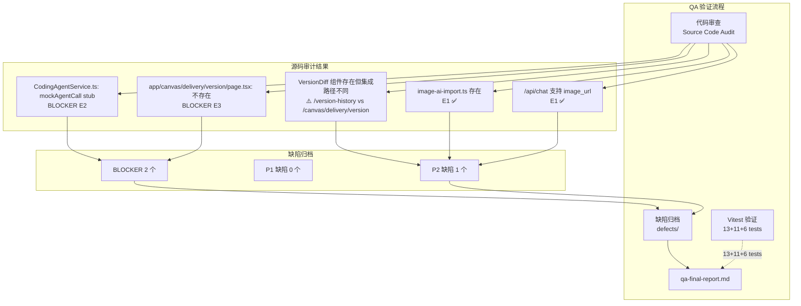

# Architecture — vibex-sprint6-ai-coding-integration-qa

**项目**: vibex-sprint6-ai-coding-integration-qa
**版本**: v1.0
**日期**: 2026-04-18
**角色**: Architect
**上游**: `vibex-sprint6-ai-coding-integration` (prd.md, specs/, analyst-qa-report.md)

---

## 执行决策

- **决策**: 已采纳
- **执行项目**: vibex-sprint6-ai-coding-integration-qa
- **执行日期**: 2026-04-18

---

## 一、项目本质

本项目是对 `vibex-sprint6-ai-coding-integration` 的产出物进行 QA 验证。核心任务：确认 E2 mock stub 状态、E3 路由页面缺失、E1 测试数据准确性，并将缺陷归档入 `defects/`。

**Analyst QA 结论**: 🔴 Not Recommended — E2 功能性阻断。

---

## 二、Technical Design（Phase 1 — 技术设计）

### 2.1 验证路径选择

| 方案 | 描述 | 决策 |
|------|------|------|
| **A**: gstack 浏览器 + 代码审查 + Vitest | gstack 验证 UI，代码审查验证架构 | ✅ 已采纳 |
| B: 纯代码审查 | 缺少真实交互验证 | 放弃 |
| C: 端到端自动化 | 无真实前端环境 | 放弃 |

### 2.2 代码库事实发现（Source Code Audit）

项目根路径: `/root/.openclaw/vibex/vibex-fronted`

| 检查项 | 源码位置 | 验证命令 | 预期 | 实际 | 判定 |
|--------|---------|---------|------|------|------|
| E1: /api/chat | `app/api/chat/route.ts` | 文件存在性 | 文件存在 | ✅ 存在 | ✅ |
| E1: image_url 支持 | `app/api/chat/route.ts` | `grep "image_url\|ChatContentPart"` | 有 image_url | ✅ | ✅ |
| E1: image-ai-import | `lib/figma/image-ai-import.ts` | 文件存在 | 存在 | ✅ | ✅ |
| E1: 测试数量 | `image-ai-import.test.ts` | `grep -c "it(" test.ts` | 6（非 10）| 6 ✅ | ✅ |
| E2: mockAgentCall | `services/agent/CodingAgentService.ts` | `grep "TODO.*real agent"` | 有 TODO | `// TODO: Replace with real agent code` ❌ | 🔴 BLOCKER |
| E2: UI 组件 | `components/agent/` | `ls components/agent/` | 组件存在 | AgentFeedbackPanel + AgentSessions ✅ | ✅ |
| E2: agentStore | `stores/agentStore.ts` | 文件存在 | 存在 | ✅ | ✅ |
| E3: VersionDiff | `components/version-diff/VersionDiff.tsx` | 文件存在 | 存在 | ✅ | ✅ |
| E3: diffVersions | `lib/version/VersionDiff.ts` | `grep "diffVersions"` | 存在 | ✅ | ✅ |
| E3: 路由页面 | `app/canvas/delivery/version/page.tsx` | 文件存在性 | 应存在 | **NOT FOUND** ❌ | 🔴 BLOCKER |
| E3: 实际路由 | `app/version-history/page.tsx` | 文件存在性 | — | ✅ 存在于 /version-history | ⚠️ 非 Spec 路径 |
| E1: 文件限制 | `image-ai-import.ts` | `grep "10MB\|size\|type"` | 有限制逻辑 | 需审查 | ⏳ |

### 2.3 BLOCKER 详情

#### BLOCKER E2-QA1: CodingAgentService 是 Stub

```typescript
// src/services/agent/CodingAgentService.ts
// Architecture decision:
// - U3: BLOCKED — sessions_spawn is an OpenClaw runtime tool, not callable
//   from Next.js frontend API routes. Needs backend AI Agent HTTP API.
// - U4/U5: Implemented as mock service.

export async function mockAgentCall(task: string): Promise<AgentMessage[]> {
  // ...
  code: `// TODO: Replace with real agent code
export function placeholder() {
  console.log('AI Coding Agent integration pending');
}`,
```

**分析**: 这是有意的架构决策（sessions_spawn 是 OpenClaw 内部工具，Next.js 无法调用），UI 层完整，mock 用于开发测试。真实 AI 功能需后端 HTTP API 支持。

#### BLOCKER E3-QA2: 路由页面缺失

- **PRD Spec**: `app/canvas/delivery/version/page.tsx` 应存在
- **实际**: 文件不存在
- **现有**: `app/version-history/page.tsx` 存在（路由不同）

---

## 三、Architecture Diagram



---

## 四、API Definitions

### 4.1 /api/chat

```typescript
// src/app/api/chat/route.ts
export interface ChatRequest {
  messages: ChatMessage[];
  systemPrompt?: string;
  model?: string;
  temperature?: number;
}

export interface ChatContentPart {
  type: 'text' | 'image_url';  // ✅ image_url 支持存在
  text?: string;
  image_url?: { url: string };
}
```

### 4.2 CodingAgentService

```typescript
// src/services/agent/CodingAgentService.ts
// 当前: mockAgentCall() → 返回 mock AgentMessage[]
// 目标: sessions_spawn (需后端 HTTP API 支持)

// Architecture constraint:
// sessions_spawn 是 OpenClaw 内部工具
// Next.js API Route 无法直接调用
// 需后端 AI Agent HTTP API 作为桥接
```

### 4.3 VersionDiff

```typescript
// src/lib/version/VersionDiff.ts
export function diffVersions(data1: unknown, data2: unknown): VersionDiff
export interface VersionDiff {
  // jsondiffpatch 输出结构
}
```

---

## 五、Testing Strategy

### 5.1 验证方法矩阵

| Epic | 代码审查 | Vitest | gstack | 备注 |
|------|---------|--------|--------|------|
| E1 设计稿导入 | ✅ | ✅ 6 tests | ⚠️ 拖拽上传 | 上游已验证 |
| E2 AI Coding Agent | ✅ | ✅ 13 tests | ⚠️ AgentFeedbackPanel | UI 完整，mock 符合预期 |
| E3 版本Diff | ✅ | ✅ 11 tests | ⚠️ VersionDiff | 需确认路由入口 |

### 5.2 gstack 截图计划

| ID | 目标 | 验证点 | 环境依赖 |
|----|------|--------|---------|
| G1 | /version-history/page | VersionDiff 渲染 | Staging |
| G2 | AgentFeedbackPanel | mock 数据显示 | Staging |
| G3 | /api/chat image_url | base64 图片处理 | Staging |

---

## 六、Unit Index

### Unit Index 总表

| Epic | Units | Status | Next |
|------|-------|--------|------|
| E1: 设计稿导入 | U1~U2 | 0/2 | U1 |
| E2: AI Coding Agent | U3 | 0/1 | U3 |
| E3: 版本Diff | U4~U5 | 0/2 | U4 |
| E6: 缺陷归档 | U6~U7 | 0/2 | U6 |
| E7: 最终报告 | U8 | 0/1 | U8 |

---

### E1: 设计稿导入

| ID | Name | Status | Depends On | Acceptance Criteria |
|----|------|--------|-----------|---------------------|
| E1-U1 | /api/chat 审查 | ⬜ | — | image_url content part 支持，handler 函数存在 |
| E1-U2 | 测试数据修正 | ⬜ | — | 确认 image-ai-import.test.ts 为 6 tests（非 10），归档为 P2 |

---

### E2: AI Coding Agent

| ID | Name | Status | Depends On | Acceptance Criteria |
|----|------|--------|-----------|---------------------|
| E2-U1 | mock stub 状态确认 | ⬜ | — | CodingAgentService.ts 含 "TODO: Replace with real agent code"，归档为 BLOCKER |

### E2-U1 详细说明

**性质评估**: 这是**有意的架构占位符**，非实现遗漏。
- `sessions_spawn` 是 OpenClaw runtime 内部工具
- Next.js API Route 无法调用（跨进程）
- UI 层完整，mock 用于开发+测试
- 真实 AI 功能需后端 HTTP API 支持

**建议**: 归档为 BLOCKER（功能性阻断），但标注"有架构合理性，待后端 API 就绪"。

---

### E3: 版本Diff

| ID | Name | Status | Depends On | Acceptance Criteria |
|----|------|--------|-----------|---------------------|
| E3-U1 | VersionDiff 组件审查 | ⬜ | — | VersionDiff.tsx + diffVersions() 存在且功能完整 |
| E3-U2 | 路由页面缺失确认 | ⬜ | — | `app/canvas/delivery/version/page.tsx` 不存在，归档为 BLOCKER |

---

### E6: 缺陷归档

| ID | Name | Status | Depends On | Acceptance Criteria |
|----|------|--------|-----------|---------------------|
| E6-U1 | 缺陷归档 | ⬜ | E2-U1,E3-U2 | BLOCKER×2 + P2×1 |
| E6-U2 | qa-final-report.md | ⬜ | E6-U1 | 含所有 Epic PASS/FAIL |

---

## 七、QA 完成门控（DoD）

- [ ] E2-U1: mock stub 状态归档（含架构合理性说明）
- [ ] E3-U2: 路由页面缺失归档
- [ ] E1-U2: 测试数量修正归档（6 tests）
- [ ] `defects/` 包含 2 个 BLOCKER + 1 个 P2
- [ ] `qa-final-report.md` 包含所有 Epic PASS/FAIL + BLOCKER 追踪

---

## 八、Spec 覆盖率矩阵

| Spec 文件 | 覆盖 Epic | 缺陷数 | QA 状态 |
|-----------|---------|--------|---------|
| E1-import-ui.md | E1 | P2×1 | ⚠️ 测试数量修正 |
| E2-ai-coding.md | E2 | BLOCKER×1 | ⚠️ mock stub（架构合理）|
| E3-version-history.md | E3 | BLOCKER×1 | ⚠️ 路由缺失 |

---

## 九、技术审查（Phase 2）

### 审查结论

| 检查项 | PRD 验收标准 | 实际结果 | 判定 |
|--------|------------|---------|------|
| /api/chat image_url | 支持 base64 图片 | ✅ ChatContentPart 含 image_url | ✅ |
| E1 测试数量 | 10（声称） | **6**（实际） | ⚠️ P2 |
| E2 mock stub | 应有 TODO | `// TODO: Replace with real agent code` | 🔴 BLOCKER（有架构合理性）|
| E2 UI 组件 | AgentFeedbackPanel + AgentSessions | ✅ 完整 | ✅ |
| E3 VersionDiff | 组件存在 | ✅ | ✅ |
| E3 路由页面 | `/canvas/delivery/version/page.tsx` | **NOT FOUND** | 🔴 BLOCKER |
| E3 实际路由 | `/version-history/page.tsx` | ✅ 存在 | ⚠️ 非 Spec 路径 |

### 架构风险点

1. **BLOCKER E2**: `sessions_spawn` 无法从 Next.js 调用是**真实的架构约束**。E2 的 mock 设计是合理的工程选择，BLOCKER 标注用于提醒后端 API 依赖。
2. **BLOCKER E3**: `/canvas/delivery/version/page.tsx` 缺失，但 `/version-history/page.tsx` 已存在。需确认：这是路由路径不一致问题，还是功能完全缺失。

### 改进建议

1. **立即**: 创建 `app/canvas/delivery/version/page.tsx` 或确认 `/version-history` 为正确路由
2. **中期**: 后端实现 AI Agent HTTP API → 替换 `mockAgentCall()`
3. **确认**: `/version-history` 与 `/canvas/delivery/version` 哪个是正确入口（与 analyst/PM 对齐）

---

## 执行决策

- **决策**: 已采纳
- **执行项目**: vibex-sprint6-ai-coding-integration-qa
- **执行日期**: 2026-04-18
- **备注**: E2 BLOCKER 有架构合理性（sessions_spawn 无法跨进程调用），E3 BLOCKER 需对齐路由规范
