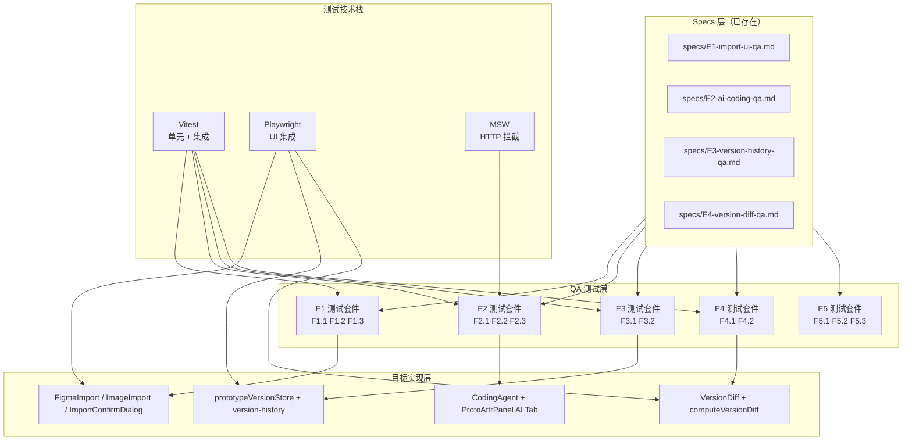

# Architecture — vibex-sprint6-qa / design-architecture

**项目**: vibex-sprint6-qa
**角色**: Architect（系统架构设计）
**日期**: 2026-04-25
**上游**: analysis.md（Analyst 有条件通过报告）
**状态**: ✅ 设计完成

---

## 1. 执行摘要

### 背景

vibex-sprint6-qa 是对 Sprint6 全部产出物（E1 设计稿导入 / E2 AI Coding Agent / E3 版本历史 / E4 版本 Diff）的系统化 QA 验证。

Analyst 报告结论：**有条件通过**，E2 Stub（P0 风险）必须在本 Sprint 内关闭。

### 目标

对 Sprint6 全部产出物进行系统化 QA 验证，确保：
1. E1/E3/E4 的 Specs 与实现一一对应，四态定义完整
2. E2 Stub 已升级为真实实现（方案 A: OpenClaw ACP Runtime 或方案 B: HTTP 后端 AI）
3. DoD 逐条可核查，PRD 格式符合规范

### 关键风险

| 风险 | 影响 | 优先级 |
|------|------|--------|
| E2 mockAgentCall 是 Stub | E2 功能完全不可用 | P0 |
| E2 Stub 升级方案选择 | 方案 A（ACP Runtime）或方案 B（HTTP）尚未确定 | P1 |
| Figma API Token 依赖 | MVP 无法使用 Figma URL 导入 | P2 |

---

## 2. Tech Stack

### 2.1 测试框架

| 工具 | 版本 | 用途 |
|------|------|------|
| Vitest | ^4.1.2 | 单元/集成测试运行器（Jest 兼容） |
| @testing-library/react | ^16.3.2 | React 组件测试（query-first） |
| @testing-library/user-event | ^14.5.2 | 用户交互模拟（比 fireEvent 更真实） |
| @testing-library/jest-dom | ^6.9.1 | DOM 断言增强 |
| jest-axe | ^10.0.0 | 可访问性审计 |
| msw | ^2.12.10 | HTTP 拦截（Mock Service Worker） |
| jsdom | ^29.0.1 | DOM 模拟环境 |
| Playwright | ^1.59.0 | E2E/UI 集成测试 |
| @vitest/coverage-v8 | ^4.1.2 | 覆盖率报告 |

### 2.2 测试配置文件

| 文件 | 用途 |
|------|------|
| `vitest.config.ts` | 根配置：jsdom 环境、@ 别名、setupFiles |
| `tests/unit/setup.ts` | 全局测试环境设置 |
| `tests/unit/vitest.config.ts` | 共享别名 + 环境配置 |
| `jest.config.ts` | Jest 兼容配置（for Stryker） |
| `playwright.config.ts` | E2E 测试配置 |

### 2.3 技术决策

**单元测试用 Vitest 而非 Jest**：VibeX 已迁移到 Vitest，Jest 仅用于 Stryker mutation testing。Vitest 支持 Vite 原生 HMR，测试速度快。

**MSW 拦截 HTTP 请求**：统一拦截所有外部 API（Figma API、MiniMax AI、Backend），确保测试不依赖真实网络。MSW v2 支持 REST 和 GraphQL。

**Playwright 用于 UI 集成验证**：四态中的「加载态/错误态」需要真实 DOM 渲染和交互，Vitest jsdom 无法完全模拟（如文件拖拽、剪贴板操作）。

---

## 3. Architecture Diagram



### 数据流说明

```
PRD + Specs
    ↓
QA 验证计划（F1.1~F5.3）
    ↓
┌─────────────────────────────────────┐
│  Vitest（单元 + 集成）               │
│  覆盖：F1.1/F1.2/F1.3               │
│  覆盖：F2.1（非 Stub 验证）          │
│  覆盖：F3.1（store）                 │
│  覆盖：F4.2（diff 计算逻辑）         │
│  覆盖：F5.1/F5.2/F5.3               │
└─────────────────────────────────────┘
    ↓
┌─────────────────────────────────────┐
│  Playwright（UI 集成）               │
│  覆盖：F2.2（ProtoAttrPanel AI Tab） │
│  覆盖：F3.2（version-history 页面） │
│  覆盖：F4.1（VersionDiff 组件）      │
└─────────────────────────────────────┘
    ↓
覆盖率报告（≥80%）
```

---

## 4. 模块划分

### 4.1 测试文件结构

```
tests/
├── unit/
│   ├── setup.ts                      # 全局环境设置
│   ├── services/
│   │   ├── CodingAgent.test.ts       # F2.1 CodingAgent 非 Stub 验证
│   │   └── computeVersionDiff.test.ts # F4.2 diff 计算四场景
│   └── stores/
│       └── prototypeVersionStore.test.ts # F3.1 store 行为验证
└── e2e/
    └── sprint6-qa/
        ├── E1-import-flow.spec.ts     # F1.1 F1.2 F1.3 UI 四态
        ├── E2-ai-coding-panel.spec.ts # F2.2 AI Tab 四态
        ├── E3-version-history.spec.ts # F3.2 页面四态
        └── E4-version-diff.spec.ts   # F4.1 组件四态
```

**设计决策**：测试文件按 Epic 分类，不按测试类型混合。便于按验收标准追踪每个 Epic 的测试覆盖。

### 4.2 核心模块

| 模块 | 职责 | 技术边界 |
|------|------|---------|
| `CodingAgent.test.ts` | 验证 `CodingAgent.generateCode()` 返回 `GeneratedCode[]`，非 Stub | 只测试服务层，不涉及 UI |
| `prototypeVersionStore.test.ts` | 验证 `usePrototypeVersionStore` 的 CRUD + 恢复行为 | 只测试 Zustand store |
| `computeVersionDiff.test.ts` | 验证 added/removed/modified 四场景 | 纯函数单元测试 |
| `E1-import-flow.spec.ts` | FigmaImport + ImageImport + ImportConfirmDialog 四态 Playwright 验证 | UI 集成测试 |
| `E2-ai-coding-panel.spec.ts` | ProtoAttrPanel AI Tab 四态 | UI 集成测试 |
| `E3-version-history.spec.ts` | version-history 页面四态 | UI 集成测试 |
| `E4-version-diff.spec.ts` | VersionDiff 组件四态 | UI 集成测试 |

### 4.3 MSW Mock 层

```typescript
// tests/unit/mocks/handlers.ts
// F2.1 拦截 OpenClaw sessions_spawn 调用
// F1.1 拦截 Figma API 调用（token-based）
// F2.2 拦截 AI 生成 API
// F3.2/F4.1 拦截 prototype-snapshots API
```

---

## 5. Data Model

### 5.1 测试数据类型

```typescript
// GeneratedCode（F2.1 核心接口）
interface GeneratedCode {
  componentId: string;
  componentName: string;
  code: string;           // 非空字符串
  language: 'tsx' | 'jsx'; // 不是 'unknown'
  model: string;           // 'claude' | 'gpt-4' | 'minimax'
}

// ProtoNode（F4.2 diff 计算基础类型）
interface ProtoNode {
  id: string;
  type: string;
  props: Record<string, unknown>;
  position?: { x: number; y: number };
}

// DiffResult（F4.2 核心返回类型）
interface DiffResult {
  nodes?: {
    added?: ProtoNode[];
    removed?: ProtoNode[];
    modified?: Array<{ before: ProtoNode; after: ProtoNode }>;
  };
  edges?: {
    added?: Edge[];
    removed?: Edge[];
  };
}

// Snapshot（F3.1/F3.2 核心类型）
interface Snapshot {
  id: string;
  name: string;
  createdAt: string;
  data: {
    nodes: ProtoNode[];
    edges: Edge[];
  };
}
```

### 5.2 Store 状态模型

```typescript
// prototypeVersionStore（F3.1 验证对象）
interface PrototypeVersionStore {
  snapshots: Snapshot[];
  selectedSnapshotId: string | null;
  comparePair: [string, string] | null;
  createSnapshot: (name?: string) => Promise<Snapshot>;
  restoreSnapshot: (id: string) => Promise<void>;
  loadSnapshots: () => Promise<void>;
  deleteSnapshot: (id: string) => Promise<void>;
  setSelectedSnapshot: (id: string | null) => void;
  setComparePair: (pair: [string, string] | null) => void;
}
```

---

## 6. API Definitions

### 6.1 内部服务接口

```typescript
// CodingAgent 服务层（F2.1）
// 文件：src/services/ai-coding/CodingAgent.ts（待实现，非 Stub）
interface CodingAgent {
  generateCode(components: ProtoNode[]): Promise<GeneratedCode[]>;
  cancelGeneration(sessionId: string): void;
}

// computeVersionDiff（F4.2）
// 文件：src/utils/version-diff.ts（待实现）
function computeVersionDiff(
  v1: PrototypeExportData,
  v2: PrototypeExportData
): DiffResult;

// prototypeVersionStore（F3.1）
// 文件：src/stores/prototypeVersionStore.ts（待实现）
const usePrototypeVersionStore: PrototypeVersionStore;
```

### 6.2 外部 API Mock 映射

| API | 用途 | Mock 策略 |
|-----|------|----------|
| `GET /api/figma/components` | FigmaImport 组件列表 | MSW REST handler |
| `POST /api/ai/generate` | CodingAgent AI 生成 | MSW REST handler |
| `GET /api/prototypes/:id/snapshots` | 版本历史列表 | MSW REST handler |
| `POST /api/prototypes/:id/snapshots` | 创建版本快照 | MSW REST handler |
| `POST /api/prototypes/:id/snapshots/:sid/restore` | 恢复版本 | MSW REST handler |

---

## 7. Testing Strategy

### 7.1 测试框架选择

**Vitest**（单元 + 集成测试）：
- 原生 Vite，HMR 速度快
- Jest 兼容 API，现有测试文件可迁移
- 内置 coverage-v8 报告

**Playwright**（UI 集成测试）：
- 真实浏览器渲染，无法用 jsdom 替代的场景
- 文件拖拽（FireEvent 无法完全模拟 DataTransfer）
- 剪贴板操作（navigator.clipboard）
- 网络请求拦截（更真实的 MSW 行为）

### 7.2 覆盖率要求

| Epic | 目标覆盖率 |
|------|----------|
| E1 设计稿导入 | ≥ 80% |
| E2 AI Coding Agent | ≥ 85%（Stub 风险高） |
| E3 版本历史 | ≥ 80% |
| E4 版本 Diff | ≥ 85%（diff 分类逻辑必须精确） |
| 全局 | ≥ 80% |

### 7.3 核心测试用例

#### F2.1: CodingAgent 非 Stub 验证（最高优先级）

```typescript
// tests/unit/services/CodingAgent.test.ts
describe('CodingAgent.generateCode', () => {
  it('应返回非空代码字符串，非 Stub', async () => {
    const codes = await codingAgent.generateCode([
      { id: 'n1', type: 'Button', props: {} }
    ]);
    expect(Array.isArray(codes)).toBe(true);
    expect(codes.length).toBeGreaterThan(0);
    expect(typeof codes[0].code).toBe('string');
    expect(codes[0].code.length).toBeGreaterThan(0);
  });

  it('应返回有效 language（tsx 或 jsx）', async () => {
    const codes = await codingAgent.generateCode([
      { id: 'n1', type: 'Button', props: {} }
    ]);
    expect(codes[0].language).toMatch(/tsx|jsx/);
    expect(codes[0].language).not.toBe('unknown');
  });

  it('不应包含 mockAgentCall 或 TODO 注释', () => {
    // 通过测试文件内容静态分析实现
    const sourceCode = fs.readFileSync(
      path.join(process.cwd(), 'src/services/ai-coding/CodingAgent.ts'),
      'utf-8'
    );
    expect(sourceCode).not.toMatch(/mockAgentCall/);
    expect(sourceCode).not.toMatch(/TODO.*Replace with real agent/i);
  });
});
```

#### F4.2: computeVersionDiff 四场景

```typescript
// tests/unit/services/computeVersionDiff.test.ts
describe('computeVersionDiff', () => {
  // 场景 1: added
  it('应正确识别新增节点', () => {
    const v1 = { nodes: [{ id: 'n1', type: 'Button', props: {} }] };
    const v2 = { nodes: [{ id: 'n1', type: 'Button' }, { id: 'n2', type: 'Input' }] };
    const diff = computeVersionDiff(v1, v2);
    expect(diff.nodes.added).toHaveLength(1);
    expect(diff.nodes.added[0].id).toBe('n2');
    expect(diff.nodes.removed).toHaveLength(0);
  });

  // 场景 2: removed
  it('应正确识别删除节点', () => {
    const v1 = { nodes: [{ id: 'n1', type: 'Button' }, { id: 'n2', type: 'Input' }] };
    const v2 = { nodes: [{ id: 'n1', type: 'Button' }] };
    const diff = computeVersionDiff(v1, v2);
    expect(diff.nodes.removed).toHaveLength(1);
    expect(diff.nodes.removed[0].id).toBe('n2');
  });

  // 场景 3: modified
  it('应正确识别修改属性', () => {
    const v1 = { nodes: [{ id: 'n1', type: 'Button', props: { text: 'Click' } }] };
    const v2 = { nodes: [{ id: 'n1', type: 'Button', props: { text: 'Submit' } }] };
    const diff = computeVersionDiff(v1, v2);
    expect(diff.nodes.modified).toHaveLength(1);
    expect(diff.nodes.modified[0].before.props.text).toBe('Click');
    expect(diff.nodes.modified[0].after.props.text).toBe('Submit');
  });

  // 场景 4: 无差异
  it('无差异时返回空对象', () => {
    const v1 = { nodes: [{ id: 'n1', type: 'Button' }] };
    const diff = computeVersionDiff(v1, v1);
    expect(diff).toEqual({});
  });
});
```

#### F3.1: prototypeVersionStore

```typescript
// tests/unit/stores/prototypeVersionStore.test.ts
describe('prototypeVersionStore', () => {
  it('createSnapshot 应增加快照数量', async () => {
    const before = usePrototypeVersionStore.getState().snapshots.length;
    await usePrototypeVersionStore.getState().createSnapshot('测试版本');
    const after = usePrototypeVersionStore.getState().snapshots.length;
    expect(after).toBe(before + 1);
  });

  it('restoreSnapshot 应还原画布数据', async () => {
    const snapshots = usePrototypeVersionStore.getState().snapshots;
    const target = snapshots[snapshots.length - 1];
    const beforeNodes = JSON.stringify(usePrototypeStore.getState().nodes);
    await usePrototypeVersionStore.getState().restoreSnapshot(target.id);
    const afterNodes = JSON.stringify(usePrototypeStore.getState().nodes);
    expect(afterNodes).toBe(JSON.stringify(target.data.nodes));
  });
});
```

### 7.4 测试执行命令

```bash
# 单元测试（Vitest）
pnpm test:unit

# 带覆盖率
pnpm test:unit:coverage

# UI 集成测试（Playwright）
pnpm test:e2e

# QA 专用完整测试
pnpm test:e2e:qa

# 类型检查
pnpm exec tsc --noEmit
```

---

## 8. 关键设计决策

### D1: E2 Stub 升级方案选择

| 方案 | 描述 | 优点 | 缺点 | 推荐 |
|------|------|------|------|------|
| A: OpenClaw ACP Runtime | `sessions_spawn({ runtime: 'acp' })` | 环境已具备，无额外依赖 | Agent 生成代码写入闭环未设计 | ⚠️ 方案 A |
| B: HTTP 后端 AI | 后端调用 MiniMax 返回代码片段 | 架构简单，可控性强 | 需后端部署，工时 2d | 备选 |
| C: 保持 Stub | 延期到 Sprint9 | 0d | E2 功能缺失 | ❌ |

**决策**：优先方案 A，因 VibeX 环境中 OpenClaw 已内置 `sessions_spawn` 工具，无需额外基础设施。方案 B 作为备选。

**风险**：方案 A 的 Agent 代码写入闭环未设计。缓解：QA 测试仅验证 `generateCode()` 返回值，不涉及代码写入。

### D2: 测试文件按 Epic 而非按测试类型组织

| 选择 | 说明 |
|------|------|
| 按 Epic 组织 | ✅ 便于按验收标准追踪 |
| 按测试类型组织 | ❌ E2 需要同时有 Vitest（单元）和 Playwright（UI），混排导致文件膨胀 |

**决策**：按 Epic 组织，同一 Epic 下的测试根据需要使用 Vitest 或 Playwright，文件独立。

### D3: F2.3 Stub 升级决策验证

**验证方法**：静态代码分析（fs.readFileSync）检查源码中不存在 `mockAgentCall` 或 `// TODO: Replace with real agent code`。

**原因**：运行期 mock 无法区分 Stub 和真实实现。必须在源码层面检查。

---

## 9. 风险矩阵

| 风险 | 影响 | 可能性 | 优先级 | 缓解措施 |
|------|------|--------|--------|----------|
| E2 Stub 未升级 | 高 | 中 | P0 | F2.3 单独验证，Stub 存在则整个项目失败 |
| OpenClaw ACP Runtime 环境不可用 | 高 | 低 | P1 | QA 测试 mock sessions_spawn，确认调用参数正确 |
| Figma API Token 管理方案缺失 | 中 | 高 | P2 | MVP 聚焦 Image AI，Figma URL 验证跳过 |
| Playwright 环境配置复杂 | 低 | 中 | P3 | 已有 `qa:server` 脚本，QA server 自动启停 |

---

## 10. 实施计划概要

详见 `IMPLEMENTATION_PLAN.md`。

**总工时: 11h**

| Epic | 优先级 | 工时 |
|------|--------|------|
| E2 AI Coding Agent | P0 | 3.0h |
| E1 设计稿导入 | P1 | 2.5h |
| E3 版本历史 | P1 | 2.0h |
| E4 版本 Diff | P1 | 2.0h |
| E5 质量保障 | P2 | 1.5h |

---

## 执行决策

- **决策**: 已采纳
- **执行项目**: vibex-sprint6-qa
- **执行日期**: 2026-04-25
- **备注**: 基于 Analyst analysis.md 有条件通过报告。E2 Stub 为 P0 风险，F2.3 必须首先完成验证。Architecture 使用 Vitest + Playwright 双测试策略。覆盖目标 ≥ 80%。

---

*设计时间: 2026-04-25 11:50 GMT+8*
