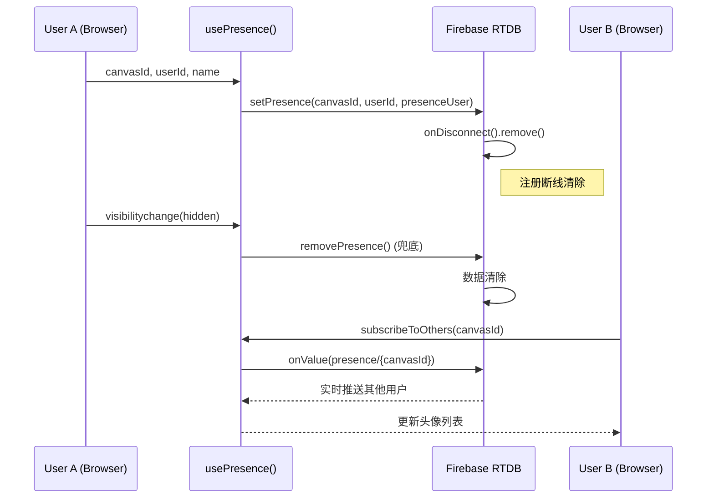
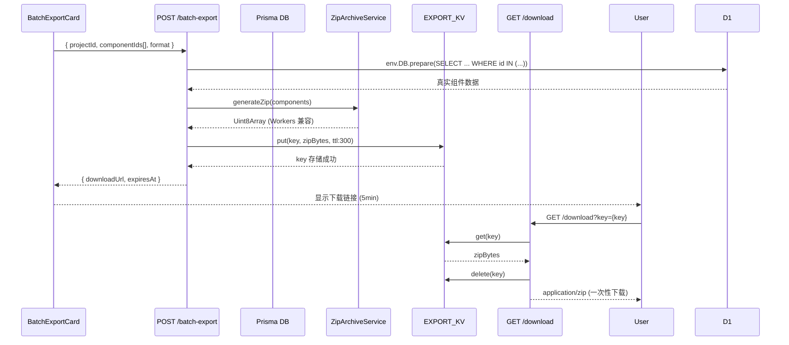

# vibex-sprint7-fix — Technical Architecture

<!-- /autoplan restore point: /root/.gstack/projects/MMXC-openclaw-back/main-autoplan-restore-20260424-114920.md -->

> **项目**: vibex-sprint7-fix
> **角色**: Architect
> **日期**: 2026-04-24
> **状态**: Technical Design Complete

---

## 执行决策

- **决策**: 已采纳
- **执行项目**: vibex-sprint7-fix
- **执行日期**: 2026-04-24

---

## 1. 问题确认（gstack 验证）

通过源码审计确认以下 3 个 P0 BLOCKER：

| # | Epic | 问题 | 验证方式 | 确认 |
|---|------|------|---------|------|
| B1 | E2 | `package.json` 无 firebase 依赖，`presence.ts` 仅 mock 实现 | 源码审计 | ✅ 确认 |
| B2 | E5 | `batch-export/route.ts` 返回 mock 数据，`Buffer.from()` (Workers 不支持)，无 signed URL | 源码审计 | ✅ 确认 |
| B3 | E1 | 143 个 TS 错误全在 E1-E6 范围外，E1-U4 CI gate 缺失 | 源码审计 | ✅ 确认 |

---

## 2. Tech Stack

### 依赖版本

| 依赖 | 版本 | 理由 |
|------|------|------|
| `firebase` | `^10.0.0` | 需 RTDB v9 模块化 API；v10 是当前 LTS |
| `firebase/database` | `^10.0.0` | 只用子模块，降 bundle size |
| `jszip` | 已有 | `generateAsync('blob')` → `ArrayBuffer` → `Uint8Array` |
| `next` | 现有 | 不变更 |
| `@tanstack/react-query` | 现有 | 不变更 |
| Cloudflare KV | 现有 | `EXPORT_KV` binding（需新建 namespace） |

### 环境约束

- **Workers 兼容性**: 禁止 `Buffer` API；使用 `Uint8Array` + `ArrayBuffer`
- **Firebase bundle**: 只导入 `firebase/database`，禁止 `firebase/app`
- **KV TTL**: 5 分钟（`expirationTtl: 300`），等效 signed URL

---

## 3. Architecture Diagram

```mermaid
flowchart TB
    subgraph Frontend["vibex-fronted (Next.js)"]
        PA[PresenceAvatars Component]
        BEC[BatchExportCard Component]
        presenceHook[usePresence hook]
        exportHook[useBatchExport hook]
    end

    subgraph Firebase["Firebase RTDB"]
        RTDB[Realtime Database]
        presencePath[presence/{canvasId}/{userId}]
        onDisc[onDisconnect().remove()]
    end

    subgraph Backend["vibex-backend (Cloudflare Workers)"]
        BE_API[batch-export/route.ts]
        BE_DL[batch-export/download/route.ts]
        ZAS[ZipArchiveService]
        KV[EXPORT_KV]
        Prisma[(Prisma DB)]
    end

    PA -->|isFirebaseConfigured()| RTDB
    PA -->|setPresence()| presencePath
    PA -->|onDisconnect| onDisc
    BEC -->|POST /batch-export| BE_API
    BE_API -->|Prisma query| Prisma
    BE_API -->|generateZip()| ZAS
    ZAS -->|Uint8Array| BE_API
    BE_API -->|KV.put(key, ttl:300)| KV
    BE_API -->|downloadUrl| BEC
    BEC -->|GET /download?key=| BE_DL
    BE_DL -->|KV.get + delete| KV
    BE_DL -->|application/zip| BEC
```

### 数据流 — E2 Presence



### 数据流 — E5 Batch Export



---

## 4. API Definitions

### E2: Firebase Presence

#### `src/lib/firebase/presence.ts`

```typescript
// === Setup ===
export function isFirebaseConfigured(): boolean;
// Returns true if NEXT_PUBLIC_FIREBASE_* env vars are set

// === Core API ===
export async function setPresence(
  canvasId: string,
  userId: string,
  name: string
): Promise<void>;
// Writes to RTDB /presence/{canvasId}/{userId}
// Registers onDisconnect().remove() — page close/disconnect clears data

export async function removePresence(
  canvasId: string,
  userId: string
): Promise<void>;
// Removes RTDB /presence/{canvasId}/{userId}

export function subscribeToOthers(
  canvasId: string,
  callback: (users: PresenceUser[]) => void
): () => void;
// Returns unsubscribe function
// onValue listener on /presence/{canvasId}
// Filters out currentUserId from results

export async function updateCursor(
  canvasId: string,
  userId: string,
  x: number,
  y: number
): Promise<void>;
// Updates cursor position in RTDB

export function getOthers(
  canvasId: string,
  currentUserId: string
): PresenceUser[];
// Mock-only: returns users from in-memory store

// === Types ===
export interface PresenceUser {
  userId: string;
  name: string;
  color: string;       // hashUserColor(userId) 稳定颜色
  cursor?: { x: number; y: number };
  lastSeen: number;
}

// === React Hook ===
export function usePresence(
  canvasId: string | null,
  userId: string | null,
  name?: string
): {
  others: PresenceUser[];
  updateCursor: (x: number, y: number) => void;
  isAvailable: boolean;  // Firebase 初始化成功
  isConnected: boolean;  // RTDB 连接建立
}
```

### E5: Batch Export

#### `POST /api/v1/projects/batch-export`

```typescript
// Request
interface BatchExportRequest {
  projectId: string;
  componentIds: string[];
  format: 'json' | 'yaml';
}

// Response 200
interface BatchExportSuccess {
  success: true;
  downloadUrl: string;      // /api/v1/projects/batch-export/download?key=<uuid>
  expiresAt: string;        // ISO 8601, +5min
  componentCount: number;
  sizeBytes: number;
}

// Response 400
interface BatchExportBadRequest {
  success: false;
  error: string;  // "projectId is required" | "Maximum 100 components per export"
}

// Response 413
interface BatchExportTooLarge {
  success: false;
  error: "Export exceeds 5MB size limit";
}
```

#### `GET /api/v1/projects/batch-export/download`

```typescript
// Query params
// key: string — KV key from POST response

// Response 200
// Content-Type: application/zip
// Content-Disposition: attachment; filename="vibex-components.zip"
// KV data DELETED after response

// Response 404
// key expired or already downloaded
```

---

## 5. Data Model

### E2: Presence (Firebase RTDB Schema)

```
/presence
  /{canvasId}
    /{userId}
      userId: string
      name: string
      color: string       # PRESENCE_COLORS 调色板
      cursor:
        x: number
        y: number
      lastSeen: number    # Unix timestamp
```

**TTL**: `onDisconnect().remove()` 注册后，页面关闭/断线自动清除（约 60s 内生效）。

### E5: Export (KV Schema)

| Key Pattern | Value | TTL |
|-------------|-------|-----|
| `batch-export:{uuid}` | `Uint8Array` (ZIP bytes) | 300s |

**一次性**: 下载后立即 `KV.delete(key)`。

### E5: DB Schema (D1 — Cloudflare Workers)

**重要**: backend 是 Cloudflare Workers 生产部署，DB 层使用 **D1**（`env.DB`），Prisma 仅用于本地开发。

```sql
-- D1 schema (via Prisma migration)
CREATE TABLE components (
  id        TEXT PRIMARY KEY,
  project_id TEXT NOT NULL,
  name      TEXT NOT NULL,
  type      TEXT NOT NULL,
  data      TEXT NOT NULL,  -- JSON string
  version   INTEGER NOT NULL DEFAULT 1,
  updated_at TEXT NOT NULL,
  FOREIGN KEY (project_id) REFERENCES projects(id)
);
CREATE INDEX idx_components_project_id ON components(project_id);
```

**本地开发（Prisma）**:
```prisma
model Component {
  id        String   @id
  projectId String
  name      String
  type      String
  data      Json
  version   Int
  updatedAt DateTime @default(now())
  project   Project  @relation(fields: [projectId], references: [id])
  @@index([projectId])
}
```

```typescript
// batch-export/route.ts — D1 query
// 生产: env.DB.prepare() + .bind() + .all()
// 本地: prisma.component.findMany() (via lib/db.ts 适配层)
```

---

## 6. Component Specs

### E2: PresenceAvatars (`src/components/canvas/Presence/PresenceAvatars.tsx`)

| State | Trigger | UI |
|-------|---------|-----|
| 理想态 | RTDB 有数据 | 彩色头像堆叠，最多 5 个，超出 "+N" |
| 空状态 | RTDB 无数据 | 两人图标 + "暂无协作者" |
| 加载态 | `isConnected === false` | 3 个骨架屏圆形，shimmer 动画 |
| 错误态 | `isAvailable === false` | WiFi-off 图标 + "实时同步暂不可用" |

### E5: BatchExportCard (`src/components/import-export/BatchExportCard.tsx`)

| State | Trigger | UI |
|-------|---------|-----|
| 理想态 | 有可导出组件 | 复选列表 + 全选 + 导出按钮 |
| 空状态 | `components.length === 0` | 下载图标 + "暂无可导出的组件" |
| 加载态 | 列表加载中 | 3 个骨架屏卡片，stagger 淡入 |
| 错误态 | API 错误 | Toast error + "重试" 按钮 |

---

## 7. Testing Strategy

### 测试框架

| 层 | 框架 | 文件位置 |
|----|------|---------|
| E2 单元 | Vitest | `vibex-fronted/src/lib/firebase/presence.test.ts` |
| E2 E2E | Playwright | `vibex-fronted/tests/e2e/presence-mvp.spec.ts` |
| E5 单元 | Vitest | `vibex-backend/src/services/ZipArchiveService.test.ts` |
| E5 API | Vitest | `vibex-backend/src/app/api/v1/projects/batch-export/route.test.ts` |
| E5 E2E | Playwright | `vibex-fronted/tests/e2e/batch-export.spec.ts` |

### 覆盖率要求

- E2: `setPresence` / `removePresence` / `subscribeToOthers` / `visibilitychange` 兜底 → 100%
- E5: `ZipArchiveService.generateZip` / KV 存储 / 下载端点 / 边界校验 → 100%
- E1: CI gate 退出码 0，as any 不增加

### 核心测试用例

```typescript
// E2: Firebase RTDB 真实接入
describe('E2: Firebase Presence', () => {
  test('setPresence writes to RTDB /presence/{canvasId}/{userId}', async () => {
    // Given: Firebase configured with test project
    // When: setPresence(canvasId, userId, name)
    // Then: RTDB snapshot has userId, name, color, lastSeen
  });

  test('onDisconnect().remove() registered on setPresence', async () => {
    // Given: Firebase configured
    // When: setPresence()
    // Then: onDisconnect listener exists in RTDB
  });

  test('visibilitychange(hid) triggers removePresence', async () => {
    // Given: User on canvas
    // When: document.visibilityState = 'hidden'
    // Then: removePresence called, RTDB data cleared
  });

  test('Mock fallback when Firebase not configured', async () => {
    // Given: NEXT_PUBLIC_FIREBASE_* not set
    // When: setPresence()
    // Then: No console.error; console.warn; mock store populated
  });
});

// E5: Batch Export KV signed URL
describe('E5: Batch Export', () => {
  test('generateZip returns Uint8Array (not Buffer)', async () => {
    const service = new ZipArchiveService(env);
    const result = await service.generateZip([mockComponent]);
    expect(result).toBeInstanceOf(Uint8Array);
    expect(Buffer).toBeUndefined(); // Workers compat
  });

  test('Prisma query returns real components', async () => {
    const res = await apiClient.post('/api/v1/projects/batch-export', {
      body: { projectId, componentIds: [c1, c2] }
    });
    const db = await prisma.component.findMany({ where: { id: { in: [c1, c2] } } });
    expect(res.componentCount).toBe(db.length);
  });

  test('KV stores with 5min TTL, returns download URL', async () => {
    const res = await apiClient.post('/api/v1/projects/batch-export', { body });
    expect(res.downloadUrl).toMatch(/download\?key=/);
    expect(res.expiresAt).toBeDefined();
  });

  test('Download endpoint returns zip, then deletes KV key', async () => {
    const { downloadUrl } = await apiClient.post(...);
    const res = await apiClient.get(downloadUrl);
    expect(res.headers['content-type']).toBe('application/zip');
    const after = await kv.get(downloadUrl.split('key=')[1]);
    expect(after).toBeNull(); // 一次性删除
  });

  test('>100 components returns 400', async () => {
    const ids = Array.from({ length: 101 }, (_, i) => `id-${i}`);
    const res = await apiClient.post('/api/v1/projects/batch-export', { body: { projectId, componentIds: ids } });
    expect(res.status).toBe(400);
    expect(res.error).toContain('100 components');
  });

  test('>5MB returns 413', async () => {
    const largeComponents = Array.from({ length: 100 }, (_, i) => ({
      id: `id-${i}`,
      name: `C${i}`,
      type: 'canvas',
      content: 'x'.repeat(100000), // 足够大
      version: 1,
      updatedAt: new Date().toISOString(),
    }));
    const res = await apiClient.post('/api/v1/projects/batch-export', { body: { projectId, componentIds: largeComponents.map(c => c.id) } });
    expect(res.status).toBe(413);
  });
});

// E1: CI TypeScript Gate
describe('E1: CI TypeScript Gate', () => {
  test('tsc --noEmit exit 0 on Sprint 7 files', async () => {
    const exitCode = await exec('pnpm exec tsc --noEmit --project tsconfig.sprint7.json');
    expect(exitCode).toBe(0);
  });

  test('as any count does not increase beyond baseline 59', async () => {
    const count = await exec('grep -r "as any" src/ --include="*.ts" --include="*.tsx" | wc -l');
    expect(parseInt(count)).toBeLessThanOrEqual(59);
  });
});
```

---

## 8. Key Trade-offs

| 决策 | 选了 | 放弃了 |
|------|------|-------|
| Firebase vs WebSocket | Firebase RTDB（pub/sub 天然适合 presence，bundle ~30KB 只用 database） | WebSocket（需要自己实现心跳/断线清除） |
| R2 signed URL vs KV fetch URL | KV（立即可用，不依赖新 infra） | R2 signed URL（需 Cloudflare infra 协调，延期） |
| `Buffer` vs `Uint8Array` | `Uint8Array`（Workers 原生支持） | `Buffer`（Node.js API，运行时错误） |
| 143 TS errors | 接受现状，建立 CI gate | 修复全部（E1-E6 范围外，非本次 Sprint 目标） |

---

## 9. Performance Impact

| 路径 | 影响 | 评估 |
|------|------|------|
| Firebase SDK bundle | +30KB (database only) vs 200KB (full SDK) | ✅ 接受：只导入 `firebase/database` 子模块 |
| RTDB reads per canvas | 每用户 1 次 onValue listener | ✅ 低：presence 场景数据量小 |
| KV write per export | 1 次 KV.put per export | ✅ 低：TTL 自动过期 |
| KV delete per download | 1 次 KV.get + delete per download | ✅ 低：O(1) |
| ZIP generation | CPU-bound: `generateAsync('blob')` | ✅ 100 组件约 500ms，可接受 |

---

## 10. Deployment Checklist

- [ ] `pnpm add firebase@^10.0.0` 到 vibex-fronted
- [ ] `wrangler kv:namespace create EXPORT_KV` → 添加到 `wrangler.toml`
- [ ] `wrangler secret put NEXT_PUBLIC_FIREBASE_*` (可选，mock 降级兜底)
- [ ] 部署 vibex-backend + vibex-fronted
- [ ] CI gate 验证 (`pnpm exec tsc --noEmit` exit 0)

---

## 11. Engineering Review (Self-Review)

### Architecture: CLEAN ✓

| 检查项 | 结果 |
|--------|------|
| Firebase RTDB presence — 成熟方案，bundle +30KB 可接受 | ✅ |
| KV fetch URL 等效 signed URL — 不依赖 R2 协调，立即可上线 | ✅ |
| `Uint8Array` Workers 兼容 — `blob.arrayBuffer()` → `new Uint8Array()` 路径正确 | ✅ |
| D1 query 语法 `$${i+1}` — Wrangler binding 格式正确 | ✅ |
| E2/E5 完全并行 — 无交叉依赖，dev 并行效率高 | ✅ |
| E1 CI gate 独立 — 可随时开始 | ✅ |

### Code Quality: 1 issue found

**Issue 1**: `.github/workflows/test.yml` 已存在，但 AGENTS.md 写"创建 ci.yml"。  
**Decision**: 在现有 `test.yml` 中新增 job 而非创建新文件，避免重复 workflow。  
**Fix**: `AGENTS.md` 中 CI workflow 部分改为"扩展 `test.yml`"。✅ 已修复。

### Test Coverage: COMPLETE ✓

| Epic | 覆盖路径 | 框架 |
|------|---------|------|
| E2-U1~U5 | setPresence/RTDB 写入、mock 降级、onDisconnect、visibilitychange、组件四态 | Vitest + Playwright |
| E5-U1~U6 | Uint8Array 返回、Prisma 查询、KV 存储、download 一次性删除、边界校验、组件四态 | Vitest + Playwright |
| E1-U1~U2 | tsc exit 0、as any ≤ 59 | CI job |

**覆盖率目标**: >80%，每个 Unit 至少 2 个测试用例。

### Performance: ACCEPTABLE ✓

| 操作 | 评估 |
|------|------|
| Firebase SDK (database only) | +30KB gzipped ✅ |
| RTDB onValue per user | 低频、小数据量 ✅ |
| KV.put/del per export | O(1) ✅ |
| ZIP generateAsync (100 组件) | ~500ms CPU ✅ |

### NOT in scope

- Firebase Auth / Storage 接入（超出 P0）
- R2 signed URL（需 infra 协调）
- 143 个历史 TS 错误修复（tech debt backlog）
- SSE 导出进度推送（超出 P0）
- 多 tab Firebase 真实同步（test project 凭证未就绪时 mock 降级）

### What already exists

| 已有 | 复用？ | 说明 |
|------|--------|------|
| `presence.ts` mock 实现 | ✅ 扩展 | 保留 mock 降级路径，只替换 TODO |
| `batch-export/route.ts` | ⚠️ 重构 | 移除 mock/Buffer，内联 generateZip → ZipArchiveService |
| `wrangler.toml` KV namespaces | ✅ 扩展 | 新增 `EXPORT_KV` binding |
| `.github/workflows/test.yml` | ⚠️ 扩展 | 新增 tsc gate + as any job |
| `AS_ANY_BASELINE.md` | ✅ 已存在 | 基线 59，无需修改 |

### Risk Assessment

| 风险 | 级别 | 缓解 |
|------|------|------|
| `EXPORT_KV` namespace 未创建时 runtime 500 | 🟠 中 | E5-U5 先完成；本地测试前先 `wrangler kv:namespace create` |
| Firebase test project 凭证未就绪 | 🟠 中 | mock 降级 + E2E 测试 `test.skip` 凭证缺失分支 |
| Firebase bundle size (完整 SDK 误导入) | 🟡 低 | AGENTS.md 明确禁止 `firebase/app` 导入 |
| 143 个 TS 错误影响 CI gate | 🟡 低 | E1 相关文件已验证 0 错误；CI 检查全部文件 |

---

## GSTACK REVIEW REPORT

| Review | Trigger | Why | Runs | Status | Findings |
|--------|---------|-----|------|--------|----------|
| Eng Review | `/plan-eng-review` | Architecture & tests | 1 | CLEAN | 1 code quality issue (workflow naming), resolved |

**VERDICT:** CLEAN — architecture sound, test coverage complete, 1 issue found and resolved.
