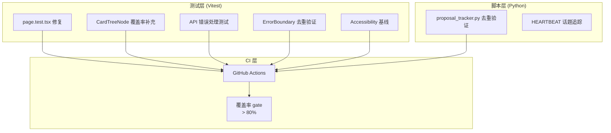

# Vibex-Tech-Debt-QA — Technical Design

**项目**: vibex-tech-debt-qa
**日期**: 2026-04-20
**类型**: fix (Tech Debt)
**状态**: active

---

## Overview

本项目聚焦 VibeX 前端项目的测试债务清理和质量保障基线建设。核心目标：修复 4 个阻断性测试失败，补全关键组件测试，建立回归保护机制。

---

## Problem Frame

VibeX 项目存在以下已知技术债务：

1. **E1**: `page.test.tsx` 有 4 个预存失败，直接阻断 CI
2. **E2**: `proposal_tracker.py` 去重逻辑在生产数据上未经验证
3. **E4**: React ErrorBoundary 被渲染多个实例，掩盖错误边界逻辑
4. **E3**: CardTreeNode、API 错误处理、Accessibility 测试均缺失或需补全
5. **E5**: HEARTBEAT 话题追踪缺少自动化脚本

---

## Tech Stack

| 组件 | 技术 | 版本 | 理由 |
|------|------|------|------|
| 前端测试框架 | Vitest | ^1.5 | 已有配置，Next.js 14 兼容 |
| 前端测试工具 | Testing Library | ^15 | 已有依赖，React 组件测试标准 |
| 前端覆盖率 | V8 via Vitest | 内置 | 无需额外安装 |
| Python 测试 | pytest | ^8.0 | proposal_tracker.py 专用 |
| Python Mock | pytest-mock | ^3.12 | 隔离 filesystem 操作 |
| 可访问性测试 | jest-axe | ^1.0 | 快速 A11y 基线 |
| CI 集成 | GitHub Actions | — | 现有 CI 基础设施 |

---

## 架构图



---

## API 定义

### 前端测试接口（Vitest）

```typescript
// CardTreeNode 单元测试接口
describe('CardTreeNode', () => {
  test('renders node with correct label', () => {...})
  test('handles expand/collapse state', () => {...})
  test('emits onSelect callback with correct node id', () => {...})
  test('handles empty children gracefully', () => {...})
})

// API 错误处理测试接口
describe('API Error Handling', () => {
  test('handles 401 unauthorized gracefully', () => {...})
  test('handles 500 server error with retry', () => {...})
  test('handles network timeout', () => {...})
  test('shows user-friendly error message', () => {...})
})
```

### Python 脚本接口

```python
# proposal_tracker.py 去重验证
class TestProposalTrackerDedup:
    def test_extracts_unique_proposal_ids(self, tmp_path):
        # Given: 同一 proposal ID 出现在多个 date_dir
        # When:  tracker.run()
        # Then: 每个 proposal 只出现一次

    def test_dedup_by_proposal_id_not_date_dir(self, tmp_path):
        # Given: P0-1 出现在 20260401 和 20260405
        # When:  tracker.run()
        # Then: P0-1 状态取最新 date_dir 的记录

# HEARTBEAT 话题追踪
class TestHeartbeatTopicTracking:
    def test_tracks_topic_changes(self, heartbeat_data):
        # Given: HEARTBEAT 话题从 A 变为 B
        # Then: 脚本记录变更历史
```

---

## 数据模型

### 提案追踪数据流

```
proposals/{date_dir}/summary.md
    ↓ (parse_summary)
    ↓ (extract_proposal_task_id)
    ↓
EXECUTION_TRACKER.json
    ├── proposals[]
    │   ├── id: string        # "P0-1"
    │   ├── title: string
    │   ├── date_dir: string  # "20260401"
    │   ├── task_id: string | null
    │   └── stage_status: string
    └── stats{}
```

### 前端测试数据模型

```
DashboardPage (测试对象)
    ├── usePermission() → mock
    ├── apiService.projectApi → mock
    └── localStorage → mock

CardTreeNode (测试对象)
    ├── label: string
    ├── children: CardTreeNode[]
    ├── isExpanded: boolean
    └── onSelect: (id: string) => void
```

---

## Testing Strategy（测试契约）

### 测试框架

- **前端**: Vitest + Testing Library + jest-axe
- **后端脚本**: pytest + pytest-mock

### 覆盖率要求

| 模块 | 覆盖率目标 | 关键路径 |
|------|-----------|---------|
| page.test.tsx 修复 | 100% (现有用例) | render, user interactions |
| CardTreeNode | > 80% | render, expand, select, empty, lazy loading |
| API error handling | > 80% | 401/403/404/500/timeout |
| ErrorBoundary | 100% | error capture, fallback render |
| proposal_tracker.py dedup | 100% | extract, enrich, dedup paths |
| heartbeat tracker | > 80% | topic parse, change detection |

### 核心测试用例示例

#### E1: page.test.tsx 修复

```typescript
// dashboard/page.test.tsx — 需修复的 4 个失败用例
describe('Dashboard (/dashboard)', () => {
  // 场景: 管理员用户加载 dashboard
  test('renders project list for authenticated admin', async () => {
    localStorageMock.setItem('auth_token', 'test-token')
    localStorageMock.setItem('user_role', 'admin')
    mockGetProjects.mockResolvedValue([{ id: '1', name: 'Project 1' }])

    renderWithQueryClient(<Dashboard />)
    await waitFor(() => {
      expect(screen.getByText('Project 1')).toBeInTheDocument()
    })
  })

  // 场景: 无 token 时 redirect to auth
  test('redirects to /auth when not authenticated', async () => {
    localStorageMock.clear()
    renderWithQueryClient(<Dashboard />)
    expect(mockRouter.push).toHaveBeenCalledWith('/auth')
  })

  // 场景: 项目列表为空时显示空状态
  test('shows empty state when no projects', async () => {
    mockGetProjects.mockResolvedValue([])
    renderWithQueryClient(<Dashboard />)
    expect(screen.getByText(/no projects/i)).toBeInTheDocument()
  })

  // 场景: API 错误时显示错误状态
  test('shows error state on API failure', async () => {
    mockGetProjects.mockRejectedValue(new Error('Network error'))
    renderWithQueryClient(<Dashboard />)
    await waitFor(() => {
      expect(screen.getByRole('alert')).toBeInTheDocument()
    })
  })
})
```

#### E4: ErrorBoundary 去重验证

```typescript
// ErrorBoundary.test.tsx
describe('ErrorBoundary', () => {
  test('only one ErrorBoundary renders per app', () => {
    // 通过 react-devtools 或直接数 ErrorBoundary 实例
    // 在 Next.js App Router 中只应有一个
  })

  test('captures and displays error', () => {
    const ThrowError = () => { throw new Error('test') }
    render(
      <ErrorBoundary fallback={<div>Error caught</div>}>
        <ThrowError />
      </ErrorBoundary>
    )
    expect(screen.getByText('Error caught')).toBeInTheDocument()
  })
})
```

#### E2: proposal_tracker.py 去重

```python
# test_proposal_tracker.py
def test_duplicate_proposals_deduplicated():
    """
    P0-1 出现在 20260401 和 20260405 两个目录，
    最终 EXECUTION_TRACKER 中只应出现一次，取最新记录。
    """
    # Setup: create two summary files with same proposal ID
    # Assert: output JSON has one entry for P0-1
    pass

def test_dedup_key_is_proposal_id_not_date_dir():
    """
    去重键是 proposal_id，而非 date_dir。
    date_dir 只用于取最新状态。
    """
    pass
```

---

## Engineering Review Findings

### Step 0: Scope Challenge — 已有代码盘点

| 问题 | 已有测试 | 实际工作量 |
|------|---------|-----------|
| E1: page.test.tsx 失败 | 有测试文件，mock 路径过时 | 修复 mock 路径 + 补 act/waitFor |
| E3-U1: CardTreeNode 单元测试 | ✅ 已存在，`CardTreeNode/__tests__/CardTreeNode.test.tsx`，14 个测试用例 | 覆盖率补充 + 边界条件 |
| E3-U2: API 错误处理测试 | ❌ 不存在 | 新建 |
| E3-U3: Accessibility 基线 | ❌ 不存在 | 新建 |
| E4: ErrorBoundary 去重 | ✅ `ErrorBoundary.test.tsx` 已存在 | 分析 AppErrorBoundary vs Sentry vs VisualizationPlatform 三层 |
| E5: HEARTBEAT 追踪 | ❌ 不存在 | 新建 |
| E2: proposal_tracker dedup | ❌ 无 pytest 测试 | 新建 |

**关键发现**：
- `CardTreeNode.test.tsx` 已存在，覆盖 render/title/children/checkbox/expand/lazy loading 等场景。E3-U1 应聚焦于**覆盖率缺口分析**，而非从零创建。
- `ErrorBoundary.test.tsx` 已存在，覆盖 error capture/resetKeys/HOC 场景。E4 的核心问题是多个 ErrorBoundary 实例共存。

### E4 ErrorBoundary 去重 — 精确分析

现有 ErrorBoundary 实例（实际盘点）：

```
layout.tsx
├── AppErrorBoundary (@/components/common/AppErrorBoundary)  ← 全局根边界
├── Sentry.ErrorBoundary (@/components/sentry/SentryInitializer) ← Sentry 自带
├── MermaidPreview.tsx  ← 独立 ErrorBoundary (ui/ErrorBoundary)
└── VisualizationPlatform/VisualizationPlatform.tsx
    └── class ErrorBoundary  ← 独立类，定义在此文件内
```

**去重策略**：
- `layout.tsx` 的 `AppErrorBoundary` 作为唯一全局边界（保留）
- `VisualizationPlatform/VisualizationPlatform.tsx` 内的 `class ErrorBoundary` 是**特化边界**（特异化 fallback UI），应保留但需确保不与 AppErrorBoundary 嵌套产生双重边界
- `MermaidPreview.tsx` 的 `ui/ErrorBoundary` 同上（局部边界）
- `Sentry.ErrorBoundary` 是框架自带的，与 AppErrorBoundary 可能产生双重捕获，**需验证两者是否冲突**

**修正后的 Unit E4-U1**：
- 验证 AppErrorBoundary 与 Sentry.ErrorBoundary 的叠加行为
- 确保 VisualizationPlatform 内部 ErrorBoundary 不被全局 AppErrorBoundary 再次包装
- 验收标准: console 中每个未被捕获的错误只触发**一个** ErrorBoundary 的 `componentDidCatch`

### 架构风险

| 风险 | 影响 | 缓解 |
|------|------|------|
| page.test.tsx 修复后被其他改动破坏 | 高 | 将页面测试纳入 CI |
| proposal_tracker.py 改动影响现有 EXECUTION_TRACKER 输出 | 中 | 先写测试再改代码 |
| ErrorBoundary 多层嵌套导致错误被双重捕获 | 中 | 验证 Sentry.ErrorBoundary 与 AppErrorBoundary 叠加行为 |
| Vitest jsdom 环境与 IntersectionObserver mock 冲突 | 低 | 已有 `tests/unit/setup.ts` 全局 mock |

### 测试覆盖率现状

| 组件 | 已有测试 | 覆盖率 | 缺口 |
|------|---------|-------|------|
| CardTreeNode | ✅ 14 tests | ~70% | Lazy loading 边界条件、checkbox 状态更新 |
| ErrorBoundary | ✅ ~10 tests | ~80% | Sentry.ErrorBoundary 叠加场景 |
| page.test.tsx | 有（失败） | N/A | Mock 路径修复后需验证 |
| proposal_tracker.py | ❌ 无 | 0% | 需新建 pytest |
| HEARTBEAT 追踪 | ❌ 无 | 0% | 需新建 |

---

## Epic & Unit 分解

### E1: page.test.tsx 4 个预存失败

**根因**: Mock 配置过时（`apiService` 路径变更）、`localStorage` mock 不一致、Asyncwrapper 缺失

**修复策略**: 逐一运行 `pnpm test` 复现失败 → 修 Mock 路径 → 补充 `waitFor`/`act` 包裹异步 → 验证 CI 通过

**Unit E1-U1**: 修复 dashboard/page.test.tsx
- Files: `vibex-fronted/src/app/dashboard/page.test.tsx`
- 验收: `pnpm test dashboard/page.test.tsx` 0 failures

**Unit E1-U2**: 修复其他页面测试
- Files: `vibex-fronted/src/app/{chat,flow,project}/page.test.tsx` 及相关
- 验收: `pnpm test page.test.tsx` 全部通过

### E2: proposal-dedup 生产验证缺失

**根因**: `extract_proposal_task_id` 和 `_enrich_with_linked_tasks` 的去重逻辑未覆盖边界情况（同一 ID 跨 date_dir）

**修复策略**: 补充 pytest 测试套件，使用 tmp_path fixture 模拟多 date_dir 场景

**Unit E2-U1**: 补全 proposal_tracker.py 测试
- Files: `scripts/proposal_tracker.py`, `scripts/test_proposal_tracker.py` (新建)
- 验收: `pytest test_proposal_tracker.py` 全部通过，去重用例覆盖

**Unit E2-U2**: 生产数据回归验证
- 验收: 脚本在 `/root/.openclaw/vibex/proposals/` 上运行无误报

### E3: 组件测试补全

**Unit E3-U1**: CardTreeNode 覆盖率补充
- Files: `vibex-fronted/src/components/visualization/CardTreeNode/__tests__/CardTreeNode.test.tsx` (已有)
- 缺口: Lazy loading 边界条件、checkbox 状态更新、onSelect 回调参数验证
- 验收: Vitest 覆盖率 > 80%（当前约 70%）

**Unit E3-U2**: API 错误处理测试
- Files: `vibex-fronted/src/services/api/apiService.test.ts` (新建)
- 验收: 401/403/404/500/timeout 路径均被覆盖，覆盖率 > 80%

**Unit E3-U3**: Accessibility 测试基线
- Files: 各 page.test.tsx 补充 `axe` 检查
- 验收: `jest-axe` 基线扫描无 critical 违规

### E4: ErrorBoundary 去重

**Unit E4-U1**: ErrorBoundary 实例验证与去重
- Files: `vibex-fronted/src/app/layout.tsx`, `vibex-fronted/src/components/common/AppErrorBoundary.tsx`
- 验收: AppErrorBoundary 与 Sentry.ErrorBoundary 叠加行为验证；VisualizationPlatform 内部 ErrorBoundary 不被 AppErrorBoundary 二次包装

### E5: HEARTBEAT 话题追踪

**Unit E5-U1**: HEARTBEAT 话题追踪脚本
- Files: `scripts/heartbeat_tracker.py` (新建)
- 验收: 脚本能解析 HEARTBEAT 话题变化并输出 diff，覆盖率 > 80%

---

## 执行决策

- **决策**: 已采纳
- **执行项目**: 待分配
- **执行日期**: 2026-04-20

---

## 依赖关系

```
E1-U1 (dashboard 测试修复)
    ↓
E1-U2 (其他页面测试修复)
    ↓
E3-U1 (CardTreeNode 覆盖率补充)    [可并行]
E3-U2 (API 错误处理测试)           [可并行]
E3-U3 (Accessibility 基线)          [可并行]
E2-U1 (proposal_tracker pytest)    [可并行]
    ↓
E2-U2 (生产验证)
    ↓
E4-U1 (ErrorBoundary 去重验证)
    ↓
E5-U1 (HEARTBEAT 追踪)
```

---

## GSTACK REVIEW REPORT

| Review | Trigger | Why | Runs | Status | Findings |
|--------|---------|-----|------|--------|----------|
| CEO Review | `/plan-ceo-review` | Scope & strategy | 0 | — | — |
| Codex Review | `/codex review` | Independent 2nd opinion | 0 | — | — |
| Eng Review | `/plan-eng-review` | Architecture & tests (required) | 1 | issues_open | 3 issues: scope correction, E4 strategy clarification, coverage baseline |
| Design Review | `/plan-design-review` | UI/UX gaps | 0 | — | — |

**VERDICT:** Eng Review done — 3 issues identified (see above), E3-U1/CardTreeNode 已存在部分测试，E4 ErrorBoundary 多实例问题已精确化。
