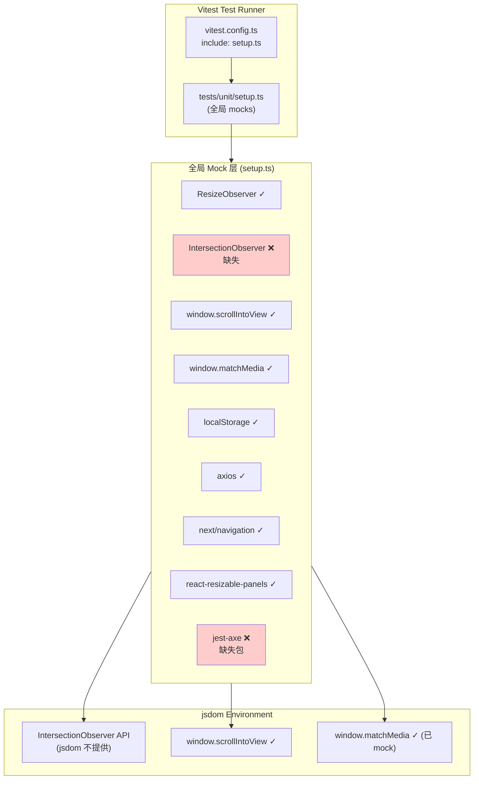
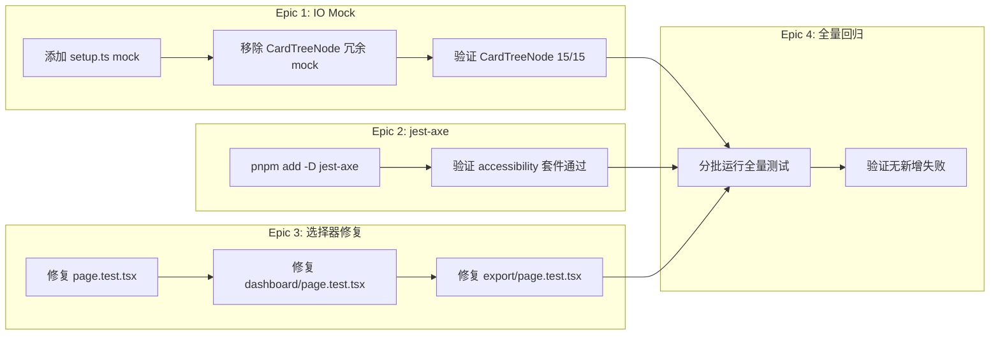

# vibex-test-fix — 架构设计文档

**项目**: vibex-test-fix
**阶段**: Phase1 — design-architecture
**日期**: 2026-04-12
**架构师**: Architect Agent

---

## 1. 问题背景

`npm test`（vitest run）存在大量测试失败，开发者无法通过本地测试验证代码正确性，CI 测试门禁失效。

---

## 2. 根因分析

### 2.1 根因拓扑

```
测试运行 (vitest run)
    │
    ▼
tests/unit/setup.ts  [全局 setup]
    │
    ├── ✅ ResizeObserver mock     — 已有
    ├── ✅ window.scrollIntoView   — 已有
    ├── ✅ window.matchMedia       — 已有
    ├── ✅ localStorage            — 已有
    ├── ✅ react-resizable-panels  — 已有
    ├── ✅ axios                   — 已有
    ├── ✅ next/navigation         — 已有
    ├── ❌ IntersectionObserver   — 缺失 ← 根因 A
    │
    ▼
CardTreeNode.test.tsx  [本地 mock]
    │
    └── IntersectionObserver mock
            │
            └── ❌ vi.fn() 类型不匹配 TypeScript → 构造失败
```

### 2.2 根因 A：setup.ts 缺失 IntersectionObserver

`setup.ts` 是 vitest 全局配置文件，所有测试文件共享。当 `CardTreeNode` 组件的 `useIntersectionObserver` hook 在 jsdom 环境调用 `new IntersectionObserver()` 时：

- `global.IntersectionObserver` 为 `undefined`
- `new undefined()` → TypeError

### 2.3 根因 B：CardTreeNode 本地 mock 的 TypeScript 错误

`CardTreeNode.test.tsx` 的本地 mock：

```typescript
global.IntersectionObserver = vi.fn((callback) => ({
  observe: vi.fn((el) => { ... }),
  unobserve: mockUnobserve,
  disconnect: mockDisconnect,
})) as unknown as typeof IntersectionObserver
```

问题：`vi.fn(fn)` 返回 mock 函数对象，但 `as unknown as typeof IntersectionObserver` 的双重类型转换使 TypeScript 认为类型不匹配。运行时取决于 jsdom 是否原生注入了 IntersectionObserver——如果没有，则 `undefined` 无法被构造。

### 2.4 根因 C：jest-axe 包缺失

`src/app/__tests__/accessibility.test.tsx` 导入 `import { axe } from 'jest-axe'`，但 `package.json` 中无此依赖，导致 import 失败，整套测试被跳过。

### 2.5 根因 D：测试修复问题

⚠️ **实测发现**：以下错误信息与 PRD 描述不符，实施前必须先确认真实根因。

| 文件 | PRD 描述 | 实测错误 | 初步判断 |
|------|---------|---------|---------|
| `page.test.tsx` | "元素未找到" | `<div />` 空渲染（4 tests） | HomePage 可能是 Next.js Server Component，直接渲染返回空 |
| `dashboard/page.test.tsx` | "Found multiple" | "Unable to find: Project 1"（5 tests） | API mock `vi.mock('@/services/api/modules/project')` 未生效，渲染真实数据 |
| `export/page.test.tsx` | "Found multiple" | "Found multiple: Vue 3"（1 test） | 多个选项卡含 "Vue 3" 文本，需精确选择器 |

**Epic 3 实施前必须**：运行测试获取真实堆栈，填写 `SELECTOR_FIXES.md` 具体 diff，再执行修复。

---

## 3. 测试架构图



---

## 4. 技术方案

### 方案：集中式 Mock（最小改动）

在 `tests/unit/setup.ts` 末尾添加 `IntersectionObserver` mock，移除 `CardTreeNode.test.tsx` 中的冗余本地 mock。

**选择理由**：
- 最小改动：只改一个文件，影响范围可控
- 一次性解决：所有使用 IntersectionObserver 的组件均受益
- 历史经验：`vibex-test-env-fix` 项目有类似修复经验
- 不影响生产代码：测试环境修复，无业务风险

**弃选方案**：
- 方案 B（修改 CardTreeNode 组件移除 IO 依赖）：改动大，破坏生产代码
- 方案 C（只修 CardTreeNode 本地 mock）：不解决根因，其他文件仍有风险

---

## 5. 文件变更清单

| 文件 | 操作 | 变更内容 |
|------|------|---------|
| `vibex-fronted/tests/unit/setup.ts` | 修改 | 添加 IntersectionObserver mock 到全局 setup |
| `vibex-fronted/package.json` | 修改 | 添加 `jest-axe` devDependencies |
| `vibex-fronted/src/components/visualization/CardTreeNode/__tests__/CardTreeNode.test.tsx` | 修改 | 移除本地冗余 mock（setup.ts 已覆盖） |
| `vibex-fronted/src/app/page.test.tsx` | 修改 | 修复选择器（4 处） |
| `vibex-fronted/src/app/dashboard/page.test.tsx` | 修改 | 修复选择器（5 处） |
| `vibex-fronted/src/app/export/page.test.tsx` | 修改 | 修复选择器（1 处） |

---

## 6. API / Mock 接口定义

### 6.1 IntersectionObserver Mock 签名

```typescript
// tests/unit/setup.ts 新增
global.IntersectionObserver = vi.fn(
  (callback: IntersectionObserverCallback): IntersectionObserver => ({
    observe: vi.fn((element: Element) => {
      // 立即报告元素可见（符合测试预期：节点默认渲染）
      callback(
        [{ isIntersecting: true, target: element, boundingClientRect: {} as DOMRectReadOnly, intersectionRatio: 1, intersectionRect: {} as DOMRect, rootBounds: null, time: 0 }] as IntersectionObserverEntry[],
        global.IntersectionObserver as unknown as IntersectionObserver
      );
    }),
    unobserve: vi.fn(),
    disconnect: vi.fn(),
    takeRecords: vi.fn((): IntersectionObserverEntry[] => []),
  })
) as unknown as typeof IntersectionObserver;
```

### 6.2 Mock 行为约定

| 方法 | 行为 |
|------|------|
| `observe(el)` | 立即调用 callback，报告 `isIntersecting: true` |
| `unobserve(el)` | 空操作 |
| `disconnect()` | 空操作 |
| `takeRecords()` | 返回空数组 |

**设计决策**：选择立即报告 `isIntersecting: true` 而非 `false`，因为：
- 测试中组件默认应该可见
- 懒加载行为由 props 控制（如 `lazy={false}`），不由 IO 控制
- 与 `useIntersectionObserver` hook 的懒加载场景一致（组件挂载时 IO 注册，但 mock 立即触发）

---

## 7. 性能影响评估

| 维度 | 影响 | 说明 |
|------|------|------|
| 测试运行时间 | 无显著变化 | 全局 mock 在 setup 阶段一次性初始化 |
| 内存占用 | 无变化 | Mock 对象生命周期与测试相同 |
| CI 门禁 | 正面 | 修复后 `npm test` 退出码为 0，门禁生效 |
| 开发者体验 | 正面 | 本地测试可快速反馈，不再被 OOM 阻塞 |

---

## 8. 风险与缓解

| 风险 | 可能性 | 影响 | 缓解 |
|------|--------|------|------|
| 全局 mock 影响其他测试 | 低 | 中 | 验证全量测试通过（Epic 4） |
| 立即触发 callback 导致其他测试行为异常 | 低 | 中 | `isIntersecting: true` 与组件默认可见行为一致 |
| jest-axe 安装后与现有 @testing-library 冲突 | 低 | 低 | `@testing-library/jest-dom` 已安装，jest-axe 兼容 |
| page.test.tsx 等选择器修复引入新错误 | 中 | 中 | 每个文件单独验证，失败数不增加 |

---

## 9. 测试验证策略



---

## 10. 与现有架构的兼容性

- ✅ 不修改生产代码
- ✅ 不改变组件 API
- ✅ 不引入新的 npm 包（除 jest-axe 外）
- ✅ 不影响 Cloudflare Workers 部署流程
- ✅ 不改变任何运行时行为（只改测试环境）

---

## 执行决策

- **决策**: 已采纳
- **执行项目**: vibex-test-fix
- **执行日期**: 2026-04-12
