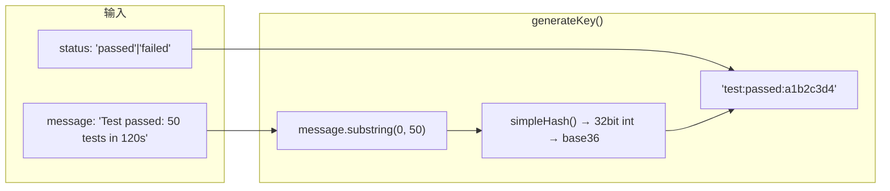
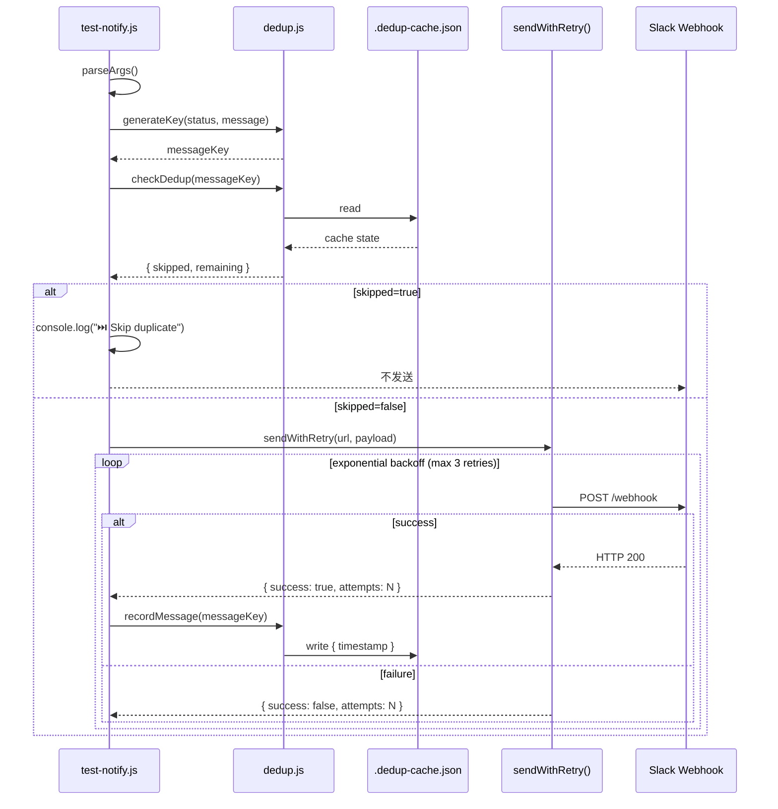

# Architecture: VibeX Test Notify 去重与统一

> **项目**: vibex-test-notify-20260405  
> **架构师**: architect  
> **日期**: 2026-04-05  
> **版本**: v1.0  
> **状态**: 已完成

---

## 1. 执行决策

- **决策**: 已采纳
- **执行项目**: vibex-test-notify-20260405
- **执行日期**: 2026-04-05

---

## 2. 问题背景

VibeX 有两套 `--notify` 实现，去重逻辑不统一：

| 实现 | 语言 | 去重 | 重试 | 超时 |
|------|------|------|------|------|
| `slack_notify_templates.py` | Python | ✅ 5 分钟窗口 | ✅ | ❌ |
| `test-notify.js` | Node.js | ❌ 无 | ❌ 无 | ❌ 无 |

**影响**: JS 版无去重 → CI 重试触发多次通知；无重试 → 瞬时网络抖动导致通知丢失；无超时 → 请求可能无限等待阻塞 CI。

---

## 3. Tech Stack

| 组件 | 技术选型 | 理由 |
|------|---------|------|
| **去重模块** | `dedup.js` (Node.js) | 移植 Python 逻辑，统一 JS/Python 去重语义 |
| **去重持久化** | `.dedup-cache.json` (文件) | 跨进程共享，与 Python 保持一致 |
| **重试** | 指数退避 (1s, 2s, 4s) | 避免重试风暴，与 Python 等效 |
| **超时** | `AbortController.timeout(5000)` | Node.js 18+ 原生支持，代码简洁 |
| **测试框架** | Jest (现有) | `vibex-fronted` 已使用 |
| **无新依赖** | 纯 Node.js 标准库 | 不引入额外 npm 包 |

**约束**:
- 不破坏现有 `test-notify.js` 的 Slack 消息格式
- 不修改 `slack_notify_templates.py` 的 Python 去重逻辑（已有，OK）
- 不引入新 npm 依赖

---

## 4. 架构图

### 4.1 组件关系

```mermaid
%%{ init: { "theme": "neutral" } }%%
flowchart TB
    subgraph CLI["CLI 入口"]
        T["test-notify.js\nparseArgs()"]
    end
    
    subgraph DedupLayer["去重层 (新增)"]
        DG["dedup.js"]
        DK["generateKey()\nsimpleHash(status + msg)"]
        DC["checkDedup()\n5min window"]
        DR["recordMessage()\nwrite .dedup-cache.json"]
        DF["readCache()\nread .dedup-cache.json"]
    end
    
    subgraph RetryLayer["重试层 (新增)"]
        SR["sendWithRetry()\nexponential backoff"]
        ST["AbortSignal.timeout(5000)"]
    end
    
    subgraph HTTP["HTTP 层 (改造)"]
        NW["fetch() / https.request"]
        WH["Slack Webhook\nhooks.slack.com"]
    end
    
    T --> DK
    DK --> DC
    DC --> DF
    DR --> DF
    DF -->|"write|read"| DC
    
    T --> DC
    DC -->|"skipped=true| skip"]
    DC -->|"skipped=false| SR
    SR --> ST
    SR --> NW
    NW --> WH
    
    subgraph CacheFile[".dedup-cache.json"]
        CF["{key: {timestamp: ms}}"]
    end
    
    DF -.-> CF
    DR -.-> CF
```

### 4.2 去重 Key 生成



---

## 5. API 定义

### 5.1 dedup.js 模块 API

```typescript
// dedup.js - 导出接口

/**
 * 生成去重 key
 * @param status - 'passed' | 'failed'
 * @param message - 完整消息文本
 * @returns string - 去重 key，格式: test:{status}:{hash36}
 */
function generateKey(status: string, message: string): string

/**
 * 检查消息是否应跳过
 * @param key - generateKey() 返回的 key
 * @returns { skipped: boolean, remaining: number } - remaining 为剩余秒数
 */
function checkDedup(key: string): { skipped: boolean; remaining: number }

/**
 * 记录已发送消息
 * @param key - generateKey() 返回的 key
 */
function recordMessage(key: string): void

/**
 * 清理过期缓存条目（自动调用）
 */
function cleanup(): void
```

### 5.2 test-notify.js 修改后的流程



### 5.3 sendWithRetry 签名

```typescript
interface RetryResult {
  success: boolean;
  attempts: number;
  lastError?: string;
}

async function sendWithRetry(
  webhookUrl: string,
  payload: object,
  options?: {
    maxAttempts?: number;        // default: 3
    timeoutMs?: number;          // default: 5000
    initialDelayMs?: number;     // default: 1000
  }
): Promise<RetryResult>
```

---

## 6. 数据模型

### 6.1 去重缓存文件

```jsonc
// .dedup-cache.json
{
  "test:passed:a1b2c3d4": { "timestamp": 1743806400000 },
  "test:failed:e5f6g7h8": { "timestamp": 1743806500000 }
  // 5 分钟前的条目自动清理
}
```

**存储位置**: `vibex-fronted/scripts/.dedup-cache.json`

**TTL**: 5 分钟（`_DEDUP_WINDOW_MS = 5 * 60 * 1000`）

**Key 格式**: `test:{status}:{hash36}`

### 6.2 CLI 参数 (不变)

```
node test-notify.js --status <passed|failed> --duration <time> --tests <n> [--errors <n>]
```

---

## 7. 模块设计

### 7.1 新建文件

| 文件 | 职责 | 依赖 |
|------|------|------|
| `vibex-fronted/scripts/dedup.js` | 去重核心逻辑 | fs, path, crypto (可选) |
| `vibex-fronted/scripts/__tests__/dedup.test.js` | 去重测试 | jest |
| `vibex-fronted/scripts/__tests__/retry.test.js` | 重试测试 | jest |

### 7.2 修改文件

| 文件 | 修改内容 |
|------|---------|
| `vibex-fronted/scripts/test-notify.js` | 集成 dedup + sendWithRetry |
| `vibex-fronted/scripts/README.md` | 新建 CI 集成文档 |

### 7.3 依赖关系

```
test-notify.js
├── generateKey() / checkDedup() / recordMessage()  ← dedup.js
└── sendWithRetry()                                 ← 内联（不拆分模块）

dedup.js
└── .dedup-cache.json (文件读写)
```

---

## 8. 技术审查

### 8.1 风险评估

| 风险 | 严重性 | 缓解措施 |
|------|--------|---------|
| `.dedup-cache.json` 并发写入冲突 | 低 | 使用 `fs.writeFileSync` 原子写；CI 场景并发概率极低 |
| 缓存文件损坏（JSON 解析失败）| 低 | try-catch 包裹，失败时删除文件重建 |
| 重试风暴压垮 Slack webhook | 低 | 指数退避 (1s→2s→4s) 控制频率 |
| Node.js 版本不支持 AbortController.timeout | 低 | Node.js 18+ 才使用；低版本回退到 setTimeout 兜底 |
| CI runner 重启后缓存丢失 | 低 | 预期行为；重启后从新开始去重，不影响功能 |

### 8.2 Python/JS 去重语义对照

| 维度 | Python | JS (本方案) | 对齐 |
|------|--------|------------|------|
| 去重窗口 | 5 分钟 | 5 分钟 | ✅ |
| Key 生成 | `task_id` 直接 | `status + simpleHash(msg)` | ✅ 等效 |
| 持久化 | `~/.openclaw/.../dedup.json` | `.dedup-cache.json` | ✅ 各自文件 |
| 过期清理 | 保存时清理 | 保存时清理 | ✅ |
| done/ready 不去重 | ✅ | N/A（test-notify 无此场景）| ✅ |

---

## 9. 测试策略

### 9.1 测试框架

- **单元测试**: Jest (现有 `vibex-fronted` 测试栈)

### 9.2 覆盖率要求

| 文件 | 覆盖率要求 |
|------|-----------|
| `dedup.js` | > 90% |
| `test-notify.js` | > 80% |

### 9.3 核心测试用例

```javascript
// dedup.test.js

describe('Dedup Module', () => {
  it('should return skipped=false for new message', () => {
    const result = checkDedup(generateKey('passed', 'test message'));
    expect(result.skipped).toBe(false);
    expect(result.remaining).toBe(0);
  });

  it('should return skipped=true within 5 minutes', () => {
    const key = generateKey('passed', '50 tests in 120s');
    recordMessage(key);
    const result = checkDedup(key);
    expect(result.skipped).toBe(true);
    expect(result.remaining).toBeGreaterThan(0);
    expect(result.remaining).toBeLessThanOrEqual(300);
  });

  it('should handle corrupted cache file gracefully', () => {
    fs.writeFileSync(CACHE_FILE, 'invalid json');
    expect(() => checkDedup('test:any')).not.toThrow();
  });
});

// retry.test.js

describe('Retry Logic', () => {
  it('should retry on failure with exponential backoff', async () => {
    let count = 0;
    global.fetch = async () => {
      count++;
      if (count < 3) throw new Error('network');
      return { ok: true };
    };

    const result = await sendWithRetry('https://hooks.slack.com/...', {});
    expect(result.success).toBe(true);
    expect(result.attempts).toBe(3);
  });

  it('should timeout after 5s without retrying', async () => {
    global.fetch = async () => {
      await new Promise(r => setTimeout(r, 10000));
      return { ok: true };
    };

    const start = Date.now();
    const result = await sendWithRetry('https://hooks.slack.com/...', {});
    expect(result.success).toBe(false);
    expect(Date.now() - start).toBeLessThan(6000);
  }, 10000);
});
```

---

## 10. 实施计划

| Phase | 内容 | 工时 | 产出 |
|-------|------|------|------|
| E1 | dedup.js 实现 + 集成 | 1h | `scripts/dedup.js` + 测试 |
| E2 | sendWithRetry + 集成 | 0.5h | `test-notify.js` 改造 |
| E3 | CI 集成文档 | 0.5h | `scripts/README.md` |

**并行度**: E1 独立；E2 依赖 E1；E3 独立

---

## 11. 验收标准

| ID | Given | When | Then |
|----|-------|------|------|
| AC1 | `node test-notify.js --status passed` | CI 环境 | Slack 收到绿色通知 |
| AC2 | 5 分钟内相同消息 | `checkDedup(key)` | `skipped: true, remaining: > 0` |
| AC3 | 进程重启 | 读取 `.dedup-cache.json` | 去重状态保持 |
| AC4 | webhook 失败 | 3 次重试后 | 记录日志，不抛异常 |
| AC5 | 网络慢 | webhook 请求 | 5s 超时，返回失败 |
| AC6 | `CI=true` | 自动启用通知 | AC1-AC5 自动执行 |

---

## 12. 验证命令

```bash
# 本地测试去重
cd vibex-fronted
node scripts/test-notify.js --status passed --duration 1s --tests 10
node scripts/test-notify.js --status passed --duration 1s --tests 10
# 第二次应该输出: ⏭️ Skip duplicate notification

# 本地测试重试
# 配置错误 webhook URL 触发重试
CI_NOTIFY_ENABLED=true CI_NOTIFY_WEBHOOK=https://invalid.example.com \
  node scripts/test-notify.js --status failed --duration 1s --tests 5 --errors 3

# 运行测试
pnpm test scripts/__tests__/dedup.test.js
pnpm test scripts/__tests__/retry.test.js
```

---

*文档版本: v1.0 | 最后更新: 2026-04-05*
