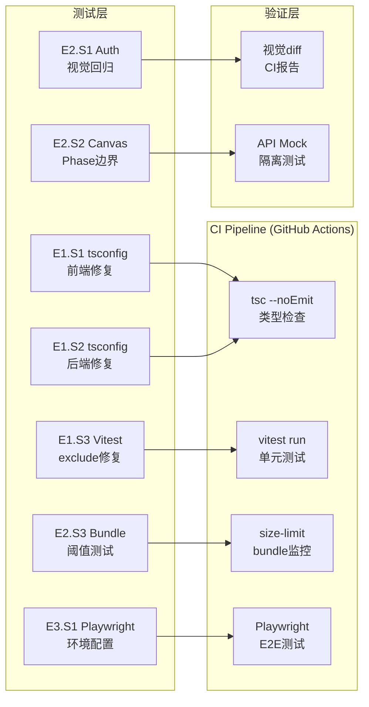

# Architecture: VibeX Tester Proposals — Quality Assurance Sprint

> **类型**: QA / CI Infrastructure  
> **日期**: 2026-04-14  
> **依据**: prd.md (vibex-tester-proposals-20260414_143000)

---

## 1. Problem Frame

VibeX 当前 CI 质量门禁存在 P0 级阻断（tsconfig 错误 + Vitest 误报），Sprint1 功能缺乏测试保护。目标：在 15h 内建立完整的 CI 门禁 + Sprint1 测试基线。

---

## 2. System Architecture



---

## 3. Technical Decisions

### 3.1 E1: CI 质量门禁修复

**tsconfig 修复策略**:

```bash
# 诊断命令
cd frontend && npx tsc --noEmit 2>&1 | head -50

# 常见错误模式 → 修复方向
"Cannot find module" → 检查 paths/baseUrl 配置
"Cannot find type" → 检查 skipLibCheck 或类型声明
"Duplicate identifier" → 多 tsconfig 合并冲突
"File is not under rootDir" → include/exclude 路径配置错误
```

**Vitest exclude 配置** (specs/E1-S3-vitest-exclude.md):

```typescript
// vite.config.ts
export default defineConfig({
  test: {
    exclude: [
      '**/node_modules/**',
      '**/dist/**',
      '**/.git/**',
      '**/dist-ssr/**',
      '**/public/**',
      '**/e2e/**',        // E2E 测试不放单元测试跑
    ],
    // 确保只跑 .test.ts / .spec.ts 文件
    include: ['**/*.test.ts', '**/*.test.tsx', '**/*.spec.ts', '**/*.spec.tsx'],
  }
});
```

**trade-off**: exclude 过度可能导致漏跑测试；exclude 不足导致误报。缓解：先跑 `--reporter=verbose` 对比测试文件数量。

### 3.2 E2: Auth 视觉回归测试

**工具选择**: `@playwright/test` + `playwright screenshot`（无需额外工具）。

```typescript
// 使用 Playwright 内置截图 diff
const diff = await page.screenshot({
  animations: 'disabled',
  fullPage: true,
});

// CI 中对比 baseline
// 首次运行 → 保存到 tests/baseline/
// CI run → 对比当前截图表单 baseline
```

**断言**: diffPercent < 5% (与 baseline 对比)。

**trade-off**: 视觉测试有 flaky 风险（字体渲染差异、GPU 差异）。缓解：
- `animations: 'disabled'`
- 固定 viewport (1920×1080)
- 连续 3 次 CI run 验证稳定性

### 3.3 E2: Canvas Phase 边界测试

**策略**: Playwright E2E + API Mock 隔离。

```typescript
// specs/E2-S2-canvas-phase.md §4 测试用例模式
// 数据准备: 先创建一个 canvas，设置特定 phase
// 边界场景: refresh → state 保持, import → init, switch → API 调用
```

**刷新保持测试**: 依赖 localStorage 或 URL param 持久化。先确认 Canvas 的 phase 状态管理方案。

### 3.4 E2: Bundle Size 阈值测试

**工具选择**: `size-limit` (与 Vitest 配合好，CI 输出清晰)。

```json
// package.json 或 size-limit.config.js
{
  "size-limit": [
    {
      "path": ".next/static/chunks/pages/**/*.js",
      "limit": "200 KB"
    }
  ]
}
```

**CI 集成**:
```yaml
# GitHub Actions
- run: npx size-limit
  env:
    CI_JOB_NUMBER: ${{ matrix.number }}
```

### 3.5 E3: Playwright E2E 环境配置

**配置内容**:
- `playwright.config.ts` (baseURL, viewport, timeout)
- `tests/e2e/` 目录结构
- `tests/fixtures/` 测试数据
- 浏览器依赖安装 (`npx playwright install chromium`)

```typescript
// playwright.config.ts
export default defineConfig({
  testDir: './tests/e2e',
  use: {
    baseURL: 'http://localhost:3000',
    viewport: { width: 1920, height: 1080 },
    screenshot: 'only-on-failure',
  },
  reporter: [['html'], ['list']],
});
```

---

## 4. CI Pipeline Integration

```yaml
# .github/workflows/test.yml
jobs:
  type-check:
    runs-on: ubuntu-latest
    steps:
      - run: cd frontend && npx tsc --noEmit
      - run: cd backend && npx tsc --noEmit

  unit-tests:
    runs-on: ubuntu-latest
    steps:
      - run: cd frontend && npx vitest run

  bundle-size:
    runs-on: ubuntu-latest
    steps:
      - run: npx size-limit --github

  e2e:
    runs-on: ubuntu-latest
    services:
      frontend:
        image: vibex-frontend:latest
    steps:
      - run: npx playwright test
```

---

## 5. Open Questions

| 问题 | 状态 | 决定 |
|------|------|------|
| Canvas Phase 状态持久化方式 | 待确认 | 先审计现有 canvas 状态管理（store/localStorage） |
| Auth visual baseline 首次生成 | 待处理 | 在 CI 首次运行时自动生成，后续对比 |
| Playwright 在 CI 中的容器支持 | 待验证 | GitHub Actions + `services` 或 Docker compose |

---

## 6. Verification

- [ ] `tsc --noEmit` 前后端退出码均为 0
- [ ] `vitest run` 退出码 0，无 node_modules 误报
- [ ] Auth 登录/注册页 dark theme 截图 diff < 5%
- [ ] Canvas Phase 3 个边界场景全部通过
- [ ] bundle size 阈值测试在 CI 中通过
- [ ] Playwright 环境配置完成，`npx playwright test` 可执行

---

*Architect Agent | 2026-04-14*
