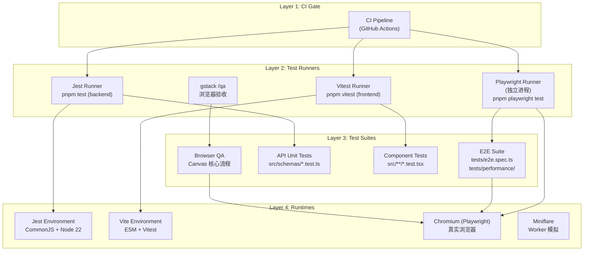
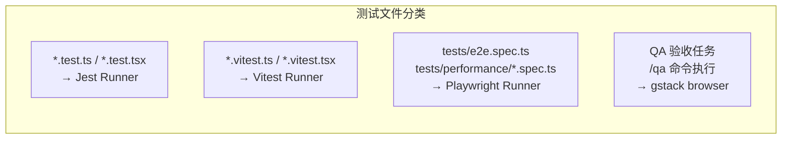

# VibeX Tester 测试架构提案

**项目**: vibex-tester-proposals-vibex-proposals-20260406
**作者**: architect
**日期**: 2026-04-06
**状态**: 已采纳
**关联提案**: P001, P002, P003, P004, P005

---

## 执行决策

- **决策**: 已采纳
- **执行项目**: vibex-e2e-test-fix
- **执行日期**: 2026-04-06

---

## 1. 问题背景

### 1.1 E2E 测试不可运行（P001 — P0）

**症状**: Playwright E2E 测试运行时抛出：

```
Class extends value undefined is not a constructor or null
```

**影响范围**:
- `tests/e2e.spec.ts` — 登录/注册流、项目流程、冲突解决等 5 个 E2E 测试套件完全无法执行
- `tests/performance/navigation-metrics.spec.ts` — 性能指标测试
- **核心覆盖率缺口**: Canvas UI 核心交互路径完全没有自动化测试

**根因**: Playwright 在 Jest 测试环境中加载失败。`jest-playwright` 桥接层在 Node.js 22 下行为异常，Playwright 需要 ESM 动态 import，而 Jest 使用 CommonJS 模块解析，两者运行时环境冲突。

---

### 1.2 Pre-existing 测试失败污染（P002 — P0）

**症状**: `pnpm test` 运行时总有 3 个测试套件失败：

```
FAIL src/schemas/auth.test.ts      — import { describe, it, expect } from 'vitest'
FAIL src/lib/api-validation.test.ts — import { describe, it, expect } from 'vitest'
FAIL src/lib/high-risk-validation.test.js — 使用 vitest import 但按 Jest 运行
```

**影响范围**:
- 测试套件: 3/73 失败
- 每次 `pnpm test` 都显示失败，新问题被淹没在旧问题中
- CI/CD 任何 PR 的 `pnpm test` 都会失败，难以区分新 regression

**根因**: 测试文件使用 `vitest` import 但项目实际用 Jest 运行，`jest.setup.js` 配置为 Jest 环境，部分测试文件从其他项目复制过来使用了 vitest 语法。

---

### 1.3 覆盖率不足（P003/P004/P005）

| 问题 | 影响 |
|------|------|
| TabBar.test.tsx 持续失败 | TabBar 组件回归风险高 |
| 前端变更缺少 /qa 验证 | Canvas 页面真实交互路径无浏览器级测试 |
| 测试文件命名不一致 | 开发者难以判断框架归属 |

---

## 2. Tech Stack

| 工具 | 用途 | 选择理由 |
|------|------|----------|
| **Playwright** | E2E / 浏览器自动化测试 | 跨浏览器、ESM 优先、Node 22 兼容 |
| **Vitest** | 单元测试（前端 React 组件） | Vite 原生集成，ESM-first，VibeX 已有部分文件使用 |
| **Miniflare** | Worker 运行时模拟 | Cloudflare Workers 本地测试，Wrangler v3 配套 |
| **Jest** | 后端 API 单元测试 | `vibex-backend` 现有配置稳定，暂不迁移 |
| **gstack (Playwright wrapper)** | 真实浏览器 QA 验收 | `/qa` 命令行界面，CI 截图证据 |

> **决策**: E2E 测试独立于 Jest 运行（`pnpm playwright test`），单元测试保持 Jest/Vitest 分层运行。

---

## 3. 架构图

### 3.1 测试分层架构



### 3.2 测试文件分类规范



---

## 4. 测试策略

### 4.1 分层测试矩阵

| 层级 | 工具 | 测试对象 | 覆盖率目标 | 运行时机 |
|------|------|----------|-----------|----------|
| **E2E** | Playwright | 完整用户流程（登录、项目、Canvas） | 核心路径 > 80% | 独立进程，CI 必跑 |
| **集成** | Vitest | React 组件交互、Store 逻辑 | 组件 > 70% | 本地 + CI |
| **单元** | Jest | API 路由、数据校验、Schema | 核心逻辑 > 80% | 本地 + CI |
| **QA 验收** | gstack | 前端变更视觉回归、交互验证 | 每次前端 PR | PR 审查前 |
| **Worker** | Miniflare | Cloudflare Workers API | API > 75% | 本地 Wrangler |

### 4.2 隔离策略

```
┌─────────────────────────────────────────────────────────┐
│  Jest 进程 (backend/src/**/*.test.ts)                   │
│    ├── 不加载 Playwright                                  │
│    ├── 不加载 Vite / Vitest                              │
│    └── jest.config.js 独立配置                           │
├─────────────────────────────────────────────────────────┤
│  Vitest 进程 (frontend/src/**/*.vitest.tsx)              │
│    ├── 不加载 Jest globals                               │
│    ├── Vite ESM 环境                                     │
│    └── vitest.config.ts 独立配置                         │
├─────────────────────────────────────────────────────────┤
│  Playwright 进程 (tests/e2e.spec.ts)                     │
│    ├── Node.js 独立进程                                  │
│    ├── 不受 Jest/Vitest 配置影响                         │
│    └── playwright.config.ts 独立配置                     │
└─────────────────────────────────────────────────────────┘
```

### 4.3 CI 执行顺序

```bash
# 1. 后端单元测试（Jest）
pnpm test --workspace=vibex-backend

# 2. 前端单元测试（Vitest）
pnpm vitest run --workspace=vibex-frontend

# 3. E2E 测试（Playwright，独立进程）
pnpm playwright test

# 4. 截图报告上传（如有前端变更）
# 失败则 PR blocking
```

---

## 5. 关键文件修改

| 文件 | 修改内容 | 对应提案 |
|------|----------|----------|
| `vibex-frontend/package.json` | test 脚本改为 `jest && vitest run && playwright test` | P001 |
| `vibex-frontend/playwright.config.ts` | 独立配置，禁用 jest-playwright 桥接 | P001 |
| `vibex-frontend/src/schemas/auth.test.ts` | vitest import 改为 Jest 标准 | P002 |
| `vibex-frontend/src/lib/api-validation.test.ts` | 同上 | P002 |
| `vibex-frontend/src/lib/high-risk-validation.test.js` | 同上 | P002 |
| `vibex-frontend/src/components/TabBar.test.tsx` | 修复 mock 完整性 | P003 |
| `.github/workflows/test.yml` | 添加 Playwright E2E step + /qa 截图检查 | P004 |
| `CLAUDE.md` | 测试规范统一：*.test.ts → Jest，*.spec.ts → Playwright | P005 |

---

## 6. 实施计划

### Phase 1: 修复 E2E 可运行性（E1，2h）

| 任务 | 工时 | 负责人 |
|------|------|--------|
| E1.1 创建独立的 playwright.config.ts | 0.5h | tester |
| E1.2 修改 package.json test 脚本 | 0.5h | dev |
| E1.3 验证 E2E 测试独立运行 | 0.5h | tester |
| E1.4 回归验证：旧测试套件不受影响 | 0.5h | tester |

### Phase 2: 清除 Pre-existing 失败（P002，1h）

| 任务 | 工时 | 负责人 |
|------|------|--------|
| E2.1 将 3 个 vitest import 文件迁移到 Jest 标准 | 0.5h | dev |
| E2.2 验证 `pnpm test` 0 失败 | 0.5h | tester |

### Phase 3: 建立 CI Gate（P004，1h）

| 任务 | 工时 | 负责人 |
|------|------|--------|
| E3.1 在 `.github/workflows/test.yml` 添加 Playwright step | 0.5h | dev |
| E3.2 添加前端 PR 的 /qa 截图强制检查 | 0.5h | reviewer |

### Phase 4: 测试规范固化（P003/P005，0.5h）

| 任务 | 工时 | 负责人 |
|------|------|--------|
| E4.1 修复 TabBar.test.tsx mock | 0.25h | tester |
| E4.2 测试规范写入 CLAUDE.md | 0.25h | architect |

**总工期**: 4.5h（分 2 个 sprint 并行执行）

---

## 7. 风险与缓解

| 风险 | 概率 | 影响 | 缓解措施 |
|------|------|------|----------|
| Playwright 独立运行后覆盖路径丢失 | 低 | 高 | E2E 测试文件保留原地，仅改 runner |
| Jest/Vitest 混用导致配置冲突 | 中 | 高 | 严格文件命名隔离 + 独立进程 |
| CI 时长增加（E2E 步骤） | 中 | 低 | Playwright 使用 reuseable browser，CI 配置缓存 |
| gstack /qa 截图 flaky | 低 | 中 | 指定稳定 viewport，固定操作序列 |

---

*文档版本: v1.0 | 最后更新: 2026-04-06*
