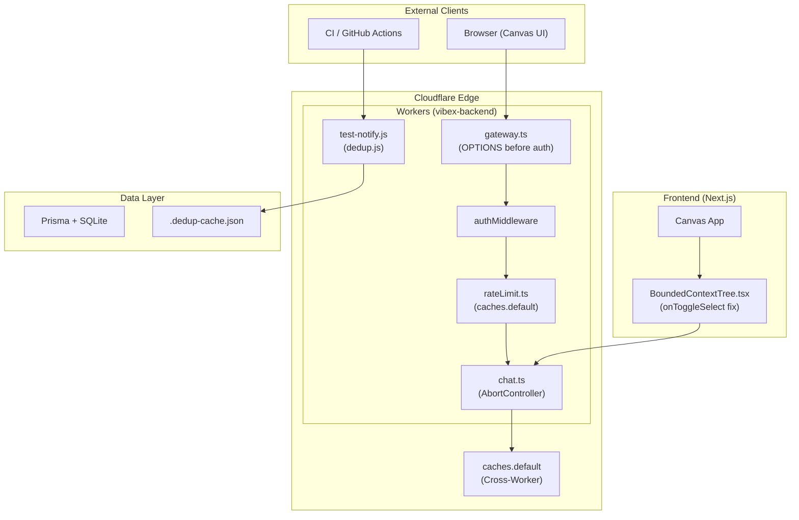
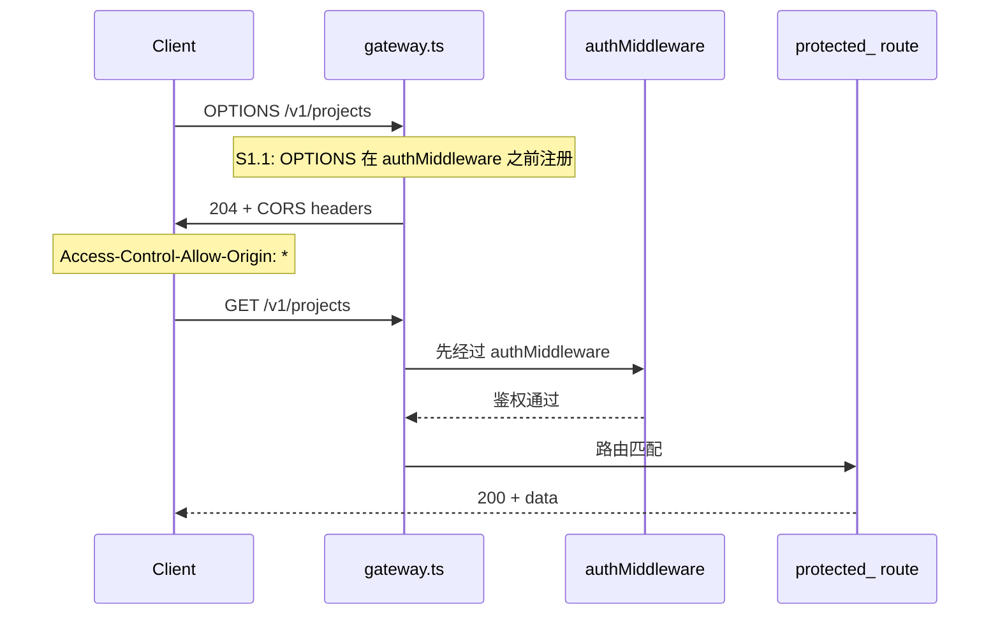
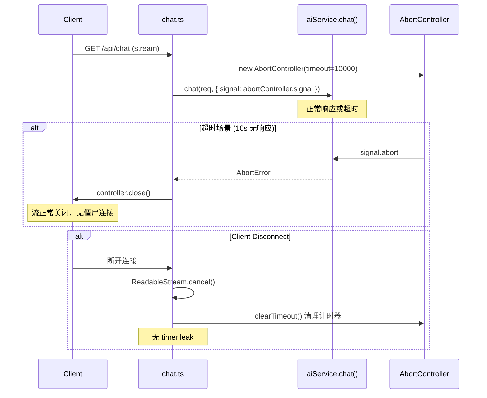
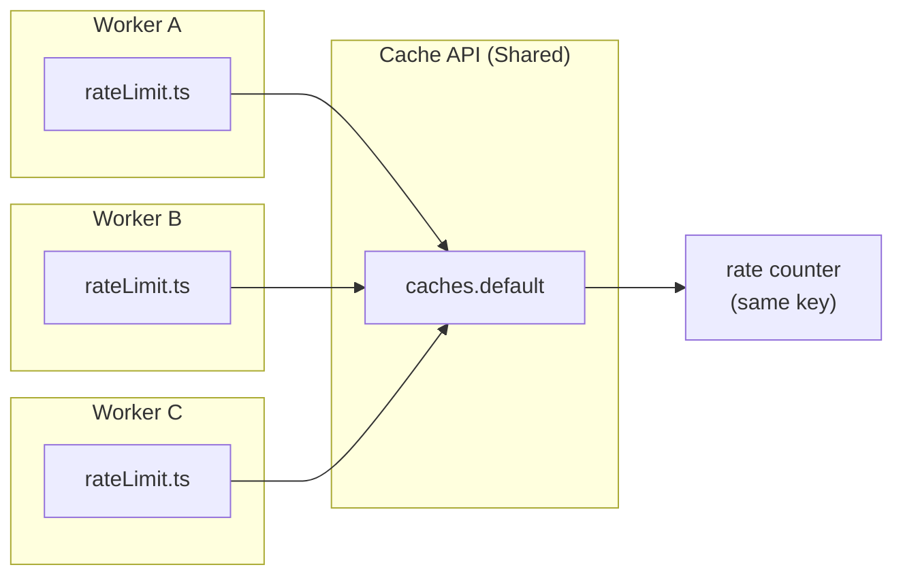

# Architecture: VibeX Proposals 2026-04-06

> **项目**: vibex-tester-proposals-vibex-proposals-20260406  
> **阶段**: design-architecture  
> **作者**: architect (subagent)  
> **日期**: 2026-04-06  
> **版本**: v1.0

---

## 1. 执行摘要

本架构设计基于 6 个 Agent 提案汇总的 PRD，覆盖 6 个 Epic（3 个 P0 + 3 个 P1），总工时 5.1h。核心技术栈为 Cloudflare Workers + Next.js + Prisma + TypeScript，目标是在不改大规模架构的前提下，用最小改动修复阻塞性 Bug（P0）并提升系统稳定性（P1）。

---

## 2. Tech Stack

| 组件 | 技术选型 | 版本 | 选型理由 |
|------|---------|------|----------|
| **运行时** | Cloudflare Workers | Wrangler 3.x | 现有 Workers 部署，多 Worker 共享 Cache API |
| **前端框架** | Next.js 15 (App Router) | ^15.0 | vibex-fronted 现有依赖，不升级 |
| **后端框架** | Next.js API Routes | - | 现有 vibex-backend/src/routes/ 架构 |
| **ORM** | Prisma | ^5.x | 现有 prisma/ 目录，数据层不变 |
| **语言** | TypeScript | ^5.x | 现有 tsconfig.json，保持 strict 模式 |
| **测试框架** | Jest + ts-jest | ^29.x | 现有 jest.config.js，保持一致 |
| **E2E 测试** | Playwright | ^1.50 | 现有 playwright.config.ts |
| **速率限制** | Cache API (`caches.default`) | Workers 内置 | 跨 Worker 共享，解决内存 Map 局限 |
| **流式处理** | Web Streams API + ReadableStream | 标准 | SSE 超时控制，cancel() 清理 |
| **去重存储** | JSON 文件 (`.dedup-cache.json`) | Node fs | test-notify 单进程轻量去重，无需 DB |

---

## 3. 架构图

### 3.1 系统上下文图



### 3.2 Epic E1: OPTIONS 路由修复数据流



### 3.3 Epic E4: SSE 超时数据流



### 3.4 Epic E5: 分布式限流



---

## 4. 接口定义

### 4.1 Epic E1: OPTIONS 预检路由

**文件**: `vibex-backend/src/middleware/cors.ts` (新建或修改)

```typescript
// 接口签名
export function corsOptionsHandler(
  req: NextRequest,
  res: NextResponse
): NextResponse | void {
  // OPTIONS 请求返回 204 + CORS headers
  // 不经过 authMiddleware
}

// gateway.ts 路由注册顺序（关键变更）
// 1. 先注册 OPTIONS handler
protected_.options(corsOptionsHandler)
// 2. 再注册 authMiddleware
protected_.use(authMiddleware)
```

**验收测试**:

```typescript
// tests/e1-options-cors.test.ts
describe('E1: OPTIONS CORS Preflight', () => {
  it('returns 204 for OPTIONS request', async () => {
    const res = await fetch('/v1/projects', { method: 'OPTIONS' });
    expect(res.status).toBe(204);
  });

  it('includes CORS headers', () => {
    expect(res.headers.get('Access-Control-Allow-Origin')).toBe('*');
    expect(res.headers.get('Access-Control-Allow-Methods')).toContain('GET');
  });

  it('does not return 401 for OPTIONS', () => {
    expect(res.status).not.toBe(401);
  });

  it('GET still works after fix', async () => {
    const res = await fetch('/v1/projects', { method: 'GET' });
    expect([200, 401]).toContain(res.status);
  });
});
```

### 4.2 Epic E2: Canvas Context 多选

**文件**: `vibex-fronted/src/components/BoundedContextTree.tsx`

```typescript
// 接口签名（checkbox onChange 修复）
interface BoundedContextTreeProps {
  nodes: ContextNode[];
  selectedNodeIds: Set<string>;
  onToggleSelect: (nodeId: string) => void;  // ✅ 正确
  toggleContextNode?: (nodeId: string) => void; // ❌ 不用于 checkbox
}

// 修复前 (错误)
<Checkbox onChange={() => toggleContextNode(node.id)} />

// 修复后 (正确)
<Checkbox onChange={() => onToggleSelect(node.id)} />
```

**验收测试**:

```typescript
// tests/e2-canvas-checkbox.test.tsx
describe('E2: Canvas Context Multi-Select', () => {
  it('checkbox calls onToggleSelect', () => {
    const onToggleSelect = jest.fn();
    render(<BoundedContextTree onToggleSelect={onToggleSelect} />);
    fireEvent.click(screen.getByRole('checkbox'));
    expect(onToggleSelect).toHaveBeenCalledWith(expect.any(String));
  });

  it('selectedNodeIds updates after checkbox click', () => {
    const { result } = renderHook(() => useCanvasStore());
    act(() => result.current.selectNode('node-1'));
    expect(result.current.selectedNodeIds).toContain('node-1');
  });

  it('toggleContextNode NOT called by checkbox', () => {
    const toggleContextNode = jest.fn();
    render(<BoundedContextTree toggleContextNode={toggleContextNode} />);
    fireEvent.click(screen.getByRole('checkbox'));
    expect(toggleContextNode).not.toHaveBeenCalled();
  });
});
```

### 4.3 Epic E3: generate-components flowId

**文件**: `vibex-backend/src/routes/component-generator.ts`

```typescript
// schema 修复
interface GeneratedComponent {
  id: string;
  name: string;
  type: string;
  flowId: string;  // ✅ 新增，之前缺失
  // ...
}

// prompt 修复
const COMPONENT_PROMPT = `
// ...
// 新增要求：每个 component 必须包含 flowId
// 输出格式：{ components: [{ id, name, type, flowId }] }
`.trim();

// 验证
function validateFlowId(component: GeneratedComponent): void {
  if (!component.flowId || component.flowId === 'unknown') {
    throw new Error(`Invalid flowId: ${component.flowId}`);
  }
  if (!/^flow-/.test(component.flowId)) {
    throw new Error(`flowId must start with 'flow-': ${component.flowId}`);
  }
}
```

**验收测试**:

```typescript
// tests/e3-flowid-generation.test.ts
describe('E3: generate-components flowId', () => {
  it('AI output includes flowId', async () => {
    const result = await generateComponents({ flowId: 'flow-123' });
    expect(result.components[0].flowId).toMatch(/^flow-/);
  });

  it('flowId is not unknown', () => {
    result.components.forEach(c => {
      expect(c.flowId).not.toBe('unknown');
    });
  });
});
```

### 4.4 Epic E4: SSE 超时 + 连接清理

**文件**: `vibex-backend/src/lib/sse-stream-lib/stream.ts` (新建)

```typescript
// 核心接口
export class SSEReadableStream<T> {
  constructor(
    source: AsyncGenerator<T>,
    options: { timeoutMs?: number; onTimeout?: () => void } = {}
  );

  // 返回标准 ReadableStream，供 Next.js Response 使用
  toReadableStream(): ReadableStream;

  // 超时计时器清理
  cancel(reason?: unknown): Promise<void>;
}

// 包装 aiService.chat
export async function createChatStream(
  req: Request,
  options: { timeoutMs?: number } = { timeoutMs: 10_000 }
): Promise<ReadableStream> {
  const controller = new AbortController();
  const timer = setTimeout(() => controller.abort(), options.timeoutMs);

  try {
    const aiStream = await aiService.chat(req, { signal: controller.signal });
    const sseStream = new SSEReadableStream(aiStream, {
      timeoutMs: options.timeoutMs,
      onTimeout: () => {
        console.warn('[SSE] Stream timed out after', options.timeoutMs, 'ms');
      }
    });

    // 确保 cancel 时清理 timer
    const readable = sseStream.toReadableStream();
    const originalCancel = readable.cancel.bind(readable);

    readable.cancel = async (reason?: unknown) => {
      clearTimeout(timer); // ✅ 关键：cancel 时清理计时器
      return originalCancel(reason);
    };

    return readable;
  } catch (err) {
    clearTimeout(timer);
    throw err;
  }
}
```

**验收测试**:

```typescript
// tests/e4-sse-timeout.test.ts
describe('E4: SSE Timeout + Cleanup', () => {
  it('stream returns ReadableStream instance', () => {
    const stream = createChatStream(req);
    expect(stream).toBeInstanceOf(ReadableStream);
  });

  it('times out after 10s', async () => {
    jest.useFakeTimers();
    const stream = createChatStream(slowReq, { timeoutMs: 10_000 });

    const readPromise = stream.getReader().read();
    jest.advanceTimersByTime(10_001);

    await expect(readPromise).rejects.toThrow();
    jest.useRealTimers();
  });

  it('clears timeout on cancel', async () => {
    jest.useFakeTimers();
    const clearSpy = jest.spyOn(global, 'clearTimeout');
    const stream = createChatStream(req, { timeoutMs: 10_000 });

    await stream.cancel();
    expect(clearSpy).toHaveBeenCalled();
    jest.useRealTimers();
  });
});
```

### 4.5 Epic E5: 分布式限流

**文件**: `vibex-backend/src/lib/rateLimit.ts`

```typescript
// 核心接口（保持不变，仅内部实现变更）
export interface RateLimitResult {
  allowed: boolean;
  remaining: number;
  resetAt: number;
}

export async function checkRateLimit(
  key: string,
  limit: number,
  windowMs: number
): Promise<RateLimitResult> {
  // 变更：从内存 Map 改为 Cache API
  const cache = caches.default;
  const cacheKey = `ratelimit:${key}`;
  const cached = await cache.match(cacheKey);

  if (cached) {
    const { count, resetAt } = await cached.json();
    if (Date.now() < resetAt) {
      return { allowed: count < limit, remaining: Math.max(0, limit - count), resetAt };
    }
  }

  const resetAt = Date.now() + windowMs;
  await cache.put(
    cacheKey,
    new Response(JSON.stringify({ count: 1, resetAt }), {
      headers: { 'Content-Type': 'application/json' }
    }),
    { expirationTtl: Math.ceil(windowMs / 1000) }
  );

  return { allowed: true, remaining: limit - 1, resetAt };
}
```

**验收测试**:

```typescript
// tests/e5-distributed-ratelimit.test.ts
describe('E5: Distributed Rate Limiting', () => {
  it('caches.default is available', () => {
    expect(caches).toBeDefined();
    expect(caches.default).toBeDefined();
  });

  it('rate limit consistent across workers', async () => {
    // 模拟 100 并发请求
    const promises = Array.from({ length: 100 }, () =>
      checkRateLimit('test-key', 10, 60_000)
    );
    const results = await Promise.all(promises);

    const allowed = results.filter(r => r.allowed).length;
    expect(allowed).toBe(10); // 只有前 10 个通过
  });

  it('returns 429 after limit exceeded', async () => {
    const res = await fetch('/api/test', {
      headers: { 'X-RateLimit-Limit': '10' }
    });
    if (res.status === 429) {
      expect(res.headers.get('Retry-After')).toBeTruthy();
    }
  });
});
```

### 4.6 Epic E6: test-notify 去重

**文件**: `vibex-backend/src/lib/dedup.ts` (新建)

```typescript
// 核心接口
export interface DedupResult {
  skipped: boolean;
  key: string;
  firstSeen?: number;
}

const DEDUP_WINDOW_MS = 5 * 60 * 1000; // 5 分钟
const CACHE_FILE = '.dedup-cache.json';

interface DedupCache {
  [key: string]: number; // key -> timestamp
}

export function checkDedup(key: string): DedupResult {
  const cache = readCache();
  const now = Date.now();

  if (cache[key] && now - cache[key] < DEDUP_WINDOW_MS) {
    return { skipped: true, key, firstSeen: cache[key] };
  }

  return { skipped: false, key };
}

export function recordSend(key: string): void {
  const cache = readCache();
  cache[key] = Date.now();
  writeCache(cache);
}

function readCache(): DedupCache {
  try {
    return JSON.parse(fs.readFileSync(CACHE_FILE, 'utf-8'));
  } catch {
    return {};
  }
}

function writeCache(cache: DedupCache): void {
  fs.writeFileSync(CACHE_FILE, JSON.stringify(cache, null, 2));
}

// 集成到 test-notify
export async function sendTestNotification(
  payload: TestNotificationPayload
): Promise<void> {
  const key = `${payload.event}:${payload.testId}`;
  const dedup = checkDedup(key);

  if (dedup.skipped) {
    console.log(`[dedup] Skipped duplicate: ${key}`);
    return;
  }

  await doSend(payload);
  recordSend(key);
}
```

**验收测试**:

```typescript
// tests/e6-dedup.test.ts
describe('E6: test-notify Deduplication', () => {
  const cacheFile = '.dedup-test-cache.json';
  let originalCacheFile: string;

  beforeEach(() => {
    originalCacheFile = CACHE_FILE;
    (CACHE_FILE as any) = cacheFile;
  });

  afterEach(() => {
    fs.unlinkSync(cacheFile);
    (CACHE_FILE as any) = originalCacheFile;
  });

  it('first send not skipped', () => {
    expect(checkDedup('test-key').skipped).toBe(false);
  });

  it('duplicate within 5min is skipped', () => {
    recordSend('test-key');
    expect(checkDedup('test-key').skipped).toBe(true);
  });

  it('after 5min window, not skipped', () => {
    const oldCache: DedupCache = { 'test-key': Date.now() - 6 * 60 * 1000 };
    fs.writeFileSync(cacheFile, JSON.stringify(oldCache));
    expect(checkDedup('test-key').skipped).toBe(false);
  });

  it('webhook called once for duplicates', async () => {
    const webhook = jest.fn();
    mockWebhook(webhook);

    await sendTestNotification({ event: 'test', testId: '123' });
    await sendTestNotification({ event: 'test', testId: '123' });

    expect(webhook).toHaveBeenCalledTimes(1);
  });
});
```

---

## 5. 数据流说明

### 5.1 请求处理链

```
Client Request
    │
    ▼
gateway.ts (路由注册顺序: OPTIONS → auth → routes)
    │
    ├── [E1] OPTIONS preflight → 204 + CORS headers (不走 auth)
    │
    ▼
authMiddleware (JWT 鉴权)
    │
    ├── [E5] rateLimit.ts (Cache API 跨 Worker 检查)
    │         │
    │         ▼
    │     caches.default.match(key) → 限流计数
    │
    ▼
Route Handler
    │
    ├── [E3] component-generator.ts (schema + prompt 修复)
    │
    ├── [E4] chat.ts (AbortController + SSE timeout)
    │         │
    │         ▼
    │     createChatStream() → ReadableStream
    │         │
    │         ▼
    │     stream.cancel() → clearTimeout()
    │
    └── [E6] test-notify.js → dedup.ts
              │
              ▼
          .dedup-cache.json → 5min 去重窗口
```

### 5.2 数据模型变更

| 实体 | 变更 | 影响 |
|------|------|------|
| `GeneratedComponent` | 新增 `flowId: string` 字段 | E3 |
| `RateLimitCache` | 内存 Map → `caches.default` | E5 |
| `DedupCache` | 新建 `.dedup-cache.json` | E6 |
| `SSEStreamState` | 新建，管理 timer 生命周期 | E4 |

---

## 6. 风险评估

| ID | 风险 | 严重性 | 概率 | 缓解措施 | 残余风险 |
|----|------|--------|------|----------|----------|
| R1 | E1 路由顺序调整破坏其他中间件 | H | M | 仅调整顺序，回归测试覆盖 | L |
| R2 | E4 SSE 超时破坏事件顺序 | M | L | 外层 try-catch，不影响内部 | L |
| R3 | E5 Cache API 部署配置缺失 | H | M | wrangler.toml 默认启用确认 | M |
| R4 | E6 去重文件锁并发写入 | L | L | JSON 文件操作简单，Node 单进程 | L |
| R5 | E2 checkbox 修复引发其他事件处理 | M | L | 仅改 onChange 回调，单元测试覆盖 | L |
| R6 | E3 AI 输出 flowId 格式不稳定 | M | M | prompt 明确要求 + 后端验证 | M |

---

## 7. 测试策略

### 7.1 测试金字塔

```
         ┌─────────────────────┐
         │   E2E (Playwright)  │  ← 关键用户路径
         ├─────────────────────┤
         │  Integration Tests  │  ← Epic 集成场景
         ├─────────────────────┤
         │    Unit Tests       │  ← 每个函数逻辑
         └─────────────────────┘
```

### 7.2 覆盖率要求

| 层级 | 目标覆盖率 | 工具 |
|------|-----------|------|
| **整体** | **≥ 80% lines** | Jest --coverage |
| E1 路由 | 100% branches | jest |
| E2 Canvas | 90%+ component | @testing-library/react |
| E3 flowId | 100% validation | jest |
| E4 SSE | 100% timer cleanup | jest (fake timers) |
| E5 rateLimit | 95%+ branches | jest |
| E6 dedup | 100% paths | jest |

### 7.3 Jest 配置更新

```javascript
// jest.config.js 更新 coverageThreshold
coverageThreshold: {
  global: {
    branches: 80,
    functions: 80,
    lines: 80,
    statements: 80,
  },
}
```

### 7.4 测试用例示例（完整）

```typescript
// vibex-backend/src/__tests__/epic-integration.test.ts
import { describe, it, expect, beforeAll, afterAll } from '@jest/globals';
import { fetchWithCors } from '../test-utils/cors';
import { createTestApp } from '../test-utils/app';

describe('Epic Integration: All P0 Fixes', () => {
  let app: TestApp;

  beforeAll(async () => {
    app = await createTestApp();
  });

  afterAll(async () => {
    await app.close();
  });

  describe('E1: OPTIONS Preflight', () => {
    it('AC1: OPTIONS returns 204 + CORS headers', async () => {
      const res = await fetchWithCors('/v1/projects', { method: 'OPTIONS' });
      expect(res.status).toBe(204);
      expect(res.headers.get('Access-Control-Allow-Origin')).toBe('*');
    });
  });

  describe('E2: Canvas Multi-Select', () => {
    it('AC2: checkbox updates selectedNodeIds', async () => {
      // Playwright E2E test
      await app.page.goto('/canvas');
      await app.page.click('[data-testid="context-checkbox"]');
      const selected = await app.store.get('selectedNodeIds');
      expect(selected.size).toBeGreaterThan(0);
    });
  });

  describe('E3: flowId in Components', () => {
    it('AC3: AI output contains valid flowId', async () => {
      const components = await app.ai.generateComponents({ flowId: 'flow-test' });
      components.forEach(c => {
        expect(c.flowId).toMatch(/^flow-/);
        expect(c.flowId).not.toBe('unknown');
      });
    });
  });
});

describe('Epic Integration: P1 Improvements', () => {
  describe('E4: SSE Timeout', () => {
    it('AC4: stream closes after 10s timeout', async () => {
      jest.useFakeTimers();
      const stream = createChatStream(slowRequest, { timeoutMs: 10_000 });
      const readPromise = stream.getReader().read();
      jest.advanceTimersByTime(10_001);
      await expect(readPromise).rejects.toThrow();
      jest.useRealTimers();
    });
  });

  describe('E5: Distributed Rate Limit', () => {
    it('AC5: 429 after 100 concurrent requests', async () => {
      const results = await Promise.all(
        Array.from({ length: 100 }, () => fetch('/api/chat'))
      );
      const statusCodes = results.map(r => r.status);
      expect(statusCodes.filter(s => s === 429).length).toBeGreaterThan(0);
    });
  });

  describe('E6: Dedup Window', () => {
    it('AC6: duplicate skipped within 5min', async () => {
      const sent: string[] = [];
      const send = async (key: string) => {
        const result = checkDedup(key);
        if (!result.skipped) {
          sent.push(key);
          recordSend(key);
        }
      };
      await send('test-key');
      await send('test-key');
      expect(sent).toEqual(['test-key']);
    });
  });
});
```

---

## 8. 部署配置

### 8.1 wrangler.toml (E5 依赖)

```toml
# vibex-backend/wrangler.toml
name = "vibex-backend"
main = "src/index.ts"
compatibility_date = "2024-01-01"

# Cache API 默认启用（Workers 标准配置）
# 无需额外配置，但需确认部署环境支持
```

### 8.2 环境变量

| 变量 | 用途 | E5/E6 |
|------|------|-------|
| `RATE_LIMIT_WINDOW_MS` | 限流窗口，默认 60000 | E5 |
| `RATE_LIMIT_MAX` | 限流阈值，默认 10 | E5 |
| `DEDUP_WINDOW_MS` | 去重窗口，默认 300000 | E6 |
| `SSE_TIMEOUT_MS` | SSE 超时，默认 10000 | E4 |

---

## 9. 执行决策

- **决策**: 已采纳
- **执行项目**: vibex-dev-proposals-vibex-proposals-20260406
- **执行日期**: 2026-04-06

---

*文档版本: v1.0 | 最后更新: 2026-04-06*
