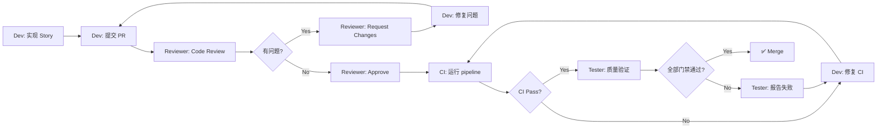

# VibeX 测试基础设施 — Agent 角色与职责

**项目**: vibex-tester-proposals-vibex-proposals-20260410  
**版本**: 1.0  
**日期**: 2026-04-10  
**状态**: Draft

---

## 1. Agent 角色总览

| Agent | 主要职责 | 交付物 | 协作接口 |
|-------|---------|--------|---------|
| **Dev** | 执行代码修改 | 配置修复、测试文件、mock 修复 | PR → Reviewer |
| **Reviewer** | 代码审查、质量把关 | Review 意见、Approval | Dev → Reviewer |
| **Tester** | 测试验证、质量门禁 | 测试报告、CI 验证报告 | Reviewer → PM |

---

## 2. Dev Agent

### 2.1 职责定义

Dev Agent 负责所有代码实现工作。在本项目中，Dev Agent 主要处理测试基础设施的修复和配置工作，而非业务功能代码。

### 2.2 Sprint 1 任务分配

#### Day 1: Playwright 配置 + stability 修复

| Story | 任务描述 | 优先级 | 验收标准 |
|-------|---------|--------|---------|
| S1.1 | 合并 Playwright 配置：提取 `tests/e2e/playwright.config.ts` 中的 `webServer` 到根配置，删除子配置 | P0 | `tests/e2e/playwright.config.ts` 不存在；`grep "webServer" playwright.config.ts` 有输出 |
| S1.2 | 移除 grepInvert 配置行 | P0 | `grep "grepInvert" playwright.config.ts` 无输出 |
| S1.3 | 验证 expect timeout = 30000 | P0 | `grep -A1 "expect:" playwright.config.ts` 包含 30000 |
| S2.1 | 修复 stability.spec.ts E2E_DIR 路径为 `./tests/e2e/`，添加 `existsSync` 断言 | P0 | `npx playwright test stability.spec.ts --project=chromium` 无 "0 tests found" |

#### Day 2: waitForTimeout 清理

| Story | 任务描述 | 优先级 | 验收标准 |
|-------|---------|--------|---------|
| S3.1 | 清理 `conflict-resolution.spec.ts` 中 8 处 waitForTimeout | P1 | 无残留；测试通过 |
| S3.2 | 清理 `conflict-dialog.spec.ts` 中 6 处 waitForTimeout | P1 | 无残留；测试通过 |
| S3.3 | 清理 `auto-save.spec.ts` 中 5 处 waitForTimeout | P1 | 无残留；测试通过 |
| S3.4 | 清理 `homepage-tester-report.spec.ts`（2处）和 `login-state-fix.spec.ts`（1处）；添加 ESLint waitForTimeout 检测规则 | P1 | 全 spec 无残留；ESLint 规则生效 |

#### Day 3: useAIController 修复

| Story | 任务描述 | 优先级 | 验收标准 |
|-------|---------|--------|---------|
| S4.1 | 迁移 `useAIController.test.tsx` 中所有 `jest.*` 到 `vi.*` 语法；验证测试通过 | P1 | `grep "jest\." useAIController.test.tsx` 无输出；`npx vitest run useAIController.test.tsx` 0 failures |

#### Day 4: useAutoSave 修复

| Story | 任务描述 | 优先级 | 验收标准 |
|-------|---------|--------|---------|
| S4.2 | 诊断并修复 `useAutoSave.test.ts` 失败原因；重点修复 `sendBeacon` 和 `localStorage` mock | P1 | `npx vitest run useAutoSave.test.ts` 0 failures |
| S4.3 | 从 `vitest.config.ts` exclude 数组移除 `useAutoSave` 和 `useCanvasExport` | P1 | exclude 列表不包含这两个文件 |

#### Day 5: canvas-e2e 修复

| Story | 任务描述 | 优先级 | 验收标准 |
|-------|---------|--------|---------|
| S5.1 | 修正 `playwright.config.ts` 中 canvas-e2e project 的 testDir 为 `./tests/e2e` | P2 | `npx playwright test --project=canvas-e2e --list` 找到 ≥1 测试 |

### 2.3 Sprint 2 任务分配

| Story | 任务描述 | 优先级 | 验收标准 |
|-------|---------|--------|---------|
| S5.2 | 参考 `sync.contract.spec.ts` 创建 `flows.contract.spec.ts`，实现 flows API Zod schema 验证的 4 个测试用例 | P3 | 文件存在；4 个测试全部通过 |
| S5.3 | 研究 Stryker mutation testing 方案，产出 `docs/decisions/stryker-approach.md`（含选项对比和推荐） | P3 | 文档存在；决策明确 |

### 2.4 Dev 执行规范

1. **每次 commit 粒度**: 1 个 Story = 1 个 commit，commit message 格式: `[T-<id>] <action>: <description>`
   - 示例: `[T-P0-1] feat: unify playwright config, remove tests/e2e/playwright.config.ts`
2. **修改前先备份**: 复制原文件内容到临时位置，便于 revert
3. **验证后再提交**: 每个 Story 完成前必须运行验证命令（见 IMPLEMENTATION_PLAN.md）
4. **CI 触发**: 每次 push 后检查 GitHub Actions 状态，失败则立即回滚或修复

### 2.5 Dev 禁止事项

- ❌ 不要在未通过验证命令前提交 PR
- ❌ 不要跳过 ESLint 检查直接 commit
- ❌ 不要忽略 Reviewer 的 blocking comments
- ❌ 不要在 CI 失败状态下合入 PR

---

## 3. Reviewer Agent

### 3.1 职责定义

Reviewer Agent 负责审查 Dev Agent 的所有代码修改，确保：
- 配置变更符合架构文档
- 测试修复逻辑正确
- 无引入新问题
- 符合 VibeX 代码规范

### 3.2 Review Checklist（Epic 1: Playwright 配置）

- [ ] `tests/e2e/playwright.config.ts` 已被删除
- [ ] 根 `playwright.config.ts` 包含原内部配置的所有必要字段（webServer、expect、projects）
- [ ] `expect.timeout` 为 30000ms
- [ ] `grepInvert` 不存在于任何配置
- [ ] CI workflow 中的 playwright 命令指向根配置

### 3.3 Review Checklist（Epic 2: stability 修复）

- [ ] `E2E_DIR` 定义为 `./tests/e2e/`
- [ ] 存在至少一个目录存在性断言（`existsSync` / `isDirectory`）
- [ ] 运行 `npx playwright test stability.spec.ts --project=chromium` 成功（无 "0 tests found"）

### 3.4 Review Checklist（Epic 3: waitForTimeout 清理）

- [ ] 所有 waitForTimeout 已替换为确定性等待（waitForResponse / waitForSelector / expect.toHaveURL）
- [ ] 无 waitForTimeout 残留（`grep -rn "waitForTimeout" tests/e2e/`）
- [ ] ESLint 规则能检测新增 waitForTimeout
- [ ] 测试逻辑无回归（替换后的等待逻辑覆盖了原有场景）

### 3.5 Review Checklist（Epic 4: Hook 测试）

- [ ] `useAIController.test.tsx` 中无 `jest.` 语法
- [ ] `useAutoSave.test.ts` 中 mock 正确处理 `sendBeacon`（非标准 API）和 `localStorage`
- [ ] `vitest.config.ts` exclude 列表为空或不包含 hook 测试文件
- [ ] `npx vitest run` 输出 0 failures

### 3.6 Review Checklist（Epic 5: 扩展）

- [ ] `canvas-e2e` project testDir 指向 `./tests/e2e`
- [ ] `flows.contract.spec.ts` 使用 Zod schema validation，测试覆盖 GET/POST/PUT/DELETE
- [ ] `stryker-approach.md` 包含三个选项的对比分析（Docker CI / 替代指标 / Vitest runner）

### 3.7 Review 执行规范

1. **Review 响应时间**: 收到 PR 后 2 小时内完成 Review
2. **Review 语气**: 具体指出问题所在，提供修复建议
3. **Approval 标准**: 所有 checklist 通过 + CI green
4. **Blocking**: 任何 P0/P1 问题未解决不得 Approval

---

## 4. Tester Agent

### 4.1 职责定义

Tester Agent 负责验证测试基础设施的质量门禁，确保：
- 所有修复后的测试能稳定运行
- CI pipeline 端到端验证通过
- 测试覆盖率达到目标值
- 质量门禁符合 PRD 定义

### 4.2 Sprint 1 验证任务

| 阶段 | 验证内容 | 验收标准 | 输出 |
|------|---------|---------|------|
| Day 1 PM | stability.spec.ts 功能验证 | 运行 stability.spec.ts，确认监控生效 | stability-verify.md |
| Day 2 | waitForTimeout 清理验证 | 全 spec grep 无残留；运行部分测试确认无回归 | cleanup-verify.md |
| Day 3 | useAIController 测试验证 | `npx vitest run useAIController.test.tsx` 0 failures | hook-test-verify.md |
| Day 4 | useAutoSave 测试验证 | `npx vitest run useAutoSave.test.ts` 0 failures | hook-test-verify.md |
| Day 5 PM | CI 端到端验证 | CI E2E ≥ 50 tests, ≥ 90% pass；Vitest 0 failures；Jest 0 failures | ci-validation-report.md |

### 4.3 Sprint 2 验证任务

| 阶段 | 验证内容 | 验收标准 | 输出 |
|------|---------|---------|------|
| Day 6 | flows.contract.spec.ts 验证 | 4 个测试全部通过 | contract-test-verify.md |
| Day 7 | 全量 DoD 验证 | 所有 18 个验收标准通过 | final-doD-report.md |

### 4.4 CI 质量门禁（Tester 强制执行）

| 门禁 | 阈值 | 执行频率 |
|------|------|---------|
| E2E 测试数 | ≥ 50（grepInvert 移除后） | 每次 PR |
| E2E pass rate | ≥ 90% | 每次 PR |
| Vitest failures | = 0 | 每次 PR |
| Jest failures | = 0 | 每次 PR |
| Coverage | ≥ 85% (branches/functions/lines/statements) | 每次 PR |
| waitForTimeout | = 0 残留 | 每次 PR |
| stability.spec.ts | 正常运行（无 "0 tests found"） | 每次 main push |

### 4.5 Tester 执行规范

1. **验证环境**: 使用 CI 环境（`CI=true`）进行最终验证，不依赖本地环境
2. **回归测试**: 每个 Story 修改后运行对应测试套件，确认无回归
3. **覆盖率报告**: 检查 Jest coverage report，确认 ≥ 85%
4. **stability 验证**: 每次 main 分支更新后运行 stability.spec.ts，更新 `daily-stability.md`
5. **失败报告**: 测试失败时，提供清晰的失败原因和最小复现步骤

### 4.6 Tester 禁止事项

- ❌ 不要在 CI 失败状态下宣布验收通过
- ❌ 不要接受 "接近" 阈值的 pass rate（≥ 90%，不是 ≥ 85%）
- ❌ 不要跳过任何验收标准

---

## 5. 协作流程

### 5.1 PR 生命周期

### 5.2 每日同步

- **早会（异步）**: Dev 报告昨日完成 + 今日计划到 #dev 频道
- **Review 请求**: Dev 完成后 @Reviewer 进行 Review
- **Tester 验证**: Reviewer Approval 后，Tester 接管验证
- **阻塞升级**: 任何 Agent 遇到阻塞 → 立即 @PM

### 5.3 沟通约定

| 场景 | 频道 | 格式 |
|------|------|------|
| Story 完成，准备 Review | #dev | `[T-<id>] Ready for review: <story name>` |
| Review 完成，Approval | #dev | `[T-<id>] Approved: <story name>` |
| Review 失败，需要修改 | #dev | `[T-<id>] Changes requested: <issue>` |
| Tester 验证失败 | #dev + #coord | `[T-<id>] Test failure: 
` |
| Sprint 结束 | #coord | Sprint 报告（含 DoD 完成情况） |

---

## 6. 质量门禁汇总

### 6.1 入场门禁（Story 可开始）

- [ ] 上游 Story 已完成（参考 Epic 依赖）
- [ ] 分支已从 main 创建（`git checkout -b feature/test-infra-v1`）
- [ ] 代码已在本地验证通过

### 6.2 出场门禁（Story 可完成）

| Story | 门禁 | 验证命令 |
|-------|------|---------|
| S1.1 | tests/e2e/playwright.config.ts 不存在 | `test -f tests/e2e/playwright.config.ts` |
| S1.2 | grepInvert 不存在 | `grep "grepInvert" playwright.config.ts` |
| S1.3 | expect timeout = 30000 | `grep -A1 "expect:" playwright.config.ts` |
| S2.1 | stability.spec.ts 正常运行 | `npx playwright test stability.spec.ts --project=chromium` |
| S3.4 | 无 waitForTimeout 残留 | `grep -rn "waitForTimeout" tests/e2e/` |
| S4.1 | useAIController 0 failures | `npx vitest run useAIController.test.tsx` |
| S4.2 | useAutoSave 0 failures | `npx vitest run useAutoSave.test.ts` |
| S4.3 | exclude 移除 | `grep "useAutoSave" vitest.config.ts` |
| S5.1 | canvas-e2e 找到测试 | `npx playwright test --project=canvas-e2e --list` |
| S5.2 | flows.contract 4 tests pass | `npx playwright test flows.contract.spec.ts` |
| S5.3 | 决策文档存在 | `test -f docs/decisions/stryker-approach.md` |

### 6.3 Sprint 出场门禁

- [ ] Epic 1-5 所有 Story DoD 达成
- [ ] CI E2E ≥ 50 tests, ≥ 90% pass
- [ ] Vitest: 0 failures
- [ ] Jest: 0 failures
- [ ] Coverage ≥ 85%
- [ ] 所有修改已 merge 到 main

---

## 7. 执行决策

- **决策**: 已采纳
- **执行项目**: team-tasks 项目 vibex-tester-proposals-vibex-proposals-20260410
- **执行日期**: 2026-04-10

---

*本 AGENTS.md 由 Architect Agent 生成，基于 PRD + Tester 提案*
