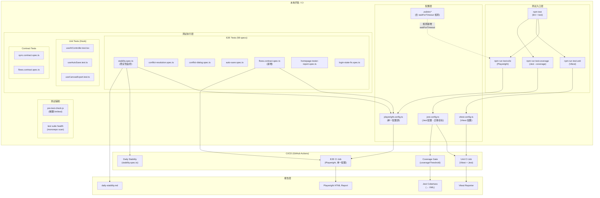
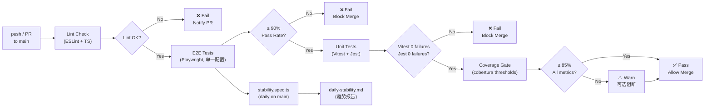
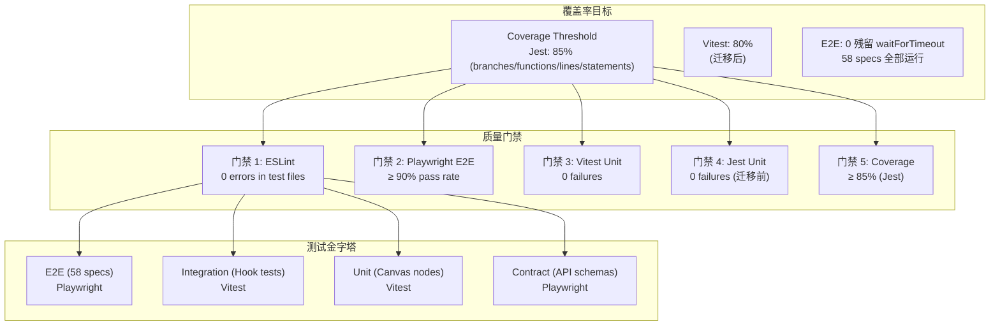
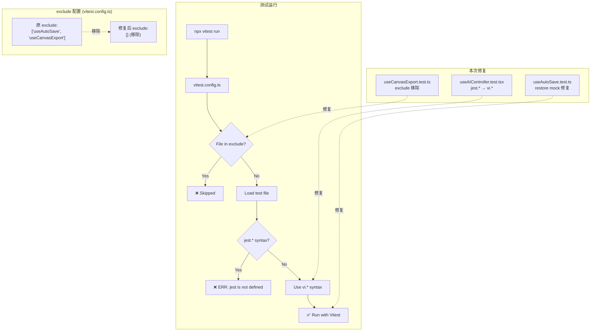

# VibeX 测试基础设施架构文档

**项目**: vibex-tester-proposals-vibex-proposals-20260410  
**版本**: 1.0  
**日期**: 2026-04-10  
**状态**: Draft

---

## 1. 技术栈与选型理由

### 1.1 测试框架栈

| 层级 | 工具 | 版本 | 用途 | 选型理由 |
|------|------|------|------|---------|
| E2E | Playwright | latest (chromium) | 端到端浏览器测试 | 跨浏览器支持、内建 locator、智能等待 |
| Unit (canvas hooks) | Vitest | 4.1.x | React Hook 单元测试 | ESM-first、HMR、原生 TypeScript 支持 |
| Unit (legacy) | Jest | 29.x (降级稳定版) | 遗留测试迁移目标 | 迁移中，最终统一到 Vitest |
| Contract | Playwright | same as E2E | API 合约测试 | 与 E2E 共享配置，复用 schema validation |
| Mutation | (待决策) | — | 变异测试 | Sprint 2 完成 Stryker 选型决策 |

### 1.2 辅助工具栈

| 工具 | 用途 | 配置位置 |
|------|------|---------|
| ESLint | 代码质量 + 测试规范检测 | `.eslintrc*` |
| TypeScript | 类型检查 | `tsconfig.json` |
| npm scripts | 测试编排 | `package.json` |
| GitHub Actions | CI/CD | `.github/workflows/test.yml` |

### 1.3 关键配置决策

**决策 1: 测试框架统一路径**
- 当前: Jest 30 RC + Vitest 4.1 双轨运行
- 目标: 统一到 Vitest（ESM-first、更好的 TS 支持）
- 迁移策略: Sprint 1 完成 Hook 测试修复，Sprint 2 后评估全面迁移

**决策 2: Playwright 配置单一源**
- 删除 `tests/e2e/playwright.config.ts`
- 统一使用根目录 `playwright.config.ts`
- CI 和本地使用同一配置，消除 timeout 差异（expect: 30000ms）

**决策 3: Jest 降级**
- `jest@30.2.0-rc.1` → `jest@29.7.0`（稳定版）
- 理由: RC 版本 breaking change 阻断 CI 风险高

---

## 2. 架构图

### 2.1 测试基础设施全景图



### 2.2 CI Pipeline 流程



### 2.3 测试覆盖率策略



### 2.4 Hook 测试执行路径



---

## 3. 数据模型

### 3.1 测试文件组织

```
vibex-fronted/
├── playwright.config.ts              # ✅ 单一 Playwright 配置（删除 tests/e2e/playwright.config.ts）
├── vitest.config.ts                  # ✅ 移除 reporters: ['default']（ERR_LOAD_URL 根因）
├── jest.config.ts                    # 迁移目标（最终统一到 Vitest）
│
├── tests/
│   ├── e2e/
│   │   ├── stability.spec.ts         # E2E_DIR: './tests/e2e/'（修复路径）
│   │   ├── conflict-resolution.spec.ts   # S3.1: waitForTimeout → waitForResponse/Selector
│   │   ├── conflict-dialog.spec.ts   # S3.2: waitForTimeout 清理
│   │   ├── auto-save.spec.ts         # S3.3: waitForTimeout 清理
│   │   ├── homepage-tester-report.spec.ts  # S3.4: waitForTimeout 清理
│   │   ├── login-state-fix.spec.ts   # S3.4: waitForTimeout 清理
│   │   └── ... (58 specs total)
│   │
│   └── contract/
│       ├── sync.contract.spec.ts     # 已有
│       └── flows.contract.spec.ts     # S5.2: 新增 flows API 合约测试
│
├── src/
│   ├── hooks/
│   │   └── canvas/
│   │       ├── useAIController.test.tsx    # S4.1: jest.* → vi.*
│   │       ├── __tests__/
│   │       │   └── useAutoSave.test.ts     # S4.2: 修复 sendBeacon/localStorage mock
│   │       └── useCanvasExport.test.ts    # S4.3: 从 exclude 移除
│   │
│   └── components/canvas/nodes/
│       ├── GatewayNode.tsx           # P2-2: 新增测试
│       ├── StickyNoteNode.tsx        # P2-2: 新增测试
│       └── ... (4 node components)    # P2-2: 零测试 → 覆盖
│
└── docs/
    └── decisions/
        └── stryker-approach.md        # S5.3: 变异测试方案决策
```

### 3.2 核心实体关系

```mermaid
erDiagram
    PLAYWRIGHT_CONFIG {
        string name "chromium|canvas-e2e"
        string testDir "./tests/e2e"
        int expectTimeout 30000
        boolean grepInvert "移除"
        object webServer "启动 dev server"
    }

    VITEST_CONFIG {
        array exclude "useAutoSave, useCanvasExport → 移除"
        array reporters "default (移除 'default' 字符串)"
        boolean coverage "coverage: true"
    }

    E2E_SPEC {
        string path "tests/e2e/*.spec.ts"
        string tag "@ci-blocking"
        int waitForTimeoutCount "需清零"
    }

    HOOK_TEST {
        string path "src/hooks/canvas/*.test.{ts|tsx}"
        string syntax "jest.* → vi.*"
        string mock "sendBeacon/localStorage"
    }

    CONTRACT_TEST {
        string path "tests/contract/*.spec.ts"
        string method "Zod schema validation"
    }

    PLAYWRIGHT_CONFIG ||--o| E2E_SPEC : "runs"
    VITEST_CONFIG ||--o| HOOK_TEST : "runs"
    E2E_SPEC ||--o{ CONTRACT_TEST : "includes"
    HOOK_TEST ||--|| VITEST_CONFIG : "governed by"
```

---

## 4. 测试框架设计

### 4.1 Playwright 单一配置规范

```typescript
// playwright.config.ts (单一配置源)
import { defineConfig, devices } from '@playwright/test';

export default defineConfig({
  testDir: './tests/e2e',
  expect: {
    timeout: 30000,           // ✅ 统一为 30s（移除冲突的 tests/e2e/config 10s）
  },
  grepInvert: undefined,      // ✅ 移除 grepInvert，所有 @ci-blocking 测试运行
  projects: [
    {
      name: 'chromium',
      use: { ...devices['Desktop Chrome'] },
    },
    {
      name: 'canvas-e2e',
      use: { ...devices['Desktop Chrome'] },
      testDir: './tests/e2e', // ✅ 修正为 ./tests/e2e（修复 './e2e' 错误）
    },
  ],
  webServer: {
    command: 'pnpm run dev',
    url: 'http://localhost:5173',
    reuseExistingServer: !process.env.CI,
    timeout: 120 * 1000,
  },
  use: {
    baseURL: 'http://localhost:5173',
    trace: 'on-first-retry',
    screenshot: 'only-on-failure',
  },
});
```

### 4.2 Vitest 配置规范

```typescript
// vitest.config.ts
import { defineConfig } from 'vitest/config';

export default defineConfig({
  test: {
    environment: 'jsdom',
    setupFiles: ['./src/test/setup.ts'],
    coverage: {
      provider: 'v8',
      reporter: ['text', 'json', 'html'],
      thresholds: {
        lines: 80,
        functions: 80,
        branches: 80,
        statements: 80,
      },
    },
    // ✅ reporters: ['default'] 移除 — ERR_LOAD_URL 根因
    // 保留 globals: true（与 useAIController vi.fn 兼容）
    exclude: [
      // ✅ S4.3: useAutoSave 已从 exclude 移除
      // ✅ S4.3: useCanvasExport 已从 exclude 移除
    ],
  },
});
```

### 4.3 E2E 等待策略（替代 waitForTimeout）

```typescript
// ✅ S3.x: waitForTimeout 清理后的确定性等待模式

// 模式 1: 网络响应等待
await page.waitForResponse(
  response => response.url().includes('/api/sync') && response.status() === 200,
  { timeout: 10000 }
);

// 模式 2: 状态选择器等待
await page.waitForSelector('[data-testid="save-confirmed"]', { state: 'visible', timeout: 5000 });

// 模式 3: 元素消失等待
await page.waitForSelector('[data-testid="loading"]', { state: 'hidden', timeout: 10000 });

// 模式 4: 路由变化等待
await expect(page).toHaveURL(/\/canvas\/.+/);

// 模式 5: 函数式等待
await page.waitForFunction(() => {
  const el = document.querySelector('[data-testid="status"]');
  return el?.textContent === 'saved';
}, { timeout: 5000 });
```

### 4.4 Hook 测试语法规范

```typescript
// ✅ S4.1: useAIController — jest.* → vi.* 迁移

// ❌ 错误 (Jest 语法)
beforeEach(() => {
  jest.clearAllMocks();
});
const mockFn = jest.fn();

// ✅ 正确 (Vitest 语法)
beforeEach(() => {
  vi.clearAllMocks();
});
const mockFn = vi.fn();

// ✅ S4.2: useAutoSave mock 修复
beforeEach(() => {
  // Mock sendBeacon (非标准 API)
  const sendBeaconMock = vi.fn().mockReturnValue(true);
  Object.defineProperty(navigator, 'sendBeacon', {
    value: sendBeaconMock,
    writable: true,
    configurable: true,
  });
  // Mock localStorage
  const storage = {};
  vi.spyOn(Storage.prototype, 'getItem').mockImplementation((key) => storage[key] ?? null);
  vi.spyOn(Storage.prototype, 'setItem').mockImplementation((key, value) => { storage[key] = value; });
});
```

### 4.5 Contract 测试模式

```typescript
// tests/contract/flows.contract.spec.ts (S5.2 新增)
// 参考 sync.contract.spec.ts 模式

import { test, expect } from '@playwright/test';
import { z } from 'zod';

// Flow schema
const flowSchema = z.object({
  id: z.string().uuid(),
  name: z.string().min(1).max(100),
  nodes: z.array(z.object({
    id: z.string(),
    type: z.string(),
    position: z.object({ x: z.number(), y: z.number() }),
  })),
  edges: z.array(z.object({
    id: z.string(),
    source: z.string(),
    target: z.string(),
  })),
  createdAt: z.string().datetime(),
  updatedAt: z.string().datetime(),
});

test.describe('Flows API Contract', () => {
  test('GET /api/flows returns valid flow array', async ({ request }) => {
    const response = await request.get('/api/flows');
    expect(response.status()).toBe(200);
    const data = await response.json();
    expect(() => flowSchema.parse(data)).not.toThrow();
  });

  test('POST /api/flows creates flow with valid schema', async ({ request }) => {
    const newFlow = {
      name: 'Test Flow',
      nodes: [],
      edges: [],
    };
    const response = await request.post('/api/flows', { data: newFlow });
    expect(response.status()).toBe(201);
    const result = flowSchema.safeParse(await response.json());
    expect(result.success).toBe(true);
  });

  test('PUT /api/flows/:id rejects invalid schema', async ({ request }) => {
    const response = await request.put('/api/flows/invalid-id', {
      data: { name: '' }, // Invalid: empty name
    });
    expect(response.status()).toBe(400);
  });

  test('DELETE /api/flows/:id returns 204', async ({ request }) => {
    // Create then delete
    const createResp = await request.post('/api/flows', { data: { name: 'Temp', nodes: [], edges: [] } });
    const { id } = await createResp.json();
    const deleteResp = await request.delete(`/api/flows/${id}`);
    expect(deleteResp.status()).toBe(204);
  });
});
```

---

## 5. 覆盖率策略

### 5.1 覆盖率指标

| 指标 | 当前值 | Sprint 1 目标 | Sprint 2 目标 |
|------|--------|-------------|--------------|
| Jest coverage (branches/lines/functions/statements) | 85% threshold defined, not enforced | **CI 强制门禁** | 保持 |
| Vitest coverage | 未配置 | 80% threshold | 提升至 85% |
| E2E spec 执行数 | ~15 (grepInvert 跳过) | **≥ 50** | ≥ 58 |
| Hook 测试激活率 | 5/7 | **7/7** | 7/7 |
| waitForTimeout 残留 | 20+ | **0** | 0 |
| Contract 测试覆盖 | 1 file (sync) | 2 files (sync + flows) | TBD |

### 5.2 质量门禁

```
✅ PASS: CI E2E ≥ 90% pass rate (无 grepInvert，全部 58 specs)
✅ PASS: Vitest 0 failures
✅ PASS: Jest 0 failures (迁移前)
✅ PASS: Coverage ≥ 85% (所有指标)
✅ PASS: 0 waitForTimeout 残留 (ESLint 检测)
✅ PASS: stability.spec.ts 路径正确，运行时正常
✅ PASS: 0 ESLint errors in src/components/canvas/CanvasPage.tsx
```

---

## 6. 关键 API 约定

### 6.1 测试入口 API

| 命令 | 用途 | CI 行为 |
|------|------|---------|
| `pnpm run test` | 完整检查 (lint + test) | ✅ 使用 |
| `pnpm run test:e2e` | Playwright E2E（单一配置） | ✅ 使用 |
| `pnpm run test:unit` | Vitest + Jest unit | ✅ 使用 |
| `pnpm run test:coverage` | Jest with coverage | ✅ 使用 |
| `npx playwright test` | 直接运行 Playwright | ✅ 使用根配置 |
| `npx vitest run` | 直接运行 Vitest | ✅ 使用 |

### 6.2 CI 环境变量约定

| 变量 | 值 | 用途 |
|------|-----|------|
| `CI=true` | true | Playwright CI 模式 |
| `PLAYWRIGHT_BROWSERS_PATH` | `~/.cache/ms-playwright` | 浏览器缓存 |
| `NODE_ENV` | test | 启用测试环境 |

---

## 7. 执行决策

- **决策**: 已采纳
- **执行项目**: team-tasks 项目 vibex-tester-proposals-vibex-proposals-20260410
- **执行日期**: 2026-04-10

---

*本架构文档由 Architect Agent 生成，基于 PRD + Tester 提案*
