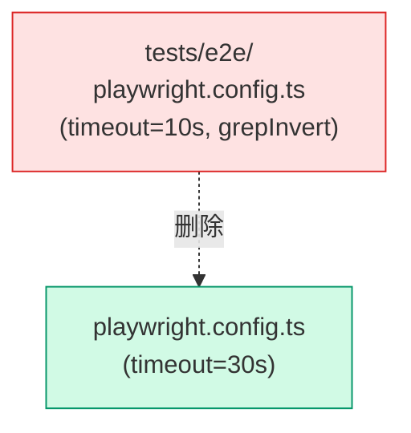

# Architecture: VibeX Tester Proposals 2026-04-11

> **项目**: vibex-tester-proposals-vibex-proposals-20260411  
> **作者**: Architect  
> **日期**: 2026-04-11  
> **版本**: v1.0

---

## 执行决策

| 决策 | 状态 | 执行项目 | 执行日期 |
|------|------|----------|----------|
| 单一 Playwright 配置 | **已采纳** | vibex-tester-proposals-vibex-proposals-20260411 | 2026-04-11 |
| 智能等待替代 waitForTimeout | **已采纳** | vibex-tester-proposals-vibex-proposals-20260411 | 2026-04-11 |

---

## 1. Tech Stack

| 组件 | 技术选型 | 说明 |
|------|----------|------|
| **E2E** | Playwright | ^1.42 |
| **Unit** | Vitest | ^1.5 |
| **断言** | expect | 统一 30s timeout |

---

## 2. 修复架构

### 2.1 Playwright 配置合并



---

## 3. 详细设计

### 3.1 删除双重配置

```bash
# 删除 tests/e2e/playwright.config.ts
rm -f tests/e2e/playwright.config.ts

# 验证
find . -name "playwright.config.ts" | wc -l
# 应输出: 1
```

### 3.2 stability.spec.ts 路径修复

```typescript
// 修复前
const files = globSync('./e2e/**/*.spec.ts');  // 永远 []

// 修复后
const testDir = path.resolve(__dirname, '..');
const files = globSync('**/*.spec.ts', { cwd: testDir });

// 验证能检测到 waitForTimeout
const violations = files.flatMap(f => detectWaitForTimeout(f));
expect(violations.length).toBeGreaterThan(0);
```

### 3.3 waitForTimeout 替换策略

```typescript
// 替换映射
const REPLACEMENTS = {
  'waitForTimeout(1000)': `await expect(page.locator('.target')).toBeVisible({ timeout: 5000 })`,
  'waitForTimeout(2000)': `await page.waitForResponse(res => res.url().includes('/api/'))`,
  'waitForTimeout(3000)': `await page.waitForFunction(() => document.readyState === 'complete')`,
};
```

### 3.4 flowId E2E 测试

```typescript
// tests/e2e/ai-generate-components.spec.ts
test('generate-components includes valid flowId', async ({ page }) => {
  await page.goto('/dashboard');
  await page.fill('[data-testid="requirement-input"]', 'create a login form');
  await page.click('[data-testid="analyze-button"]');
  
  const flowId = await page.evaluate(() => window.__FLOW_ID__);
  expect(flowId).toMatch(/^[0-9a-f-]{36}$/);
});
```

---

## 4. 验收标准

| 检查项 | 命令 | 目标 |
|--------|------|------|
| Playwright 配置唯一 | `find . -name "playwright.config.ts" \| wc -l` | 1 |
| 无 grepInvert | `grep "grepInvert" playwright.config.ts` | 无结果 |
| expect timeout | `grep "timeout.*30000" playwright.config.ts` | 有结果 |
| stability 违规检测 | `stability.spec.ts` 运行 | > 0 违规 |
| waitForTimeout | `grep -rn "waitForTimeout" tests/e2e/ \| wc -l` | 0 |
| flowId E2E | `pnpm playwright test ai-generate-components.spec.ts` | PASS |

---

*文档版本: v1.0 | 最后更新: 2026-04-11*
