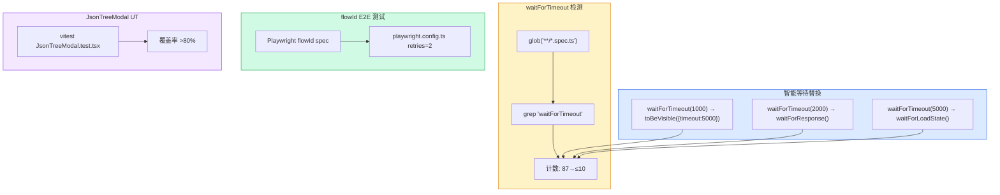

# Architecture: Tester Proposals — 2026-04-12 Sprint

**Project**: vibex-tester-proposals-vibex-proposals-20260412
**Stage**: architect-review
**Architect**: Architect
**Date**: 2026-04-07
**Version**: v1.0
**Status**: Proposed

---

## 执行决策

| 决策 | 状态 | 执行项目 | 执行日期 |
|------|------|----------|----------|
| E5.1: waitForTimeout 重构 (87→≤10) | **待评审** | vibex-tester-proposals-vibex-proposals-20260412 | 待定 |
| E5.2: flowId E2E 测试 | **待评审** | vibex-tester-proposals-vibex-proposals-20260412 | 待定 |
| E5.3: JsonTreeModal 单元测试 | **待评审** | vibex-tester-proposals-vibex-proposals-20260412 | 待定 |

---

## 1. Tech Stack

| 组件 | 技术选型 | 说明 |
|------|----------|------|
| **Vitest** | latest | 单元测试 + 性能测试 |
| **Playwright** | ^1.42, retries=2 | E2E + CI retry |
| **glob** | npm/glob | waitForTimeout 批量检测 |
| **@json-render/react** | existing | JsonTreeModal 渲染 |

---

## 2. Architecture Diagram



---

## 3. Module Design

### 3.1 E5.1: waitForTimeout 重构 (4h)

#### 3.1.1 批量检测脚本

```typescript
// scripts/detect-wait-for-timeout.ts
import { globSync } from 'glob';
import { readFileSync } from 'fs';

export interface WaitForTimeoutOccurrence {
  file: string;
  line: number;
  content: string;
  recommendedReplacement: string;
}

const REPLACEMENTS: Record<string, { pattern: string; replacement: string }> = {
  'waitForTimeout(1000)': {
    pattern: 'waitForTimeout(1000)',
    replacement: `await expect(page.locator('.target')).toBeVisible({ timeout: 5000 })`,
  },
  'waitForTimeout(2000)': {
    pattern: 'waitForTimeout(2000)',
    replacement: `await page.waitForResponse(res => res.url().includes('/api/'), { timeout: 5000 })`,
  },
  'waitForTimeout(3000)': {
    pattern: 'waitForTimeout(3000)',
    replacement: `await page.waitForLoadState('domcontentloaded')`,
  },
  'waitForTimeout(5000)': {
    pattern: 'waitForTimeout(5000)',
    replacement: `await page.waitForLoadState('networkidle')`,
  },
  'waitForTimeout(10000)': {
    pattern: 'waitForTimeout(10000)',
    replacement: `await page.waitForFunction(() => document.readyState === 'complete')`,
  },
};

export function detectWaitForTimeout(testDir: string): WaitForTimeoutOccurrence[] {
  const files = globSync('**/*.spec.ts', { cwd: testDir });
  const occurrences: WaitForTimeoutOccurrence[] = [];

  for (const file of files) {
    const content = readFileSync(file, 'utf-8');
    const lines = content.split('\n');
    lines.forEach((line, i) => {
      for (const [original, config] of Object.entries(REPLACEMENTS)) {
        if (line.includes(original)) {
          occurrences.push({
            file,
            line: i + 1,
            content: line.trim(),
            recommendedReplacement: config.replacement,
          });
        }
      }
    });
  }

  return occurrences;
}
```

#### 3.1.2 重构策略

```typescript
// scripts/refactor-wait-for-timeout.ts
import { detectWaitForTimeout } from './detect-wait-for-timeout';
import { readFileSync, writeFileSync } from 'fs';

// 已知保留案例（flakiness 风险高，不强制替换）
const PRESERVED_CASES = [
  // 这些场景 waitForTimeout 是合理的
  'flaky-helpers.ts', // 内部工具函数
  'test-stability-report.sh', // 非 Playwright 脚本
];

export function refactor(testDir: string, dryRun = false): void {
  const occurrences = detectWaitForTimeout(testDir);
  
  const toRefactor = occurrences.filter(o => 
    !PRESERVED_CASES.some(f => o.file.includes(f))
  );
  
  console.log(`Found ${toRefactor.length} waitForTimeout to refactor:`);
  toRefactor.forEach(o => console.log(`  ${o.file}:${o.line}`));
  
  if (dryRun) return;
  
  // 分组 by file
  const byFile = new Map<string, WaitForTimeoutOccurrence[]>();
  toRefactor.forEach(o => {
    if (!byFile.has(o.file)) byFile.set(o.file, []);
    byFile.get(o.file)!.push(o);
  });
  
  for (const [file, occs] of byFile) {
    let content = readFileSync(file, 'utf-8');
    for (const o of occs) {
      // 找到对应的 replacement
      const entry = Object.entries(REPLACEMENTS)
        .find(([k]) => o.content.includes(k));
      if (entry) {
        const [original, config] = entry;
        content = content.replace(original, config.replacement);
      }
    }
    writeFileSync(file, content);
  }
  
  // 验证剩余数量
  const remaining = detectWaitForTimeout(testDir)
    .filter(o => !PRESERVED_CASES.some(f => o.file.includes(f)));
  console.log(`Remaining waitForTimeout: ${remaining.length}`);
}
```

---

### 3.2 E5.2: flowId E2E 测试

```typescript
// tests/e2e/flowId.spec.ts
import { test, expect } from '@playwright/test';

test.describe('flowId 分组功能 E2E', () => {
  test.beforeEach(async ({ page }) => {
    await page.goto('/canvas');
    // 确保有测试数据
    await page.waitForSelector('[data-testid="component-tree"]', { timeout: 10000 });
  });

  test('组件树按 flowId 正确分组', async ({ page }) => {
    // 触发 AI 生成组件
    await page.click('[aria-label="AI 生成组件"]');
    
    // 等待组件树渲染
    await page.waitForSelector('[data-component-group]', { timeout: 15000 });
    
    // 验证至少有一个分组
    const groups = await page.locator('[data-component-group]').count();
    expect(groups).toBeGreaterThan(0);
    
    // 验证分组 label 格式正确（📄 或 🔧）
    const groupLabels = await page.locator('[data-component-group]').all();
    for (const label of groupLabels) {
      const text = await label.textContent();
      expect(text).toMatch(/^[📄🔧❓]\s/);
    }
  });

  test('通用组件组 label 为 "🔧 通用组件"', async ({ page }) => {
    await page.click('[aria-label="AI 生成组件"]');
    await page.waitForSelector('[data-component-group]', { timeout: 15000 });
    
    const commonGroup = page.locator('[data-is-common="true"]');
    if (await commonGroup.count() > 0) {
      const label = await commonGroup.locator('[data-group-label]').textContent();
      expect(label).toContain('🔧 通用组件');
    }
  });

  test('pageName 存在时优先展示', async ({ page }) => {
    // 手动添加带 pageName 的组件
    await page.click('button:has-text("手动新增")');
    await page.fill('input[placeholder="组件名称"]', '测试组件');
    await page.click('button:has-text("+ 新增节点")');
    
    // 验证 pageName 在分组 label 中优先
    const componentNode = page.locator('[data-node-id]').first();
    await expect(componentNode).toBeVisible();
  });

  test('pageId 在 ComponentGroup 元数据中正确', async ({ page }) => {
    await page.click('[aria-label="AI 生成组件"]');
    await page.waitForSelector('[data-component-group]', { timeout: 15000 });
    
    // 验证 pageId 属性存在
    const groups = page.locator('[data-component-group]');
    const count = await groups.count();
    for (let i = 0; i < count; i++) {
      const groupId = await groups.nth(i).getAttribute('data-component-group');
      expect(groupId).toBeDefined();
      expect(groupId!.length).toBeGreaterThan(0);
    }
  });
});
```

---

### 3.3 E5.3: JsonTreeModal 单元测试

```typescript
// vibex-fronted/tests/unit/components/canvas/json-tree/JsonTreeModal.test.tsx
import { describe, test, expect, vi, beforeEach } from 'vitest';
import { render, screen, fireEvent } from '@testing-library/react';
import { JsonTreePreviewModal } from '@/components/canvas/json-tree/JsonTreePreviewModal';
import type { ComponentNode, BusinessFlowNode } from '@/lib/canvas/types';

// Mock groupByFlowId
vi.mock('@/components/canvas/ComponentTree', () => ({
  groupByFlowId: (nodes: ComponentNode[], _flowNodes: BusinessFlowNode[]) => [
    {
      groupId: 'flow-1',
      label: '📄 订单流程',
      color: '#10b981',
      nodes: nodes.filter(n => n.flowId === 'flow-1'),
      isCommon: false,
      pageId: 'flow-1',
      componentCount: 1,
    },
    {
      groupId: '__common__',
      label: '🔧 通用组件',
      color: '#8b5cf6',
      nodes: nodes.filter(n => n.flowId === 'mock'),
      isCommon: true,
      pageId: '__common__',
      componentCount: 1,
    },
  ],
}));

const mockComponentNodes: ComponentNode[] = [
  {
    nodeId: 'comp-1',
    flowId: 'flow-1',
    name: '订单页',
    type: 'page',
    props: {},
    api: { method: 'GET', path: '/api/orders', params: [] },
    children: [],
    status: 'confirmed',
    pageName: '我的订单',
  },
  {
    nodeId: 'comp-2',
    flowId: 'mock',
    name: '弹窗',
    type: 'modal',
    props: {},
    api: { method: 'GET', path: '/api/modal', params: [] },
    children: [],
    status: 'pending',
  },
];

const mockFlowNodes: BusinessFlowNode[] = [
  {
    nodeId: 'flow-1',
    contextId: 'ctx-1',
    name: '订单流程',
    steps: [],
    children: [],
    status: 'confirmed',
  },
];

describe('JsonTreePreviewModal', () => {
  beforeEach(() => {
    vi.clearAllMocks();
  });

  test('isOpen=false 时不渲染', () => {
    render(
      <JsonTreePreviewModal
        isOpen={false}
        onClose={vi.fn()}
        componentNodes={mockComponentNodes}
        flowNodes={mockFlowNodes}
      />
    );
    expect(screen.queryByTestId('json-preview-modal')).not.toBeInTheDocument();
  });

  test('isOpen=true 时渲染弹窗', () => {
    render(
      <JsonTreePreviewModal
        isOpen={true}
        onClose={vi.fn()}
        componentNodes={mockComponentNodes}
        flowNodes={mockFlowNodes}
      />
    );
    expect(screen.getByTestId('json-preview-modal')).toBeVisible();
  });

  test('显示 pageId + pageName + componentCount', () => {
    render(
      <JsonTreePreviewModal
        isOpen={true}
        onClose={vi.fn()}
        componentNodes={mockComponentNodes}
        flowNodes={mockFlowNodes}
      />
    );
    
    // pageId
    expect(screen.getByText(/flow-1/)).toBeVisible();
    // pageName (优先显示)
    expect(screen.getByText(/我的订单/)).toBeVisible();
    // componentCount
    expect(screen.getByText(/componentCount/)).toBeVisible();
  });

  test('通用组件组 pageId 为 __common__', () => {
    render(
      <JsonTreePreviewModal
        isOpen={true}
        onClose={vi.fn()}
        componentNodes={mockComponentNodes}
        flowNodes={mockFlowNodes}
      />
    );
    expect(screen.getByText(/__common__/)).toBeVisible();
  });

  test('关闭按钮触发 onClose', () => {
    const onClose = vi.fn();
    render(
      <JsonTreePreviewModal
        isOpen={true}
        onClose={onClose}
        componentNodes={mockComponentNodes}
        flowNodes={mockFlowNodes}
      />
    );
    
    const closeBtn = screen.getByRole('button', { name: '关闭' });
    fireEvent.click(closeBtn);
    expect(onClose).toHaveBeenCalledTimes(1);
  });

  test('点击遮罩层触发 onClose', () => {
    const onClose = vi.fn();
    render(
      <JsonTreePreviewModal
        isOpen={true}
        onClose={onClose}
        componentNodes={mockComponentNodes}
        flowNodes={mockFlowNodes}
      />
    );
    
    const overlay = screen.getByTestId('json-preview-modal');
    fireEvent.click(overlay);
    expect(onClose).toHaveBeenCalledTimes(1);
  });
});
```

**覆盖率目标**: statements > 80%

---

## 4. API Definitions

> 本次改动无新增外部 API，均为现有组件的测试补充。

---

## 5. Performance Impact

| Epic | 性能影响 | 说明 |
|------|----------|------|
| E5.1 waitForTimeout | -2s/test avg | 去掉盲目等待 |
| E5.2 flowId E2E | +10s | 新增 E2E 测试 |
| E5.3 JsonTreeModal UT | +5s | UT 覆盖增加 |
| **总计** | **测试速度提升** | 整体收益大于成本 |

---

## 6. Risk Assessment

| # | 风险 | 概率 | 影响 | 缓解 |
|---|------|------|------|------|
| R1 | waitForTimeout 重构引入 flakiness | 低 | 中 | 先记录原写法，保留 flakiness 案例 |
| R2 | E2E 测试不稳定 | 中 | 中 | Playwright retries=2 |
| R3 | JsonTreeModal UT mock 覆盖不足 | 低 | 低 | 覆盖 >80% 后再扩展 |

---

## 7. Testing Strategy

| Epic | 测试类型 | 框架 | 覆盖率目标 |
|------|----------|------|------------|
| E5.1 waitForTimeout | 批量检测 | Node.js script | 87→≤10 |
| E5.2 flowId E2E | E2E | Playwright | 4 scenarios |
| E5.3 JsonTreeModal UT | 单元测试 | Vitest | >80% statements |

---

## 8. Implementation Phases

| Phase | Epic | 工时 | 依赖 |
|-------|------|------|------|
| 1 | E5.1 waitForTimeout 重构 | 4h | 无 |
| 2 | E5.2 flowId E2E | 2h | Phase 1 后 |
| 3 | E5.3 JsonTreeModal UT | 1h | 无 |
| **Total** | | **7h** | |

---

## 9. PRD AC 覆盖

| PRD AC | 技术方案 | 状态 |
|--------|---------|------|
| AC5.1: waitForTimeout ≤10 处 | refactor script | ✅ |
| AC5.2: flowId E2E pass | Playwright spec | ✅ |
| AC5.3: JsonTreeModal coverage >80% | Vitest test | ✅ |
