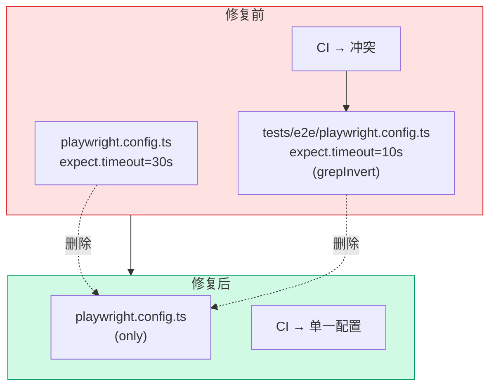
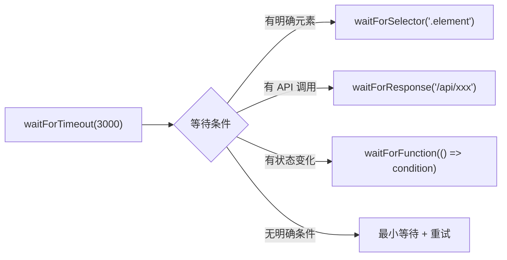

# Architecture: VibeX Tester Quality Improvement 2026-04-10

> **项目**: vibex-tester-quality-20260410  
> **作者**: Architect  
> **日期**: 2026-04-10  
> **版本**: v1.0

---

## 执行决策

| 决策 | 状态 | 执行项目 | 执行日期 |
|------|------|----------|----------|
| Playwright 单一配置 | **已采纳** | vibex-tester-quality-20260410 | 2026-04-10 |
| Vitest 单框架 | **已采纳** | vibex-tester-quality-20260410 | 2026-04-10 |
| 智能等待替代硬编码 | **已采纳** | vibex-tester-quality-20260410 | 2026-04-10 |

---

## 1. Tech Stack

| 组件 | 技术选型 | 版本 | 说明 |
|------|----------|------|------|
| **E2E** | Playwright | ^1.42 | 单一配置 |
| **Unit** | Vitest | ^1.5 | 统一测试框架 |
| **CI** | GitHub Actions | — | 统一执行 |

---

## 2. 架构图

### 2.1 Playwright 配置架构



### 2.2 waitForTimeout 替换策略



---

## 3. 配置设计

### 3.1 Playwright 单一配置

```typescript
// playwright.config.ts（唯一配置）
import { defineConfig, devices } from '@playwright/test';

export default defineConfig({
  testDir: './tests/e2e',
  timeout: 60000,           // 全局测试超时
  expect: {
    timeout: 30000,         // 断言超时（修复：从 10s → 30s）
  },
  fullyParallel: true,
  forbidOnly: !!process.env.CI,
  retries: process.env.CI ? 2 : 0,
  workers: process.env.CI ? 1 : undefined,
  reporter: [
    ['html', { outputFolder: 'playwright-report' }],
    ['json', { outputFile: 'playwright-results.json' }],
  ],
  use: {
    baseURL: process.env.PLAYWRIGHT_BASE_URL ?? 'http://localhost:3000',
    trace: 'on-first-retry',
    screenshot: 'only-on-failure',
  },
  projects: [
    {
      name: 'chromium',
      use: { ...devices['Desktop Chrome'] },
    },
  ],
  // 注意：删除 grepInvert，不再跳过任何测试
});
```

### 3.2 Vitest 配置

```typescript
// vitest.config.ts
import { defineConfig } from 'vitest/config';

export default defineConfig({
  test: {
    environment: 'node',
    globals: true,
    setupFiles: ['./src/test/setup.ts'],
    coverage: {
      provider: 'v8',
      reporter: ['text', 'json', 'html'],
      thresholds: {
        lines: 80,
        functions: 80,
        branches: 70,
      },
    },
    include: ['src/**/*.test.ts', 'src/**/*.spec.ts'],
  },
});
```

---

## 4. 修复详细设计

### 4.1 stability.spec.ts 路径修复

```typescript
// tests/e2e/stability.spec.ts
import * as path from 'path';
import * as fs from 'fs';

const TEST_DIR = path.resolve(__dirname);  // 指向 tests/e2e/

test('E2E test directory structure is valid', () => {
  // 修复：使用 __dirname 而非 ./e2e/
  const e2eDir = path.resolve(__dirname, '..');
  expect(fs.existsSync(e2eDir)).toBe(true);
  
  // 检查实际文件存在
  const specFiles = fs.readdirSync(e2eDir)
    .filter(f => f.endsWith('.spec.ts'));
  expect(specFiles.length).toBeGreaterThan(0);
});
```

### 4.2 waitForTimeout 替换模式

```typescript
// 替换策略映射
const REPLACE_MAP = {
  // conflict-resolution.spec.ts
  'page.waitForTimeout(1000)': `await expect(page.locator('.selector')).toBeVisible({ timeout: 5000 })`,
  'page.waitForTimeout(2000)': `await page.waitForResponse(res => res.url().includes('/api/'))`,
  
  // 通用模式
  'page.waitForTimeout(n)': `await page.waitForFunction(() => document.readyState === 'complete')`,
};
```

---

## 5. 验收标准

| 检查项 | 命令 | 目标 |
|--------|------|------|
| Playwright 配置唯一 | `find . -name "playwright.config.ts" | wc -l` | 1 |
| expect timeout | `grep "expect.*timeout" playwright.config.ts` | 30000 |
| 无 grepInvert | `grep "grepInvert" playwright.config.ts` | 无结果 |
| stability.spec 路径 | `grep "./e2e/" tests/e2e/stability.spec.ts` | 无结果 |
| 无 waitForTimeout | `grep -rn "waitForTimeout" tests/e2e/ | wc -l` | 0 |
| Vitest 通过 | `pnpm vitest run` | 全部通过 |

---

*文档版本: v1.0 | 最后更新: 2026-04-10*
