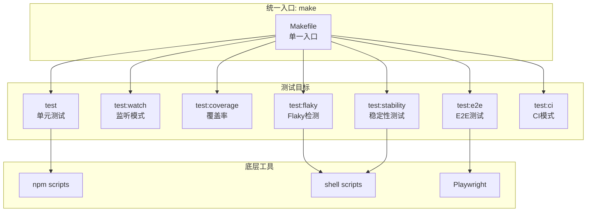

# Architecture: Test Commands Unification

> **项目**: vibex-tester-test-commands  
> **Architect**: Architect Agent  
> **日期**: 2026-04-07  
> **版本**: v1.0  
> **状态**: Proposed

---

## 1. 概述

### 1.1 问题陈述

测试命令分散在 30+ npm scripts 和多个 shell 脚本中，Tester/Developer 无法快速找到对应命令。

### 1.2 技术目标

| 目标 | 描述 | 优先级 |
|------|------|--------|
| AC1 | `make help` 列出所有命令 | P0 |
| AC2 | 所有测试场景可通过 make 访问 | P0 |
| AC3 | CI 使用 make 命令 | P1 |

---

## 2. 系统架构

### 2.1 Makefile 架构



---

## 3. 详细设计

### 3.1 E1: Makefile 统一入口

```makefile
# Makefile
# 统一测试命令入口

.PHONY: help test test:watch test:coverage test:e2e test:flaky test:stability test:ci

# ============================================
# Meta
# ============================================
help: ## 显示所有可用命令
	@echo "VibeX Test Commands"
	@echo "=================="
	@echo ""
	@echo "Usage: make <target>"
	@echo ""
	@echo "Targets:"
	@awk 'BEGIN {FS = ":.*?## "} /^[a-zA-Z_-]+:.*?## / {printf "  %-20s %s\n", $$1, $$2}' $(MAKEFILE_LIST)

# ============================================
# Unit Tests
# ============================================
test: ## 运行单元测试
	pnpm test

test:watch: ## 运行单元测试（监听模式）
	pnpm test:watch

test:coverage: ## 运行单元测试（覆盖率）
	pnpm test:coverage

# ============================================
# E2E Tests
# ============================================
test:e2e: ## 运行 E2E 测试
	pnpm playwright test

test:e2e:ui: ## 运行 E2E 测试（UI模式）
	pnpm playwright test --ui

test:e2e:debug: ## 运行 E2E 测试（调试模式）
	pnpm playwright test --debug

# ============================================
# Special Tests
# ============================================
test:flaky: ## 检测 Flaky 测试
	bash scripts/flaky-detector.sh

test:stability: ## 稳定性测试报告
	bash scripts/stability-report.sh

# ============================================
# CI
# ============================================
test:ci: ## CI 模式（单元+E2E）
	pnpm test
	pnpm test:e2e

# ============================================
# Utilities
# ============================================
test:clean: ## 清理测试缓存
	rm -rf coverage/ .test-results/ playwright-report/ test-results/
	pnpm test --clearMocks

test:update-snapshots: ## 更新快照
	pnpm test --updateSnapshots
```

### 3.2 E2: TEST_COMMANDS.md

```markdown
# Test Commands — VibeX

## 快速参考

| 命令 | 说明 | 前置条件 |
|------|------|----------|
| `make test` | 单元测试 | - |
| `make test:watch` | 监听模式 | - |
| `make test:coverage` | 覆盖率 | - |
| `make test:e2e` | E2E 测试 | `pnpm install` |
| `make test:flaky` | Flaky 检测 | - |
| `make test:stability` | 稳定性报告 | - |
| `make test:ci` | CI 模式 | - |

## 详细说明

### make test
运行所有单元测试。

**命令**: `pnpm test`
**输出**: `PASS/FAIL` + 覆盖率报告
**输出位置**: `coverage/`

### make test:e2e
运行 Playwright E2E 测试。

**命令**: `pnpm playwright test`
**前置条件**: `pnpm install && npx playwright install`
**输出**: `playwright-report/`
**输出位置**: `test-results/`
```

### 3.3 E3: CI 集成

```yaml
# .github/workflows/test.yml
name: Tests

on: [push, pull_request]

jobs:
  unit-test:
    runs-on: ubuntu-latest
    steps:
      - uses: actions/checkout@v4
      - run: pnpm install
      - run: make test:coverage

  e2e-test:
    runs-on: ubuntu-latest
    steps:
      - uses: actions/checkout@v4
      - run: pnpm install
      - run: npx playwright install --with-deps
      - run: make test:e2e

  ci-test:
    runs-on: ubuntu-latest
    if: github.event_name == 'push'
    steps:
      - uses: actions/checkout@v4
      - run: pnpm install
      - run: make test:ci
```

### 3.4 E4: npm scripts 清理

```json
// package.json — 清理后的 scripts
{
  "scripts": {
    "test": "vitest run",
    "test:watch": "vitest",
    "test:coverage": "vitest run --coverage",
    "test:e2e": "playwright test",
    "test:e2e:ui": "playwright test --ui",
    "test:update-snapshots": "vitest run --updateSnapshots"
  }
}
```

---

## 4. 性能影响评估

| 指标 | 影响 | 说明 |
|------|------|------|
| `make help` | < 100ms | 仅读取文件 |
| `make test` | ~30s | 单元测试时间 |
| `make test:e2e` | ~2-5min | E2E 测试时间 |
| **总计** | **CI ~5min** | 无额外开销 |

---

## 5. 技术审查

### 5.1 PRD 验收标准覆盖

| PRD AC | 技术方案 | 缺口 |
|---------|---------|------|
| AC1: `make help` | ✅ Makefile help target | 无 |
| AC2: 所有测试场景 | ✅ 7 个 make targets | 无 |
| AC3: CI 使用 make | ✅ test:ci target | 无 |

### 5.2 风险点

| 风险 | 等级 | 缓解 |
|------|------|------|
| Windows 不支持 make | 🟡 中 | 提供 npm scripts 备选 |
| shell 脚本跨平台 | 🟡 中 | 使用 bash 或 WSL |
| Playwright 依赖安装慢 | 🟡 中 | CI 缓存 playwright |

---

## 6. 验收标准映射

| Epic | Story | 验收标准 | 实现 |
|------|-------|----------|------|
| E1 | S1.1 | `make help` 列出所有命令 | Makefile |
| E2 | S2.1 | TEST_COMMANDS.md 完整 | docs/TEST_COMMANDS.md |
| E3 | S3.1 | CI 使用 `make test:ci` | test.yml |
| E4 | S4.1 | 命名统一为 test:* | package.json |

---

*本文档由 Architect Agent 生成 | 2026-04-07*
