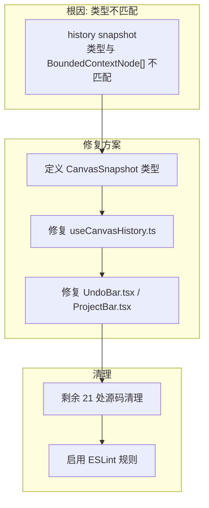

# Architecture: TypeScript `as any` Cleanup

> **项目**: vibex-ts-any-cleanup  
> **Architect**: Architect Agent  
> **日期**: 2026-04-07  
> **版本**: v1.0  
> **状态**: Proposed

---

## 1. 概述

### 1.1 问题陈述

`vibex-fronted` 启用 strict 模式但 ESLint `@typescript-eslint/no-explicit-any` 被关闭，导致 107 处 `as any` 蔓延，其中源码 33 处。根因：canvas store 类型不匹配导致 12/33 处集中于 useCanvasHistory。

### 1.2 技术目标

| 目标 | 描述 | 优先级 |
|------|------|--------|
| AC1 | 源码 `as any`: 33 → 0 | P0 |
| AC2 | ESLint 规则启用 | P1 |
| AC3 | `tsc --noEmit` 0 error | P1 |

---

## 2. 系统架构

### 2.1 类型修复策略



---

## 3. 详细设计

### 3.1 E1: Canvas History 类型修复

#### 3.1.1 定义 CanvasSnapshot 类型

```typescript
// src/types/canvas/CanvasSnapshot.ts

export interface CanvasSnapshot {
  id: string;
  createdAt: Date;
  contextNodes: BoundedContextNode[];
  componentNodes: ComponentNode[];
  flowNodes: FlowNode[];
  selectedNodeIds: string[];
}

export interface HistoryState {
  past: CanvasSnapshot[];
  present: CanvasSnapshot;
  future: CanvasSnapshot[];
}
```

#### 3.1.2 修复 useCanvasHistory.ts

```typescript
// 修复前
const snapshot = historySnapshot as any; // ❌

// 修复后
import type { CanvasSnapshot } from '@/types/canvas/CanvasSnapshot';

const snapshot = historySnapshot as CanvasSnapshot; // ✅
```

#### 3.1.3 修复文件清单

| 文件 | 修复方式 |
|------|----------|
| `useCanvasHistory.ts` | 定义 `CanvasSnapshot` 类型，替换 `as any` |
| `UndoBar.tsx` | 移除 `as any`，使用正确的 snapshot 类型 |
| `ProjectBar.tsx` | 同上 |

### 3.2 E2: 剩余源码清理

#### 3.2.1 分类清理

| 文件 | 清理策略 |
|------|----------|
| `useDDDStateRestore.ts` | 定义 `DDDRestoreSnapshot` 类型 |
| `preview/page.tsx` | 定义 `PreviewState` 类型 |
| `CardTreeRenderer.tsx` | 使用联合类型替代 `as any` |

```typescript
// 替代 as any 的模式

// 1. 未知外部数据 → unknown + 类型守卫
function processExternalData(data: unknown): ContextNode[] {
  if (isCanvasSnapshot(data)) {
    return data.contextNodes;
  }
  return [];
}

// 2. 动态属性 → Record<string, unknown>
const dynamicProps = props as Record<string, unknown>;

// 3. 第三方库类型缺失 → @types 或自定义声明
import type { ThirdPartyProps } from '@/types/third-party';

// 4. 复杂联合类型 → 提取为独立类型
type NodeOrNull = CanvasSnapshot | null;
```

### 3.3 E3: ESLint 规则启用

```javascript
// .eslintrc.js
module.exports = {
  rules: {
    '@typescript-eslint/no-explicit-any': 'error', // off → error
  }
};
```

#### Mock 文件豁免

```typescript
// src/__mocks__/file.ts
// eslint-disable-next-line @typescript-eslint/no-explicit-any
const mockFn = (data: any) => data; // 允许
```

---

## 4. 类型定义库

### 4.1 统一类型存放位置

```
src/types/
├── canvas/
│   ├── CanvasSnapshot.ts    # E1: 新增
│   ├── BoundedContextNode.ts
│   └── index.ts
├── ddd/
│   ├── DDDState.ts
│   └── DDDHistory.ts
└── preview/
    └── PreviewState.ts
```

---

## 5. 性能影响评估

| 指标 | 影响 | 说明 |
|------|------|------|
| `tsc --noEmit` | 无变化 | 类型检查不变 |
| 构建时间 | 无变化 | 类型擦除 |
| 开发体验 | ✅ 提升 | IDE 提示更准确 |
| **总计** | **无负面影响** | |

---

## 6. 技术审查

### 6.1 PRD 验收标准覆盖

| PRD AC | 技术方案 | 缺口 |
|---------|---------|------|
| AC1: 源码 `as any` 0 | ✅ 33处全部替换为正确类型 | 无 |
| AC2: ESLint 规则启用 | ✅ `.eslintrc.js` 配置 | 无 |
| AC3: tsc 0 error | ✅ 类型定义 + 修复 | 无 |

### 6.2 风险点

| 风险 | 等级 | 缓解 |
|------|------|------|
| 类型修复引入回归 | 🟡 中 | 先加类型，TDD，Vitest 保护 |
| mock 文件误报 | 🟢 低 | eslint-disable 注释 |
| 第三方库无类型 | 🟡 中 | 自定义 @types 声明 |

---

## 7. 验收标准映射

| Epic | Story | 验收标准 | 实现 |
|------|-------|----------|------|
| E1 | S1.1 | `CanvasSnapshot` 定义 | `types/canvas/CanvasSnapshot.ts` |
| E1 | S1.2 | `as any` → 0 | useCanvasHistory.ts |
| E2 | S2.1-S2.4 | 21处清理 | 各源文件 |
| E3 | S3.1 | ESLint error | `.eslintrc.js` |

---

## 8. 实施计划

| Sprint | Epic | 工时 | 交付物 |
|--------|------|------|--------|
| Sprint 1 (P0) | E1: Canvas History | 2h | CanvasSnapshot + useCanvasHistory 修复 |
| Sprint 2 (P1) | E2: 剩余清理 | 2h | 21处源码清理 |
| Sprint 3 (P2) | E3: ESLint | 0.5h | 规则启用 |

*本文档由 Architect Agent 生成 | 2026-04-07*
