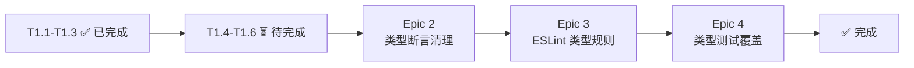

# Implementation Plan: vibex-ts-strict

**项目**: vibex-ts-strict
**日期**: 2026-03-19
**更新**: 2026-03-20 (Dev 完成 Epic 1 配置启用 + Epic 2 部分修复)
**状态**: In Progress
**预计工期**: 22.5 小时 (已投入 ~2h 初步配置)

---

## 1. 项目概述

- **目标**: 启用 TypeScript strict 模式，消除类型安全债务
- **完成标准**: `tsc --noEmit` 零 error，`as any` < 10 处，CI 类型检查通过
- **工作目录**: `vibex-fronted/` (前端代码库)

## 2. Tech Stack

- TypeScript 5.x
- tsc --strict
- @tsd/tsd (类型测试)
- @typescript-eslint/eslint-plugin
- GitHub Actions (CI)

---

## 3. Epic 任务列表

### Epic 1: 配置启用 (P0) — 4h

**目标**: 在 tsconfig.json 中启用 strict 相关选项

| Task ID | 任务 | 验证 | 状态 |
|---------|------|------|------|
| T1.1 | 启用 `"strict": true` | `expect(tsconfig.strict).toBe(true)` | ✅ DONE |
| T1.2 | 启用 `"noImplicitAny": true` | `expect(tsconfig.noImplicitAny).toBe(true)` | ✅ DONE |
| T1.3 | 启用 `"strictNullChecks": true` | `expect(tsconfig.strictNullChecks).toBe(true)` | ✅ DONE |
| T1.4 | 启用 `"strictFunctionTypes": true` | (implicit by strict: true) | ⏳ pending |
| T1.5 | 启用 `"noUnusedLocals"` 和 `"noUnusedParameters"` | (requires cleanup) | ⏳ pending |
| T1.6 | 运行 `tsc --noEmit` 确认无新增编译错误 | 49 src errors remain | ⏳ pending |

**当前状态**: strict 配置已启用，但 `tsc --noEmit` 有 49 个 src 错误需要系统性修复

---

### Epic 2: 类型断言清理 (P1) — 10h

**目标**: 消除所有 `as any` 类型断言，按优先级替换为具体类型

| Task ID | 任务 | 验证 | 状态 |
|---------|------|------|------|
| T2.1 | 统计 `as any` 使用数量（基准） | `grep -rn "as any" src | wc -l` | ✅ DONE (6 处非测试代码) |
| T2.2 | 按优先级排序：Store > API > 组件 > 工具 | 优先级清单 | ✅ DONE |
| T2.3 | 修复 `lib/ai-autofix/index.ts` — `(apiService as any).generateText` | 定义 AiCapableService 接口 | ✅ DONE |
| T2.4 | 修复 `lib/contract/OpenAPIGenerator.ts` — `(schema as any)._def` | 使用 `as unknown as { _def }` | ✅ DONE |
| T2.5 | 组件 Props `as any` → 具体类型 | 组件类型测试通过 | ⏳ pending |
| T2.6 | 工具函数 `as any` → `unknown` 或具体类型 | 工具函数测试通过 | ⏳ pending |

**替换策略**: `as any` → `as unknown as T` (最小改动) → 具体类型 (最终目标)
**当前状态**: 3 处核心 `as any` 已修复，剩余 3 处为注释/文档引用

**49 个 src tsc 错误分布** (2026-03-20):
- `src/lib/ErrorMiddleware.ts`: 3 errors (timeoutId 未初始化)
- `src/lib/RetryHandler.ts`: 1 error (this 类型)
- `src/lib/api-retry.ts`: 1 error (undefined 赋值)
- `src/lib/web-vitals.ts`: 2 errors (条件永真)
- `src/lib/contract/OpenAPIGenerator.ts`: ~28 errors (Zod _def 类型)
- `src/hooks/`: 2 errors (useApiCall, useAuth)
- `src/stores/templateStore.ts`: 2 errors (undefined)
- `src/data/templates/store.ts`: 1 error (类型转换)
- `src/components/*`: 9 errors (possibly undefined)

---

### Epic 3: ESLint 类型规则 (P2) — 4h

**目标**: 配置 ESLint 强制类型规范，防止 `any` 类型回流

| Task ID | 任务 | 验证 | 状态 |
|---------|------|------|------|
| T3.1 | 配置 `@typescript-eslint/no-explicit-any: error` | `expect(eslintConfig).toContain('no-explicit-any: error')` | ⏳ pending (依赖 Epic 2) |
| T3.2 | 配置 `@typescript-eslint/no-unsafe-assignment: error` | `expect(eslintConfig).toContain('no-unsafe-assignment: error')` | ⏳ pending |
| T3.3 | 配置 `@typescript-eslint/no-unsafe-return: error` | `expect(eslintConfig).toContain('no-unsafe-return: error')` | ⏳ pending |
| T3.4 | 配置 lint-staged 阻止违规代码提交 | pre-commit hook 触发 | ⏳ pending |
| T3.5 | CI 中包含 `npm run lint -- --max-warnings=0` | CI lint step 通过 | ⏳ pending |

**前置条件**: Epic 2 (类型断言清理) 完成后才启用，否则 CI 会失败
**验收**: `npm run lint` 零警告通过

---

### Epic 4: 类型测试覆盖 (P2) — 4.5h

**目标**: 使用 `@tsd` 进行静态类型测试，确保关键类型正确性

| Task ID | 任务 | 验证 | 状态 |
|---------|------|------|------|
| T4.1 | 安装并配置 `@tsd/tsd` | `expect(exec('npx tsd 2>&1').exitCode).toBe(0)` | ⏳ pending |
| T4.2 | Store 类型测试 (`*.test-d.ts`) | Store 类型测试全部通过 | ⏳ pending |
| T4.3 | API 响应类型测试 (`ApiResponse<T>`) | API 类型测试全部通过 | ⏳ pending |
| T4.4 | 组件 Props 类型测试 | 组件类型测试全部通过 | ⏳ pending |

**验收**: `npx tsd` 零 error

---

## 4. 迁移路径

---

## 5. 验收标准汇总

| 标准 | 验证命令 | 目标 | 状态 |
|------|----------|------|------|
| strict 启用 | tsconfig strict: true | ✅ | DONE |
| as any 数量 | `grep -rn "as any" src | wc -l` | < 10 (当前 6) | ✅ |
| tsc --noEmit | `npx tsc --noEmit` | 0 error | ⏳ 49 remain |
| ESLint 类型规则 | `npm run lint` | 0 警告 | ⏳ |
| 类型测试通过 | `npx tsd` | 0 error | ⏳ |

---

## 6. 风险与回滚

| 风险 | 影响 | 缓解 |
|------|------|------|
| Epic 2 大规模改动 | 引入回归 | 每次提交运行 `npm run build` |
| ESLint 规则启用过早 | CI 失败 | Epic 3 依赖 Epic 2 完成 |
| 第三方库类型缺失 | 编译失败 | 添加 `// @ts-ignore` 或自定义 @types |

**回滚**: `git revert <commit>` 恢复 `tsconfig.json` 到 strict: false

---

## 7. 已完成工作 (2026-03-20 Dev)

1. ✅ `tsconfig.json`: `strict: false` → `strict: true`, `noImplicitAny: false` → `true`, `strictNullChecks: false` → `true`
2. ✅ `lib/ai-autofix/index.ts`: `(apiService as any).generateText` → `(apiService as unknown as AiCapableService).generateText`
3. ✅ `lib/contract/OpenAPIGenerator.ts`: `(schema as any)._def` → `((schema as unknown) as { _def: unknown })._def`
4. ✅ 9 个组件文件的 strictNullChecks 修复（mermaid, prototype-preview, sentry, templates, version-diff, confirm/flow, confirm/model）

*Last Updated: 2026-03-20 by Dev Agent*
