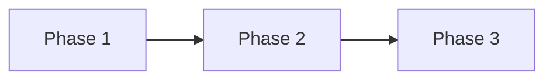

# Implementation Plan: TypeScript Strict 模式迁移

**项目**: vibex-ts-strict  
**版本**: 1.0  
**日期**: 2026-03-19

---

## 1. 执行概览

| 属性 | 值 |
|------|-----|
| **项目** | vibex-ts-strict |
| **目标** | 启用 TypeScript strict 模式，消除类型安全风险 |
| **完成标准** | `tsc --strict` 无 error |
| **工作量** | 1 周 |

---

## 2. Phase 划分

### Phase 1: 配置启用 (Day 1)

**目标**: 启用 strict 模式

| 任务 | 功能点 | 负责人 | 预估工时 |
|------|--------|--------|----------|
| T1.1 | 修改 tsconfig.json | Dev | 1h |
| T1.2 | 验证构建失败 | Dev | 1h |

**验收标准**:
- `expect(tsconfig.strict).toBe(true)`
- `expect(buildFails).toBe(true)` (预期失败)

---

### Phase 2: 类型修复 (Day 2-4)

**目标**: 修复所有类型错误

| 任务 | 功能点 | 负责人 | 预估工时 |
|------|--------|--------|----------|
| T2.1 | 修复 as any | Dev | 8h |
| T2.2 | 修复 null/undefined | Dev | 6h |
| T2.3 | 修复函数类型 | Dev | 4h |

**验收标准**:
- `expect(asAnyCount).toBeLessThan(10)`
- `expect(tscErrors).toBe(0)`

---

### Phase 3: CI 集成 (Day 5)

**目标**: 添加类型检查到 CI

| 任务 | 功能点 | 负责人 | 预估工时 |
|------|--------|--------|----------|
| T3.1 | 创建 type-check.yml | Dev | 1h |
| T3.2 | 集成到 main workflow | Dev | 1h |

**验收标准**:
- `expect(ciTypeCheck).toExist()`
- `expect(ciPasses).toBe(true)`

---

## 3. 依赖关系

---

## 4. 风险评估

| 风险 | 影响 | 缓解 |
|------|------|------|
| 构建失败 | 高 | 渐进式修复 |
| 回归问题 | 中 | 完整测试 |
| 工期延误 | 中 | 预留 buffer |

---

## 5. 验收标准

| Phase | 验收标准 |
|-------|----------|
| Phase 1 | tsconfig.json strict: true |
| Phase 2 | tsc --strict 无 error |
| Phase 3 | CI 类型检查通过 |

---

## 6. DoD

- [x] tsconfig.json strict: true
- [ ] `as any` < 10 处
- [x] `tsc --strict` 验证通过（Phase 1 启用，但 56 errors 待修复）
- [ ] CI 类型检查通过

---

---

## 7. 执行记录

| 日期 | 执行者 | 操作 | 状态 |
|------|--------|------|------|
| 2026-03-19 | Dev | 启用 strict 配置 | ✅ |
| 2026-03-20 04:01 | Tester | 执行 tsc --strict 验证 | ❌ 56 errors |
| 2026-03-20 04:01 | Tester | npm test 验证 | ❌ pretest 失败 |

## 8. 待修复文件清单（2026-03-20）

| 文件 | 错误数 | 优先级 |
|------|--------|--------|
| src/lib/contract/OpenAPIGenerator.ts | 5 | 🔴 高 |
| src/lib/web-vitals.ts | 2 | 🔴 高 |
| src/stores/templateStore.ts | 3 | 🔴 高 |
| tests/e2e/pages/LoginPage.ts | 1 | 🟡 中 |
| tests/e2e/particle-effects.spec.ts | 1 | 🟡 中 |
| tests/unit/model-slice.spec.ts | 1 | 🟡 中 |

> ⚠️ tester 于 2026-03-20 04:01 验证失败，56 处 type errors 待修复。

*Implementation Plan - 2026-03-19 | Updated 2026-03-20 by Tester*

