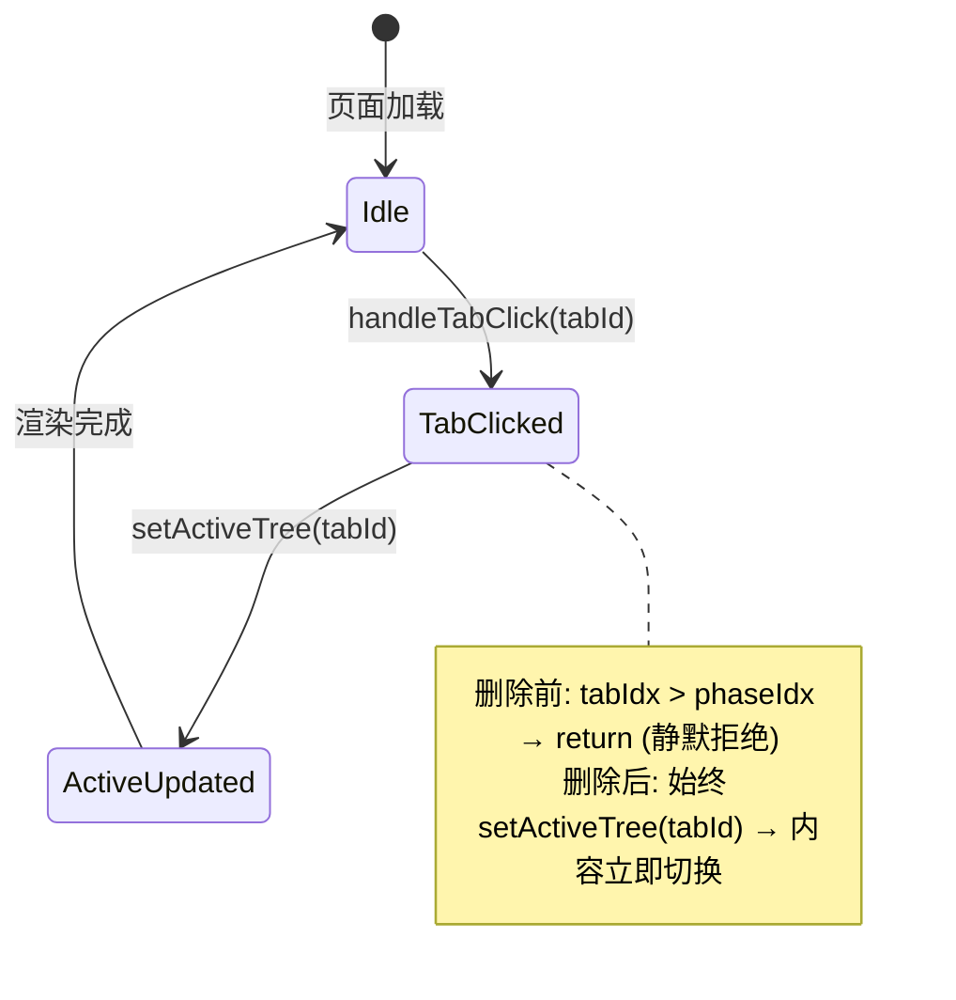
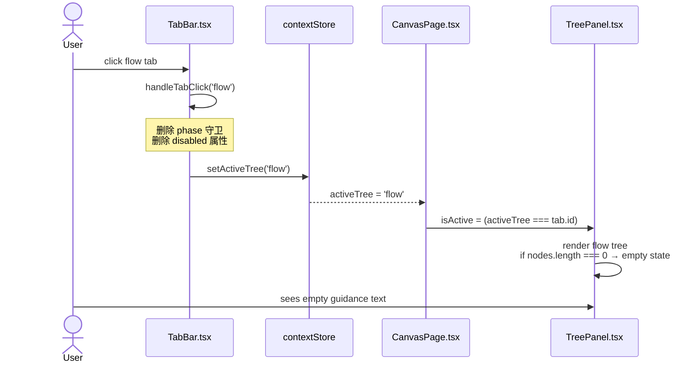

# VibeX TabBar 无障碍化 — 架构设计文档

**项目**: vibex
**阶段**: design-architecture
**Architect**: architect
**日期**: 2026-04-13
**状态**: ✅ 已完成

---

## 执行决策

- **决策**: 已采纳
- **执行项目**: team-tasks vibex / tab-bar-unified
- **执行日期**: 2026-04-13
- **推荐方案**: 方案 A（TabBar 移除 disabled + 空状态提示）

---

## 1. Tech Stack

| 类别 | 选型 | 版本 | 理由 |
|------|------|------|------|
| 框架 | Next.js | 16.2.0 | 现有依赖，不升级 |
| UI 库 | React | 19.2.3 | 现有依赖，不升级 |
| 语言 | TypeScript | ^5 | strict 模式，不改变配置 |
| 状态管理 | Zustand | 4.5.7 | 三树 store 已使用，无需改动 |
| 单元测试 | Vitest | 4.1.2 | 现有测试框架 |
| E2E 测试 | Playwright | 1.59.0 | 现有测试框架 |
| CSS | CSS Modules | — | 现有模式，不引入 Tailwind |

**约束**: 不引入新依赖。所有改动仅涉及组件逻辑层和 CSS Module。

---

## 2. 架构图（Mermaid）

### 2.1 TabBar 状态机



### 2.2 三树渲染架构

```mermaid
flowchart TD
  subgraph "TabBar 层"
    TB[TabBar.tsx<br/>4 tabs: context/flow/component/prototype]
  end

  subgraph "CanvasPage 层"
    CP[CanvasPage.tsx<br/>desktop: TabBar 组件<br/>mobile: 内联 tabBar]
  end

  subgraph "Store 层 (Zustand)"
    CS[contextStore<br/>activeTree / setActiveTree]
    FS[flowStore<br/>flowNodes]
    CmS[componentStore<br/>componentNodes]
  end

  subgraph "Panel 层"
    TP[TreePanel.tsx<br/>isActive 判断渲染]
    CP1[ContextTreePanel]
    FP[FlowTreePanel]
    CmP[ComponentTreePanel]
    PP[PrototypeQueuePanel]
  end

  TB -->|onClick| CP
  CP -->|setActiveTree| CS
  CS -->|activeTree| TP
  FS -->|flowNodes| FP
  CmS -->|componentNodes| CmP

  CS -->|空判断| TP
  FS -->|空判断| FP
  CmS -->|空判断| CmP

  note for TB "删除: isLocked / disabled / phase guard\n保留: isActive 判断 / badge / onClick"
```

### 2.3 Tab 切换数据流



---

## 3. 模块划分

### 3.1 TabBar.tsx — 改动范围

**文件**: `vibex-fronted/src/components/canvas/TabBar.tsx`

| 行号 | 改动类型 | 说明 |
|------|----------|------|
| 37-42 | **删除** | `isLocked` 变量、`disabled={isLocked}`、`aria-disabled={isLocked}` |
| 43-46 | **删除** | `className` 中 `isLocked ? styles.tabLocked : ''` 条件 |
| 47-48 | **删除** | `title` 中的 `isLocked` 三元表达式 |
| 52-55 | **删除** | `handleTabClick` 中 `if (tabIdx > phaseIdx) return;` 守卫 |
| ~73 | **保留** | `aria-selected={isActive}` 判断逻辑不变 |
| ~74-76 | **保留** | `badge` 渲染逻辑不变 |
| ~77-87 | **修改** | `<button>` 标签：删除 `disabled`/`aria-disabled`，其余保留 |

**保留逻辑**:
- `isActive` 判断：`phase === 'prototype'` ? ... : `activeTree === tab.id || (activeTree === null && tab.id === 'context')`
- Tab badge 数量显示
- `onTabChange` callback
- `role="tab"` / `role="tablist"` ARIA 属性

### 3.2 CanvasPage.tsx — 移动端改动

**文件**: `vibex-fronted/src/components/canvas/CanvasPage.tsx`

| 行号 | 改动类型 | 说明 |
|------|----------|------|
| ~631-648 | **检查** | 移动端内联 `tabBar` — 确认无 `disabled` 逻辑（如有则删除） |
| ~631-648 | **新增** | `prototype` tab（🚀）与 desktop TabBar 保持一致 |

**移动端当前状态**: 经核查，`useTabMode` 内联 tab bar（第631-648行）**目前没有 disabled 逻辑**，仅显示 context/flow/component 三 tab。需确认是否与 desktop TabBar TABS 数组一致（含 prototype tab）。

### 3.3 TreePanel.tsx — 空状态改造

**文件**: `vibex-fronted/src/components/canvas/TreePanel.tsx`

| 行号 | 改动类型 | 说明 |
|------|----------|------|
| ~157-159 | **修改** | 空状态文案替换（见下表） |

**空状态文案变更**:

| 树类型 | 现状文案 | 改为 |
|--------|----------|------|
| context | "输入需求后 AI 将生成限界上下文" | **"请先在需求录入阶段输入需求"** |
| flow | "确认上下文后自动生成流程树" | **"请先确认上下文节点，流程将自动生成"** |
| component | "确认流程后自动生成组件树" | **"请先完成流程树，组件将自动生成"** |

---

## 4. 接口 / Props 定义

### 4.1 TabBar Props（不变）

```typescript
interface TabBarProps {
  /** Callback when tab changes */
  onTabChange?: (tab: TreeType) => void;
}
// ✅ 不变，向后兼容
```

### 4.2 TreePanel Props（不变）

```typescript
interface TreePanelProps {
  tree: TreeType;
  title: string;
  nodes: TreeNode[];
  collapsed: boolean;
  isActive: boolean;
  onToggleCollapse: () => void;
  onNodeConfirm?: (nodeId: string) => void;
  children?: React.ReactNode;
  actions?: React.ReactNode;
  headerActions?: React.ReactNode;
  onNodeClick?: (nodeId: string) => void;
}
// ✅ 不变，空状态文案从组件内部硬编码（不需要外部传入）
```

---

## 5. 数据流

### 5.1 Tab 切换流程

```
用户点击 tab
  ↓
TabBar.handleTabClick(tabId)
  ↓ (删除 phase 守卫)
setActiveTree(tabId)  ← Zustand action
  ↓
contextStore.activeTree 更新
  ↓
CanvasPage 重新渲染
  ↓
TreePanel.isActive 判断
  ↓
Panel 渲染内容:
  - nodes.length > 0 → 渲染树
  - nodes.length === 0 → 渲染空状态引导文案
```

### 5.2 数据持久性保证

| Store | 数据 | 切换 Tab 后是否保留 |
|-------|------|---------------------|
| `contextStore.contextNodes` | 上下文节点数组 | ✅ 保留（Zustand 持久化） |
| `flowStore.flowNodes` | 流程节点数组 | ✅ 保留（Zustand 持久化） |
| `componentStore.componentNodes` | 组件节点数组 | ✅ 保留（Zustand 持久化） |
| `sessionStore.prototypeQueue` | 原型队列 | ✅ 保留（独立于 activeTree） |

**关键**: 三树数据存储在各自 Zustand store 中，`activeTree` 只控制哪个面板视觉激活，不卸载数据。

---

## 6. 测试策略

### 6.1 单元测试（Vitest）

**文件**: `vibex-fronted/tests/unit/components/canvas/TabBar.unittest.tsx`（新建）

```typescript
import { render, screen } from '@testing-library/react';
import userEvent from '@testing-library/user-event';
import { TabBar } from '@/components/canvas/TabBar';

describe('TabBar — accessibility changes', () => {
  test('AC-1: 4 个 tab 均无 disabled 属性', () => {
    render(<TabBar />);
    const tabs = screen.getAllByRole('tab');
    expect(tabs).toHaveLength(4);
    tabs.forEach((tab) => {
      expect(tab).not.toBeDisabled();
    });
  });

  test('AC-7: 只有一个 tab 处于 active（aria-selected=true）', () => {
    render(<TabBar />);
    const selected = screen.getAllByRole('tab', { selected: true });
    expect(selected).toHaveLength(1);
  });

  test('AC-6: prototype tab 始终可点击（不受 phase 锁定）', () => {
    render(<TabBar />);
    const prototypeTab = screen.getByRole('tab', { name: /原型/i });
    expect(prototypeTab).not.toBeDisabled();
  });

  test('点击任意 tab，handleTabClick 无 phase 守卫抛错', async () => {
    const user = userEvent.setup();
    render(<TabBar />);
    const flowTab = screen.getByRole('tab', { name: /流程/i });
    await user.click(flowTab);
    // 无守卫时，flow tab 应该可点击
    expect(flowTab).toBeDefined();
  });
});
```

**覆盖率目标**: TabBar.tsx > 90%

### 6.2 E2E 测试（Playwright）

**文件**: `vibex-fronted/tests/e2e/tab-switching.spec.ts`（新建）

```typescript
import { test, expect } from '@playwright/test';

test.describe('TabBar 无障碍化 — AC-1~AC-8 全覆盖', () => {
  test.beforeEach(async ({ page }) => {
    await page.goto('/canvas');
    // 确保 input 阶段（phase=input）
    await page.evaluate(() => {
      // 强制设置 phase 为 input（通过 store 或 URL）
    });
  });

  test('AC-1: 4 个 tab 均无 disabled 属性', async ({ page }) => {
    await page.goto('/canvas');
    const tabs = page.locator('[role="tab"]');
    await expect(tabs).toHaveCount(4);
    for (const tab of await tabs.all()) {
      await expect(tab).not.toBeDisabled();
    }
  });

  test('AC-2: 点击任意 tab，内容立即切换，响应 < 100ms', async ({ page }) => {
    await page.goto('/canvas');
    const start = Date.now();
    await page.click('[role="tab"]:has-text("流程")');
    await expect(page.locator('[role="tab"][aria-selected="true"]')).toHaveAttribute('aria-label', /流程/);
    expect(Date.now() - start).toBeLessThan(100);
  });

  test('AC-3: 空树显示引导提示而非空白', async ({ page }) => {
    await page.goto('/canvas');
    // phase=input → flow tree 为空
    await page.click('[role="tab"]:has-text("流程")');
    const emptyState = page.locator('text=请先确认上下文节点，流程将自动生成');
    await expect(emptyState).toBeVisible();
  });

  test('AC-4: PhaseIndicator 不受 TabBar 改动影响', async ({ page }) => {
    await page.goto('/canvas');
    const indicator = page.locator('[data-testid="phase-indicator"]');
    await expect(indicator).toBeVisible();
    await page.click('[role="tab"]:has-text("流程")');
    await expect(indicator).toBeVisible(); // 切换后仍存在
  });

  test('AC-5: 移动端与桌面端行为一致', async ({ page }) => {
    await page.setViewportSize({ width: 375, height: 812 });
    await page.goto('/canvas?tabMode=true');
    const tabs = page.locator('[role="tab"]');
    for (const tab of await tabs.all()) {
      await expect(tab).not.toBeDisabled();
    }
  });

  test('AC-6: prototype tab 始终可点击，与 phase 解耦', async ({ page }) => {
    await page.goto('/canvas');
    // phase=input 时 prototype 应该仍可点击
    const prototypeTab = page.locator('[role="tab"]:has-text("🚀")');
    await prototypeTab.click();
    await expect(prototypeTab).toHaveAttribute('aria-selected', 'true');
  });

  test('AC-7: 只有一个 tab 处于 active', async ({ page }) => {
    await page.goto('/canvas');
    const selected = page.locator('[role="tab"][aria-selected="true"]');
    await expect(selected).toHaveCount(1);
    // 切换后仍只有一个
    await page.click('[role="tab"]:has-text("流程")');
    await expect(selected).toHaveCount(1);
  });

  test('AC-8: 切换 tab 后三树数据不丢失', async ({ page }) => {
    await page.goto('/canvas');
    // 先在 context tab 添加节点
    // ... (setup: 添加 context 节点)
    await page.click('[role="tab"]:has-text("流程")');
    await page.click('[role="tab"]:has-text("上下文")');
    // context 节点仍存在
    const contextNodes = page.locator('[data-node-id]');
    expect(await contextNodes.count()).toBeGreaterThan(0);
  });
});
```

**测试命令**:
```bash
# 单元测试
cd vibex-fronted && pnpm test:unit tests/unit/components/canvas/TabBar.unittest.tsx

# E2E 测试
cd vibex-fronted && pnpm test:e2e tests/e2e/tab-switching.spec.ts

# 全部测试
cd vibex-fronted && pnpm test:ci
```

---

## 7. 风险评估

### 7.1 性能影响

| 风险 | 可能性 | 影响 | 缓解 |
|------|--------|------|------|
| 三树同时渲染导致首屏变慢 | 低 | 低 | 各 Panel 有 `isActive` 控制，`display:none` 视觉隐藏；不卸载组件 |
| 频繁切换 tab 导致 React 重新渲染 | 低 | 低 | `activeTree` 是单一字符串状态，Zustand 精细化更新 |

### 7.2 功能影响

| 风险 | 可能性 | 影响 | 缓解 |
|------|--------|------|------|
| 用户点击空树感到困惑 | 中 | 低 | Epic 2 空状态提示文案已定义 |
| prototype tab 行为与其他 tab 不一致 | 低 | 中 | prototype tab 原本就不受 phase 锁定，行为不变 |
| 移动端 TabBar 与 desktop TabBar 行为不一致 | 中 | 中 | S1.2 统一检查 CanvasPage.tsx 移动端内联实现 |

### 7.3 安全考量

| 风险 | 可能性 | 影响 | 缓解 |
|------|--------|------|------|
| 移除 disabled 后，用户可跳过 phase 直接访问 API | 低 | 中 | API 层已有 phase 校验，TabBar 移除 disabled 只是 UX 改动，不改变后端权限 |
| Tab 切换触发不必要的数据请求 | 低 | 低 | 三树数据按需加载，切换 tab 不触发新请求 |

---

## 8. 可回滚性

所有改动均可通过 Git revert 单步回滚：

| 改动 | 回滚命令 |
|------|----------|
| TabBar.tsx 删除 isLocked | `git revert <commit>` |
| TreePanel.tsx 文案修改 | `git revert <commit>` |
| CanvasPage.tsx 移动端改动 | `git revert <commit>` |
| 新增 tab-switching.spec.ts | `git revert <commit>` |

**Phase 顺序推进逻辑**: 完全不受影响——`PHASE_ORDER` 常量、`phase` 状态、`setPhase` action 均未改动。

---

## 9. 变更摘要

| 文件 | 改动类型 | 行数变化 |
|------|----------|----------|
| `TabBar.tsx` | 删除 isLocked/disabled/aria-disabled/phase guard | -15 行 |
| `TreePanel.tsx` | 空状态文案替换 | ±0 行（仅文案变更） |
| `CanvasPage.tsx` | 移动端内联 TabBar 检查 | ±0~10 行 |
| `TabBar.unittest.tsx` | 新建单元测试 | +40 行 |
| `tab-switching.spec.ts` | 新建 E2E 测试 | +120 行 |
| **净变更** | | **约 -15 行代码 + 160 行测试** |
