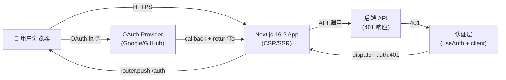
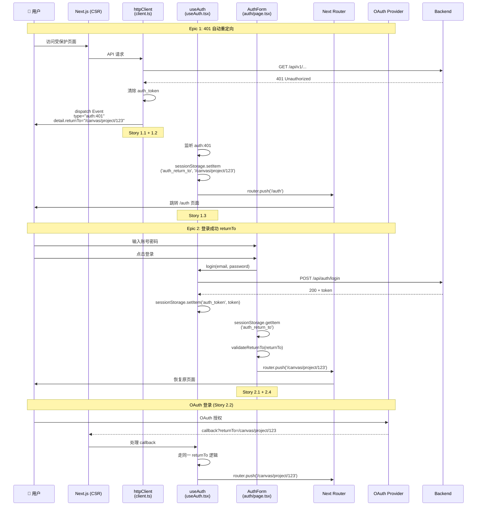
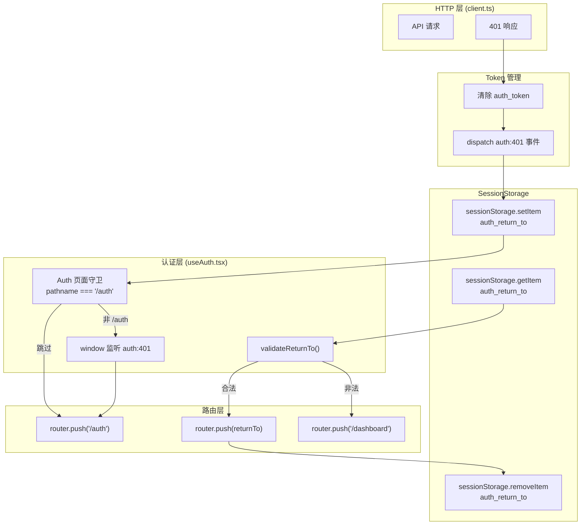

# VibeX 认证重定向 — 架构设计

> **项目**: vibex
> **版本**: 1.0
> **日期**: 2026-04-11
> **状态**: ✅ 架构完成

---

## 1. 技术栈

| 技术 | 选型 | 理由 |
|------|------|------|
| 前端框架 | Next.js 16.2.0 (App Router) | SSR/CSR 混用路由体系，auth 页面守卫依赖路由上下文 |
| UI 库 | React 19 | 成熟生态，Next.js 16.2 默认依赖 |
| 语言 | TypeScript (strict) | PRD 非功能性要求 |
| HTTP 客户端 | Axios (现有 `client.ts`) | 已有重试、熔断器扩展，只需扩展 401 拦截器 |
| 状态管理 | React Context (现有 `useAuth`) + sessionStorage | 认证状态已有，扩展事件总线机制 |
| 测试 | Vitest + Playwright | 现有测试框架，PRD 指定 |
| OAuth | 现有 `/services/oauth/oauth.ts` | 扩展 returnTo 透传 |

**关键路径说明**：PRD 描述文件路径为 `src/lib/httpClient.ts` 和 `src/contexts/AuthContext.tsx`，但实际现有文件为：
- `src/services/api/client.ts`（Axios httpClient）
- `src/hooks/useAuth.tsx`（AuthContext + Provider + hooks）
- `src/app/auth/page.tsx`（登录页，AuthForm 组件内嵌）

---

## 2. 架构图

### 2.1 系统上下文图（C4 Level 1）



### 2.2 Auth 流程时序图



### 2.3 事件总线数据流图



---

## 3. 模块划分

### 3.1 httpClient 模块（扩展 client.ts）

**文件**: `src/services/api/client.ts`

| 改动点 | 说明 |
|--------|------|
| 新增 `AuthError` 类 | 401 专用错误，含 `isAuthError=true` 和 `returnTo` 字段 |
| 响应拦截器 401 分支 | 改为抛出 `AuthError` 而非普通 Error |
| `dispatch` `auth:401` | 清除 token 后，通过 `window.dispatchEvent` 广播事件 |
| 区分主动登出 | 新增 `isLogoutAction` 标记，跳过 401 redirect |

**AuthError 接口**:
```typescript
export class AuthError extends Error {
  isAuthError = true;
  status: number;
  returnTo: string; // 当前路径，格式为 '/canvas/project/123'

  constructor(message: string, status: number, returnTo: string) {
    super(message);
    this.name = 'AuthError';
    this.status = status;
    this.returnTo = returnTo;
  }
}
```

### 3.2 useAuth 模块（扩展 useAuth.tsx）

**文件**: `src/hooks/useAuth.tsx`

| 改动点 | 说明 |
|--------|------|
| 全局 401 监听 | `useEffect` 监听 `window` 的 `auth:401` 事件 |
| sessionStorage 存 returnTo | 事件触发时写入 `auth_return_to` |
| `inAuthPage` 守卫 | 读取 `window.location.pathname`，`/auth` 路径跳过 redirect |
| logout 标记 | logout 调用时设置 `isLogoutAction`，httpClient 读取跳过 redirect |

**关键 Hook 新增**:
```typescript
// 监听 auth:401 事件，自动跳转
useEffect(() => {
  const handler = (e: CustomEvent) => {
    const returnTo = e.detail?.returnTo;
    if (!returnTo) return;
    // Auth 页面守卫
    if (window.location.pathname === '/auth') return;
    sessionStorage.setItem('auth_return_to', returnTo);
    router.push('/auth');
  };
  window.addEventListener('auth:401', handler as EventListener);
  return () => window.removeEventListener('auth:401', handler as EventListener);
}, []);
```

### 3.3 AuthForm 模块（扩展 auth/page.tsx）

**文件**: `src/app/auth/page.tsx`

| 改动点 | 说明 |
|--------|------|
| `validateReturnTo()` | 白名单校验函数，拒绝外部域名、`//` 开头、`javascript:` 等 |
| 登录成功后读 returnTo | `sessionStorage.getItem('auth_return_to')` 读路径 |
| 校验后跳转 | `validateReturnTo()` 通过则 `router.push(returnTo)`，否则 `/dashboard` |
| 跳转后清除 returnTo | `sessionStorage.removeItem('auth_return_to')` |
| OAuth returnTo | OAuth callback URL 携带 `?returnTo=` 参数透传 |

**validateReturnTo 实现规范**:
```typescript
function validateReturnTo(returnTo: string | null): string {
  if (!returnTo) return '/dashboard';
  // 必须以 / 开头
  if (!returnTo.startsWith('/')) return '/dashboard';
  // 禁止协议前缀
  if (/^(https?|javascript:|data:)/i.test(returnTo)) return '/dashboard';
  // 禁止协议相对 URL（//evil.com）
  if (/^\/\//.test(returnTo)) return '/dashboard';
  // 禁止路径遍历攻击
  if (returnTo.includes('/../') || returnTo.endsWith('/..')) return '/dashboard';
  return returnTo;
}
```

### 3.4 OAuth 模块（扩展 oauth.ts）

**文件**: `src/services/oauth/oauth.ts`

| 改动点 | 说明 |
|--------|------|
| OAuth returnTo 透传 | callback URL 携带 `?returnTo=xxx` 参数 |
| callback 页面处理 | `/app/auth/page.tsx` 处理 `returnTo` URL 参数，与 sessionStorage 逻辑一致 |

---

## 4. 数据流设计

### 4.1 401 → 跳转 → returnTo → 恢复 完整流

```
用户访问 /canvas/project/123
  ↓
httpClient GET /api/v1/canvas
  ↓
Backend 返回 401
  ↓
client.ts 拦截器：
  1. localStorage/sessionStorage.removeItem('auth_token')
  2. if (!isLogoutAction):
       const returnTo = window.location.pathname + window.location.search
       window.dispatchEvent(new CustomEvent('auth:401', { detail: { returnTo } }))
  ↓
useAuth useEffect 监听：
  1. sessionStorage.setItem('auth_return_to', returnTo)
  2. if (pathname !== '/auth'):
       router.push('/auth')
  ↓
用户看到 /auth 登录页（Story 2.3 守卫生效，不再触发 401 循环）
  ↓
用户登录成功
  ↓
auth/page.tsx:
  1. const returnTo = sessionStorage.getItem('auth_return_to')
  2. const safeReturnTo = validateReturnTo(returnTo)
  3. router.push(safeReturnTo)  // '/canvas/project/123'
  4. sessionStorage.removeItem('auth_return_to')
  ↓
用户回到原页面
```

### 4.2 存储键约定

| Storage Key | 用途 | 生命周期 |
|-------------|------|----------|
| `auth_token` | JWT Bearer Token | 登录时写入，logout/401 时清除 |
| `auth_return_to` | 401 触发前的页面路径 | 触发时写入，登录成功后清除 |
| `auth_is_logout` | 主动登出标记，区分 401 | logout 时写入，下一次 401 检查后清除 |

---

## 5. API 设计

### 5.1 后端接口约定（前端需适配）

| 接口 | 方法 | 说明 |
|------|------|------|
| `/api/auth/login` | POST | 登录，返回 `{ token: string }` |
| `/api/auth/register` | POST | 注册，返回 `{ token: string }` |
| `/api/auth/logout` | POST | 登出，触发 `isLogoutAction` |
| `/api/auth/me` | GET | 获取当前用户信息 |

### 5.2 前端内部事件约定

| 事件名 | 触发方 | 监听方 | payload |
|--------|--------|--------|---------|
| `auth:401` | client.ts (401 拦截器) | useAuth (useEffect) | `{ returnTo: string }` |
| `auth:login-success` | auth/page.tsx | - | `void` |
| `auth:logout` | useAuth (logout fn) | client.ts | `void` |

---

## 6. 安全考量

### 6.1 Open Redirect 白名单校验（高优先级）

**风险**：攻击者通过 `sessionStorage.setItem('auth_return_to', '//evil.com/login?redirect=//evil.com')` 诱导用户登录后跳转钓鱼站点。

**防御措施（F2.4 Story）**：

| 测试用例 | 期望结果 |
|----------|----------|
| `validateReturnTo('/dashboard')` | `/dashboard` ✅ |
| `validateReturnTo('/canvas/project/123')` | `/canvas/project/123` ✅ |
| `validateReturnTo('//evil.com')` | `/dashboard` ✅ 拦截 |
| `validateReturnTo('https://evil.com')` | `/dashboard` ✅ 拦截 |
| `validateReturnTo('javascript:alert(1)')` | `/dashboard` ✅ 拦截 |
| `validateReturnTo('/../etc/passwd')` | `/dashboard` ✅ 拦截 |
| `validateReturnTo(null)` | `/dashboard` ✅ fallback |
| `validateReturnTo('')` | `/dashboard` ✅ fallback |

### 6.2 Auth 页面循环守卫（中优先级）

**风险**：`/auth` 页面本身触发 401 后跳回 `/auth`，无限循环。

**防御**：useAuth useEffect 中检查 `window.location.pathname === '/auth'` 时跳过跳转。

### 6.3 Logout 误触发 401 redirect（中优先级）

**风险**：用户主动 logout 后，下一次 API 请求（pending requests）会触发 401 → auth:401 → redirect。

**防御**：
1. logout 时设置 `sessionStorage.setItem('auth_is_logout', '1')`
2. client.ts 响应拦截器检查该标记，若存在则不 dispatch `auth:401`
3. 清除 token 后立即移除该标记

### 6.4 OAuth Callback 路径安全（低优先级）

**风险**：OAuth callback URL 中 `returnTo` 参数被篡改。

**防御**：OAuth callback 处理时走同一 `validateReturnTo()` 校验。

---

## 7. 文件变更清单

| 文件 | 操作 | Story |
|------|------|-------|
| `src/services/api/client.ts` | 修改 | S1.1, S1.2, S3.2 |
| `src/hooks/useAuth.tsx` | 修改 | S1.3, S2.3 |
| `src/app/auth/page.tsx` | 修改 | S2.1, S2.4 |
| `src/services/oauth/oauth.ts` | 修改 | S2.2 |
| `src/app/auth/page.test.tsx` | 新增测试 | S3.1 |
| `src/hooks/__tests__/useAuth.test.tsx` | 扩展测试 | S3.2 |
| `tests/e2e/login-state-fix.spec.ts` | 新增 E2E | S3.1 |
| `src/lib/__tests__/validateReturnTo.test.ts` | 新增单元测试 | S3.2 |

---

## 8. 测试策略

### 8.1 单元测试（Vitest）

**覆盖率目标**: > 80%

| 测试文件 | 覆盖范围 |
|----------|----------|
| `src/lib/__tests__/validateReturnTo.test.ts` | 白名单校验全路径覆盖 |
| `src/hooks/__tests__/useAuth.test.tsx` | 401 监听、logout 标记、守卫逻辑 |
| `src/app/auth/page.test.tsx` | AuthForm returnTo 读、OAuth returnTo、validateReturnTo |

**validateReturnTo 边界用例**:
```typescript
// src/lib/__tests__/validateReturnTo.test.ts
describe('validateReturnTo', () => {
  test('正常路径通过', () => {
    expect(validateReturnTo('/dashboard')).toBe('/dashboard');
    expect(validateReturnTo('/canvas/project/123')).toBe('/canvas/project/123');
    expect(validateReturnTo('/canvas?project=1&tab=2')).toBe('/canvas?project=1&tab=2');
  });

  test('null/空字符串 fallback', () => {
    expect(validateReturnTo(null)).toBe('/dashboard');
    expect(validateReturnTo('')).toBe('/dashboard');
  });

  test('协议相对 URL 拦截', () => {
    expect(validateReturnTo('//evil.com')).toBe('/dashboard');
    expect(validateReturnTo('https://evil.com')).toBe('/dashboard');
    expect(validateReturnTo('javascript:alert(1)')).toBe('/dashboard');
  });

  test('路径遍历攻击拦截', () => {
    expect(validateReturnTo('/../etc/passwd')).toBe('/dashboard');
    expect(validateReturnTo('/foo/../bar')).toBe('/dashboard');
  });

  test('非 / 开头拦截', () => {
    expect(validateReturnTo('dashboard')).toBe('/dashboard');
    expect(validateReturnTo('evil.com')).toBe('/dashboard');
  });
});
```

**运行命令**:
```bash
cd /root/.openclaw/vibex/vibex-fronted
pnpm vitest run src/lib/__tests__/validateReturnTo.test.ts
pnpm vitest run src/hooks/__tests__/useAuth.test.tsx
pnpm vitest run src/app/auth/page.test.tsx
```

### 8.2 E2E 测试（Playwright）

**测试文件**: `tests/e2e/login-state-fix.spec.ts`

| TC | 描述 | 步骤摘要 |
|----|------|----------|
| TC-004 | 401 触发 redirect | 受保护页 → mock 401 → 期望 URL 含 `/auth` |
| TC-005 | returnTo 保存正确 | 401 后 → 期望 `sessionStorage.auth_return_to` 有值 |
| TC-006 | 登录成功返回原页面 | TC-005 续 → 登录 → 期望 URL 恢复原路径 |
| TC-007 | OAuth returnTo | OAuth 回调 → 期望 `router.push(returnTo)` |
| TC-008 | logout 不触发 redirect | logout → 期望无 auth:401 dispatch |

**运行命令**:
```bash
cd /root/.openclaw/vibex/vibex-fronted
pnpm playwright test tests/e2e/login-state-fix.spec.ts

# 指定浏览器
pnpm playwright test tests/e2e/login-state-fix.spec.ts --project=chromium

# 查看报告
pnpm playwright show-report
```

### 8.3 CI 集成

```yaml
# .github/workflows/auth-redirect.yml
- name: Run unit tests
  run: pnpm vitest run --reporter=dot

- name: Run E2E tests
  run: pnpm playwright test tests/e2e/login-state-fix.spec.ts

- name: Build check
  run: pnpm build
```

---

## 9. 架构决策记录（ADR）

### ADR-001: 使用 Window 事件总线而非 Axios 拦截器直接跳转

**状态**: 已采纳

**上下文**: PRD 最初推荐方案 A（Auth Context + Axios Interceptor 直接跳转）。

**决策**: 改用 Window CustomEvent 总线 + AuthContext 监听。

**理由**:
1. **解耦**：httpClient 不知道路由逻辑（Next.js Router），避免循环依赖
2. **可测试**：事件可 mock，拦截器跳转需 mock router.push
3. **可扩展**：其他模块可监听 `auth:401` 做清理（如关闭 WebSocket）

**权衡**: 引入事件总线增加 1 个异步步骤，但用户感知延迟 < 10ms，可接受。

---

*架构设计: ✅ 完成*
*Next: Dev 实现 → Tester E2E 覆盖*
