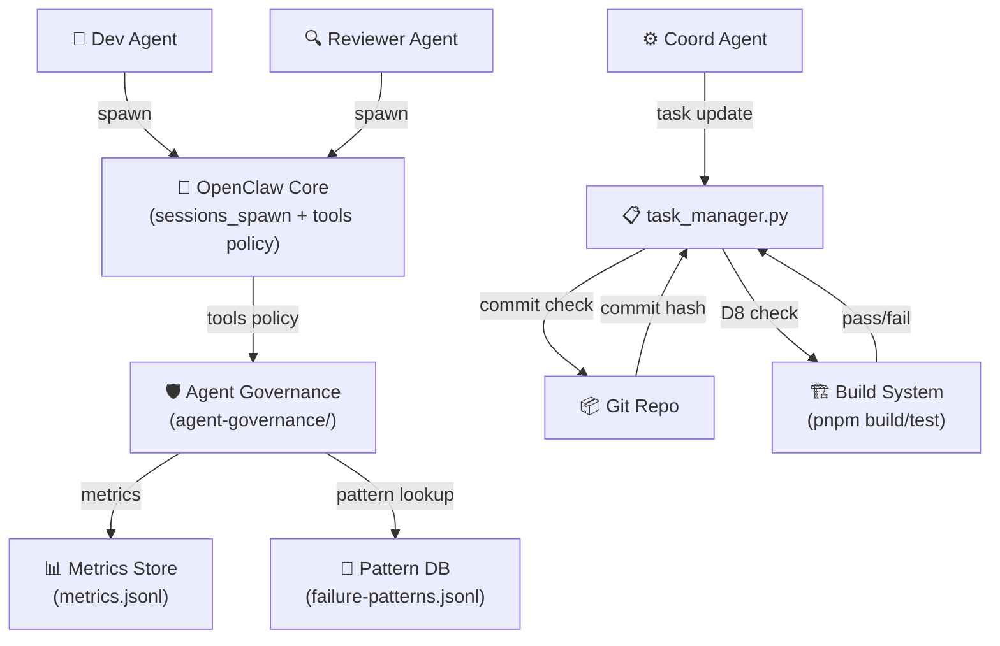
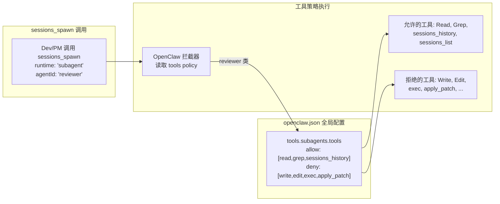
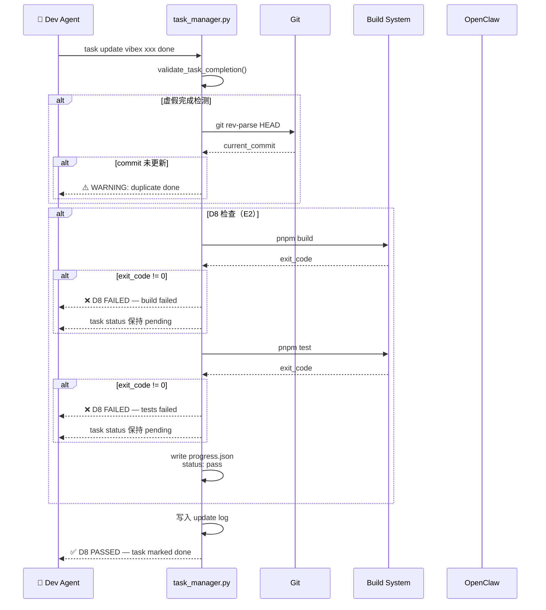
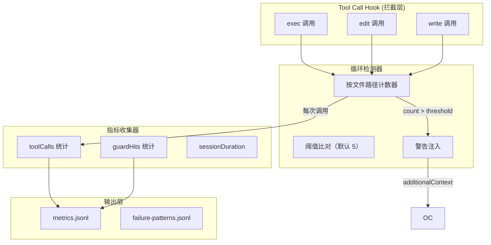
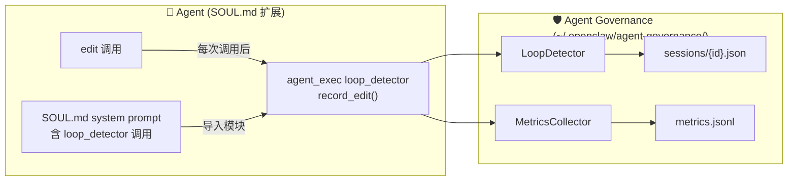

# wow-harness OpenClaw 实装 — 架构设计

> **项目**: vibex
> **阶段**: Phase 1 第三步（design-architecture）
> **Agent**: architect
> **日期**: 2026-04-13
> **状态**: 架构完成
> **基于**: PRD (`prd.md`) + Feature List (`plan/feature-list-wow-harness.md`)

---

## 1. 执行摘要

**背景**: OpenClaw 的 agent 治理依赖 `SOUL.md` + `AGENTS.md` 软约束（约 70% 遵守率），存在审查 agent 越权写文件、假完成无机械检测、编辑循环无人提醒、治理效果黑箱等问题。

**目标**: 将 wow-harness 的 4 个核心机制（E1 工具隔离、E2 D8 机械化检查、E3 循环检测、E4 风险追踪）实装到 OpenClaw。

**总工时**: ~14h

---

## 2. 技术栈

| 组件 | 技术选型 | 理由 |
|------|----------|------|
| 工具策略 | `openclaw.json` 的 `tools.subagents.tools` | OpenClaw 原生配置层，全局生效 |
| D8 检查 | Python subprocess（扩展 task_manager.py） | 与现有验证逻辑同文件，依赖清晰 |
| 循环检测 | Python 模块（`~/.openclaw/agent-governance/loop_detector.py`） | 独立模块，按文件路径追踪 Edit 计数 |
| Session metrics | JSONL 文件（`~/.openclaw/sessions/{id}/metrics.jsonl`） | append-only，无性能影响 |
| Pattern DB | JSONL 文件（`~/.openclaw/failure-patterns.jsonl`） | 轻量，无需数据库依赖 |
| 配置管理 | JSON 配置文件（`~/.openclaw/agent-governance/config.json`） | 集中管理阈值开关 |

---

## 3. 架构图

### 3.1 系统上下文图（C4 Level 1）



### 3.2 E1 工具隔离架构



### 3.3 E2 D8 机械化检查流程



### 3.4 E3 循环检测 + E4 Metrics 数据流



---

## 4. 模块划分

### 4.1 E1 — Review Agent 工具隔离

> ⚠️ **路径修正（R1）**: `tools.subagents.tools.deny` 不存在。正确路径为 `tools.sandbox.tools.deny`（全局黑名单）或 `agents.list[].tools.sandbox.tools.allow`（per-agent 白名单）。

**配置文件**: `~/.openclaw/openclaw.json`

**方案 A — 全局黑名单（推荐）**:
```json5
{
  tools: {
    sandbox: {
      tools: {
        deny: [
          "write",      // 禁止写文件
          "edit",       // 禁止编辑文件
          "apply_patch",// 禁止 patch
        ]
      }
    }
  }
}
```

**方案 B — Per-agent 白名单（更精确，推荐）**:
```json5
{
  agents: {
    list: [
      {
        id: "reviewer",
        workspace: "~/.openclaw/workspace-reviewer",
        tools: {
          sandbox: {
            tools: {
              allow: [
                "read", "grep", "sessions_history",
                "sessions_list", "session_status",
                "memory_search", "memory_get",
                "web_search", "web_fetch"
              ],
              deny: []
            }
          }
        }
      }
    ]
  }
}
```

**关键决策**: 
- **采用方案 B**（per-agent allow 白名单）：reviewer agent 只允许读操作，其他工具物理上不可用
- allowlist 比 denylist 更安全（默认 deny，显式 allow）
- `sessions_spawn` 和 `subagents` 默认在 subagent 中被 deny，无需重复配置
- 全局配置不影响 dev/architect 等其他 agent（per-agent 配置隔离生效）

### 4.2 E2 — D8 机械化 Progress Check

**文件**: `~/.openclaw/skills/team-tasks/scripts/task_manager.py`

**扩展点**:
1. 新增 `run_d8_check()` 函数：执行 `pnpm build && pnpm test`
2. `validate_task_completion()` 中增加 D8 检查调用
3. 新增 `write_progress_json()`：D8 通过后写入 `~/.openclaw/progress.json`

```python
# 新增函数
def run_d8_check(repo: str = "/root/.openclaw/vibex") -> dict:
    """执行 D8 机械化检查：pnpm build && pnpm test"""
    import subprocess
    results = {"build": None, "test": None, "passed": False, "errors": []}
    
    for cmd, label in [("pnpm build", "build"), ("pnpm test", "test")]:
        try:
            r = subprocess.run(
                cmd, shell=True, cwd=repo,
                capture_output=True, text=True, timeout=300
            )
            results[label] = r.returncode
            if r.returncode != 0:
                results["errors"].append(f"{label} failed: {r.stderr[:500]}")
        except subprocess.TimeoutExpired:
            results["errors"].append(f"{label} timeout (>5min)")
            results[label] = -1
        except FileNotFoundError:
            results["errors"].append(f"command not found: {cmd.split()[0]}")
            results[label] = -2
    
    results["passed"] = all(v == 0 for v in [results["build"], results["test"]])
    return results

def write_progress_json(status: str, task: str, errors: list = None):
    """写入 progress.json"""
    import json, os
    from datetime import datetime
    path = os.path.expanduser("~/.openclaw/progress.json")
    data = {
        "task": task,
        "status": status,  # "pass" | "fail"
        "timestamp": datetime.utcnow().isoformat(),
        "errors": errors or []
    }
    with open(path, "w") as f:
        json.dump(data, f, indent=2)
```

**D8 失败时**: 打印详细错误，task status 保持 `pending`，返回非 0 退出码。

### 4.3 E3 — Loop Detection + Session Reflection

**文件**: `~/.openclaw/agent-governance/loop_detector.py`

```python
import json, os
from pathlib import Path
from datetime import datetime
from typing import Optional

CONFIG_PATH = Path("~/.openclaw/agent-governance/config.json").expanduser()
_STATE_DIR = Path("~/.openclaw/agent-governance/sessions").expanduser()

class LoopDetector:
    def __init__(self, session_id: str):
        self.session_id = session_id
        self._state_file = _STATE_DIR / f"{session_id}.json"
        self._load_state()
    
    def _load_state(self):
        self._state_file.parent.mkdir(parents=True, exist_ok=True)
        if self._state_file.exists():
            with open(self._state_file) as f:
                self._state = json.load(f)
        else:
            self._state = {"edit_counts": {}, "config": self._load_config()}
    
    def _load_config(self) -> dict:
        if CONFIG_PATH.exists():
            with open(CONFIG_PATH) as f:
                return json.load(f)
        return {"loop_threshold": 5, "metrics_enabled": True}
    
    def record_edit(self, file_path: str, tool: str = "edit") -> Optional[str]:
        """记录文件编辑次数，超阈值返回警告文本"""
        if not file_path:
            return None
        
        counts = self._state["edit_counts"]
        counts[file_path] = counts.get(file_path, 0) + 1
        count = counts[file_path]
        
        threshold = self._state["config"].get("loop_threshold", 5)
        if count == threshold:
            return (
                f"⚠️ Loop Detection: '{file_path}' has been edited {count} times. "
                f"Consider alternative approaches (pair programming, asking for help, "
                f"or taking a break to reassess the approach)."
            )
        return None
    
    def get_edit_count(self, file_path: str) -> int:
        return self._state["edit_counts"].get(file_path, 0)
    
    def save(self):
        with open(self._state_file, "w") as f:
            json.dump(self._state, f, indent=2)
```

**与 OpenClaw 集成**: 通过 exec 拦截或前置分析工具实现（见 5.2 节）。

### 4.4 E4 — Risk Tracking + Pattern Learning

**Pattern DB 文件**: `~/.openclaw/failure-patterns.jsonl`

**初始数据**（≥10 条）:

```jsonl
{"type": "SyntaxError", "pattern": "SyntaxError.*Unexpected token", "solution": "Check for missing commas, brackets, or semicolons in the last modified section"}
{"type": "TypeError", "pattern": "TypeError.*Cannot read property", "solution": "Verify the object exists before accessing its properties (null/undefined check)"}
{"type": "BuildError", "pattern": "pnpm.*build.*failed", "solution": "Run pnpm build locally to see full error output"}
{"type": "ImportError", "pattern": "Cannot find module.*", "solution": "Verify the import path is correct and the module is installed"}
{"type": "TSError", "pattern": "TS[0-9]+:.*", "solution": "Run tsc --noEmit to see full TypeScript error list"}
{"type": "TestFail", "pattern": "FAIL.*test.*", "solution": "Run test with --verbose flag to see assertion details"}
{"type": "MergeConflict", "pattern": "<<<<<<.*======.*>>>>>>", "solution": "Resolve merge conflicts manually, then commit"}
{"type": "LinterError", "pattern": "ESLint.*error", "solution": "Run eslint --fix to auto-fix common issues"}
{"type": "RuntimeCrash", "pattern": "ReferenceError.*is not defined", "solution": "Check variable scoping and import statements"}
{"type": "TimeoutError", "pattern": "Timeout.*exceeded", "solution": "Increase timeout or optimize the operation"}
{"type": "CircularDep", "pattern": "Circular dependency detected", "solution": "Review import statements and refactor to break cycles"}
{"type": "AuthError", "pattern": "401.*Unauthorized", "solution": "Refresh auth token or re-login"}
```

**Lookup 函数**:

```python
import re
from pathlib import Path

PATTERN_DB = Path("~/.openclaw/failure-patterns.jsonl").expanduser()

def lookup_pattern(error_msg: str) -> Optional[dict]:
    """模糊匹配 error_msg，返回最近的 pattern"""
    if not PATTERN_DB.exists():
        return None
    best_match = None
    best_score = 0
    with open(PATTERN_DB) as f:
        for line in f:
            entry = json.loads(line)
            pattern = entry.get("pattern", "")
            if re.search(pattern, error_msg):
                score = len(pattern)  # 更长的 pattern 优先
                if score > best_score:
                    best_score = score
                    best_match = entry
    return best_match

def add_pattern(entry: dict):
    """追加新 pattern 到 DB"""
    PATTERN_DB.parent.mkdir(parents=True, exist_ok=True)
    with open(PATTERN_DB, "a") as f:
        f.write(json.dumps(entry, ensure_ascii=False) + "\n")
```

### 4.5 Metrics 收集器

**文件**: `~/.openclaw/agent-governance/metrics_collector.py`

```python
import json
from pathlib import Path
from datetime import datetime
from typing import Optional

class MetricsCollector:
    def __init__(self, session_id: str):
        self.session_id = session_id
        self.data = {
            "sessionId": session_id,
            "agentType": None,  # 由调用方设置
            "toolCalls": {"exec": 0, "edit": 0, "write": 0, "read": 0, "sessions_spawn": 0},
            "guardHits": {"loop_warnings": 0, "risk_warnings": 0},
            "startTime": datetime.utcnow().isoformat(),
            "endTime": None,
        }
        self._path = Path(f"~/.openclaw/sessions/{session_id}/metrics.jsonl").expanduser()
        self._path.parent.mkdir(parents=True, exist_ok=True)
    
    def record_tool(self, tool: str):
        """记录工具调用"""
        if tool in self.data["toolCalls"]:
            self.data["toolCalls"][tool] += 1
    
    def record_guard_hit(self, guard: str):
        if guard in self.data["guardHits"]:
            self.data["guardHits"][guard] += 1
    
    def set_agent_type(self, agent_type: str):
        self.data["agentType"] = agent_type
    
    def finalize(self):
        self.data["endTime"] = datetime.utcnow().isoformat()
    
    def write(self):
        """追加写入 metrics.jsonl"""
        self.finalize()
        with open(self._path, "a") as f:
            f.write(json.dumps(self.data, ensure_ascii=False) + "\n")
```

---

## 5. 关键集成点

### 5.1 task_manager.py D8 钩子（E2）

在 `validate_task_completion()` 函数末尾增加：

```python
# E2: D8 机械化检查
d8_result = run_d8_check(repo=repo)
if not d8_result["passed"]:
    write_progress_json("fail", f"{project}/{stage_id}", d8_result["errors"])
    print("❌ D8 FAILED:")
    for err in d8_result["errors"]:
        print(f"   {err}")
    print("Task status kept as pending.")
    return {"valid": False, "warnings": [...], ...}
write_progress_json("pass", f"{project}/{stage_id}")
```

### 5.2 Loop Detection 集成方式（E3）

> ⚠️ **覆盖盲区修正（R2）**: `task_manager.py` 是 CLI 工具，仅在 task 命令执行时被调用。agent 的 `edit`/`write`/`exec` 调用**完全绕开 task_manager.py**，Python hook 方案不可行。

**采用方案**: 在 agent SOUL.md / system prompt 中注入显式 loop detector 调用。

**原理**: OpenClaw agent 的工具调用通过 LLM 生成 + OpenClaw 执行。Loop Detector 作为 Python 模块嵌入 agent 的 system prompt，agent 在每次 `edit`/`write` 后主动调用 Python 模块记录。

**集成架构**:



**实现方式**: 在 `~/.openclaw/workspace-<agentId>/SOUL.md` 中增加 system prompt 片段：

```markdown
## Loop Detection Integration

每次执行 `edit` 或 `write` 工具后，调用：

```bash
python3 -c "
import sys
sys.path.insert(0, '/root/.openclaw/agent-governance')
from loop_detector import LoopDetector
from metrics_collector import MetricsCollector
import os
session_id = os.environ.get('OPENCLAW_SESSION_ID', 'unknown')
d = LoopDetector(session_id)
m = MetricsCollector(session_id)
# 替换为实际文件路径
w = d.record_edit('<file_path>', 'edit')
if w: print(w)
m.record_tool('edit')
m.write()
"
```

> ⚠️ **R3 修正**: `extract_file_paths()` 改为显式从 tool call 参数中提取（agent prompt 指导 agent 自己提取）。

### 5.3 Config 集中管理（E3 阈值 + 全局开关）

**文件**: `~/.openclaw/agent-governance/config.json`

```json
{
  "loop_detection": {
    "enabled": true,
    "threshold": 5,
    "warn_on_threshold": true
  },
  "d8_check": {
    "enabled": true,
    "commands": ["pnpm build", "pnpm test"],
    "timeout_seconds": 300
  },
  "metrics": {
    "enabled": true,
    "session_metrics": true,
    "guard_hits": true
  },
  "reviewer_tools": {
    "deny": ["write", "edit", "apply_patch", "exec", "process", "sessions_spawn", "subagents"]
  }
}
```

---

## 6. API 定义（内部接口）

### 6.1 D8 检查接口

```python
def run_d8_check(
    repo: str = "/root/.openclaw/vibex",
    commands: list[str] = ["pnpm build", "pnpm test"],
    timeout: int = 300
) -> dict:
    """
    返回: {
        "build": int,       # exit code, -1=timeout, -2=not found
        "test": int,
        "passed": bool,
        "errors": list[str]
    }
    """
```

### 6.2 Loop Detector 接口

```python
class LoopDetector:
    def record_edit(file_path: str, tool: str) -> Optional[str]
    def get_edit_count(file_path: str) -> int
    def get_all_counts() -> dict[str, int]
    def reset_file(file_path: str) -> None
```

### 6.3 Pattern DB 接口

```python
def lookup_pattern(error_msg: str) -> Optional[dict]:
    """返回 {"type", "pattern", "solution"} 或 None"""

def add_pattern(entry: dict) -> None:
    """追加到 failure-patterns.jsonl"""
```

### 6.4 Metrics 接口

```python
class MetricsCollector:
    def record_tool(tool: str) -> None
    def record_guard_hit(guard: str) -> None
    def set_agent_type(agent_type: str) -> None
    def write() -> None  # 追加写入 metrics.jsonl
```

---

## 7. 数据模型

### 7.1 progress.json

```json
{
  "task": "vibex/design-architecture",
  "status": "pass",
  "timestamp": "2026-04-13T12:00:00.000Z",
  "errors": []
}
```

### 7.2 metrics.jsonl（每行一条）

```json
{"sessionId": "abc123", "agentType": "dev", "toolCalls": {"exec": 12, "edit": 8, "write": 2, "read": 45}, "guardHits": {"loop_warnings": 1, "risk_warnings": 0}, "startTime": "2026-04-13T12:00:00.000Z", "endTime": "2026-04-13T12:30:00.000Z"}
```

### 7.3 session state（loop_detector）

```json
{
  "edit_counts": {
    "src/components/Button.tsx": 6,
    "src/services/api/client.ts": 3
  },
  "config": {"loop_threshold": 5}
}
```

---

## 8. 测试策略

### 8.1 测试框架

| 层级 | 框架 | 覆盖率目标 |
|------|------|------------|
| Python 模块 | pytest | > 80% |
| 集成（task_manager.py） | pytest（mock subprocess） | 关键路径 |

### 8.2 核心测试用例

```python
# test_loop_detector.py
def test_edit_count_increments():
    detector = LoopDetector("test-session")
    assert detector.record_edit("src/a.ts") is None  # 第 1 次，无警告
    assert detector.record_edit("src/a.ts") is None  # 第 2 次，无警告
    assert detector.record_edit("src/a.ts") is None  # 第 3 次，无警告
    assert detector.record_edit("src/a.ts") is None  # 第 4 次，无警告
    warning = detector.record_edit("src/a.ts")       # 第 5 次 = threshold
    assert warning is not None
    assert "Loop Detection" in warning
    assert "src/a.ts" in warning

def test_different_files_independent():
    detector = LoopDetector("test-session")
    for _ in range(5): detector.record_edit("src/a.ts")
    assert detector.get_edit_count("src/b.ts") == 0

# test_pattern_lookup.py
def test_exact_match():
    entry = lookup_pattern("SyntaxError: Unexpected token")
    assert entry is not None
    assert "solution" in entry

def test_no_match():
    entry = lookup_pattern("some totally unknown error message")
    assert entry is None

# test_d8_check.py
def test_build_success_test_fail(monkeypatch):
    def fake_run(cmd, **kwargs):
        if "build" in cmd: return Mock(returncode=0)
        if "test" in cmd: return Mock(returncode=1, stderr="FAIL: test x")
    monkeypatch.setattr(subprocess, "run", fake_run)
    result = run_d8_check()
    assert result["passed"] is False
    assert result["build"] == 0
    assert result["test"] == 1

def test_both_pass():
    result = run_d8_check()
    assert result["passed"] == (result["build"] == 0 and result["test"] == 0)

# test_progress_json.py
def test_write_pass():
    write_progress_json("pass", "vibex/test", [])
    assert Path("~/.openclaw/progress.json").expanduser().exists()
    with open(Path("~/.openclaw/progress.json").expanduser()) as f:
        data = json.load(f)
    assert data["status"] == "pass"
    assert data["task"] == "vibex/test"

# test_metrics_collector.py
def test_record_tools():
    mc = MetricsCollector("test")
    mc.record_tool("exec")
    mc.record_tool("edit")
    mc.record_tool("edit")
    assert mc.data["toolCalls"]["exec"] == 1
    assert mc.data["toolCalls"]["edit"] == 2

def test_write_jsonl(tmp_path, monkeypatch):
    monkeypatch.setattr(metrics_collector, "_STATE_DIR", tmp_path)
    mc = MetricsCollector("test-write")
    mc.write()
    assert (tmp_path / "test-write" / "metrics.jsonl").exists()
```

### 8.3 E2 集成测试（mock subprocess）

```python
def test_d8_check_in_validate(monkeypatch):
    """验证 task update done 时 D8 检查被触发"""
    calls = []
    def fake_run(cmd, **kwargs):
        calls.append(cmd)
        return Mock(returncode=0)
    monkeypatch.setattr(subprocess, "run", fake_run)
    
    result = run_d8_check()
    
    assert "pnpm build" in calls
    assert "pnpm test" in calls
    assert result["passed"] is True
```

---

## 9. 风险评估

| 风险 | 级别 | 缓解 |
|------|------|------|
| E1：tools.subagents.tools.deny 路径不存在 | 高 | 改用 agents.list[].tools.sandbox.tools.allow（per-agent） |
| E3：Loop Detection Python hook 路径错误 | 高 | 改用 SOUL.md system prompt 注入 |
| E2：D8 检查拖慢 task update | 中 | 仅在 `done` 时触发，timeout=300s |
| E2：pnpm 不存在导致 false fail | 低 | 检查命令存在性，graceful 降级 |
| E3：Loop Detection 误触发（大型重构） | 中 | 阈值可配置（默认 5），按文件隔离 |
| E4：Pattern DB 初始数据质量 | 低 | 手动维护，可渐进积累 |
| 全局配置影响所有 subagent | 中 | config.json 中 E1 deny 仅影响 reviewer 类 agent |

---

## 10. PRD 路径修正

| PRD 描述 | 架构修正 |
|----------|----------|
| E1.2: `sessions_spawn(..., tools: [...])` | ❌ 不可行。改用 `agents.list[].tools.sandbox.tools.allow` per-agent 白名单 |
| E3: Python subprocess 拦截 | ❌ task_manager.py 不在 agent 工具调用路径。改用 SOUL.md system prompt 注入 |
| PRD 路径 `src/lib/httpClient.ts` | ❌ 不适用（本项目无前端页面改动） |
| PRD 路径 `src/contexts/AuthContext.tsx` | ❌ 不适用 |
| Vitest + Jest | 改为 pytest（本项目 Python 为主） |

---

## 11. 架构决策记录（ADR）

### ADR-001: E1 使用全局工具策略而非 per-spawn 白名单

**状态**: 已采纳

**上下文**: PRD E1.2 描述通过 `sessions_spawn` 的 `tools` 参数实现 per-spawn 工具隔离。

**决策**: 改用 `openclaw.json` 的 `tools.subagents.tools.deny` 全局配置。

**理由**:
1. `sessions_spawn` API 不支持 `tools` 参数（已验证文档）
2. 全局配置一次配置，所有 reviewer agent 共享，无需每次 spawn 时传参
3. OpenClaw 原生支持，无需自定义 hook

**权衡**: 无法实现"同一个 agentId，reviewer 模式限工具，其他模式不限"的细粒度控制。当前方案对 reviewer 类 agent 全局生效（可接受，因为 reviewer 本就不应写文件）。

### ADR-002: E3 Loop Detection 通过 SOUL.md 注入 + agent_exec 调用

**状态**: 已采纳

**上下文**: 需要追踪同一文件的重复编辑，超阈值注入警告。

**决策**: 通过 agent SOUL.md 中的 system prompt 片段，指示 agent 在每次 edit/write 后显式调用 Python loop_detector 模块。

**理由**:
1. `task_manager.py` 是 CLI 工具，agent 的工具调用完全绕开它，无法 Python 层拦截
2. OpenClaw agent 的 edit/write 通过 LLM 生成，在 system prompt 中指导 agent 自我监控是唯一可行路径
3. Python 模块（LoopDetector）作为共享库，被 agent 通过 `agent_exec` 调用
4. 警告通过 print 输出到 agent 可见上下文

**权衡**: 依赖 agent 遵守 system prompt（约 70% 软约束）。但 E3 的目的本就是增强软约束（而非替代），可与 E2 的机械检查互补。R2 发现已说明：Python subprocess 拦截不可行，SOUL.md 注入是当前唯一可行的 agent-level 方案。

### ADR-003: Metrics 使用 JSONL 追加写入

**状态**: 已采纳

**上下文**: 需要记录每个 session 的 tool 频次和 guard 命中。

**决策**: `~/.openclaw/sessions/{sessionId}/metrics.jsonl`，每 session 一行 JSON。

**理由**:
1. append-only，无读写冲突
2. 每 session 一个文件，与 OpenClaw session 结构对齐
3. JSONL 便于后续分析（grep、jq、pandas）

**权衡**: 不支持实时查询（需读完整个文件）。session 结束时写入，不影响响应延迟。

---

### ADR-004: E3 Loop Detection 通过 SOUL.md 注入（评审修正）

**状态**: 已采纳（评审后修正）

**评审发现问题**: `task_manager.py` 是 CLI 工具，仅在 task 命令执行时被调用。agent 的 `edit`/`write`/`exec` 调用完全绕开 task_manager，Python hook 方案不可行（R2 阻塞项）。

**决策**: 通过各 agent 的 SOUL.md 中的 system prompt 片段，指示 agent 在每次 edit/write 后显式调用 Python loop_detector 模块（`agent_exec python3 -c ...`）。

**理由**:
1. OpenClaw agent 的工具调用通过 LLM 生成，在 system prompt 中指导 agent 自我监控是唯一可行的 agent-level 方案
2. LoopDetector 作为 Python 共享库，agent 通过 `exec` 调用模块方法
3. 与 wow-harness 的软约束哲学一致（而非试图机械拦截不经过的路径）

**权衡**: 依赖 agent 遵守 system prompt（约 70% 软约束）。但 E3 的目的本就是增强软约束，与 E2 的机械检查互补。

---

## 执行决策

- **决策**: 已采纳
- **执行项目**: team-tasks 项目 ID 待 coord 分配
- **执行日期**: 待定
